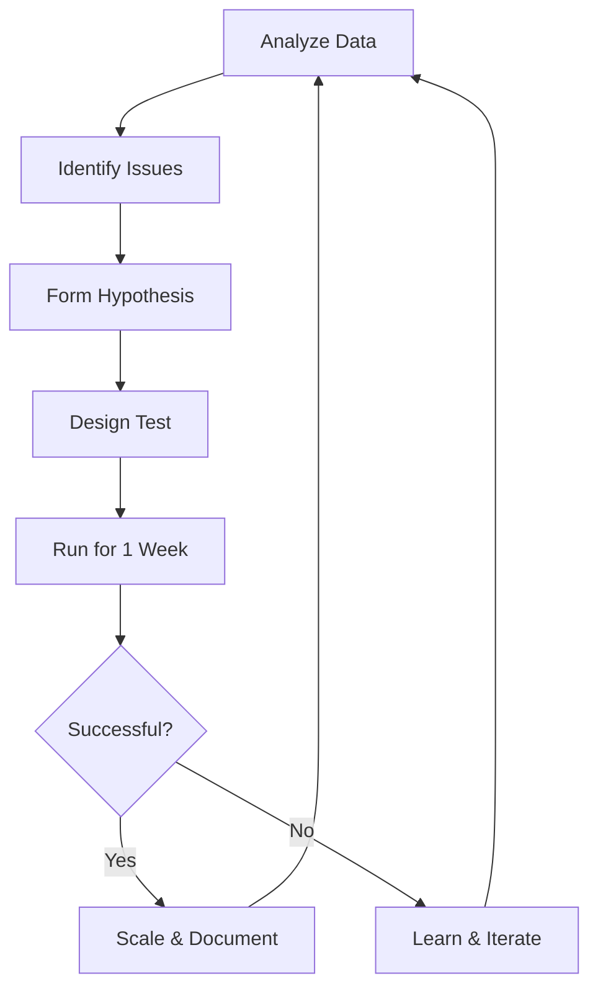

# Meta Ads Performance Optimization Framework
## Top-Down Analysis & Action Plan for LENGOLF

*Last Updated: August 2025*

---

## 📊 Executive Summary

This document provides a comprehensive, actionable framework for optimizing Meta Ads performance from account level down to individual creatives. It includes diagnostic workflows, performance benchmarks, and specific action items for improving ROAS.

**Key Finding**: In 2025, creative quality drives 70-80% of Meta Ads performance, not budget or targeting. Focus optimization efforts on creative testing and iteration.

---

## 🎯 Performance Benchmarks & Targets

### Industry Standards (2025)
| Metric | Poor | Average | Good | Excellent | LENGOLF Target |
|--------|------|---------|------|-----------|----------------|
| **CTR** | <0.5% | 0.9% | 1.5-2% | >3% | **>2%** |
| **Conversion Rate** | <2% | 9.11% | 12-15% | >20% | **>10%** |
| **CPC** | >$2 | $1-1.5 | $0.5-1 | <$0.40 | **<$1** |
| **CPA** | >$50 | $18-25 | $10-15 | <$10 | **<฿500** |
| **ROAS** | <1x | 1.25-2x | 2.5-3x | >4x | **>3x** |

### Performance Scoring System
- **Score 75-100**: Top Performer ✅ - Scale budget
- **Score 50-74**: Good 🔵 - Maintain and optimize
- **Score 25-49**: Needs Optimization ⚠️ - Test improvements
- **Score 0-24**: Poor Performance 🔴 - Pause or rebuild

---

## 📋 Weekly Performance Review Workflow

### 1️⃣ Account Level Analysis (5 minutes)
**Check These First:**
- [ ] Total spend vs budget utilization
- [ ] Overall ROAS trend (week-over-week)
- [ ] Event Match Quality (EMQ) score
- [ ] Pixel/CAPI health status
- [ ] Any policy violations or restrictions

**🚨 Red Flags:**
- Budget utilization <80% or >110%
- ROAS declining for 2+ weeks
- EMQ score <6/10
- Multiple ad rejections

### 2️⃣ Campaign Level Analysis (10 minutes)

#### Decision Tree for Campaign Optimization

```
Is Campaign ROAS > 2x?
├─ YES → Is CTR > 1.5%?
│   ├─ YES → ✅ SCALE: Increase budget 20-30%
│   └─ NO → ⚠️ OPTIMIZE: Test new creatives
└─ NO → Is Spend > ฿5,000?
    ├─ YES → Is Conv Rate > 5%?
    │   ├─ YES → 🔧 FIX: Landing page/offer issue
    │   └─ NO → 🔴 PAUSE: Rebuild with new approach
    └─ NO → ⏳ WAIT: Need more data (1 week)
```

#### Campaign Structure Audit
- [ ] Using simplified structure (3-5 campaigns max)?
- [ ] Campaigns organized by objective (Prospecting/Retargeting/Retention)?
- [ ] Using Advantage+ campaigns where appropriate?
- [ ] Budget allocation: 70% prospecting, 20% retargeting, 10% retention?

### 3️⃣ Ad Set Level Analysis (15 minutes)

#### Ad Set Performance Matrix
| Status | CTR | Conv Rate | Action Required |
|--------|-----|-----------|-----------------|
| 🟢 Active | >2% | >10% | Scale budget, test similar audiences |
| 🟡 Learning | 1-2% | 5-10% | Wait for 50+ conversions, minor creative refresh |
| 🔴 Underperforming | <1% | <5% | Pause if 2x CPA target spent |

#### Optimization Checklist
- [ ] **Audience Size**: 1-10M for prospecting, <1M for retargeting
- [ ] **Budget**: Minimum ฿1,200/week per ad set (for ฿40 CPA)
- [ ] **Placements**: Using Advantage+ placements?
- [ ] **Creative Count**: 3-6 ads per ad set (not more)
- [ ] **Learning Phase**: Reached 50 conversions in 7 days?

### 4️⃣ Creative Level Analysis (20 minutes)

#### Creative Performance Diagnostic

**Step 1: Identify Creative Issues**
```
High CTR (>2%) + Low CVR (<5%) = Landing Page Problem
Low CTR (<1%) + High CVR (>10%) = Creative Problem
Low CTR (<1%) + Low CVR (<5%) = Targeting Problem
```

**Step 2: Creative Health Metrics**
- **Frequency**: >3 = Creative fatigue, refresh needed
- **Engagement Rate**: <1% = Poor creative quality
- **Thumb-stop Rate**: <20% = Weak hook (first 3 seconds)
- **Hold Rate**: <50% at 15 sec = Message not resonating

#### Creative Optimization Priority Matrix

| Creative Type | Performance | Action |
|--------------|-------------|---------|
| **Top Performers** | CTR >3%, CVR >15% | • Duplicate with variations<br>• Test in new audiences<br>• Create similar concepts |
| **Good Performers** | CTR 1.5-3%, CVR 8-15% | • A/B test headlines<br>• Try different CTAs<br>• Test aspect ratios |
| **Needs Work** | CTR 0.8-1.5%, CVR 3-8% | • New hook (first 3 sec)<br>• Simplify message<br>• Add social proof |
| **Poor Performers** | CTR <0.8%, CVR <3% | • Pause after ฿1,000 spend<br>• Complete redesign<br>• Different angle/benefit |

---

## 🛠️ Optimization Action Plans

### Immediate Actions (Do This Week)

#### For Low CTR (<1%)
1. **Hook Optimization** (First 3 seconds)
   - Start with question or bold statement
   - Use motion/animation in first frame
   - Add text overlay with main benefit
   - Test UGC vs professional content

2. **Visual Format Testing**
   - Switch to 4:5 vertical (15% better than 1:1)
   - Try carousel for multiple benefits
   - Test video vs static image
   - Add captions for silent viewing

3. **Copy Improvements**
   - Lead with number/statistic
   - Use emoji in first line (increases CTR 10%)
   - Test urgency messaging
   - Personalize by audience segment

#### For Low Conversion Rate (<5%)
1. **Landing Page Alignment**
   - Match ad creative to landing page hero
   - Same offer/pricing in ad and page
   - Reduce form fields (each field = -5% CVR)
   - Add trust signals above fold

2. **Offer Testing**
   - Free trial vs discount
   - Bundle vs single item
   - Payment plan options
   - Limited-time bonuses

3. **Audience Refinement**
   - Exclude recent site visitors from prospecting
   - Create lookalike from high-LTV customers
   - Test interest expansion on/off
   - Layer behavioral with demographic targeting

#### For High CPA (>Target)
1. **Budget Reallocation**
   - Pause ads with CPA >2x target
   - Shift budget to top 20% performers
   - Reduce audience overlap
   - Consolidate similar ad sets

2. **Bidding Strategy**
   - Switch to highest volume (no cost cap)
   - Test value optimization if LTV varies
   - Use campaign budget optimization (CBO)
   - Set realistic daily budgets (50x CPA)

---

## 📈 Scaling Strategy

### When to Scale (All Must Be True)
✅ ROAS >2.5x for 14+ days
✅ Frequency <2.5
✅ CTR stable or increasing
✅ 100+ conversions in ad set

### How to Scale Safely
1. **Week 1**: Increase budget 20%
2. **Week 2**: If metrics hold, increase another 30%
3. **Week 3**: Duplicate to new audiences
4. **Week 4**: Test new creative variations

**⚠️ Never increase budget >50% in one day**

---

## 🔄 Creative Testing Framework

### Test Priorities (In Order)
1. **Message/Angle** (Biggest impact)
2. **Visual Style** (UGC vs branded)
3. **Format** (Video vs image vs carousel)
4. **Copy Length** (Short vs long)
5. **CTA Button** (Shop Now vs Learn More)

### Testing Cadence
- **Weekly**: 2-3 new creatives
- **Bi-weekly**: Major concept test
- **Monthly**: Complete creative refresh for fatigued ads

### Creative Iteration Process
```
Launch → 500 impressions → Check CTR
└─ CTR <0.8% → Kill immediately
└─ CTR >0.8% → Run to 50 clicks → Check CVR
    └─ CVR <5% → Optimize landing page
    └─ CVR >5% → Scale gradually
```

---

## 📊 Reporting & Documentation

### Weekly Report Template
```
Week of: [Date]

PERFORMANCE SUMMARY
• Total Spend: ฿____
• Total Revenue: ฿____
• ROAS: ____x
• Top Campaign: [Name] - ROAS ____x
• Worst Campaign: [Name] - ROAS ____x

KEY WINS
• [What worked well]
• [Successful tests]

KEY CHALLENGES
• [What didn't work]
• [Failed tests]

NEXT WEEK ACTIONS
• [ ] Test: [Description]
• [ ] Scale: [Campaign name]
• [ ] Pause: [Campaign name]
• [ ] Create: [X new creatives]
```

---

## 🚀 Advanced Optimization Techniques

### 1. Advantage+ Implementation
- **Advantage+ Shopping**: Automates prospecting and retargeting
- **Advantage+ Placements**: 12% lower CPA on average
- **Advantage+ Creative**: Dynamic optimization of creative elements
- **When to Use**: After manual testing establishes winning elements

### 2. Creative Fatigue Prevention
- **Monitor Frequency**: Refresh at 2.5+
- **First Seen Ratio**: <90% means reaching new people
- **CPM Increase**: >20% week-over-week = fatigue
- **Action**: Have 10+ creatives ready in reserve

### 3. Attribution & Tracking
- **Use Both**: Meta Pixel + Conversions API
- **UTM Parameters**: Track in Google Analytics
- **View-Through**: Count only if <10% of conversions
- **Incrementality Test**: Pause all ads for 1 week quarterly

---

## ⚡ Quick Reference: Decision Matrix

| Scenario | Immediate Action | 48-Hour Action | 1-Week Action |
|----------|-----------------|----------------|---------------|
| **ROAS <1x** | Pause worst 50% | New creatives | Rebuild campaign |
| **CTR dropping** | Refresh creative | New audiences | Test new angles |
| **CVR dropping** | Check landing page | A/B test offer | Survey customers |
| **CPM rising** | Reduce frequency | Broader targeting | New placements |
| **Budget not spending** | Broaden audience | Increase bid | Check restrictions |

---

## 📝 Monthly Optimization Checklist

### Week 1
- [ ] Deep dive previous month's data
- [ ] Identify top 3 winning elements
- [ ] Plan creative production for month
- [ ] Set monthly ROAS target

### Week 2
- [ ] Launch 5+ new creative tests
- [ ] Scale winners from Week 1
- [ ] Pause underperformers
- [ ] Competitor creative research

### Week 3
- [ ] Audience expansion tests
- [ ] Landing page optimization
- [ ] Review attribution data
- [ ] Budget reallocation

### Week 4
- [ ] Month-end analysis
- [ ] Document learnings
- [ ] Plan next month strategy
- [ ] Creative fatigue audit

---

## 🎯 LENGOLF-Specific Recommendations

Based on your business model:

1. **Seasonal Adjustments**
   - High season: Focus on conversion campaigns
   - Low season: Build audiences with engagement campaigns
   - Holidays: Increase budgets 2-3x

2. **Local Market Focus**
   - Geo-target within 25km radius
   - Daypart ads for peak booking times
   - Local language creative variations
   - Partner/corporate separate campaigns

3. **Creative Themes That Work**
   - Social proof (customer testimonials)
   - Behind-the-scenes content
   - Instructor highlights
   - Special package offers
   - Event/tournament coverage

4. **Tracking Offline Conversions**
   - Upload offline events weekly
   - Match rate target: >70%
   - Include phone bookings
   - Track walk-in conversions

---

## 📚 Resources & Tools

### Essential Tools
- **Meta Ads Manager**: Primary campaign management
- **Meta Business Suite**: Organic + paid overview
- **Events Manager**: Pixel & CAPI debugging
- **Creative Hub**: Mockup and preview ads
- **Experiments**: A/B testing platform

### Recommended Third-Party Tools
- **Design**: Canva, Figma
- **Video**: CapCut, InShot
- **Analytics**: Triple Whale, Northbeam
- **Creative AI**: Pencil, AdCreative.ai
- **Landing Pages**: Unbounce, Instapage

---

## 🔄 Continuous Improvement Process



---

*Remember: Meta Ads success in 2025 = 70% Creative + 20% Offer + 10% Targeting*

**Focus on creative excellence, and the algorithm will find your customers.**