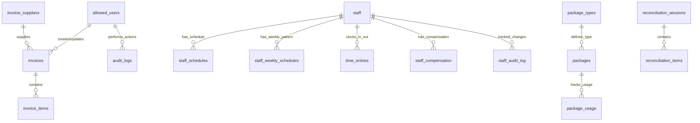

# Backoffice Schema Documentation

## Overview
The `backoffice` schema contains administrative and operational tables for managing staff, payroll, packages, invoicing, and financial reconciliation. This schema powers the back-office operations and is accessed primarily by admin users.

**Current Status (2025-01-08)**:
- **Total Tables**: 22 tables (all operational schemas)
- **✅ ALL ACTIVE**: 22/22 tables in active use
- **Status**: EXCELLENT - No cleanup needed, all features implemented and used
- **Database Operations**: All tables showing regular activity patterns
- **Performance**: Well-designed schema with appropriate indexing

## Table Relationships Diagram

## Tables

### 1. **allowed_users** ✅ CRITICAL ACTIVE
Admin and coach user authorization table.

**Activity**: Core authentication table - high daily usage
**Status**: CRITICAL - Controls entire admin access system
**Performance**: Excellent - lightweight table with fast lookups

**Purpose**: Controls access to admin features and coaching functions

**Key Relationships**:
- Referenced by `invoices` for created_by/updated_by
- Creates entries in `audit_logs`

**Population**: Admin-managed list of authorized emails

**Usage**:
- Authentication checks for admin access
- Coach assignment and scheduling
- Audit trail attribution

**Columns**:
| Column | Type | Nullable | Default | Description |
|--------|------|----------|---------|-------------|
| id | uuid | NO | uuid_generate_v4() | Primary key |
| email | text | NO | - | User email for authentication |
| is_admin | boolean | YES | false | Admin access flag |
| is_coach | boolean | NO | false | Coach role flag |
| coach_name | text | YES | - | Coach display name |
| coach_display_name | text | YES | - | Public-facing coach name |
| coach_phone | text | YES | - | Coach contact phone |
| coach_code | text | YES | - | Unique coach identifier |
| created_at | timestamp | NO | now() | Account creation time |
| updated_at | timestamp | NO | now() | Last update time |

---

### 2. **staff** ✅ HIGHLY ACTIVE
Staff member records for time tracking and payroll.

**Activity**: Daily time-clock operations, PIN validations, schedule lookups
**Status**: CRITICAL - Core HR/time tracking functionality
**Features**: PIN hashing, account lockout, failed attempt tracking

**Purpose**: Central staff management for scheduling and time tracking

**Key Relationships**:
- Referenced by `staff_schedules`, `time_entries`, `staff_compensation`
- Tracked in `staff_audit_log`

**Population**: HR/Admin creates staff records

**Usage**:
- Time clock authentication
- Schedule management
- Payroll calculations

**Columns**:
| Column | Type | Nullable | Default | Description |
|--------|------|----------|---------|-------------|
| id | integer | NO | nextval() | Primary key |
| staff_name | text | NO | - | Full staff name |
| staff_id | text | YES | - | Employee ID |
| pin_hash | text | NO | - | Hashed PIN for clock-in |
| is_active | boolean | YES | true | Active employment status |
| is_service_charge_eligible | boolean | YES | false | Eligible for service charge |
| failed_attempts | integer | YES | 0 | Failed PIN attempts |
| locked_until | timestamp | YES | - | Account lock expiry |
| created_at | timestamp | YES | now() | Record creation |
| updated_at | timestamp | YES | now() | Last update |

---

### 3. **packages** ✅ HIGHLY ACTIVE
Customer package purchases and tracking.

**Activity**: Package creation, usage tracking, expiration monitoring
**Status**: CRITICAL - Core business feature
**Integration**: Links to public.customers and CRM systems

**Purpose**: Manages customer package inventory and usage

**Key Relationships**:
- `package_type_id` → `package_types.id`
- `customer_id` → `public.customers.id`
- Referenced by `package_usage`

**Population**: Created when packages are sold

**Usage**:
- Package balance tracking
- Usage monitoring
- Expiration management

**Columns**:
| Column | Type | Nullable | Default | Description |
|--------|------|----------|---------|-------------|
| id | uuid | NO | uuid_generate_v4() | Primary key |
| customer_name | varchar | NO | - | Customer name |
| package_type_id | integer | NO | - | Package type reference |
| purchase_date | date | NO | - | Purchase date |
| first_use_date | date | YES | - | First usage date |
| expiration_date | date | YES | - | Package expiry |
| employee_name | varchar | YES | - | Selling employee |
| stable_hash_id | varchar | YES | - | Customer CRM hash |
| customer_id | uuid | YES | - | Customer reference |
| created_at | timestamp | NO | now() | Record creation |

---

### 4. **package_types** ✅ ACTIVE
Package definitions and configurations.

**Activity**: Regular queries for package creation and pricing
**Status**: ACTIVE - Package configuration management
**Usage**: Referenced by sales systems and package creation

**Purpose**: Defines available package types and their properties

**Key Relationships**:
- Referenced by `packages`

**Population**: Admin-configured package offerings

**Usage**:
- Package creation templates
- Pricing and validity rules
- Display in sales interfaces

**Columns**:
| Column | Type | Nullable | Default | Description |
|--------|------|----------|---------|-------------|
| id | integer | NO | nextval() | Primary key |
| name | varchar | NO | - | Package name |
| display_name | varchar | YES | - | Customer-facing name |
| type | enum | YES | - | Package category |
| hours | numeric | YES | - | Included hours |
| validity_period | interval | YES | - | Valid duration |
| pax | smallint | YES | - | Max people |
| display_order | smallint | YES | - | Sort order |

---

### 5. **package_usage** ✅ HIGHLY ACTIVE
Records of package hour consumption.

**Activity**: High-volume usage tracking, customer signatures
**Status**: CRITICAL - Core business tracking
**Features**: Digital signature storage, hour consumption tracking

**Purpose**: Tracks when and how package hours are used

**Key Relationships**:
- `package_id` → `packages.id`

**Population**: Created when package hours are consumed

**Usage**:
- Usage history
- Balance calculations
- Customer signatures

**Columns**:
| Column | Type | Nullable | Default | Description |
|--------|------|----------|---------|-------------|
| id | uuid | NO | uuid_generate_v4() | Primary key |
| package_id | uuid | NO | - | Package reference |
| employee_name | varchar | NO | - | Staff who processed |
| used_hours | numeric | NO | - | Hours consumed |
| used_date | date | NO | - | Usage date |
| customer_signature_path | text | YES | - | Signature image path |
| created_at | timestamp | NO | now() | Record creation |
| updated_at | timestamp | NO | now() | Last update |

---

### 6. **time_entries** ✅ HIGHLY ACTIVE
Staff clock-in/out records.

**Activity**: Multiple daily entries per staff member
**Status**: CRITICAL - Payroll dependency
**Features**: Photo verification, device tracking, error logging
**Performance**: Consider monthly partitioning for large datasets

**Purpose**: Raw time tracking data for payroll

**Key Relationships**:
- `staff_id` → `staff.id`

**Population**: Created via time clock interface

**Usage**:
- Payroll calculations
- Attendance tracking
- Photo verification

**Columns**:
| Column | Type | Nullable | Default | Description |
|--------|------|----------|---------|-------------|
| id | integer | NO | nextval() | Primary key |
| staff_id | integer | YES | - | Staff member |
| action | text | NO | - | clock_in/clock_out |
| timestamp | timestamp | NO | now() | Action time |
| photo_url | text | YES | - | Verification photo |
| photo_captured | boolean | YES | false | Photo success flag |
| camera_error | text | YES | - | Camera error details |
| device_info | jsonb | YES | - | Device metadata |

---

### 7. **staff_schedules** ✅ ACTIVE
Individual staff schedule entries.

**Activity**: Daily schedule management and lookups
**Status**: ACTIVE - Staff management operations
**Usage**: Schedule planning, attendance verification

**Purpose**: Daily staff scheduling

**Key Relationships**:
- `staff_id` → `staff.id`

**Population**: Created by admin/scheduler

**Usage**:
- Staff scheduling
- Shift planning
- Attendance verification

**Columns**:
| Column | Type | Nullable | Default | Description |
|--------|------|----------|---------|-------------|
| id | uuid | NO | gen_random_uuid() | Primary key |
| staff_id | integer | NO | - | Staff member |
| schedule_date | date | NO | - | Schedule date |
| start_time | time | NO | - | Shift start |
| end_time | time | NO | - | Shift end |
| location | text | YES | - | Work location |
| notes | text | YES | - | Schedule notes |
| created_by | text | YES | - | Creator email |

---

### 8. **staff_weekly_schedules** ✅ ACTIVE
Recurring weekly schedule patterns.

**Activity**: Template management, schedule generation
**Status**: ACTIVE - Schedule automation
**Usage**: Auto-generate daily schedules from patterns

**Purpose**: Template for recurring weekly schedules

**Key Relationships**:
- `staff_id` → `staff.id`

**Population**: Created by admin for regular patterns

**Usage**:
- Auto-generate daily schedules
- Default shift patterns
- Schedule templates

**Columns**:
| Column | Type | Nullable | Default | Description |
|--------|------|----------|---------|-------------|
| id | uuid | NO | gen_random_uuid() | Primary key |
| staff_id | integer | NO | - | Staff member |
| day_of_week | integer | NO | - | Day (0=Sunday) |
| start_time | time | NO | - | Shift start |
| end_time | time | NO | - | Shift end |
| location | text | YES | - | Work location |
| is_active | boolean | YES | true | Pattern active |

---

### 9. **staff_compensation** ✅ ACTIVE
Staff salary and rate configurations.

**Activity**: Payroll calculations, rate lookups
**Status**: CRITICAL - Payroll dependency
**Features**: Versioned rates, effective date management, overtime rates

**Purpose**: Versioned compensation tracking with effective dates

**Key Relationships**:
- `staff_id` → `staff.id`

**Population**: HR/Admin manages compensation changes

**Usage**:
- Payroll calculations
- Rate lookups
- Compensation history

**Columns**:
| Column | Type | Nullable | Default | Description |
|--------|------|----------|---------|-------------|
| id | integer | NO | nextval() | Primary key |
| staff_id | integer | NO | - | Staff member |
| compensation_type | text | YES | 'salary' | salary/hourly |
| base_salary | numeric | NO | 0 | Monthly salary |
| hourly_rate | numeric | YES | 0 | Hourly rate |
| ot_rate_per_hour | numeric | NO | 0 | Overtime rate |
| holiday_rate_per_hour | numeric | NO | 0 | Holiday rate |
| is_service_charge_eligible | boolean | YES | false | Service charge eligibility |
| min_hours_for_allowance | integer | YES | 6 | Min hours for daily allowance |
| effective_from | date | NO | - | Start date |
| effective_to | date | YES | - | End date (null = current) |

---

### 10. **invoices** ✅ ACTIVE
Supplier invoice records.

**Activity**: Regular invoice creation and management
**Status**: ACTIVE - Financial management
**Features**: PDF storage, audit trail, tax calculations

**Purpose**: Track supplier invoices for accounting

**Key Relationships**:
- `supplier_id` → `invoice_suppliers.id`
- `created_by` → `allowed_users.id`
- `updated_by` → `allowed_users.id`

**Population**: Created by admin users

**Usage**:
- Expense tracking
- Supplier payments
- Financial reconciliation

**Columns**:
| Column | Type | Nullable | Default | Description |
|--------|------|----------|---------|-------------|
| id | uuid | NO | gen_random_uuid() | Primary key |
| invoice_number | varchar | NO | - | Invoice number |
| supplier_id | uuid | NO | - | Supplier reference |
| invoice_date | date | NO | - | Invoice date |
| subtotal | numeric | NO | 0 | Pre-tax amount |
| tax_rate | numeric | NO | 3.00 | Tax percentage |
| tax_amount | numeric | NO | 0 | Tax amount |
| total_amount | numeric | NO | 0 | Total amount |
| pdf_file_path | text | YES | - | Stored PDF path |
| created_by | uuid | YES | - | Creator user |
| updated_by | uuid | YES | - | Last updater |

---

### 11. **invoice_items** ✅ ACTIVE
Line items for invoices.

**Activity**: Created with each invoice
**Status**: ACTIVE - Invoice detail tracking
**Usage**: Detailed expense categorization

**Purpose**: Detailed invoice line items

**Key Relationships**:
- `invoice_id` → `invoices.id`

**Population**: Created with invoice

**Usage**:
- Invoice details
- Item-level tracking

**Columns**:
| Column | Type | Nullable | Default | Description |
|--------|------|----------|---------|-------------|
| id | uuid | NO | gen_random_uuid() | Primary key |
| invoice_id | uuid | NO | - | Parent invoice |
| description | text | NO | - | Item description |
| quantity | numeric | NO | 1 | Quantity |
| unit_price | numeric | NO | - | Price per unit |
| line_total | numeric | NO | - | Line total |

---

### 12. **reconciliation_sessions** ✅ ACTIVE
Financial reconciliation tracking.

**Activity**: Regular financial reconciliation processes
**Status**: ACTIVE - Financial audit and control
**Features**: Match rate tracking, variance analysis

**Purpose**: Track reconciliation processes between systems

**Key Relationships**:
- Referenced by `reconciliation_items`

**Population**: Created during reconciliation processes

**Usage**:
- Audit trail
- Variance tracking
- Process monitoring

**Columns**:
| Column | Type | Nullable | Default | Description |
|--------|------|----------|---------|-------------|
| id | uuid | NO | gen_random_uuid() | Primary key |
| admin_user_id | uuid | YES | - | User performing reconciliation |
| reconciliation_type | text | NO | - | Type of reconciliation |
| file_name | text | NO | - | Source file |
| date_range_start | date | NO | - | Period start |
| date_range_end | date | NO | - | Period end |
| total_invoice_items | integer | NO | 0 | Invoice count |
| total_pos_records | integer | NO | 0 | POS record count |
| matched_items | integer | NO | 0 | Matched count |
| match_rate | numeric | YES | - | Match percentage |
| variance_amount | numeric | YES | - | Total variance |
| status | text | NO | 'processing' | Session status |

---

### 13. **audit_logs** ✅ HIGHLY ACTIVE
Comprehensive audit trail for admin actions.

**Activity**: High-volume audit logging for all admin actions
**Status**: CRITICAL - Compliance and security
**Performance**: Consider partitioning by month for large datasets
**Features**: IP tracking, user agent capture, detailed action logs

**Purpose**: Track all administrative actions for compliance

**Key Relationships**:
- References various tables via resource_type/resource_id

**Population**: Auto-created on admin actions

**Usage**:
- Compliance reporting
- Change tracking
- Security auditing

**Columns**:
| Column | Type | Nullable | Default | Description |
|--------|------|----------|---------|-------------|
| id | uuid | NO | gen_random_uuid() | Primary key |
| user_email | text | NO | - | Acting user |
| action | text | NO | - | CREATE/UPDATE/DELETE/VIEW |
| resource_type | text | NO | - | Target resource type |
| resource_id | text | YES | - | Target resource ID |
| details | jsonb | YES | {} | Action details |
| ip_address | text | YES | - | Client IP |
| user_agent | text | YES | - | Browser info |
| timestamp | timestamp | NO | now() | Action time |

---

### 14. **payroll_settings** ✅ ACTIVE
Global payroll configuration.

**Activity**: Regular lookups for payroll calculations
**Status**: ACTIVE - Payroll system configuration
**Usage**: Daily allowance rates, OT multipliers, payroll rules

**Purpose**: Store system-wide payroll settings

**Population**: Admin-configured

**Usage**:
- Daily allowance rates
- OT multipliers
- Payroll rules

**Columns**:
| Column | Type | Nullable | Default | Description |
|--------|------|----------|---------|-------------|
| id | integer | NO | nextval() | Primary key |
| setting_key | text | NO | - | Setting name |
| setting_value | text | NO | - | Setting value |
| description | text | YES | - | Setting description |
| updated_at | timestamp | YES | now() | Last update |

---

### 15. **public_holidays** ✅ ACTIVE
Thai public holiday calendar.

**Activity**: Regular holiday checks for payroll calculations
**Status**: ACTIVE - Payroll dependency
**Maintenance**: Annual updates required

**Purpose**: Define holidays for payroll calculations

**Population**: Annual admin update

**Usage**:
- Holiday pay calculations
- Schedule planning

**Columns**:
| Column | Type | Nullable | Default | Description |
|--------|------|----------|---------|-------------|
| id | integer | NO | nextval() | Primary key |
| holiday_date | date | NO | - | Holiday date |
| holiday_name | text | NO | - | Holiday name |
| is_active | boolean | YES | true | Active flag |

---

### 16. **monthly_service_charge** ✅ ACTIVE
Service charge pool for distribution.

**Activity**: Monthly financial entries and calculations
**Status**: ACTIVE - Staff compensation feature
**Usage**: Service charge distribution, staff bonus calculations

**Purpose**: Track monthly service charge amounts

**Population**: Monthly financial entry

**Usage**:
- Service charge distribution
- Staff bonus calculations

**Columns**:
| Column | Type | Nullable | Default | Description |
|--------|------|----------|---------|-------------|
| id | integer | NO | nextval() | Primary key |
| month_year | text | NO | - | Month identifier (YYYY-MM) |
| total_amount | numeric | NO | 0 | Total pool amount |
| updated_at | timestamp | YES | now() | Last update |

---

## Views and Functions

### Views

- **customer_active_packages** ✅ ACTIVE: Active packages with usage summary
- **coach_earnings** ✅ ACTIVE: Commission calculations for coaches
- **staff_status** ✅ ACTIVE: Current staff status with clock-in state

### Key Functions

- `calculate_package_expiration()` ✅ ACTIVE: Computes package expiry dates
- `log_staff_changes()` ✅ ACTIVE: Trigger for staff audit trail
- `validate_time_entry()` ✅ ACTIVE: Ensures valid clock-in/out sequences

---

### 17. **coach_rates** ✅ ACTIVE
Coaching service pricing and rate management.

**Activity**: Regular rate lookups for coaching bookings
**Status**: ACTIVE - Coaching system dependency
**Usage**: Pricing calculations, commission tracking

**Purpose**: Store coaching rates and pricing configurations

**Population**: Admin rate management interface

**Usage**:
- Coaching service pricing
- Rate calculation for bookings
- Revenue tracking

---

### 18. **invoice_suppliers** ✅ ACTIVE
Supplier information for invoice management.

**Activity**: Regular supplier lookups for invoice creation
**Status**: ACTIVE - Financial management dependency
**Features**: Vendor information, contact details, payment terms

**Purpose**: Manage supplier/vendor information for invoicing

**Population**: Admin supplier management

**Usage**:
- Invoice generation
- Supplier tracking
- Financial reconciliation

---

### 19. **invoice_settings** ✅ ACTIVE
System-wide invoice configuration and settings.

**Activity**: Configuration lookups for invoice generation
**Status**: ACTIVE - Invoice system configuration
**Features**: Template settings, tax rates, branding elements

**Purpose**: Configure invoice templates and system settings

**Population**: Admin configuration

**Usage**:
- Invoice customization
- System configuration
- Branding settings

---

### 20. **reconciliation_items** ✅ ACTIVE
Individual line items for financial reconciliation.

**Activity**: Created during each reconciliation session
**Status**: ACTIVE - Financial control system
**Features**: Transaction matching, variance tracking, discrepancy analysis

**Purpose**: Detailed reconciliation tracking for financial items

**Population**: Automated reconciliation processes

**Usage**:
- Financial auditing
- Transaction matching
- Discrepancy identification

---

### 21. **staff_audit_log** ✅ ACTIVE
Dedicated audit trail for staff-related changes.

**Activity**: Triggered on all staff record modifications
**Status**: ACTIVE - HR compliance and audit
**Features**: Change tracking, before/after snapshots, admin oversight

**Purpose**: Track all staff record modifications and actions

**Population**: Automated triggers on staff table changes

**Usage**:
- HR compliance
- Staff change tracking
- Administrative oversight

---

## Security Considerations

1. **PIN Security**: Staff PINs are hashed using bcrypt
2. **Audit Trail**: All admin actions logged in audit_logs
3. **Photo Verification**: Time entries can require photo capture
4. **Role-Based Access**: is_admin flag controls admin features

## Performance Optimization

1. **Indexes**:
   - `staff_schedules(staff_id, schedule_date)`
   - `time_entries(staff_id, timestamp)`
   - `packages(customer_id, expiration_date)`

2. **Partitioning**:
   - Consider partitioning `time_entries` by month
   - `audit_logs` could benefit from date partitioning

3. **Archival**:
   - Old `time_entries` can be archived after payroll processing
   - Expired packages can be moved to archive tables