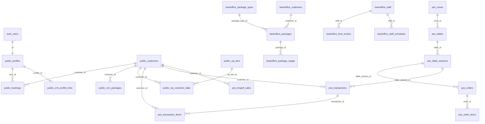
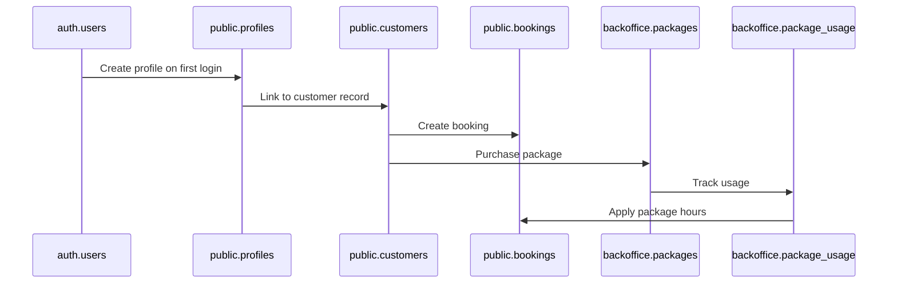

# Database Overview and Relationships

## Schema Architecture

The Lengolf Forms database consists of four main schemas:

- **`public`** - Core application data (35 tables, 182 functions) - Bookings, customers, inventory, coaching, referral analytics
- **`backoffice`** - Administrative operations (22 tables, 27 functions) - Staff, packages, invoicing, payroll, scheduling  
- **`pos`** - Point of sale transactions (29 tables, 32 functions) - Sales data, table management, product mapping
- **`auth`** - Supabase-managed authentication (16 tables, 4 functions) - Users, sessions, MFA, SSO

## Cross-Schema Relationships



## Key Integration Points

### 1. Authentication Flow
```
auth.users → public.profiles → application features
```

**Details**:
- `auth.users.id` = `public.profiles.id` (UUID, 1:1)
- Profile created on first login via trigger
- All app data linked through profiles table

### 2. Customer Unification
```
Multiple Systems → public.customers (unified)
```

**Sources**:
- Booking system customers
- POS system customers (via `current_pos_customer_id`)
- CRM imports (via `stable_hash_id`)
- Legacy systems (via `legacy_pos_customer_ids[]`)

**Linking Strategy**:
- Phone number normalization
- Email matching
- Manual assignment
- Hash-based linking for CRM

### 3. Package Management Flow
```
backoffice.packages → backoffice.package_usage → public.crm_packages
```

**Process**:
1. Package sold in `backoffice.packages`
2. Usage tracked in `backoffice.package_usage`
3. Synced to `public.crm_packages` for customer portal
4. Linked to `public.customers` for unified view

### 4. Transaction Integration
```
POS System → pos.lengolf_sales ← pos.transactions
```

**Dual Path**:
- **External POS**: CSV import → `pos.lengolf_sales`
- **Internal POS**: Orders → `pos.transactions` → `pos.transaction_items`
- Both link to `public.customers` via `customer_id`

## Data Dependencies

### Critical Dependencies

1. **Customer Records**
   - `public.customers` must exist before linking transactions
   - Phone normalization essential for matching
   - `stable_hash_id` required for CRM integration

2. **Profile Linking**
   - `auth.users` must exist before `public.profiles`
   - Profile required for booking creation
   - VIP data depends on profile-customer linking

3. **Package Lifecycle**
   - `backoffice.package_types` defines available packages
   - `backoffice.packages` records purchases
   - `backoffice.package_usage` tracks consumption
   - Expiration calculated from type + purchase date

### Data Flow Sequence



## Referential Integrity

### Foreign Key Constraints

**Public Schema**:
- `bookings.user_id` → `profiles.id`
- `bookings.customer_id` → `customers.id`
- `crm_packages.customer_id` → `customers.id`
- `profiles.customer_id` → `customers.id`

**Backoffice Schema**:
- `packages.package_type_id` → `package_types.id`
- `package_usage.package_id` → `packages.id`
- `staff_schedules.staff_id` → `staff.id`
- `time_entries.staff_id` → `staff.id`

**POS Schema**:
- `tables.zone_id` → `zones.id`
- `table_sessions.table_id` → `tables.id`
- `orders.table_session_id` → `table_sessions.id`
- `order_items.order_id` → `orders.id`

### Soft Dependencies (No FK Constraints)

**Cross-Schema References**:
- `pos.transaction_items.customer_id` → `public.customers.id`
- `pos.lengolf_sales.customer_id` → `public.customers.id`
- `backoffice.packages.customer_id` → `public.customers.id`

**Reasons for Soft Links**:
- Data may exist before customer creation
- Allows for gradual customer linking
- Supports data import flexibility

## Data Consistency Challenges

### 1. Customer Duplication
**Problem**: Same customer across multiple systems
**Solution**: 
- Normalized phone numbers for matching
- Hash-based stable IDs
- Manual merge tools

### 2. Package Synchronization
**Problem**: Package data split across schemas
**Solution**:
- Regular sync jobs
- Event-driven updates
- Reconciliation reports

### 3. Transaction Attribution
**Problem**: POS transactions without customer links
**Solution**:
- Phone-based matching
- Retroactive linking
- Staff verification process

## Performance Implications

### Cross-Schema Queries
```sql
-- Expensive: Customer with all transactions
SELECT c.*, ls.*, ti.*
FROM public.customers c
LEFT JOIN pos.lengolf_sales ls ON c.id = ls.customer_id
LEFT JOIN pos.transaction_items ti ON c.id = ti.customer_id;
```

**Optimization Strategies**:
- Materialized views for common joins
- Indexed foreign key columns
- Query-specific denormalization

### Critical Indexes

**Public Schema**:
- `customers(stable_hash_id)` - CRM lookups
- `bookings(date, bay)` - Availability checks
- `customers(normalized_phone)` - Phone matching

**POS Schema**:
- `lengolf_sales(date, receipt_number)` - Daily reports
- `transaction_items(customer_id, sales_timestamp)` - Customer history

**Backoffice Schema**:
- `packages(customer_id, expiration_date)` - Active packages
- `time_entries(staff_id, timestamp)` - Payroll calculations

## Backup and Recovery Considerations

### Schema Priority
1. **auth** - Critical for access
2. **public** - Core business data
3. **backoffice** - Administrative data  
4. **pos** - Can be re-imported from POS system

### Recovery Strategies
- Point-in-time recovery for auth/public schemas
- Daily backups of all schemas
- CSV export capability for POS data
- Package data sync from external CRM

## Migration Strategies

### Schema Evolution
1. **Backward Compatible**: Add nullable columns
2. **Data Migrations**: Update existing records
3. **Breaking Changes**: Multi-phase deployment

### Cross-Schema Coordination
- Coordinate FK changes across schemas
- Maintain referential integrity during migrations
- Test with representative data volumes

---

This overview provides the foundation for understanding how all database components work together to support the Lengolf Forms application ecosystem.