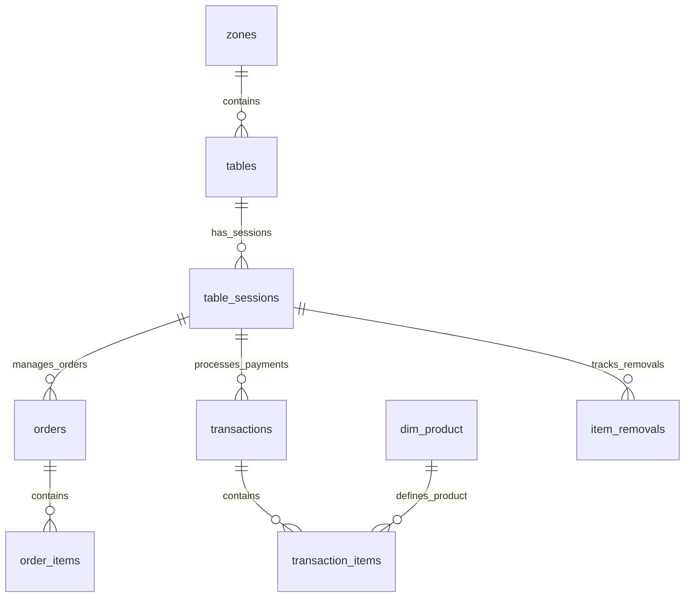

# POS Schema Documentation

## Overview
The `pos` schema contains Point of Sale (POS) transaction data, table management, and sales analytics. This schema integrates with external POS systems and supports the in-house table management system for food & beverage operations.

## Table Relationships Diagram

## Core Tables

### 1. **lengolf_sales**
Primary sales data table containing all transaction line items.

**Purpose**: Central repository for all sales transactions from POS system

**Key Relationships**:
- `customer_id` → `public.customers.id`
- `product_id` → `dim_product.id`

**Population**: Imported from Qashier POS via CSV uploads and ETL processes

**Usage**:
- Sales analytics and reporting
- Revenue calculations
- Product performance analysis
- Customer purchase history

**Columns**:
| Column | Type | Nullable | Default | Description |
|--------|------|----------|---------|-------------|
| id | integer | NO | nextval() | Primary key |
| date | date | NO | - | Transaction date |
| receipt_number | text | NO | - | POS receipt number |
| invoice_number | text | YES | - | Invoice number |
| payment_method | text | YES | - | Payment type |
| staff_name | text | YES | - | Staff who processed |
| customer_name | text | YES | - | Customer name |
| customer_phone_number | text | YES | - | Customer phone |
| product_name | text | YES | - | Product sold |
| product_category | text | YES | - | Product category |
| item_cnt | integer | YES | - | Quantity sold |
| item_price | numeric | YES | - | Unit price |
| sales_total | numeric | YES | - | Line total |
| sales_net | numeric | YES | - | Net amount |
| gross_profit | numeric | YES | - | Profit calculation |
| is_sim_usage | integer | YES | - | Simulator usage flag |
| sales_timestamp | timestamp | NO | - | Transaction timestamp |
| customer_id | uuid | YES | - | Linked customer record |
| product_id | uuid | YES | - | Linked product record |

---

### 2. **zones**
Physical areas in the establishment.

**Purpose**: Defines different areas/zones for table organization

**Key Relationships**:
- Referenced by `tables`

**Population**: Admin-configured based on physical layout

**Usage**:
- Table organization
- Zone-based reporting
- Layout management

**Columns**:
| Column | Type | Nullable | Default | Description |
|--------|------|----------|---------|-------------|
| id | uuid | NO | gen_random_uuid() | Primary key |
| name | varchar | NO | - | Zone identifier |
| display_name | varchar | NO | - | User-friendly name |
| zone_type | varchar | NO | - | Type of zone |
| color_theme | varchar | YES | '#6B7280' | UI color |
| is_active | boolean | YES | true | Active status |
| display_order | integer | YES | 0 | Sort order |

---

### 3. **tables**
Physical tables/stations in each zone.

**Purpose**: Represents individual tables or simulator bays

**Key Relationships**:
- `zone_id` → `zones.id`
- Referenced by `table_sessions`

**Population**: Admin-configured based on physical setup

**Usage**:
- Table management
- Session assignment
- Layout visualization

**Columns**:
| Column | Type | Nullable | Default | Description |
|--------|------|----------|---------|-------------|
| id | uuid | NO | gen_random_uuid() | Primary key |
| zone_id | uuid | NO | - | Parent zone |
| table_number | integer | NO | - | Table number |
| display_name | varchar | NO | - | Display name |
| max_pax | integer | NO | 8 | Maximum people |
| position_x | integer | NO | 0 | Layout X position |
| position_y | integer | NO | 0 | Layout Y position |
| is_active | boolean | YES | true | Active status |

---

### 4. **table_sessions**
Active sessions at tables/bays.

**Purpose**: Tracks current table occupancy and orders

**Key Relationships**:
- `table_id` → `tables.id`
- Referenced by `orders`, `transactions`, `item_removals`

**Population**: Created when table is occupied

**Usage**:
- Table status tracking
- Session billing
- Order management

**Columns**:
| Column | Type | Nullable | Default | Description |
|--------|------|----------|---------|-------------|
| id | uuid | NO | gen_random_uuid() | Primary key |
| table_id | uuid | NO | - | Table reference |
| status | varchar | NO | 'free' | Session status |
| pax_count | integer | YES | 0 | Number of people |
| booking_id | text | YES | - | Associated booking |
| staff_pin | varchar | YES | - | Staff PIN |
| session_start | timestamp | YES | - | Session start time |
| session_end | timestamp | YES | - | Session end time |
| total_amount | numeric | YES | 0 | Session total |
| current_order_items | jsonb | YES | [] | Active order items |
| notes | text | YES | - | Session notes |

---

### 5. **orders**
Food & beverage orders within sessions.

**Purpose**: Manages F&B orders for table sessions

**Key Relationships**:
- `table_session_id` → `table_sessions.id`
- Referenced by `order_items`, `transactions`

**Population**: Created when orders are placed

**Usage**:
- Order tracking
- Kitchen communication
- Billing preparation

**Columns**:
| Column | Type | Nullable | Default | Description |
|--------|------|----------|---------|-------------|
| id | uuid | NO | gen_random_uuid() | Primary key |
| table_session_id | uuid | NO | - | Session reference |
| order_number | integer | NO | nextval() | Sequential order number |
| status | text | NO | 'confirmed' | Order status |
| total_amount | numeric | NO | 0 | Order total |
| tax_amount | numeric | YES | 0 | Tax amount |
| subtotal_amount | numeric | NO | 0 | Pre-tax total |
| confirmed_at | timestamp | YES | now() | Confirmation time |
| confirmed_by | text | YES | - | Staff who confirmed |
| cancelled_at | timestamp | YES | - | Cancellation time |
| cancellation_reason | text | YES | - | Why cancelled |
| notes | text | YES | - | Order notes |

---

### 6. **order_items**
Individual items within orders.

**Purpose**: Line items for F&B orders

**Key Relationships**:
- `order_id` → `orders.id`
- `product_id` → `dim_product.id`

**Population**: Created when items added to orders

**Usage**:
- Kitchen preparation
- Item tracking
- Billing details

**Columns**:
| Column | Type | Nullable | Default | Description |
|--------|------|----------|---------|-------------|
| id | uuid | NO | gen_random_uuid() | Primary key |
| order_id | uuid | NO | - | Parent order |
| product_id | uuid | YES | - | Product reference |
| product_name | text | NO | - | Item name |
| category_name | text | YES | - | Item category |
| quantity | integer | NO | - | Quantity ordered |
| unit_price | numeric | NO | - | Price per unit |
| total_price | numeric | NO | - | Line total |
| modifiers | jsonb | YES | [] | Item modifications |
| notes | text | YES | - | Special requests |

---

### 7. **transactions**
Payment transactions for completed orders.

**Purpose**: Records payment processing for orders

**Key Relationships**:
- `table_session_id` → `table_sessions.id`
- `order_id` → `orders.id`
- `customer_id` → `public.customers.id`

**Population**: Created when payments are processed

**Usage**:
- Payment tracking
- Receipt generation
- Financial reconciliation

**Columns**:
| Column | Type | Nullable | Default | Description |
|--------|------|----------|---------|-------------|
| id | uuid | NO | gen_random_uuid() | Primary key |
| transaction_id | uuid | NO | - | Unique transaction ID |
| receipt_number | varchar | NO | - | Receipt number |
| subtotal | numeric | NO | - | Pre-tax amount |
| vat_amount | numeric | NO | - | VAT amount |
| total_amount | numeric | NO | - | Total amount |
| discount_amount | numeric | YES | 0 | Discount applied |
| payment_methods | jsonb | YES | - | Payment details |
| payment_status | varchar | YES | 'completed' | Payment status |
| customer_id | uuid | YES | - | Customer reference |
| staff_pin | varchar | YES | - | Processing staff |
| transaction_date | timestamp | NO | now() | Transaction time |

---

### 8. **transaction_items**
Individual items in payment transactions.

**Purpose**: Line-by-line breakdown of transaction content

**Key Relationships**:
- `transaction_id` → `transactions.id`
- `order_id` → `orders.id`
- `table_session_id` → `table_sessions.id`
- `customer_id` → `public.customers.id`

**Population**: Created during transaction processing

**Usage**:
- Detailed receipts
- Item-level analytics
- Revenue attribution

**Columns**:
| Column | Type | Nullable | Default | Description |
|--------|------|----------|---------|-------------|
| id | uuid | NO | gen_random_uuid() | Primary key |
| transaction_id | uuid | NO | - | Parent transaction |
| item_sequence | integer | NO | - | Item order |
| product_name | varchar | NO | - | Product name |
| product_category | varchar | YES | - | Category |
| sku_number | varchar | YES | - | SKU |
| item_cnt | integer | NO | 1 | Quantity |
| item_price_incl_vat | numeric | NO | - | Price with VAT |
| item_price_excl_vat | numeric | NO | - | Price without VAT |
| sales_total | numeric | NO | - | Line total |
| payment_method | varchar | YES | - | Payment type |
| customer_id | uuid | YES | - | Customer reference |
| is_sim_usage | boolean | YES | false | Simulator usage |
| is_voided | boolean | YES | false | Voided status |

---

### 9. **dim_product**
Product master data for POS items.

**Purpose**: Central product catalog for all POS items

**Key Relationships**:
- Referenced by `transaction_items`, `order_items`

**Population**: Synced from POS system or manually maintained

**Usage**:
- Product lookups
- Pricing information
- Category management

**Columns**:
| Column | Type | Nullable | Default | Description |
|--------|------|----------|---------|-------------|
| id | integer | NO | nextval() | Primary key |
| product_name | text | NO | - | Product name |
| tab | text | YES | - | POS tab/section |
| category | text | YES | - | Product category |
| parent_category | text | YES | - | Parent category |
| barcode | text | YES | - | Product barcode |
| sku_number | text | YES | - | SKU |
| unit_price | numeric | YES | - | Current price |
| unit_cost | numeric | YES | - | Cost price |
| is_sim_usage | boolean | YES | false | Simulator time flag |
| product_id | uuid | YES | - | UUID reference |

---

### 10. **item_removals**
Tracks removed items from orders.

**Purpose**: Audit trail for cancelled/removed order items

**Key Relationships**:
- `table_session_id` → `table_sessions.id`
- `order_id` → `orders.id`
- `order_item_id` → `order_items.id`

**Population**: Created when items are removed from orders

**Usage**:
- Audit trail
- Waste tracking
- Staff accountability

**Columns**:
| Column | Type | Nullable | Default | Description |
|--------|------|----------|---------|-------------|
| id | uuid | NO | gen_random_uuid() | Primary key |
| table_session_id | uuid | NO | - | Session reference |
| item_name | text | NO | - | Removed item |
| item_quantity | integer | NO | - | Quantity removed |
| removal_reason | text | NO | - | Reason for removal |
| staff_pin | text | NO | - | Staff PIN |
| removed_by | text | NO | - | Staff name |
| removed_at | timestamp | NO | now() | Removal time |
| original_quantity | integer | YES | - | Original quantity |
| removed_quantity | integer | YES | - | Amount removed |

---

## Support Tables

### 11. **lengolf_sales_staging**
Raw import staging for POS CSV data.

**Purpose**: Staging area for raw CSV imports from Qashier

**Population**: CSV upload processing

**Usage**: ETL staging before data normalization

### 12. **product_mappings**
Maps POS product names to standardized product IDs.

**Purpose**: Normalize product references across systems

**Population**: Admin-managed mappings

**Usage**: Data integration and normalization

### 13. **sales_sync_logs**
Logs for POS data synchronization processes.

**Purpose**: Track ETL job status and errors

**Population**: Auto-created during sync processes

**Usage**: Monitoring and debugging data imports

## Data Flow

1. **POS System** → CSV Export → **lengolf_sales_staging**
2. **Staging** → ETL Process → **lengolf_sales** (normalized)
3. **Manual Orders** → **table_sessions** → **orders** → **order_items**
4. **Payment** → **transactions** → **transaction_items**

## Key Processes

### Sales Data Import
1. CSV files uploaded to staging
2. ETL normalizes and validates data  
3. Products mapped via product_mappings
4. Customers linked via phone/name matching
5. Final data inserted into lengolf_sales

### Table Management
1. Table sessions created for walk-ins/bookings
2. Orders placed and tracked through order lifecycle
3. Payments processed creating transactions
4. Session closed and table freed

### Financial Reconciliation
- Daily sales totals from lengolf_sales
- Transaction totals from transactions table
- Variance analysis for discrepancies
- Integration with backoffice reconciliation

## Performance Considerations

1. **Indexes**:
   - `lengolf_sales(date, receipt_number)`
   - `transactions(transaction_date)`
   - `table_sessions(table_id, status)`

2. **Partitioning**:
   - Consider monthly partitioning for lengolf_sales
   - Archive old transaction data

3. **ETL Optimization**:
   - Batch processing for large CSV imports
   - Incremental sync for daily updates

## Integration Points

- **Public Schema**: Customer linking via customer_id
- **Backoffice Schema**: Staff references via staff_pin
- **External POS**: CSV import/export
- **Financial Systems**: Transaction export for accounting