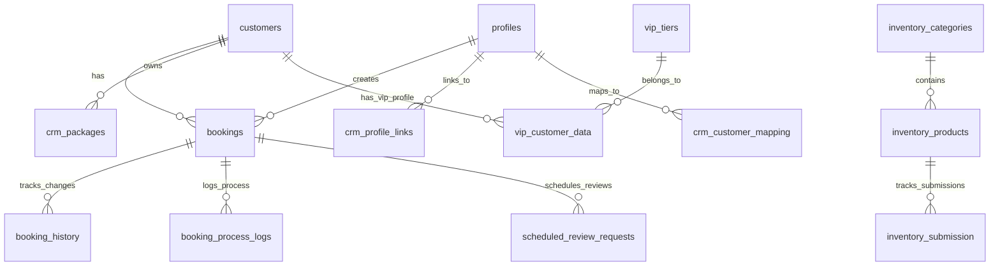

# Public Schema Documentation

## Overview
The `public` schema contains core application tables for managing bookings, customer data, inventory, competitive analytics, and system operations. This is the primary schema for user-facing functionality.

**Current Status (2025-01-08)**:
- **Total Tables**: 35 (+ 2 views)
- **🔥 Highly Active**: 2 tables (customers: 26.9M ops, processed_leads: 7.2K ops)
- **✅ Active**: 8 tables with regular operations (bookings, crm_packages, etc.)
- **⚠️ Low Activity**: 3 tables with minimal usage
- **❌ Unused**: 12 tables with zero/minimal activity (cleanup candidates)
- **Database Operations**: 26.9M+ total operations, heavily concentrated in customer management

## Table Relationships Diagram

## Tables

### 1. **bookings**
Core table for all booking records.

**Purpose**: Stores customer bookings for golf simulator sessions

**Key Relationships**:
- `user_id` → `profiles.id` (booking creator)
- `customer_id` → `customers.id` (customer record)

**Population**: Created through booking form, admin interfaces, or API

**Usage**: 
- Displayed in booking calendar
- Used for availability checking
- Drives notifications and reminders

**Columns**:
| Column | Type | Nullable | Default | Description |
|--------|------|----------|---------|-------------|
| id | text | NO | - | Unique booking identifier |
| user_id | uuid | NO | - | Profile ID of user who created booking |
| name | text | NO | - | Customer name for booking |
| email | text | NO | - | Contact email |
| phone_number | text | NO | - | Contact phone |
| date | date | NO | - | Booking date |
| start_time | text | NO | - | Session start time |
| duration | real | NO | - | Session duration in hours |
| number_of_people | integer | NO | - | Party size |
| status | text | NO | - | Booking status (confirmed/cancelled/etc) |
| bay | text | YES | - | Assigned simulator bay |
| customer_notes | text | YES | - | Notes from customer |
| booking_type | text | YES | - | Type of booking (walk-in/package/etc) |
| package_id | uuid | YES | - | Associated package if applicable |
| stable_hash_id | text | YES | - | CRM customer hash ID |
| referral_source | text | YES | - | How customer heard about us |
| is_new_customer | boolean | YES | false | First-time customer flag |
| created_at | timestamp | NO | now() | Record creation time |
| updated_at | timestamp | NO | now() | Last update time |

---

### 2. **customers** 🔥 HIGHLY ACTIVE
Unified customer master data table.

**Activity**: **26.9M+ operations** - Most active table in entire database
**Status**: CRITICAL - Core business entity
**Performance Note**: High update volume suggests optimization needed

**Purpose**: Central repository for all customer information across systems

**Key Relationships**:
- Referenced by `bookings`, `crm_packages`, `vip_customer_data`
- Links to POS system via `current_pos_customer_id`

**Population**: 
- Auto-created from bookings
- Synced from POS system
- Imported from CRM

**Usage**:
- Customer lookup and search
- Analytics and reporting
- Marketing communications

**Columns**:
| Column | Type | Nullable | Default | Description |
|--------|------|----------|---------|-------------|
| id | uuid | NO | gen_random_uuid() | Primary key |
| customer_code | varchar | NO | - | Unique customer code |
| customer_name | varchar | NO | - | Full name |
| contact_number | varchar | YES | - | Primary phone |
| email | varchar | YES | - | Primary email |
| normalized_phone | varchar | YES | - | Standardized phone format |
| stable_hash_id | varchar | YES | - | Unique hash for CRM linking |
| current_pos_customer_id | bigint | YES | - | Active POS customer ID |
| legacy_pos_customer_ids | bigint[] | YES | - | Historical POS IDs |
| total_lifetime_value | numeric | YES | 0.00 | Total spending |
| total_visits | integer | YES | 0 | Visit count |
| last_visit_date | date | YES | - | Most recent visit |
| marketing_opt_in | boolean | YES | false | Marketing consent |
| search_vector | tsvector | YES | - | Full-text search index |
| created_at | timestamp | YES | now() | Record creation |
| updated_at | timestamp | YES | now() | Last update |

---

### 3. **profiles**
User authentication profiles from NextAuth.

**Purpose**: Stores authenticated user profiles and links to customer records

**Key Relationships**:
- `customer_id` → `customers.id`
- `vip_customer_data_id` → `vip_customer_data.id`

**Population**: Created on first login via OAuth providers

**Usage**:
- User authentication
- Profile management
- Booking ownership

**Columns**:
| Column | Type | Nullable | Default | Description |
|--------|------|----------|---------|-------------|
| id | uuid | NO | - | Auth user ID |
| email | text | YES | - | Login email |
| display_name | text | YES | - | Display name |
| phone_number | text | YES | - | Contact phone |
| provider | text | YES | - | OAuth provider (google/line) |
| provider_id | text | YES | - | Provider user ID |
| picture_url | text | YES | - | Profile picture URL |
| marketing_preference | boolean | NO | true | Email preferences |
| customer_id | uuid | YES | - | Linked customer record |
| vip_customer_data_id | uuid | YES | - | VIP profile link |

---

### 4. **bay_availability_cache** ❌ UNUSED - CLEANUP CANDIDATE
Performance optimization for bay availability checks.

**Activity**: **0 operations** - Never used
**Status**: UNUSED - Feature never implemented
**Action**: Safe to drop

**Purpose**: Caches Google Calendar API results to reduce API calls

**Population**: Auto-populated on availability checks (never activated)

**Usage**: Intended for booking availability caching (not implemented)

**Columns**:
| Column | Type | Nullable | Default | Description |
|--------|------|----------|---------|-------------|
| id | uuid | NO | gen_random_uuid() | Primary key |
| cache_key | text | NO | - | Unique cache identifier |
| date | text | NO | - | Date checked |
| time | text | NO | - | Time slot |
| duration | integer | NO | - | Duration in minutes |
| available | boolean | NO | - | Availability status |
| bay | text | YES | - | Specific bay if assigned |
| all_available_bays | text[] | YES | - | List of available bays |
| valid_until | bigint | NO | - | Cache expiry timestamp |
| created_at | timestamp | YES | now() | Cache creation time |

---

### 5. **booking_history** ✅ ACTIVE
Audit trail for all booking changes.

**Activity**: Regular operations tracking booking modifications
**Status**: ACTIVE - Critical audit functionality

**Purpose**: Tracks all modifications to bookings for audit and customer service

**Key Relationships**:
- `booking_id` → `bookings.id`

**Population**: Auto-created on any booking change via triggers

**Usage**:
- Customer service investigations
- Audit reporting
- Change tracking

**Columns**:
| Column | Type | Nullable | Default | Description |
|--------|------|----------|---------|-------------|
| history_id | uuid | NO | gen_random_uuid() | Primary key |
| booking_id | text | NO | - | Related booking |
| changed_at | timestamp | NO | now() | Change timestamp |
| action_type | text | NO | - | Type of change |
| changed_by_type | text | YES | - | Who made change (user/system/admin) |
| changed_by_identifier | text | YES | - | ID of changer |
| changes_summary | text | YES | - | Human-readable summary |
| old_booking_snapshot | jsonb | YES | - | Previous state |
| new_booking_snapshot | jsonb | YES | - | New state |
| notes | text | YES | - | Additional notes |

---

### 6. **crm_packages** ✅ ACTIVE
Customer package holdings from CRM system.

**Activity**: Regular sync operations from CRM
**Status**: ACTIVE - Core package management

**Purpose**: Stores package information synced from external CRM

**Key Relationships**:
- `customer_id` → `customers.id`

**Population**: Synced from CRM via scheduled jobs

**Usage**:
- Package balance checking
- Booking eligibility
- Usage tracking

**Columns**:
| Column | Type | Nullable | Default | Description |
|--------|------|----------|---------|-------------|
| id | uuid | NO | gen_random_uuid() | Primary key |
| stable_hash_id | varchar | NO | - | CRM customer hash |
| crm_package_id | text | YES | - | CRM package ID |
| customer_name | text | YES | - | Customer name |
| package_name | text | YES | - | Package name |
| package_category | text | YES | - | Package type |
| total_hours | numeric | YES | - | Total package hours |
| used_hours | numeric | YES | - | Hours consumed |
| remaining_hours | numeric | YES | - | Hours available |
| first_use_date | date | YES | - | First usage date |
| expiration_date | date | YES | - | Package expiry |
| purchase_date | timestamp | YES | - | Purchase date |
| pax | integer | YES | - | People allowed |

---

### 7. **inventory_categories** ❌ UNUSED - CLEANUP CANDIDATE
Categories for inventory management.

**Activity**: **0 operations** - Never used
**Status**: UNUSED - Inventory feature not implemented
**Action**: Consider removal with inventory_products

**Purpose**: Organizes inventory items into logical groups

**Key Relationships**:
- Referenced by `inventory_products`

**Population**: Admin-managed through inventory settings (never used)

**Usage**: Feature not implemented

**Columns**:
| Column | Type | Nullable | Default | Description |
|--------|------|----------|---------|-------------|
| id | uuid | NO | gen_random_uuid() | Primary key |
| name | varchar | NO | - | Category name |
| display_order | integer | NO | 0 | Sort order |
| is_active | boolean | YES | true | Active status |
| created_at | timestamp | YES | now() | Creation time |
| updated_at | timestamp | YES | now() | Last update |

---

### 8. **inventory_products** ❌ UNUSED - CLEANUP CANDIDATE
Product definitions for inventory tracking.

**Activity**: **3 operations** - Minimal test data only
**Status**: UNUSED - Inventory feature not fully implemented
**Action**: Consider removal with inventory_categories

**Purpose**: Defines trackable inventory items

**Key Relationships**:
- `category_id` → `inventory_categories.id`

**Population**: Admin-managed through inventory settings (minimal use)

**Usage**: Feature not fully implemented

**Columns**:
| Column | Type | Nullable | Default | Description |
|--------|------|----------|---------|-------------|
| id | uuid | NO | gen_random_uuid() | Primary key |
| category_id | uuid | YES | - | Product category |
| name | varchar | NO | - | Product name |
| unit | varchar | YES | - | Unit of measure |
| input_type | varchar | NO | - | Form input type |
| input_options | jsonb | YES | - | Input configuration |
| reorder_threshold | numeric | YES | - | Low stock alert level |
| supplier | varchar | YES | - | Supplier name |
| unit_cost | numeric | YES | - | Cost per unit |
| image_url | text | YES | - | Product image |
| purchase_link | text | YES | - | Reorder URL |
| display_order | integer | NO | 0 | Sort order |
| is_active | boolean | YES | true | Active status |

---

### 9. **inventory_submission** ⚠️ LOW ACTIVITY
Daily inventory count submissions.

**Activity**: **1,862 operations** - Some usage but low volume
**Status**: PARTIALLY ACTIVE - Consider if still needed

**Purpose**: Records staff inventory counts

**Key Relationships**:
- `product_id` → `inventory_products.id`
- `category_id` → `inventory_categories.id`

**Population**: Staff daily submissions via inventory form

**Usage**:
- Stock level tracking
- Usage analytics
- Reorder alerts

**Columns**:
| Column | Type | Nullable | Default | Description |
|--------|------|----------|---------|-------------|
| id | uuid | NO | gen_random_uuid() | Primary key |
| date | date | NO | - | Count date |
| staff | varchar | NO | - | Staff member name |
| product_id | uuid | NO | - | Product counted |
| category_id | uuid | NO | - | Product category |
| value_numeric | numeric | YES | - | Numeric count |
| value_text | text | YES | - | Text value |
| value_json | jsonb | YES | - | Complex values |
| note | text | YES | - | Submission notes |

---

### 10. **vip_customer_data** ❌ UNUSED - CLEANUP CANDIDATE
VIP customer profile information.

**Activity**: **0 operations** - Never used
**Status**: UNUSED - VIP feature never launched
**Action**: Safe to drop with vip_tiers

**Purpose**: Stores VIP-specific customer data and preferences

**Key Relationships**:
- `customer_id` → `customers.id`
- `vip_tier_id` → `vip_tiers.id`

**Population**: Never implemented

**Usage**: VIP feature was planned but never launched

**Columns**:
| Column | Type | Nullable | Default | Description |
|--------|------|----------|---------|-------------|
| id | uuid | NO | gen_random_uuid() | Primary key |
| vip_display_name | text | YES | - | VIP profile name |
| vip_email | text | YES | - | VIP contact email |
| vip_phone_number | text | YES | - | VIP phone |
| vip_marketing_preference | boolean | YES | true | Marketing consent |
| vip_tier_id | integer | YES | - | Membership tier |
| stable_hash_id | text | YES | - | CRM link hash |
| customer_id | uuid | YES | - | Customer record |

---

### 11. **vip_tiers** ❌ UNUSED - CLEANUP CANDIDATE
VIP membership tier definitions.

**Activity**: **0 operations** - Never used
**Status**: UNUSED - VIP feature never launched
**Action**: Safe to drop with vip_customer_data

**Purpose**: Defines VIP program tiers and benefits

**Population**: Never implemented

**Usage**: VIP feature was planned but never launched

**Columns**:
| Column | Type | Nullable | Default | Description |
|--------|------|----------|---------|-------------|
| id | integer | NO | nextval() | Primary key |
| tier_name | text | NO | - | Tier name (Bogey/Eagle/Masters) |
| description | text | YES | - | Tier description |
| status | text | NO | 'active' | Active/inactive |
| sort_order | integer | YES | - | Display order |

---

### 12. **processed_leads** 🔥 HIGHLY ACTIVE
Facebook/Meta lead form submissions.

**Activity**: **7,256 operations** including frequent deletions
**Status**: CRITICAL - Active lead management
**Performance Note**: High deletion rate suggests archival needed

**Purpose**: Stores and tracks marketing leads from social media

**Population**: Auto-imported from Facebook Lead Ads via webhook

**Usage**:
- Lead follow-up
- Marketing analytics
- Conversion tracking

**Columns**:
| Column | Type | Nullable | Default | Description |
|--------|------|----------|---------|-------------|
| id | uuid | NO | gen_random_uuid() | Primary key |
| lead_id | text | NO | - | Facebook lead ID |
| lead_type | text | NO | - | Lead form type |
| full_name | text | YES | - | Lead name |
| email | text | YES | - | Lead email |
| phone_number | text | YES | - | Lead phone |
| company_name | text | YES | - | Company (for events) |
| event_type | text | YES | - | Event type interest |
| spam_score | integer | YES | 0 | Spam detection score |
| is_likely_spam | boolean | YES | false | Spam flag |
| created_at | timestamp | YES | now() | Import time |

---

### 13. **google_ads_spend** ❌ UNUSED - CLEANUP CANDIDATE
Google Ads campaign spending data.

**Activity**: **0 operations** - Never used
**Status**: UNUSED - Ad tracking not implemented
**Action**: Safe to drop

**Purpose**: Tracks advertising spend for ROI analysis

**Population**: Never implemented

**Usage**: Ad spend tracking feature not activated

**Columns**:
| Column | Type | Nullable | Default | Description |
|--------|------|----------|---------|-------------|
| id | integer | NO | nextval() | Primary key |
| date | date | YES | - | Spend date |
| campaign_id | bigint | YES | - | Google campaign ID |
| campaign_name | text | YES | - | Campaign name |
| cost_thb | numeric | YES | - | Spend in THB |

---

### 14. **unified_referral_records** ✅ ACTIVE
Consolidated referral source tracking.

**Activity**: Regular ETL operations from multiple sources
**Status**: ACTIVE - Important for analytics

**Purpose**: Unified view of all referral sources across systems

**Population**: ETL from multiple sources (bookings, POS, forms)

**Usage**:
- Referral analytics
- Staff performance
- Marketing attribution

**Columns**:
| Column | Type | Nullable | Default | Description |
|--------|------|----------|---------|-------------|
| id | integer | NO | nextval() | Primary key |
| date | date | NO | - | Referral date |
| referral_source | text | NO | - | Normalized source |
| data_source | text | NO | - | System of origin |
| customer_name | text | YES | - | Customer name |
| customer_phone | text | YES | - | Customer phone |
| customer_id | uuid | YES | - | Customer record |
| staff_name | text | YES | - | Referring staff |
| raw_referral_source | text | YES | - | Original value |

---

### 15. **cash_checks**
Daily cash recording system for staff operations.

**Purpose**: Staff cash recording for opening/closing amounts

**Population**: Staff UI submissions via `/cash-check` page

**Code Usage**:
- **API**: `/api/cash-check/route.ts` - Handles submissions with validation
- **Frontend**: `/cash-check/page.tsx` - Mobile-optimized staff interface
- **Validation**: Restricts to specific staff members (Dolly, Net, May)
- **Security**: Requires authentication and validates positive amounts

**Usage**:
- Daily cash reconciliation
- Staff accountability tracking
- Financial audit trail
- Operational compliance

**Business Logic**:
- Enforces staff member validation (hardcoded allowlist)
- Requires positive numeric amounts
- Auto-generates UUID and timestamps
- Provides immediate success/error feedback

**Columns**:
| Column | Type | Nullable | Default | Description |
|--------|------|----------|---------|-------------|
| id | uuid | NO | gen_random_uuid() | Primary key |
| timestamp | timestamptz | NO | now() | Check time |
| staff | varchar | NO | - | Staff member |
| amount | numeric | NO | - | Cash amount |
| created_at | timestamptz | YES | now() | Creation time |

---

### 16. **lead_feedback**
B2C lead contact and follow-up management.

**Purpose**: Track lead contact attempts and responses for B2C lead management

**Population**: Staff UI for lead management via B2C lead feedback system

**Code Usage**:
- **API Endpoints**: 
  - `/api/leads/feedback/route.ts` - Creates feedback records
  - `/api/leads/feedback-stats/route.ts` - Analytics on feedback data
  - `/api/leads/unfeedback/route.ts` - Removes feedback records
- **Integration**: Links to `processed_leads` table via `lead_id`
- **Validation**: Enforces enum types for response categories
- **Workflow**: Tracks complete lead lifecycle from contact to conversion

**Usage**:
- Lead conversion tracking and analytics
- Follow-up scheduling and management
- Sales pipeline progression monitoring
- Staff performance evaluation
- Lead quality assessment

**Business Logic**:
- Tracks reachability success/failure
- Categorizes responses (very_interested, interested_need_time, not_interested, no_clear_answer)
- Defines visit timelines (within_1_week, within_month, no_plan)
- Flags leads requiring follow-up
- Tracks booking conversion success
- Maintains staff notes and comments

**Columns**:
| Column | Type | Nullable | Default | Description |
|--------|------|----------|---------|-------------|
| id | uuid | NO | gen_random_uuid() | Primary key |
| lead_id | uuid | NO | - | References processed_leads |
| call_date | date | NO | - | Contact date |
| was_reachable | boolean | NO | - | Contact success |
| response_type | enum | YES | - | Response category |
| visit_timeline | enum | YES | - | Visit interest |
| requires_followup | boolean | NO | false | Needs follow-up |
| booking_submitted | boolean | NO | false | Converted to booking |
| comments | text | YES | - | Notes |

---

### 17. **coach_weekly_schedules**
Coach availability and scheduling system.

**Purpose**: Define coach weekly availability patterns for coaching system

**Population**: Admin scheduling interface and coaching system

**Code Usage**:
- **API Endpoints**: 
  - `/api/coaching/availability/weekly-schedule/route.ts` - Manages coach schedules
  - `/api/coaching-assist/availability/route.ts` - Provides availability for booking
- **Integration**: Used by coaching system for availability validation
- **Access Control**: Coaches can view own schedules, admins can view all
- **Functions**: Integrated with `get_coach_availability()` Supabase function

**Usage**:
- Coach availability lookup and management
- Booking slot validation for coaching sessions
- Schedule conflict detection and prevention
- Coaching resource planning
- Staff schedule coordination

**Business Logic**:
- Stores weekly recurring availability patterns
- Uses day_of_week (0-6, Sunday-Saturday) for standardization
- Supports time-based availability windows
- Allows availability toggling (is_available flag)
- Enables per-coach customization
- Provides foundation for coaching booking system

**Columns**:
| Column | Type | Nullable | Default | Description |
|--------|------|----------|---------|-------------|
| id | uuid | NO | gen_random_uuid() | Primary key |
| coach_id | uuid | YES | - | Coach identifier |
| day_of_week | integer | NO | - | Day (0-6, Sun-Sat) |
| start_time | time | NO | - | Availability start |
| end_time | time | NO | - | Availability end |
| is_available | boolean | YES | true | Currently available |

---

### 18. **system_logs**
Application system logging and error tracking.

**Purpose**: Centralized application logging

**Population**: Application error handlers and system events

**Usage**:
- Error monitoring
- System diagnostics
- Performance tracking

---

### 19. **translation_keys**, **translations**, **translation_namespaces**, **translation_history** ⚠️ LOW ACTIVITY
Internationalization system for multi-language support.

**Activity**: Minimal operations across all tables
**Status**: PARTIALLY IMPLEMENTED - i18n system present but unused
**Action**: Consider removal if not planning multi-language support

**Purpose**: Support multiple languages in the application

**Population**: Translation management system (minimally used)

**Usage**: i18n infrastructure exists but not actively used

---

### 20. **guest_profiles** ❌ UNUSED - CLEANUP CANDIDATE
Guest user profile management for non-authenticated users.

**Activity**: **0 operations** - Never used
**Status**: UNUSED - Guest booking feature not implemented
**Action**: Safe to drop

**Purpose**: Track guest user information and preferences

**Population**: Never implemented

**Usage**: Guest booking feature was planned but not built

---

### 21. **crm_customer_mapping** ❌ UNUSED - CLEANUP CANDIDATE
CRM to internal customer ID mapping.

**Activity**: **1 operation** - Test data only
**Status**: UNUSED - CRM integration abandoned
**Action**: Safe to drop with other CRM tables

**Purpose**: Maps CRM customer IDs to internal customer records

**Usage**: CRM integration feature abandoned

---

### 22. **crm_matching_logs** ❌ UNUSED - CLEANUP CANDIDATE
Logs for CRM customer matching process.

**Activity**: **0 operations** - Never used
**Status**: UNUSED - CRM integration abandoned
**Action**: Safe to drop

**Purpose**: Audit trail for CRM customer matching

**Usage**: CRM matching feature never implemented

---

### 23. **crm_profile_links** ❌ UNUSED - CLEANUP CANDIDATE
Links between profiles and CRM records.

**Activity**: **2 operations** - Test data only
**Status**: UNUSED - CRM integration abandoned
**Action**: Safe to drop

**Purpose**: Links user profiles to CRM customer records

**Usage**: CRM profile linking feature abandoned

---

### 24. **customer_migration_log** ❌ UNUSED - CLEANUP CANDIDATE
Historical migration tracking.

**Activity**: **0 operations** - Migration completed
**Status**: HISTORICAL - No longer needed
**Action**: Archive then drop

**Purpose**: Tracked customer data migration

**Usage**: Migration completed, logs no longer needed

---

### 25. **profile_migration_log** ❌ UNUSED - CLEANUP CANDIDATE
Historical profile migration tracking.

**Activity**: **0 operations** - Migration completed
**Status**: HISTORICAL - No longer needed
**Action**: Archive then drop

**Purpose**: Tracked profile data migration

**Usage**: Migration completed, logs no longer needed

---

### 26. **us_open_scores** ❌ UNUSED - CLEANUP CANDIDATE
Tournament scoring feature.

**Activity**: **0 operations** - Never used
**Status**: UNUSED - Tournament feature not implemented
**Action**: Safe to drop

**Purpose**: Store US Open tournament scores

**Usage**: Tournament feature was planned but never built

---

## Views and Materialized Views

### customer_analytics ✅ ACTIVE
Aggregated customer metrics view combining data from multiple tables.
**Usage**: Dashboard analytics, customer insights

### customer_login_providers ❌ UNUSED - CLEANUP CANDIDATE
Shows authentication methods used by customers.
**Activity**: **0 operations** - Authentication view not used
**Action**: Safe to drop with other unused auth features

### referral_data ✅ ACTIVE  
Daily aggregated referral counts.
**Usage**: Marketing analytics, referral tracking

## Key Stored Procedures & Functions

- `update_customer_search_vector()` - Maintains full-text search index
- `log_booking_change()` - Trigger function for booking history
- `normalize_phone_number()` - Standardizes phone formats

## Security & Access Control

- Row Level Security (RLS) enabled on sensitive tables
- Profile-based access for user data
- Admin role bypass for backoffice operations

## Performance Considerations

1. **Indexes**:
   - `customers.stable_hash_id` - Fast CRM lookups
   - `bookings.date` - Date range queries
   - `customers.search_vector` - Full-text search

2. **Caching**:
   - `bay_availability_cache` reduces external API calls
   - 5-minute TTL on availability data

3. **Partitioning**:
   - Consider partitioning `booking_history` by month for large datasets