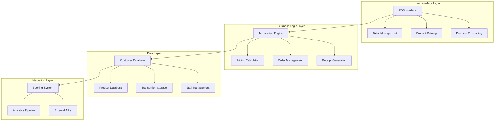
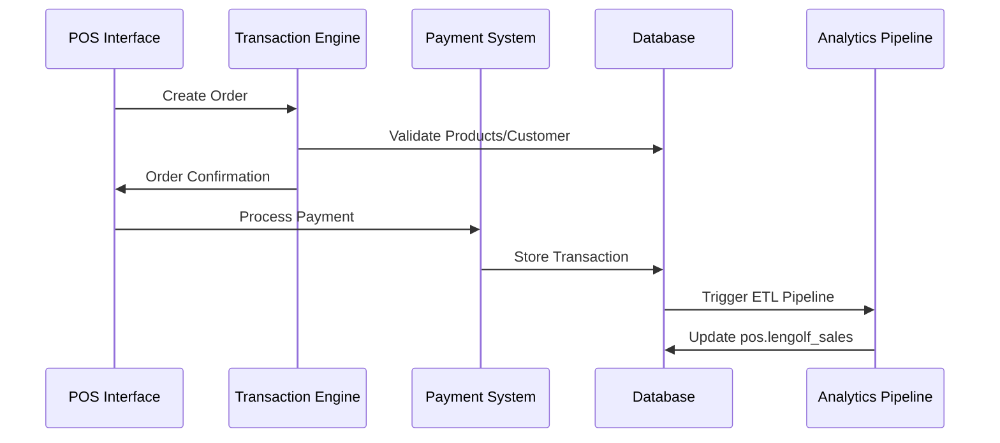
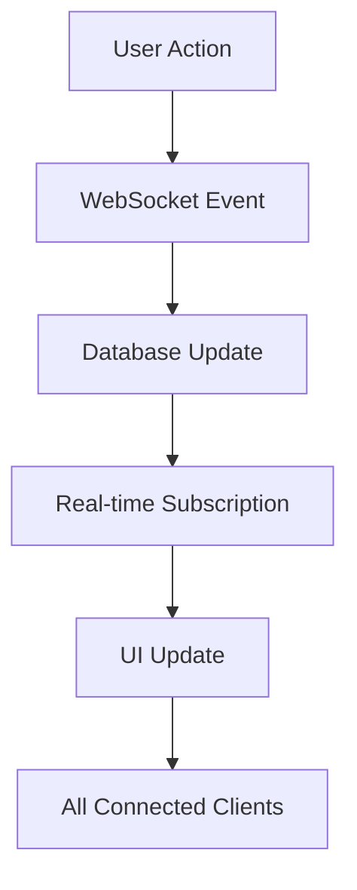
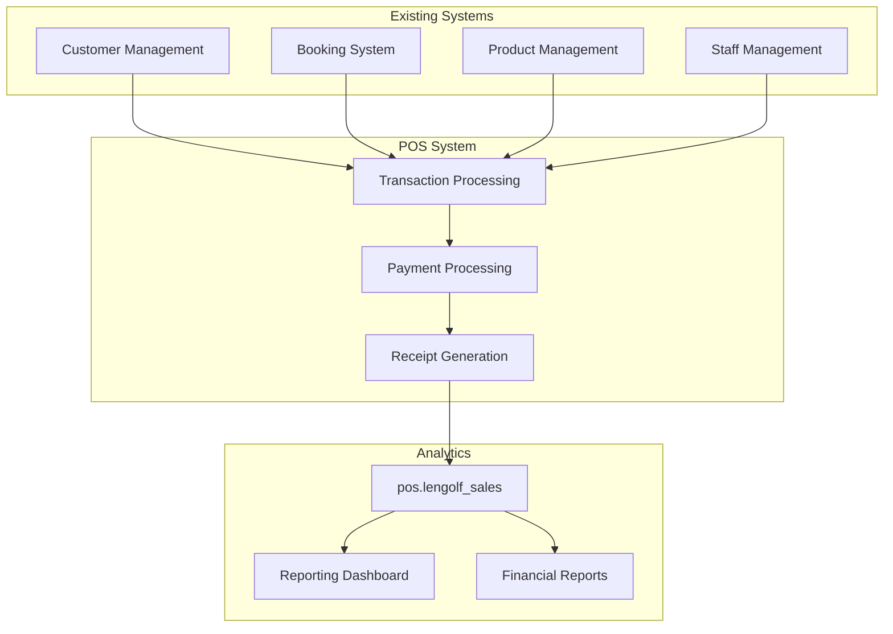

# Lengolf POS System Architecture

## Table of Contents
1. [Executive Summary](#executive-summary)
2. [System Overview](#system-overview)
3. [Component Architecture](#component-architecture)
4. [Integration Strategy](#integration-strategy)
5. [Implementation Roadmap](#implementation-roadmap)
6. [Technical Requirements](#technical-requirements)
7. [Data Flow Architecture](#data-flow-architecture)
8. [Security and Compliance](#security-and-compliance)
9. [Performance Requirements](#performance-requirements)
10. [Deployment Strategy](#deployment-strategy)

## Executive Summary

The Lengolf POS System is a comprehensive point-of-sale solution designed to replace the current Qashier system, eliminating monthly subscription fees while providing enhanced functionality tailored specifically for golf simulator operations. The system integrates seamlessly with existing infrastructure including customer management, staff systems, and product catalogs.

### Key Benefits
- **Cost Reduction**: Eliminate ฿2,000+ monthly Qashier fees
- **Enhanced Integration**: Seamless connection with existing booking and customer systems
- **Improved Analytics**: Direct integration with current transaction data pipeline
- **Customized Features**: Golf simulator-specific functionality
- **Scalability**: Built on modern tech stack for future expansion

### Business Impact
- **Annual Savings**: ฿24,000+ in subscription fees
- **Operational Efficiency**: Streamlined workflows and reduced training
- **Data Ownership**: Complete control over transaction data
- **Customization**: Ability to add golf-specific features and promotions

## System Overview

### Current State Analysis
The existing Qashier POS system provides basic transaction processing but lacks integration with our booking system and requires expensive monthly subscriptions. Data must be imported via CSV files, creating delays in analytics and reporting.

### Target Architecture
The new system will provide:
- **Real-time Integration**: Direct database connections eliminating CSV imports
- **Unified Customer Experience**: Single customer database across all systems
- **Golf-Specific Features**: Bay management, lesson scheduling integration
- **Modern Interface**: Touch-optimized tablet interface
- **Comprehensive Reporting**: Real-time analytics and financial reporting

### Core Components



## Component Architecture

### 1. Table Management System
**Purpose**: Visual table layout management and occupancy tracking
**Location**: `docs/development/pos-system/TABLE_MANAGEMENT_SYSTEM.md`

**Key Features**:
- Real-time table status (Empty, Occupied, Reserved, Cleaning)
- Customer assignment and pax count tracking
- Integration with booking system for bay reservations
- Staff assignment and service responsibility tracking

**Technical Implementation**:
- WebSocket real-time updates
- Touch-optimized interface for tablet devices
- Database integration with `pos.tables` and `pos.table_sessions`

### 2. POS Interface Design
**Purpose**: Primary user interaction layer for order creation and management
**Location**: `docs/development/pos-system/POS_INTERFACE_DESIGN.md`

**Key Features**:
- Touch-first design optimized for tablets
- Product catalog with category navigation
- Real-time order calculations with VAT
- Staff authentication with PIN system

**Technical Implementation**:
- React-based responsive interface
- Real-time price calculations
- Offline capability with sync

### 3. Product Catalog Integration
**Purpose**: Integration with existing product management system
**Location**: `docs/development/pos-system/PRODUCT_CATALOG_INTEGRATION.md`

**Key Features**:
- Real-time product synchronization from `products.products`
- Category hierarchy (Tab → Category → Product)
- Search and filtering capabilities
- Price and availability updates

**Technical Implementation**:
- Direct database integration
- Caching for performance
- Real-time updates via WebSocket

### 4. Transaction Processing Engine
**Purpose**: Core business logic for order and payment processing
**Location**: `docs/development/pos-system/TRANSACTION_PROCESSING_DESIGN.md`

**Key Features**:
- Order lifecycle management
- VAT calculations (pre/post September 2024 logic)
- Discount and promotion handling
- Integration with `pos.lengolf_sales` for analytics continuity

**Technical Implementation**:
- State machine-based order processing
- Business rules engine
- Error handling and recovery

### 5. Payment Processing System
**Purpose**: Multi-payment method processing and financial reconciliation
**Location**: `docs/development/pos-system/PAYMENT_PROCESSING_DESIGN.md`

**Key Features**:
- Cash, card, and digital wallet support
- Split payment capabilities
- PCI compliance for card processing
- Daily reconciliation and reporting

**Technical Implementation**:
- Secure payment tokenization
- Integration with Thai payment providers
- Fraud detection and prevention

### 6. Receipt Generation System
**Purpose**: Thermal printing and digital receipt delivery
**Location**: `docs/development/pos-system/RECEIPT_GENERATION_DESIGN.md`

**Key Features**:
- Thermal printer integration (58mm/80mm)
- Thai tax compliance formatting
- Digital receipt options (email, SMS, QR code)
- Multi-language support (Thai/English)

**Technical Implementation**:
- Template-based receipt generation
- Print queue management
- Error recovery mechanisms

### 7. Void Transaction System
**Purpose**: Transaction cancellation and refund processing
**Location**: `docs/development/pos-system/VOID_TRANSACTION_SYSTEM.md`

**Key Features**:
- Manager authorization for voids
- Full and partial transaction voids
- Payment reversal processing
- Complete audit trails

**Technical Implementation**:
- Role-based authorization
- Payment processor integration
- Comprehensive logging

## Integration Strategy

### Existing System Integration

#### Customer Management Integration
```typescript
// Integration with public.customers
interface CustomerIntegration {
  source: 'public.customers';
  fields: ['id', 'name', 'email', 'phone', 'created_at'];
  realTimeSync: true;
  cachingStrategy: 'write-through';
}
```

#### Staff Management Integration
```typescript
// Integration with backoffice.staff
interface StaffIntegration {
  source: 'backoffice.staff';
  authentication: 'pin_based';
  permissions: ['pos_access', 'void_transactions', 'manager_functions'];
  sessionManagement: true;
}
```

#### Product Management Integration
```typescript
// Integration with products.products schema
interface ProductIntegration {
  source: 'products.products';
  categories: 'products.categories';
  realTimeUpdates: true;
  searchEngine: 'full_text_postgres';
}
```

#### Booking System Integration
```typescript
// Integration with booking system
interface BookingIntegration {
  bayReservations: 'public.bookings';
  customerLinking: true;
  timeSlotManagement: true;
  instructorAssignment: true;
}
```

### Data Flow Integration



## Implementation Roadmap

### Phase 1: Foundation (Weeks 1-2)
**Objective**: Core system infrastructure and basic functionality

**Deliverables**:
- [ ] Database schema implementation
- [ ] Basic POS interface (product selection, order creation)
- [ ] Simple cash payment processing
- [ ] Customer and staff integration
- [ ] Basic receipt printing

**Key Components**:
- Table Management System (basic functionality)
- Product Catalog Integration
- Simple Transaction Processing
- Basic Receipt Generation

**Success Criteria**:
- Process simple cash transactions
- Generate basic receipts
- Track table occupancy
- Integrate with existing customer data

### Phase 2: Enhanced Features (Weeks 3-4)
**Objective**: Advanced payment processing and transaction management

**Deliverables**:
- [ ] Multi-payment method support (cards, digital wallets)
- [ ] Advanced order management (modifications, discounts)
- [ ] Manager authorization systems
- [ ] Enhanced receipt options (email, SMS)
- [ ] Real-time table status updates

**Key Components**:
- Payment Processing System
- Enhanced Transaction Processing
- Void Transaction System (basic)
- Digital Receipt Options

**Success Criteria**:
- Process card and digital payments
- Handle order modifications
- Send digital receipts
- Basic void functionality

### Phase 3: Security & Compliance (Weeks 5-6)
**Objective**: Security hardening and regulatory compliance

**Deliverables**:
- [ ] PCI compliance implementation
- [ ] Thai tax compliance features
- [ ] Comprehensive audit trails
- [ ] Advanced void and refund capabilities
- [ ] Manager override systems

**Key Components**:
- Security framework implementation
- Audit and compliance systems
- Advanced authorization controls
- Financial reconciliation

**Success Criteria**:
- Pass PCI compliance audit
- Generate tax-compliant receipts
- Complete audit trail functionality
- Manager authorization workflows

### Phase 4: Integration & Optimization (Weeks 7-8)
**Objective**: Full system integration and performance optimization

**Deliverables**:
- [ ] Complete booking system integration
- [ ] Real-time analytics pipeline
- [ ] Performance optimization
- [ ] Staff training and documentation
- [ ] Production deployment

**Key Components**:
- Full system integration testing
- Performance tuning
- User training materials
- Production deployment

**Success Criteria**:
- Handle peak transaction volumes
- Complete Qashier system replacement
- Staff fully trained
- All integrations working

## Technical Requirements

### Hardware Requirements
- **Tablets**: Touch-screen tablets (minimum 10" display)
- **Thermal Printers**: 58mm or 80mm thermal receipt printers
- **Cash Drawers**: Electronic cash drawers with printer connection
- **Card Readers**: EMV-compliant card readers
- **Network**: Stable internet connection for real-time sync

### Software Requirements
- **Next.js 14**: React-based web application framework
- **TypeScript**: Type-safe development
- **Supabase**: PostgreSQL database and real-time subscriptions
- **Tailwind CSS**: Responsive UI styling
- **WebSocket**: Real-time communication

### Database Requirements
- **PostgreSQL 14+**: Main database system
- **Real-time Subscriptions**: Supabase real-time features
- **Backup Strategy**: Daily automated backups
- **High Availability**: 99.9% uptime requirement

### Security Requirements
- **PCI DSS Compliance**: Level 4 merchant compliance
- **Data Encryption**: TLS 1.3 for data in transit
- **Access Controls**: Role-based permissions
- **Audit Logging**: Complete transaction audit trails

## Data Flow Architecture

### Transaction Data Flow


### Real-time Update Flow


### Integration Data Flow


## Security and Compliance

### PCI DSS Compliance
- **Secure Cardholder Data**: Tokenization of card numbers
- **Encrypted Transmission**: TLS 1.3 for all communications
- **Access Controls**: Multi-factor authentication for admin access
- **Regular Security Testing**: Quarterly vulnerability scans

### Thai Tax Compliance
- **VAT Calculations**: Proper 7% VAT handling
- **Receipt Requirements**: Tax-compliant receipt formatting
- **Record Keeping**: 7-year transaction history retention
- **Government Reporting**: Automated tax report generation

### Data Protection
- **PDPA Compliance**: Thai Personal Data Protection Act compliance
- **Data Encryption**: AES-256 encryption for sensitive data
- **Access Logging**: Complete audit trails for data access
- **Regular Backups**: Daily encrypted backups with 30-day retention

## Performance Requirements

### Response Time Requirements
- **Page Load**: < 2 seconds initial load
- **Transaction Processing**: < 3 seconds end-to-end
- **Payment Authorization**: < 5 seconds
- **Real-time Updates**: < 1 second propagation

### Throughput Requirements
- **Concurrent Users**: 20+ simultaneous POS terminals
- **Transaction Volume**: 1000+ transactions per day
- **Peak Hour Capacity**: 200 transactions per hour
- **Database Performance**: < 100ms query response time

### Availability Requirements
- **System Uptime**: 99.9% availability during business hours
- **Offline Capability**: 2 hours offline operation
- **Recovery Time**: < 15 minutes from system failures
- **Data Backup**: < 1 hour recovery point objective

## Deployment Strategy

### Development Environment
- **Local Development**: Docker-based development environment
- **Testing Database**: Dedicated test database with sample data
- **Feature Branches**: Git-based feature development workflow
- **Automated Testing**: Unit and integration tests

### Staging Environment
- **Production Mirror**: Identical configuration to production
- **User Acceptance Testing**: Staff testing and feedback
- **Performance Testing**: Load testing with production data volumes
- **Security Testing**: Penetration testing and vulnerability assessment

### Production Deployment
- **Blue-Green Deployment**: Zero-downtime deployment strategy
- **Database Migration**: Careful schema migration with rollback capability
- **Monitoring**: Real-time application and infrastructure monitoring
- **Rollback Plan**: Quick rollback capability in case of issues

### Migration Strategy
1. **Parallel Operation**: Run new system alongside Qashier during testing
2. **Data Migration**: Import historical transaction data
3. **Staff Training**: Comprehensive training on new system
4. **Gradual Rollout**: Start with one terminal, expand gradually
5. **Qashier Sunset**: Cancel Qashier subscription after full migration

---

## Success Metrics

### Financial Metrics
- **Cost Savings**: ฿24,000+ annual subscription savings
- **ROI Timeline**: 3-month return on investment
- **Transaction Processing**: 100% of current transaction volume

### Operational Metrics
- **System Uptime**: 99.9% availability
- **Transaction Speed**: 50% faster than current system
- **Error Rate**: < 0.1% transaction error rate
- **Staff Satisfaction**: 90%+ satisfaction rating

### Technical Metrics
- **Performance**: < 2 second response times
- **Security**: Zero security incidents
- **Data Integrity**: 100% transaction accuracy
- **Integration**: Seamless data flow to analytics

---

**Maintained by**: Lengolf Development Team  
**Last Updated**: July 14, 2025  
**Next Review**: August 2025

## Related Documents
- [Table Management System](./TABLE_MANAGEMENT_SYSTEM.md)
- [POS Interface Design](./POS_INTERFACE_DESIGN.md)
- [Product Catalog Integration](./PRODUCT_CATALOG_INTEGRATION.md)
- [Transaction Processing Design](./TRANSACTION_PROCESSING_DESIGN.md)
- [Payment Processing Design](./PAYMENT_PROCESSING_DESIGN.md)
- [Receipt Generation Design](./RECEIPT_GENERATION_DESIGN.md)
- [Void Transaction System](./VOID_TRANSACTION_SYSTEM.md)