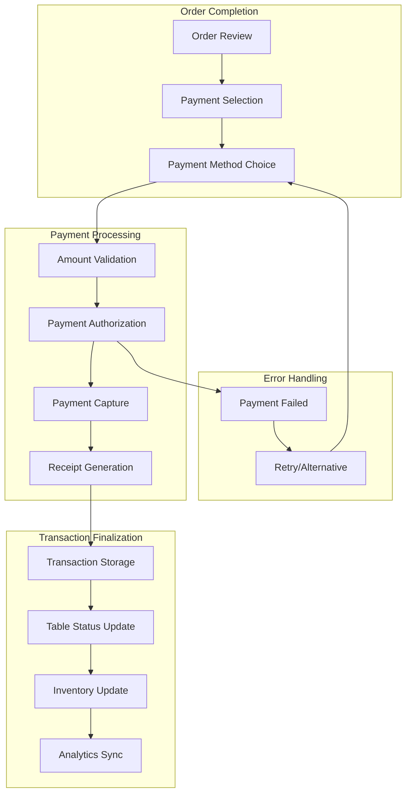
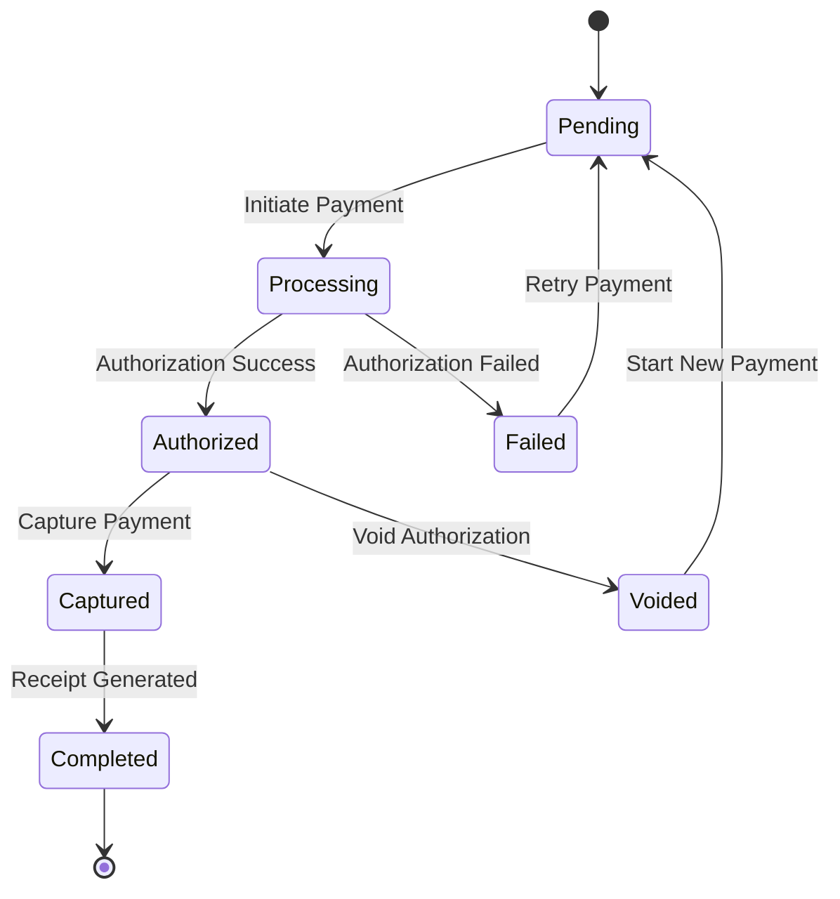

# Payment Processing System Design

## Table of Contents
1. [Overview](#overview)
2. [Payment Methods](#payment-methods)
3. [Payment Flow Architecture](#payment-flow-architecture)
4. [Security and Compliance](#security-and-compliance)
5. [User Interface Design](#user-interface-design)
6. [Error Handling](#error-handling)
7. [Integration Points](#integration-points)
8. [Audit and Reconciliation](#audit-and-reconciliation)
9. [Performance Requirements](#performance-requirements)
10. [Implementation Details](#implementation-details)

## Overview

The Payment Processing System handles all financial transactions within the POS system, supporting multiple payment methods while maintaining security and compliance standards. The system processes payments, manages transaction states, handles split payments, and integrates with existing transaction storage for seamless analytics continuity.

### Key Responsibilities
- **Payment Method Support**: Cash, card payments, and digital wallets
- **Transaction Security**: PCI compliance and secure payment handling
- **Split Payment Processing**: Multiple payment methods per order
- **Real-time Validation**: Payment verification and fraud detection
- **Receipt Generation**: Automated receipt creation and printing
- **Financial Reconciliation**: End-of-day reporting and settlement

### Integration Context
The payment system integrates with existing infrastructure:
- **Transaction Storage**: Direct integration with `pos.lengolf_sales`
- **Customer System**: Link payments to `public.customers`
- **Staff System**: Track payment processors via `backoffice.staff`
- **Table Management**: Associate payments with table sessions
- **Receipt System**: Trigger automatic receipt generation

## Payment Methods

### Supported Payment Types

Based on current Qashier system analysis, the following payment methods are supported:

#### 1. Cash Payments
- **Direct Cash**: Physical cash transactions
- **Change Calculation**: Automatic change computation
- **Denomination Tracking**: Track cash drawer contents
- **Manager Override**: Large cash transaction approvals

#### 2. Credit/Debit Cards
- **Visa**: Credit and debit card processing
- **Mastercard**: Credit and debit card processing
- **EMV Chip**: Secure chip card transactions
- **Contactless**: Tap-to-pay transactions

#### 3. Digital Wallets
- **PromptPay**: Thai QR code payment system
- **TrueMoney**: Popular Thai digital wallet
- **Alipay**: Chinese digital payment platform
- **Line Pay**: Messaging app payment integration

#### 4. House Account
- **Customer Credit**: Pre-paid customer accounts
- **Corporate Accounts**: Business customer billing
- **Staff Discounts**: Employee purchase benefits

### Payment Method Configuration

```typescript
interface PaymentMethod {
  id: string;
  name: string;
  type: 'cash' | 'card' | 'digital_wallet' | 'house_account';
  enabled: boolean;
  requires_signature: boolean;
  requires_pin: boolean;
  min_amount?: number;
  max_amount?: number;
  processing_fee?: number;
  icon: string;
  display_order: number;
}

// Example configuration
const PAYMENT_METHODS: PaymentMethod[] = [
  {
    id: 'cash',
    name: 'Cash',
    type: 'cash',
    enabled: true,
    requires_signature: false,
    requires_pin: false,
    icon: 'cash',
    display_order: 1
  },
  {
    id: 'visa',
    name: 'Visa',
    type: 'card',
    enabled: true,
    requires_signature: true,
    requires_pin: false,
    max_amount: 50000,
    icon: 'visa',
    display_order: 2
  },
  {
    id: 'promptpay',
    name: 'PromptPay',
    type: 'digital_wallet',
    enabled: true,
    requires_signature: false,
    requires_pin: false,
    processing_fee: 0.005, // 0.5%
    icon: 'promptpay',
    display_order: 3
  }
];
```

## Payment Flow Architecture

### High-Level Payment Process



### Payment State Machine



### Split Payment Support

```typescript
interface SplitPayment {
  id: string;
  order_id: string;
  total_amount: number;
  payments: PaymentTransaction[];
  status: 'pending' | 'partial' | 'completed';
  created_at: Date;
  completed_at?: Date;
}

interface PaymentTransaction {
  id: string;
  split_payment_id: string;
  payment_method_id: string;
  amount: number;
  status: 'pending' | 'authorized' | 'captured' | 'failed' | 'voided';
  external_transaction_id?: string;
  authorization_code?: string;
  processor_response?: string;
  processed_at?: Date;
}
```

## Security and Compliance

### PCI DSS Compliance

#### Data Protection
- **Tokenization**: Never store actual card numbers
- **Encryption**: All sensitive data encrypted in transit and at rest
- **Access Controls**: Restricted access to payment data
- **Audit Logging**: Complete transaction audit trails

#### Secure Processing
```typescript
class SecurePaymentProcessor {
  private encryptionKey: string;
  private tokenService: TokenService;
  
  async processCardPayment(
    cardData: EncryptedCardData,
    amount: number,
    orderId: string
  ): Promise<PaymentResult> {
    // Validate encrypted card data
    const validationResult = await this.validateCardData(cardData);
    if (!validationResult.isValid) {
      return { success: false, error: 'Invalid card data' };
    }
    
    // Tokenize card for processing
    const token = await this.tokenService.tokenize(cardData);
    
    // Process payment with token
    const result = await this.authorizePayment(token, amount);
    
    // Store only non-sensitive data
    await this.storeTransactionRecord({
      orderId,
      amount,
      token: token.reference, // Safe token reference only
      authCode: result.authorizationCode,
      status: result.status
    });
    
    return result;
  }
}
```

### Fraud Prevention

#### Real-time Validation
- **Amount Limits**: Configurable transaction limits per payment method
- **Velocity Checks**: Multiple transaction monitoring
- **Geographic Validation**: Location-based fraud detection
- **Pattern Recognition**: Unusual transaction pattern alerts

#### Risk Scoring
```typescript
interface RiskAssessment {
  score: number; // 0-100 risk score
  factors: RiskFactor[];
  recommendation: 'approve' | 'review' | 'decline';
  required_actions: string[];
}

class FraudDetectionService {
  async assessTransaction(
    paymentData: PaymentData,
    customerHistory: CustomerHistory,
    deviceInfo: DeviceInfo
  ): Promise<RiskAssessment> {
    const factors: RiskFactor[] = [];
    
    // Amount-based risk
    if (paymentData.amount > customerHistory.averageTransaction * 3) {
      factors.push({
        type: 'amount_anomaly',
        score: 15,
        description: 'Transaction amount significantly above average'
      });
    }
    
    // Frequency-based risk
    const recentTransactions = customerHistory.getTransactionsToday();
    if (recentTransactions.length > 5) {
      factors.push({
        type: 'high_frequency',
        score: 10,
        description: 'Multiple transactions today'
      });
    }
    
    const totalScore = factors.reduce((sum, factor) => sum + factor.score, 0);
    
    return {
      score: totalScore,
      factors,
      recommendation: this.getRecommendation(totalScore),
      required_actions: this.getRequiredActions(totalScore)
    };
  }
}
```

## User Interface Design

### Payment Selection Screen

```tsx
interface PaymentSelectionProps {
  order: OrderSummary;
  onPaymentSelect: (method: PaymentMethod) => void;
  onSplitPayment: () => void;
}

const PaymentSelection: React.FC<PaymentSelectionProps> = ({
  order,
  onPaymentSelect,
  onSplitPayment
}) => {
  return (
    <div className="payment-selection">
      <OrderSummary 
        items={order.items}
        subtotal={order.subtotal}
        vat={order.vat}
        total={order.total}
      />
      
      <PaymentMethodGrid>
        {PAYMENT_METHODS.filter(method => method.enabled)
          .map(method => (
            <PaymentMethodCard
              key={method.id}
              method={method}
              onClick={() => onPaymentSelect(method)}
              total={order.total}
            />
          ))}
      </PaymentMethodGrid>
      
      <SplitPaymentButton 
        onClick={onSplitPayment}
        enabled={order.total > 100}
      />
    </div>
  );
};
```

### Cash Payment Interface

```tsx
interface CashPaymentProps {
  total: number;
  onPaymentComplete: (payment: CashPayment) => void;
  onCancel: () => void;
}

const CashPaymentInterface: React.FC<CashPaymentProps> = ({
  total,
  onPaymentComplete,
  onCancel
}) => {
  const [cashReceived, setCashReceived] = useState<number>(0);
  const [selectedDenomination, setSelectedDenomination] = useState<number | null>(null);
  
  const change = cashReceived - total;
  const isValidPayment = cashReceived >= total;
  
  const quickAmounts = [total, 500, 1000, 2000];
  
  return (
    <div className="cash-payment">
      <TotalDisplay amount={total} />
      
      <CashInputSection>
        <NumericKeypad 
          value={cashReceived}
          onChange={setCashReceived}
        />
        
        <QuickAmountButtons
          amounts={quickAmounts}
          onSelect={setCashReceived}
        />
      </CashInputSection>
      
      <ChangeCalculation
        change={change}
        isValid={isValidPayment}
      />
      
      <ActionButtons>
        <CancelButton onClick={onCancel} />
        <CompleteButton 
          onClick={() => onPaymentComplete({
            method: 'cash',
            amount: total,
            cashReceived,
            change
          })}
          disabled={!isValidPayment}
        />
      </ActionButtons>
    </div>
  );
};
```

### Card Payment Interface

```tsx
const CardPaymentInterface: React.FC<CardPaymentProps> = ({
  total,
  method,
  onPaymentComplete,
  onCancel
}) => {
  const [processingStatus, setProcessingStatus] = useState<ProcessingStatus>('idle');
  const [requiresSignature, setRequiresSignature] = useState(false);
  
  const handleCardInserted = async () => {
    setProcessingStatus('reading');
    
    try {
      const result = await processCardPayment({
        amount: total,
        method: method.id
      });
      
      if (result.requiresSignature) {
        setRequiresSignature(true);
        setProcessingStatus('signature_required');
      } else {
        setProcessingStatus('completed');
        onPaymentComplete(result);
      }
    } catch (error) {
      setProcessingStatus('error');
    }
  };
  
  return (
    <div className="card-payment">
      <PaymentMethodHeader method={method} total={total} />
      
      {processingStatus === 'idle' && (
        <CardInstructions 
          method={method}
          onCardInserted={handleCardInserted}
        />
      )}
      
      {processingStatus === 'reading' && (
        <ProcessingIndicator message="Reading card..." />
      )}
      
      {requiresSignature && (
        <SignatureCapture 
          onSignatureComplete={() => {
            setProcessingStatus('completed');
            onPaymentComplete();
          }}
        />
      )}
      
      {processingStatus === 'error' && (
        <ErrorMessage 
          message="Payment failed. Please try again."
          onRetry={() => setProcessingStatus('idle')}
        />
      )}
    </div>
  );
};
```

## Error Handling

### Payment Failure Types

```typescript
enum PaymentErrorType {
  NETWORK_ERROR = 'network_error',
  CARD_DECLINED = 'card_declined',
  INSUFFICIENT_FUNDS = 'insufficient_funds',
  INVALID_CARD = 'invalid_card',
  EXPIRED_CARD = 'expired_card',
  PROCESSOR_ERROR = 'processor_error',
  TIMEOUT = 'timeout',
  FRAUD_DETECTED = 'fraud_detected'
}

interface PaymentError {
  type: PaymentErrorType;
  message: string;
  recoverable: boolean;
  suggestedActions: string[];
  retryable: boolean;
  requiresManagerOverride: boolean;
}

class PaymentErrorHandler {
  handlePaymentError(error: PaymentError): PaymentErrorResponse {
    switch (error.type) {
      case PaymentErrorType.CARD_DECLINED:
        return {
          userMessage: 'Card was declined. Please try a different payment method.',
          allowRetry: false,
          suggestAlternative: true,
          logLevel: 'info'
        };
        
      case PaymentErrorType.NETWORK_ERROR:
        return {
          userMessage: 'Network connection issue. Please try again.',
          allowRetry: true,
          maxRetries: 3,
          logLevel: 'warning'
        };
        
      case PaymentErrorType.FRAUD_DETECTED:
        return {
          userMessage: 'Transaction requires manager approval.',
          allowRetry: false,
          requiresManagerOverride: true,
          logLevel: 'critical'
        };
        
      default:
        return {
          userMessage: 'Payment processing error. Please contact support.',
          allowRetry: false,
          logLevel: 'error'
        };
    }
  }
}
```

### Recovery Mechanisms

```typescript
class PaymentRecoveryService {
  async recoverFailedPayment(
    paymentId: string,
    originalPayment: PaymentData
  ): Promise<RecoveryResult> {
    // Check if payment actually went through despite error
    const paymentStatus = await this.checkPaymentStatus(paymentId);
    
    if (paymentStatus === 'completed') {
      return {
        status: 'recovered',
        action: 'payment_completed',
        message: 'Payment was actually successful'
      };
    }
    
    // Attempt automatic retry for retriable errors
    if (originalPayment.error?.retryable && originalPayment.retryCount < 3) {
      const retryResult = await this.retryPayment(paymentId);
      return retryResult;
    }
    
    // Suggest alternative payment methods
    return {
      status: 'failed',
      action: 'suggest_alternative',
      suggestedMethods: this.getSuggestedAlternatives(originalPayment.method)
    };
  }
}
```

## Integration Points

### Transaction Storage Integration

```typescript
interface PaymentToTransactionMapper {
  mapPaymentToSalesRecord(
    payment: CompletedPayment,
    order: OrderData
  ): LengolfSalesRecord;
}

class TransactionStorageService {
  async storeCompletedPayment(
    payment: CompletedPayment,
    order: OrderData
  ): Promise<void> {
    // Map payment data to pos.lengolf_sales format
    const salesRecord = this.mapPaymentToSalesRecord(payment, order);
    
    // Store in primary transaction table
    await this.supabase
      .from('lengolf_sales')
      .insert(salesRecord);
    
    // Update table status if applicable
    if (order.tableId) {
      await this.updateTableStatus(order.tableId, 'available');
    }
    
    // Trigger analytics pipeline
    await this.triggerAnalyticsUpdate(salesRecord);
  }
  
  private mapPaymentToSalesRecord(
    payment: CompletedPayment,
    order: OrderData
  ): LengolfSalesRecord {
    return {
      // Transaction identifiers
      bill_no: order.orderNumber,
      transaction_id: payment.transactionId,
      
      // Customer and staff
      customer_id: order.customerId,
      staff_id: order.staffId,
      
      // Financial data
      subtotal: order.subtotal,
      vat_amount: order.vatAmount,
      total_amount: payment.amount,
      
      // Payment method mapping
      payment_method: this.mapPaymentMethodToLegacy(payment.method),
      
      // Timing
      transaction_date: payment.completedAt,
      created_at: new Date(),
      
      // Additional metadata
      table_number: order.tableName,
      order_items: JSON.stringify(order.items),
      payment_details: JSON.stringify(payment.details)
    };
  }
}
```

### Customer System Integration

```typescript
class CustomerPaymentService {
  async processCustomerPayment(
    customerId: string,
    payment: PaymentData
  ): Promise<void> {
    // Update customer payment history
    await this.updateCustomerPaymentHistory(customerId, payment);
    
    // Process loyalty points if applicable
    if (payment.amount >= 100) {
      await this.awardLoyaltyPoints(customerId, payment.amount);
    }
    
    // Update customer spending statistics
    await this.updateSpendingStats(customerId, payment);
  }
  
  private async updateCustomerPaymentHistory(
    customerId: string,
    payment: PaymentData
  ): Promise<void> {
    await this.supabase
      .from('customer_payment_history')
      .insert({
        customer_id: customerId,
        payment_method: payment.method,
        amount: payment.amount,
        transaction_date: payment.completedAt,
        success: payment.status === 'completed'
      });
  }
}
```

## Audit and Reconciliation

### Daily Reconciliation

```typescript
interface DailyReconciliation {
  date: Date;
  cashSales: ReconciliationSummary;
  cardSales: ReconciliationSummary;
  digitalWalletSales: ReconciliationSummary;
  discrepancies: Discrepancy[];
  totalSales: number;
  expectedCash: number;
  actualCash?: number;
  status: 'pending' | 'reconciled' | 'discrepancy';
}

class ReconciliationService {
  async generateDailyReconciliation(date: Date): Promise<DailyReconciliation> {
    const salesData = await this.getDailySalesData(date);
    const paymentData = await this.getDailyPaymentData(date);
    
    return {
      date,
      cashSales: this.calculateCashSummary(salesData, paymentData),
      cardSales: this.calculateCardSummary(salesData, paymentData),
      digitalWalletSales: this.calculateDigitalSummary(salesData, paymentData),
      discrepancies: this.identifyDiscrepancies(salesData, paymentData),
      totalSales: salesData.reduce((sum, sale) => sum + sale.amount, 0),
      expectedCash: this.calculateExpectedCash(salesData),
      status: 'pending'
    };
  }
  
  private identifyDiscrepancies(
    salesData: SalesRecord[],
    paymentData: PaymentRecord[]
  ): Discrepancy[] {
    const discrepancies: Discrepancy[] = [];
    
    // Check for payments without corresponding sales
    paymentData.forEach(payment => {
      const correspondingSale = salesData.find(sale => 
        sale.transactionId === payment.transactionId
      );
      
      if (!correspondingSale) {
        discrepancies.push({
          type: 'orphaned_payment',
          description: `Payment ${payment.id} has no corresponding sale`,
          amount: payment.amount,
          severity: 'high'
        });
      }
    });
    
    return discrepancies;
  }
}
```

### Financial Reporting

```typescript
interface FinancialReport {
  period: DateRange;
  summary: FinancialSummary;
  paymentMethodBreakdown: PaymentMethodSummary[];
  hourlyBreakdown: HourlySummary[];
  topProducts: ProductSummary[];
  refunds: RefundSummary[];
}

class FinancialReportingService {
  async generateFinancialReport(
    startDate: Date,
    endDate: Date
  ): Promise<FinancialReport> {
    const period = { startDate, endDate };
    
    const [
      transactionData,
      paymentData,
      refundData
    ] = await Promise.all([
      this.getTransactionData(period),
      this.getPaymentData(period),
      this.getRefundData(period)
    ]);
    
    return {
      period,
      summary: this.calculateFinancialSummary(transactionData),
      paymentMethodBreakdown: this.analyzePaymentMethods(paymentData),
      hourlyBreakdown: this.analyzeHourlyTrends(transactionData),
      topProducts: this.analyzeTopProducts(transactionData),
      refunds: this.analyzeRefunds(refundData)
    };
  }
}
```

## Performance Requirements

### Response Time Targets

- **Payment Authorization**: < 3 seconds
- **Transaction Storage**: < 1 second  
- **Receipt Generation**: < 2 seconds
- **Daily Reconciliation**: < 30 seconds
- **Financial Reports**: < 60 seconds

### Throughput Requirements

- **Concurrent Payments**: 20 simultaneous transactions
- **Daily Transaction Volume**: 1000+ transactions
- **Peak Hour Capacity**: 100 transactions/hour
- **Data Retention**: 7 years of transaction history

### System Availability

```typescript
class PaymentSystemMonitoring {
  async checkSystemHealth(): Promise<SystemHealthStatus> {
    const checks = await Promise.all([
      this.checkDatabaseConnection(),
      this.checkPaymentProcessorConnection(),
      this.checkReceiptPrinterStatus(),
      this.checkCashDrawerStatus()
    ]);
    
    const failedChecks = checks.filter(check => !check.healthy);
    
    return {
      overall: failedChecks.length === 0 ? 'healthy' : 'degraded',
      details: checks,
      timestamp: new Date(),
      actionRequired: failedChecks.length > 0
    };
  }
}
```

## Implementation Details

### Database Schema

```sql
-- Payment transactions table
CREATE TABLE pos.payment_transactions (
    id UUID PRIMARY KEY DEFAULT gen_random_uuid(),
    order_id UUID NOT NULL,
    payment_method VARCHAR(50) NOT NULL,
    amount DECIMAL(10,2) NOT NULL,
    currency VARCHAR(3) DEFAULT 'THB',
    
    -- Payment processing
    status VARCHAR(20) NOT NULL DEFAULT 'pending' 
        CHECK (status IN ('pending', 'authorized', 'captured', 'failed', 'voided', 'refunded')),
    external_transaction_id VARCHAR(200),
    authorization_code VARCHAR(50),
    processor_response JSONB,
    
    -- Security and audit
    processed_by_staff_id UUID REFERENCES backoffice.staff(id),
    processed_at TIMESTAMPTZ,
    ip_address INET,
    device_fingerprint VARCHAR(200),
    
    -- Split payment support
    split_payment_id UUID,
    payment_sequence INTEGER DEFAULT 1,
    
    -- Timestamps
    created_at TIMESTAMPTZ DEFAULT NOW(),
    updated_at TIMESTAMPTZ DEFAULT NOW()
);

-- Payment reconciliation table
CREATE TABLE pos.payment_reconciliation (
    id UUID PRIMARY KEY DEFAULT gen_random_uuid(),
    reconciliation_date DATE NOT NULL,
    payment_method VARCHAR(50) NOT NULL,
    expected_amount DECIMAL(10,2) NOT NULL,
    actual_amount DECIMAL(10,2),
    discrepancy DECIMAL(10,2) GENERATED ALWAYS AS (actual_amount - expected_amount),
    status VARCHAR(20) DEFAULT 'pending',
    reconciled_by_staff_id UUID REFERENCES backoffice.staff(id),
    reconciled_at TIMESTAMPTZ,
    notes TEXT,
    created_at TIMESTAMPTZ DEFAULT NOW()
);

-- Indexes for performance
CREATE INDEX idx_payment_transactions_order ON pos.payment_transactions(order_id);
CREATE INDEX idx_payment_transactions_status ON pos.payment_transactions(status);
CREATE INDEX idx_payment_transactions_method ON pos.payment_transactions(payment_method);
CREATE INDEX idx_payment_transactions_date ON pos.payment_transactions(processed_at);
```

### API Endpoints

```typescript
// Payment processing endpoints
export class PaymentController {
  // Initialize payment
  async POST_initializePayment(req: PaymentInitRequest): Promise<PaymentInitResponse> {
    const { orderId, amount, paymentMethod } = req.body;
    
    // Validate payment request
    const validation = await this.validatePaymentRequest(req.body);
    if (!validation.isValid) {
      return { success: false, error: validation.error };
    }
    
    // Create payment transaction record
    const transaction = await this.createPaymentTransaction({
      orderId,
      amount,
      paymentMethod,
      status: 'pending'
    });
    
    return {
      success: true,
      transactionId: transaction.id,
      requiresAuthorization: paymentMethod !== 'cash'
    };
  }
  
  // Process payment
  async POST_processPayment(req: PaymentProcessRequest): Promise<PaymentProcessResponse> {
    const { transactionId, paymentData } = req.body;
    
    try {
      const result = await this.paymentProcessor.processPayment(transactionId, paymentData);
      
      // Update transaction status
      await this.updateTransactionStatus(transactionId, result.status);
      
      // If successful, complete the order
      if (result.success) {
        await this.completeOrder(result.orderId);
        await this.generateReceipt(result.orderId);
      }
      
      return result;
    } catch (error) {
      await this.handlePaymentError(transactionId, error);
      throw error;
    }
  }
}
```

### Error Recovery Implementation

```typescript
class PaymentErrorRecovery {
  async recoverFromPaymentError(
    transactionId: string,
    error: PaymentError
  ): Promise<RecoveryAction> {
    // Log the error for analysis
    await this.logPaymentError(transactionId, error);
    
    // Determine recovery strategy
    const strategy = this.determineRecoveryStrategy(error);
    
    switch (strategy) {
      case 'retry':
        return await this.retryPayment(transactionId);
        
      case 'alternative_method':
        return await this.suggestAlternativePayment(transactionId);
        
      case 'manual_intervention':
        return await this.escalateToManager(transactionId);
        
      default:
        return { action: 'abort', reason: 'Unrecoverable error' };
    }
  }
}
```

---

## Implementation Roadmap

### Phase 1: Core Payment Processing (Week 1-2)
- [ ] Basic cash payment handling
- [ ] Payment transaction database schema
- [ ] Simple card payment integration
- [ ] Basic error handling

### Phase 2: Enhanced Features (Week 3-4)
- [ ] Split payment support
- [ ] Digital wallet integration
- [ ] Advanced error recovery
- [ ] Receipt generation integration

### Phase 3: Security & Compliance (Week 5-6)
- [ ] PCI compliance implementation
- [ ] Fraud detection system
- [ ] Audit trail enhancement
- [ ] Security testing

### Phase 4: Reporting & Analytics (Week 7-8)
- [ ] Daily reconciliation
- [ ] Financial reporting
- [ ] Performance monitoring
- [ ] Integration testing

---

**Maintained by**: Lengolf Development Team  
**Last Updated**: July 14, 2025  
**Next Review**: August 2025