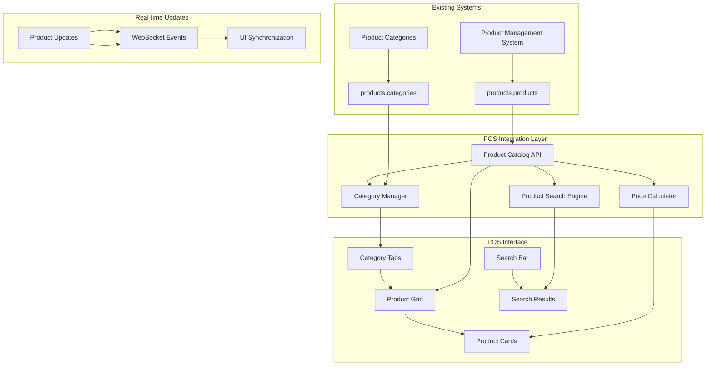

# Product Catalog Integration Design

## Table of Contents
1. [Overview](#overview)
2. [Integration Architecture](#integration-architecture)
3. [Product Data Flow](#product-data-flow)
4. [Category Management](#category-management)
5. [Product Display System](#product-display-system)
6. [Search and Filtering](#search-and-filtering)
7. [Real-time Updates](#real-time-updates)
8. [Performance Optimization](#performance-optimization)
9. [Mobile Adaptation](#mobile-adaptation)
10. [Implementation Details](#implementation-details)

## Overview

The Product Catalog Integration seamlessly connects the existing Product Management System with the new POS interface, providing real-time product browsing, search, and selection capabilities. This integration maintains the familiar category structure from the current Qashier system while leveraging the comprehensive product database already established.

### Key Integration Points
- **Existing Product Database**: `products.products` with comprehensive product catalog
- **Category Hierarchy**: Three-tier structure (Tab → Category → Product)
- **Real-time Pricing**: Live pricing updates from product management
- **Visual Consistency**: Maintains current color-coded category system
- **Search Capability**: Fast product discovery across all categories

### Business Requirements
Based on analysis of current system and existing data:
- **Product Categories**: DRINK, FOOD, GOLF, PACKAGES with subcategories
- **Visual Product Cards**: Color-coded tiles matching current Qashier design
- **Real-time Pricing**: Dynamic pricing with cost/profit calculations
- **Inventory Integration**: Product availability status (future enhancement)
- **Search Functionality**: Quick product lookup by name, SKU, or category

## Integration Architecture

### System Components Overview



### Data Flow Architecture

```
Product Management System → products.products → Product Catalog API → 
Category Processing → Real-time Pricing → POS Interface → Product Selection
```

### Integration Benefits
- **Zero Data Duplication**: Single source of truth for product data
- **Real-time Synchronization**: Immediate updates across all systems
- **Consistent Categorization**: Maintains existing business logic
- **Performance Optimization**: Cached frequently accessed data
- **Seamless Updates**: Product changes immediately available in POS

## Product Data Flow

### Data Source Integration

```typescript
// Product data interface matching existing products schema
interface Product {
  id: string;
  name: string;
  slug: string;
  description?: string;
  
  // Pricing and cost
  price: number;
  cost?: number;
  profitMargin?: number;
  
  // Category hierarchy
  categoryId: string;
  category: string;
  tab: string;
  parentCategory: string;
  
  // Product properties
  sku?: string;
  externalCode?: string;
  unit?: string;
  isSimUsage: boolean;
  isCustomProduct: boolean;
  showInStaffUI: boolean;
  
  // Display properties
  isActive: boolean;
  displayOrder: number;
  posDisplayColor?: string;
  
  // Legacy migration support
  legacyQashierId?: string;
  legacyPosName?: string;
  
  // Metadata
  createdAt: Date;
  updatedAt: Date;
}

// Category structure interface
interface ProductCategory {
  id: string;
  name: string;
  slug: string;
  description?: string;
  parentId?: string;
  
  // Display properties
  displayOrder: number;
  colorCode?: string;
  icon?: string;
  isActive: boolean;
  
  // Product statistics
  productCount: number;
  averagePrice: number;
  
  // Hierarchy information
  level: 'tab' | 'category';
  children?: ProductCategory[];
}
```

### Real-time Data Synchronization

```typescript
// Product catalog service with real-time updates
export class ProductCatalogService {
  private products: Map<string, Product> = new Map();
  private categories: Map<string, ProductCategory> = new Map();
  private wsConnection: WebSocket | null = null;
  
  async initialize(): Promise<void> {
    // Load initial product data
    await this.loadProducts();
    await this.loadCategories();
    
    // Initialize real-time updates
    this.initializeWebSocket();
  }
  
  async loadProducts(): Promise<Product[]> {
    const response = await fetch('/api/admin/products?include_all=true');
    const data = await response.json();
    
    // Cache products for fast access
    data.products.forEach((product: Product) => {
      this.products.set(product.id, product);
    });
    
    return data.products;
  }
  
  async loadCategories(): Promise<ProductCategory[]> {
    const response = await fetch('/api/admin/products/categories');
    const data = await response.json();
    
    // Build category hierarchy and cache
    const categories = this.buildCategoryHierarchy(data.categories);
    categories.forEach(category => {
      this.categories.set(category.id, category);
    });
    
    return categories;
  }
  
  getProductsByCategory(categoryId: string): Product[] {
    return Array.from(this.products.values())
      .filter(product => product.categoryId === categoryId && product.isActive)
      .sort((a, b) => a.displayOrder - b.displayOrder || a.name.localeCompare(b.name));
  }
  
  searchProducts(query: string): Product[] {
    const searchTerm = query.toLowerCase();
    return Array.from(this.products.values())
      .filter(product => 
        product.isActive &&
        (product.name.toLowerCase().includes(searchTerm) ||
         product.sku?.toLowerCase().includes(searchTerm) ||
         product.category.toLowerCase().includes(searchTerm))
      )
      .sort((a, b) => {
        // Prioritize exact name matches
        const aNameMatch = a.name.toLowerCase().startsWith(searchTerm);
        const bNameMatch = b.name.toLowerCase().startsWith(searchTerm);
        
        if (aNameMatch && !bNameMatch) return -1;
        if (!aNameMatch && bNameMatch) return 1;
        
        return a.name.localeCompare(b.name);
      });
  }
  
  private initializeWebSocket(): void {
    this.wsConnection = new WebSocket('/ws/products');
    
    this.wsConnection.onmessage = (event) => {
      const update = JSON.parse(event.data);
      this.handleProductUpdate(update);
    };
    
    this.wsConnection.onclose = () => {
      // Reconnect after delay
      setTimeout(() => this.initializeWebSocket(), 3000);
    };
  }
  
  private handleProductUpdate(update: ProductUpdateEvent): void {
    switch (update.type) {
      case 'product_updated':
        this.products.set(update.product.id, update.product);
        break;
      case 'product_deleted':
        this.products.delete(update.productId);
        break;
      case 'category_updated':
        this.categories.set(update.category.id, update.category);
        break;
    }
    
    // Emit update to subscribers
    this.emit('catalog_updated', update);
  }
}
```

## Category Management

### Category Hierarchy Implementation

```typescript
// Category hierarchy builder
export const buildCategoryHierarchy = (flatCategories: any[]): ProductCategory[] => {
  const categoryMap = new Map<string, ProductCategory>();
  
  // First pass: create category objects
  flatCategories.forEach(cat => {
    categoryMap.set(cat.id, {
      ...cat,
      level: cat.parent_id ? 'category' : 'tab',
      children: [],
      productCount: 0
    });
  });
  
  // Second pass: build hierarchy
  const rootCategories: ProductCategory[] = [];
  
  categoryMap.forEach(category => {
    if (category.parentId) {
      const parent = categoryMap.get(category.parentId);
      if (parent) {
        parent.children = parent.children || [];
        parent.children.push(category);
      }
    } else {
      rootCategories.push(category);
    }
  });
  
  // Sort by display order
  rootCategories.sort((a, b) => a.displayOrder - b.displayOrder);
  rootCategories.forEach(root => {
    if (root.children) {
      root.children.sort((a, b) => a.displayOrder - b.displayOrder);
    }
  });
  
  return rootCategories;
};

// Category statistics calculator
export const calculateCategoryStats = (
  categories: ProductCategory[], 
  products: Product[]
): ProductCategory[] => {
  return categories.map(category => {
    const categoryProducts = products.filter(p => 
      p.categoryId === category.id || 
      (category.children && category.children.some(child => p.categoryId === child.id))
    );
    
    const productCount = categoryProducts.length;
    const averagePrice = productCount > 0 
      ? categoryProducts.reduce((sum, p) => sum + p.price, 0) / productCount 
      : 0;
    
    return {
      ...category,
      productCount,
      averagePrice,
      children: category.children 
        ? calculateCategoryStats(category.children, products)
        : undefined
    };
  });
};
```

### Category Tab Component

```tsx
interface CategoryTabsProps {
  categories: ProductCategory[];
  activeCategory: string;
  onCategoryChange: (categoryId: string) => void;
}

const CategoryTabs = ({ categories, activeCategory, onCategoryChange }: CategoryTabsProps) => {
  return (
    <div className="category-tabs">
      {/* Main category tabs (DRINK, FOOD, GOLF, PACKAGES) */}
      <div className="flex space-x-1 mb-4">
        {categories.filter(cat => cat.level === 'tab').map(tab => (
          <CategoryTab
            key={tab.id}
            category={tab}
            isActive={activeCategory === tab.id}
            onClick={() => onCategoryChange(tab.id)}
          />
        ))}
      </div>
      
      {/* Subcategory filters */}
      <CategorySubTabs 
        parentCategory={activeCategory}
        categories={categories}
        onSubCategoryChange={onCategoryChange}
      />
    </div>
  );
};

const CategoryTab = ({ category, isActive, onClick }: CategoryTabProps) => {
  const tabStyle = {
    backgroundColor: isActive ? category.colorCode : '#F3F4F6',
    color: isActive ? '#FFFFFF' : '#374151'
  };
  
  return (
    <button
      className={`category-tab px-6 py-3 rounded-lg font-medium transition-all shadow-sm
                  hover:shadow-md active:scale-95 ${
                    isActive ? 'shadow-lg' : 'hover:bg-gray-200'
                  }`}
      style={tabStyle}
      onClick={onClick}
    >
      <div className="flex items-center space-x-2">
        {category.icon && (
          <span className="text-lg">{category.icon}</span>
        )}
        <span>{category.name}</span>
      </div>
      
      {category.productCount > 0 && (
        <span className="ml-2 px-2 py-1 bg-white bg-opacity-20 rounded-full text-xs">
          {category.productCount}
        </span>
      )}
    </button>
  );
};

const CategorySubTabs = ({ parentCategory, categories, onSubCategoryChange }: SubTabsProps) => {
  const parentCat = categories.find(cat => cat.id === parentCategory);
  const subCategories = parentCat?.children || [];
  
  if (subCategories.length === 0) return null;
  
  return (
    <div className="flex flex-wrap gap-2">
      <button
        className="subcategory-tab px-4 py-2 bg-gray-100 hover:bg-gray-200 
                   rounded-full text-sm font-medium transition-colors"
        onClick={() => onSubCategoryChange(parentCategory)}
      >
        All {parentCat?.name}
      </button>
      
      {subCategories.map(subCat => (
        <button
          key={subCat.id}
          className="subcategory-tab px-4 py-2 bg-gray-100 hover:bg-gray-200 
                     rounded-full text-sm font-medium transition-colors"
          onClick={() => onSubCategoryChange(subCat.id)}
        >
          {subCat.name}
          {subCat.productCount > 0 && (
            <span className="ml-1 text-xs text-gray-600">
              ({subCat.productCount})
            </span>
          )}
        </button>
      ))}
    </div>
  );
};
```

## Product Display System

### Product Grid Layout

```tsx
interface ProductGridProps {
  products: Product[];
  onProductSelect: (product: Product) => void;
  viewMode: 'grid' | 'list';
  loading?: boolean;
}

const ProductGrid = ({ products, onProductSelect, viewMode, loading }: ProductGridProps) => {
  if (loading) {
    return <ProductGridSkeleton viewMode={viewMode} />;
  }
  
  if (products.length === 0) {
    return <EmptyProductsState />;
  }
  
  return (
    <div className={`product-grid ${
      viewMode === 'grid' 
        ? 'grid grid-cols-2 sm:grid-cols-3 md:grid-cols-4 lg:grid-cols-5 xl:grid-cols-6 gap-4'
        : 'flex flex-col space-y-2'
    }`}>
      {products.map(product => (
        <ProductCard
          key={product.id}
          product={product}
          viewMode={viewMode}
          onClick={() => onProductSelect(product)}
        />
      ))}
    </div>
  );
};

const ProductCard = ({ product, viewMode, onClick }: ProductCardProps) => {
  const cardStyle = {
    backgroundColor: product.posDisplayColor || '#F3F4F6',
    borderColor: product.posDisplayColor 
      ? adjustColorBrightness(product.posDisplayColor, -20)
      : '#E5E7EB'
  };
  
  if (viewMode === 'list') {
    return (
      <ProductListItem 
        product={product} 
        onClick={onClick}
        style={cardStyle}
      />
    );
  }
  
  return (
    <div
      className="product-card bg-white rounded-lg shadow-sm border-2 hover:border-blue-400 
                 hover:shadow-md transition-all cursor-pointer active:scale-95 
                 touch-manipulation overflow-hidden"
      style={cardStyle}
      onClick={onClick}
    >
      {/* Product Image or Icon */}
      <div className="aspect-square p-3 flex flex-col">
        <div className="flex-1 flex items-center justify-center mb-2">
          {product.image ? (
            
          ) : (
            <div className="w-12 h-12 bg-white bg-opacity-50 rounded-lg 
                          flex items-center justify-center">
              <span className="text-xl font-bold text-gray-700">
                {getProductInitials(product.name)}
              </span>
            </div>
          )}
        </div>
        
        {/* Product Name */}
        <h3 className="text-sm font-medium text-gray-900 text-center mb-2 
                       line-clamp-2 min-h-[2.5rem]">
          {product.name}
        </h3>
        
        {/* Price */}
        <div className="text-center">
          <span className="text-lg font-bold text-gray-900">
            ฿{product.price.toFixed(2)}
          </span>
          {product.unit && (
            <span className="text-xs text-gray-600 ml-1">
              /{product.unit}
            </span>
          )}
        </div>
        
        {/* Product Indicators */}
        <div className="flex justify-center mt-2 space-x-1">
          {product.isSimUsage && (
            <span className="px-1.5 py-0.5 bg-green-100 text-green-800 text-xs rounded-full">
              SIM
            </span>
          )}
          {product.hasModifiers && (
            <span className="px-1.5 py-0.5 bg-blue-100 text-blue-800 text-xs rounded-full">
              +
            </span>
          )}
          {product.cost && (
            <span className="px-1.5 py-0.5 bg-yellow-100 text-yellow-800 text-xs rounded-full">
              {Math.round(((product.price - product.cost) / product.price) * 100)}%
            </span>
          )}
        </div>
      </div>
    </div>
  );
};

const ProductListItem = ({ product, onClick, style }: ProductListItemProps) => {
  return (
    <div
      className="product-list-item flex items-center p-3 bg-white rounded-lg 
                 border-l-4 shadow-sm hover:shadow-md transition-all cursor-pointer"
      style={style}
      onClick={onClick}
    >
      {/* Product Icon */}
      <div className="w-12 h-12 bg-white bg-opacity-50 rounded-lg 
                      flex items-center justify-center mr-3">
        <span className="text-lg font-bold text-gray-700">
          {getProductInitials(product.name)}
        </span>
      </div>
      
      {/* Product Details */}
      <div className="flex-1">
        <h3 className="font-medium text-gray-900">{product.name}</h3>
        <div className="flex items-center space-x-2 text-sm text-gray-600">
          <span>{product.category}</span>
          {product.sku && (
            <>
              <span>•</span>
              <span>SKU: {product.sku}</span>
            </>
          )}
        </div>
      </div>
      
      {/* Price and Indicators */}
      <div className="text-right">
        <div className="text-lg font-bold text-gray-900">
          ฿{product.price.toFixed(2)}
        </div>
        <div className="flex space-x-1 justify-end">
          {product.isSimUsage && (
            <span className="px-2 py-1 bg-green-100 text-green-800 text-xs rounded-full">
              SIM
            </span>
          )}
          {product.cost && (
            <span className="px-2 py-1 bg-yellow-100 text-yellow-800 text-xs rounded-full">
              {Math.round(((product.price - product.cost) / product.price) * 100)}% margin
            </span>
          )}
        </div>
      </div>
    </div>
  );
};
```

### Product Quick Actions

```tsx
const ProductQuickActions = ({ product, onAction }: ProductQuickActionsProps) => {
  return (
    <div className="product-quick-actions flex space-x-1 p-2">
      <Button
        size="sm"
        variant="outline"
        onClick={(e) => {
          e.stopPropagation();
          onAction('add_one', product);
        }}
      >
        +1
      </Button>
      
      {product.hasModifiers && (
        <Button
          size="sm"
          variant="outline"
          onClick={(e) => {
            e.stopPropagation();
            onAction('customize', product);
          }}
        >
          <Settings className="w-3 h-3" />
        </Button>
      )}
      
      <Button
        size="sm"
        variant="outline"
        onClick={(e) => {
          e.stopPropagation();
          onAction('view_details', product);
        }}
      >
        <Info className="w-3 h-3" />
      </Button>
    </div>
  );
};
```

## Search and Filtering

### Advanced Search Implementation

```typescript
// Product search engine with multiple search strategies
export class ProductSearchEngine {
  private products: Product[] = [];
  private searchIndex: Map<string, Product[]> = new Map();
  
  setProducts(products: Product[]): void {
    this.products = products;
    this.buildSearchIndex();
  }
  
  search(query: string, options: SearchOptions = {}): SearchResult[] {
    if (!query.trim()) return [];
    
    const searchTerm = query.toLowerCase().trim();
    const results: SearchResult[] = [];
    
    // 1. Exact name matches (highest priority)
    const exactMatches = this.products.filter(p => 
      p.name.toLowerCase() === searchTerm && p.isActive
    );
    results.push(...exactMatches.map(p => ({ product: p, score: 100, matchType: 'exact' })));
    
    // 2. Name starts with query
    const nameStartMatches = this.products.filter(p => 
      p.name.toLowerCase().startsWith(searchTerm) && 
      p.isActive && 
      !exactMatches.includes(p)
    );
    results.push(...nameStartMatches.map(p => ({ product: p, score: 90, matchType: 'name_start' })));
    
    // 3. Name contains query
    const nameContainsMatches = this.products.filter(p => 
      p.name.toLowerCase().includes(searchTerm) && 
      p.isActive && 
      !exactMatches.includes(p) && 
      !nameStartMatches.includes(p)
    );
    results.push(...nameContainsMatches.map(p => ({ product: p, score: 80, matchType: 'name_contains' })));
    
    // 4. SKU matches
    const skuMatches = this.products.filter(p => 
      p.sku?.toLowerCase().includes(searchTerm) && 
      p.isActive && 
      !results.some(r => r.product.id === p.id)
    );
    results.push(...skuMatches.map(p => ({ product: p, score: 70, matchType: 'sku' })));
    
    // 5. Category matches
    const categoryMatches = this.products.filter(p => 
      (p.category.toLowerCase().includes(searchTerm) || 
       p.tab.toLowerCase().includes(searchTerm)) && 
      p.isActive && 
      !results.some(r => r.product.id === p.id)
    );
    results.push(...categoryMatches.map(p => ({ product: p, score: 60, matchType: 'category' })));
    
    // 6. Description matches (if available)
    if (options.includeDescription) {
      const descriptionMatches = this.products.filter(p => 
        p.description?.toLowerCase().includes(searchTerm) && 
        p.isActive && 
        !results.some(r => r.product.id === p.id)
      );
      results.push(...descriptionMatches.map(p => ({ product: p, score: 50, matchType: 'description' })));
    }
    
    // Sort by score and limit results
    return results
      .sort((a, b) => b.score - a.score || a.product.name.localeCompare(b.product.name))
      .slice(0, options.limit || 50);
  }
  
  private buildSearchIndex(): void {
    this.searchIndex.clear();
    
    this.products.forEach(product => {
      const searchTerms = [
        product.name,
        product.sku,
        product.category,
        product.tab,
        product.description
      ].filter(Boolean).map(term => term!.toLowerCase());
      
      searchTerms.forEach(term => {
        if (!this.searchIndex.has(term)) {
          this.searchIndex.set(term, []);
        }
        this.searchIndex.get(term)!.push(product);
      });
    });
  }
  
  getSuggestions(query: string): string[] {
    const searchTerm = query.toLowerCase();
    const suggestions = new Set<string>();
    
    // Find matching product names and categories
    this.products.forEach(product => {
      if (product.name.toLowerCase().includes(searchTerm)) {
        suggestions.add(product.name);
      }
      if (product.category.toLowerCase().includes(searchTerm)) {
        suggestions.add(product.category);
      }
    });
    
    return Array.from(suggestions)
      .sort((a, b) => a.localeCompare(b))
      .slice(0, 10);
  }
}

interface SearchOptions {
  includeDescription?: boolean;
  limit?: number;
  categoryFilter?: string;
  priceRange?: { min: number; max: number };
}

interface SearchResult {
  product: Product;
  score: number;
  matchType: 'exact' | 'name_start' | 'name_contains' | 'sku' | 'category' | 'description';
}
```

### Search Interface Component

```tsx
interface ProductSearchProps {
  onSearch: (query: string) => void;
  onClearSearch: () => void;
  placeholder?: string;
  autoFocus?: boolean;
}

const ProductSearch = ({ onSearch, onClearSearch, placeholder, autoFocus }: ProductSearchProps) => {
  const [query, setQuery] = useState('');
  const [suggestions, setSuggestions] = useState<string[]>([]);
  const [showSuggestions, setShowSuggestions] = useState(false);
  const searchEngine = useProductSearchEngine();
  
  const debouncedSearch = useMemo(
    () => debounce((searchQuery: string) => {
      onSearch(searchQuery);
      if (searchQuery.length >= 2) {
        const newSuggestions = searchEngine.getSuggestions(searchQuery);
        setSuggestions(newSuggestions);
      } else {
        setSuggestions([]);
      }
    }, 300),
    [onSearch, searchEngine]
  );
  
  const handleInputChange = (value: string) => {
    setQuery(value);
    setShowSuggestions(true);
    debouncedSearch(value);
  };
  
  const handleClear = () => {
    setQuery('');
    setSuggestions([]);
    setShowSuggestions(false);
    onClearSearch();
  };
  
  const handleSuggestionSelect = (suggestion: string) => {
    setQuery(suggestion);
    setShowSuggestions(false);
    onSearch(suggestion);
  };
  
  return (
    <div className="product-search relative">
      <div className="relative">
        <Search className="absolute left-3 top-1/2 transform -translate-y-1/2 text-gray-400 w-5 h-5" />
        <Input
          type="text"
          placeholder={placeholder || "Search products..."}
          value={query}
          onChange={(e) => handleInputChange(e.target.value)}
          onFocus={() => setShowSuggestions(true)}
          onBlur={() => setTimeout(() => setShowSuggestions(false), 200)}
          className="pl-10 pr-10 h-12 text-lg"
          autoFocus={autoFocus}
        />
        {query && (
          <Button
            variant="ghost"
            size="sm"
            onClick={handleClear}
            className="absolute right-2 top-1/2 transform -translate-y-1/2"
          >
            <X className="w-4 h-4" />
          </Button>
        )}
      </div>
      
      {/* Search Suggestions */}
      {showSuggestions && suggestions.length > 0 && (
        <div className="absolute top-full left-0 right-0 bg-white border border-gray-200 
                        rounded-lg shadow-lg z-50 max-h-60 overflow-y-auto">
          {suggestions.map((suggestion, index) => (
            <button
              key={index}
              className="w-full px-4 py-2 text-left hover:bg-gray-50 
                         border-b border-gray-100 last:border-b-0"
              onClick={() => handleSuggestionSelect(suggestion)}
            >
              <div className="flex items-center">
                <Search className="w-4 h-4 text-gray-400 mr-2" />
                <span className="text-gray-900">{suggestion}</span>
              </div>
            </button>
          ))}
        </div>
      )}
      
      {/* Search Filters */}
      <SearchFilters 
        onFilterChange={handleFilterChange}
        activeFilters={activeFilters}
      />
    </div>
  );
};

const SearchFilters = ({ onFilterChange, activeFilters }: SearchFiltersProps) => {
  return (
    <div className="search-filters flex flex-wrap gap-2 mt-2">
      <FilterButton
        label="Price Range"
        isActive={activeFilters.priceRange !== undefined}
        onClick={() => setShowPriceFilter(true)}
      >
        <DollarSign className="w-4 h-4" />
      </FilterButton>
      
      <FilterButton
        label="SIM Products"
        isActive={activeFilters.simOnly}
        onClick={() => onFilterChange({ simOnly: !activeFilters.simOnly })}
      >
        <Target className="w-4 h-4" />
      </FilterButton>
      
      <FilterButton
        label="Sort by Price"
        isActive={activeFilters.sortBy === 'price'}
        onClick={() => onFilterChange({ 
          sortBy: activeFilters.sortBy === 'price' ? 'name' : 'price' 
        })}
      >
        <ArrowUpDown className="w-4 h-4" />
      </FilterButton>
    </div>
  );
};
```

## Real-time Updates

### Product Synchronization

```typescript
// Real-time product updates using WebSocket
export const useProductUpdates = () => {
  const [products, setProducts] = useState<Product[]>([]);
  const [categories, setCategories] = useState<ProductCategory[]>([]);
  const [lastUpdate, setLastUpdate] = useState<Date>(new Date());
  
  useEffect(() => {
    const ws = new WebSocket('/ws/products');
    
    ws.onmessage = (event) => {
      const update = JSON.parse(event.data) as ProductUpdateEvent;
      handleProductUpdate(update);
    };
    
    ws.onopen = () => {
      console.log('Product updates WebSocket connected');
    };
    
    ws.onclose = () => {
      console.log('Product updates WebSocket disconnected');
      // Attempt reconnection
      setTimeout(() => window.location.reload(), 5000);
    };
    
    return () => {
      ws.close();
    };
  }, []);
  
  const handleProductUpdate = (update: ProductUpdateEvent) => {
    setLastUpdate(new Date());
    
    switch (update.type) {
      case 'product_updated':
        setProducts(prev => prev.map(p => 
          p.id === update.product.id ? update.product : p
        ));
        break;
        
      case 'product_created':
        setProducts(prev => [...prev, update.product]);
        break;
        
      case 'product_deleted':
        setProducts(prev => prev.filter(p => p.id !== update.productId));
        break;
        
      case 'product_price_updated':
        setProducts(prev => prev.map(p => 
          p.id === update.productId 
            ? { ...p, price: update.newPrice, updatedAt: new Date(update.timestamp) }
            : p
        ));
        break;
        
      case 'category_updated':
        setCategories(prev => prev.map(c => 
          c.id === update.category.id ? update.category : c
        ));
        break;
    }
  };
  
  return { products, categories, lastUpdate };
};

interface ProductUpdateEvent {
  type: 'product_updated' | 'product_created' | 'product_deleted' | 
        'product_price_updated' | 'category_updated';
  product?: Product;
  productId?: string;
  category?: ProductCategory;
  newPrice?: number;
  timestamp: string;
}
```

### Update Notifications

```tsx
const ProductUpdateNotification = ({ update }: { update: ProductUpdateEvent }) => {
  const [visible, setVisible] = useState(true);
  
  useEffect(() => {
    const timer = setTimeout(() => setVisible(false), 3000);
    return () => clearTimeout(timer);
  }, []);
  
  if (!visible) return null;
  
  const getUpdateMessage = () => {
    switch (update.type) {
      case 'product_updated':
        return `Product "${update.product?.name}" has been updated`;
      case 'product_created':
        return `New product "${update.product?.name}" is now available`;
      case 'product_deleted':
        return `Product has been removed from catalog`;
      case 'product_price_updated':
        return `Price updated for product (฿${update.newPrice})`;
      case 'category_updated':
        return `Category "${update.category?.name}" has been updated`;
      default:
        return 'Product catalog updated';
    }
  };
  
  return (
    <div className="product-update-notification fixed top-4 right-4 bg-blue-600 text-white 
                    px-4 py-2 rounded-lg shadow-lg z-50 animate-slide-in">
      <div className="flex items-center">
        <RefreshCw className="w-4 h-4 mr-2" />
        <span className="text-sm">{getUpdateMessage()}</span>
      </div>
    </div>
  );
};
```

## Performance Optimization

### Caching Strategy

```typescript
// Product catalog cache with intelligent invalidation
export class ProductCatalogCache {
  private productCache = new Map<string, Product>();
  private categoryCache = new Map<string, ProductCategory>();
  private searchCache = new Map<string, SearchResult[]>();
  private cacheTimestamps = new Map<string, number>();
  
  private readonly CACHE_TTL = 5 * 60 * 1000; // 5 minutes
  private readonly SEARCH_CACHE_TTL = 60 * 1000; // 1 minute
  
  getProduct(id: string): Product | null {
    const cached = this.productCache.get(id);
    const timestamp = this.cacheTimestamps.get(`product:${id}`);
    
    if (cached && timestamp && Date.now() - timestamp < this.CACHE_TTL) {
      return cached;
    }
    
    return null;
  }
  
  setProduct(product: Product): void {
    this.productCache.set(product.id, product);
    this.cacheTimestamps.set(`product:${product.id}`, Date.now());
  }
  
  getSearchResults(query: string): SearchResult[] | null {
    const cached = this.searchCache.get(query);
    const timestamp = this.cacheTimestamps.get(`search:${query}`);
    
    if (cached && timestamp && Date.now() - timestamp < this.SEARCH_CACHE_TTL) {
      return cached;
    }
    
    return null;
  }
  
  setSearchResults(query: string, results: SearchResult[]): void {
    this.searchCache.set(query, results);
    this.cacheTimestamps.set(`search:${query}`, Date.now());
  }
  
  invalidateProduct(productId: string): void {
    this.productCache.delete(productId);
    this.cacheTimestamps.delete(`product:${productId}`);
    
    // Invalidate search cache as product data changed
    this.searchCache.clear();
  }
  
  invalidateCategory(categoryId: string): void {
    this.categoryCache.delete(categoryId);
    this.cacheTimestamps.delete(`category:${categoryId}`);
    
    // Invalidate related caches
    this.searchCache.clear();
  }
  
  clear(): void {
    this.productCache.clear();
    this.categoryCache.clear();
    this.searchCache.clear();
    this.cacheTimestamps.clear();
  }
}
```

### Lazy Loading Implementation

```tsx
// Lazy load products by category with intersection observer
const LazyProductGrid = ({ categoryId, onProductSelect }: LazyProductGridProps) => {
  const [visibleProducts, setVisibleProducts] = useState<Product[]>([]);
  const [loading, setLoading] = useState(false);
  const [hasMore, setHasMore] = useState(true);
  const loaderRef = useRef<HTMLDivElement>(null);
  
  const PRODUCTS_PER_PAGE = 20;
  
  const loadMoreProducts = useCallback(async () => {
    if (loading || !hasMore) return;
    
    setLoading(true);
    try {
      const response = await fetch(
        `/api/products/category/${categoryId}?offset=${visibleProducts.length}&limit=${PRODUCTS_PER_PAGE}`
      );
      const data = await response.json();
      
      if (data.products.length < PRODUCTS_PER_PAGE) {
        setHasMore(false);
      }
      
      setVisibleProducts(prev => [...prev, ...data.products]);
    } catch (error) {
      console.error('Failed to load products:', error);
    } finally {
      setLoading(false);
    }
  }, [categoryId, visibleProducts.length, loading, hasMore]);
  
  // Intersection observer for infinite scroll
  useEffect(() => {
    const observer = new IntersectionObserver(
      (entries) => {
        if (entries[0].isIntersecting) {
          loadMoreProducts();
        }
      },
      { threshold: 0.1 }
    );
    
    if (loaderRef.current) {
      observer.observe(loaderRef.current);
    }
    
    return () => observer.disconnect();
  }, [loadMoreProducts]);
  
  // Reset when category changes
  useEffect(() => {
    setVisibleProducts([]);
    setHasMore(true);
    loadMoreProducts();
  }, [categoryId]);
  
  return (
    <div className="lazy-product-grid">
      <ProductGrid 
        products={visibleProducts}
        onProductSelect={onProductSelect}
      />
      
      {/* Loader trigger */}
      <div ref={loaderRef} className="h-10 flex items-center justify-center">
        {loading && (
          <div className="flex items-center space-x-2">
            <Loader2 className="w-4 h-4 animate-spin" />
            <span className="text-sm text-gray-600">Loading more products...</span>
          </div>
        )}
      </div>
    </div>
  );
};
```

## Mobile Adaptation

### Touch-Optimized Product Selection

```scss
// Mobile-specific optimizations
.product-card {
  // Minimum touch target size (iOS HIG)
  @apply min-h-[44px] min-w-[44px];
  
  // Touch feedback
  @apply transition-transform duration-150;
  @apply active:scale-95;
  
  // Better spacing on mobile
  @screen max-sm {
    @apply p-2;
    
    .product-name {
      @apply text-xs;
    }
    
    .product-price {
      @apply text-sm;
    }
  }
}

// Mobile category tabs
.category-tabs {
  @screen max-md {
    @apply overflow-x-auto;
    @apply flex-nowrap;
    @apply pb-2;
    
    .category-tab {
      @apply flex-shrink-0;
      @apply min-w-[120px];
    }
  }
}

// Mobile search
.product-search {
  @screen max-sm {
    @apply sticky top-0 z-40;
    @apply bg-white border-b;
    @apply p-2;
  }
}
```

### Gesture Support

```typescript
// Swipe gestures for category navigation
export const useCategorySwipes = (
  categories: ProductCategory[],
  activeCategory: string,
  onCategoryChange: (categoryId: string) => void
) => {
  const currentIndex = categories.findIndex(cat => cat.id === activeCategory);
  
  const handleSwipeLeft = () => {
    const nextIndex = (currentIndex + 1) % categories.length;
    onCategoryChange(categories[nextIndex].id);
  };
  
  const handleSwipeRight = () => {
    const prevIndex = currentIndex > 0 ? currentIndex - 1 : categories.length - 1;
    onCategoryChange(categories[prevIndex].id);
  };
  
  return { handleSwipeLeft, handleSwipeRight };
};
```

## Implementation Details

### File Structure

```
src/components/pos/product-catalog/
├── ProductCatalog.tsx                # Main catalog component
├── CategoryTabs.tsx                  # Category navigation
├── ProductGrid.tsx                   # Product display grid
├── ProductCard.tsx                   # Individual product card
├── ProductSearch.tsx                 # Search interface
├── SearchFilters.tsx                 # Advanced search filters
├── LazyProductGrid.tsx              # Performance-optimized grid
├── ProductQuickActions.tsx           # Quick action buttons
└── hooks/
    ├── useProductCatalog.ts          # Main catalog hook
    ├── useProductSearch.ts           # Search functionality
    ├── useProductUpdates.ts          # Real-time updates
    ├── useProductCache.ts            # Caching layer
    └── useCategoryNavigation.ts      # Category management

src/services/
├── ProductCatalogService.ts          # Core catalog service
├── ProductSearchEngine.ts            # Search implementation
├── ProductCatalogCache.ts            # Caching strategy
└── ProductSyncManager.ts             # Real-time sync

src/types/
└── product-catalog.ts                # TypeScript interfaces
```

### API Integration Endpoints

```typescript
// Product catalog API endpoints
const API_ENDPOINTS = {
  // Product data
  getProducts: '/api/admin/products',
  getProductsByCategory: (categoryId: string) => `/api/products/category/${categoryId}`,
  getProduct: (productId: string) => `/api/products/${productId}`,
  
  // Category data
  getCategories: '/api/admin/products/categories',
  getCategoryHierarchy: '/api/products/categories/hierarchy',
  
  // Search
  searchProducts: '/api/products/search',
  getSearchSuggestions: '/api/products/search/suggestions',
  
  // Real-time updates
  productUpdatesWebSocket: '/ws/products',
  
  // Cache management
  getProductUpdatesAfter: (timestamp: string) => `/api/products/updates?after=${timestamp}`,
  invalidateProductCache: '/api/products/cache/invalidate'
};
```

---

**Next Implementation Steps:**

1. **Core Integration**: Connect with existing product management API
2. **Category Hierarchy**: Implement category navigation and filtering
3. **Search Engine**: Build fast product search with suggestions
4. **Real-time Updates**: Implement WebSocket synchronization
5. **Caching Layer**: Add performance optimization with intelligent caching
6. **Mobile Optimization**: Implement touch gestures and responsive design
7. **Testing**: Comprehensive testing with various product data scenarios

**Related Documents:**
- [Product Management System](./PRODUCT_MANAGEMENT_SYSTEM.md) - Backend product management
- [POS Interface Design](./POS_INTERFACE_DESIGN.md) - User interface integration
- [Transaction Processing](./TRANSACTION_PROCESSING_DESIGN.md) - Order processing integration

---

**Document Status**: Technical Specification v1.0  
**Last Updated**: July 14, 2025  
**Implementation Priority**: High (Core Data Integration Component)