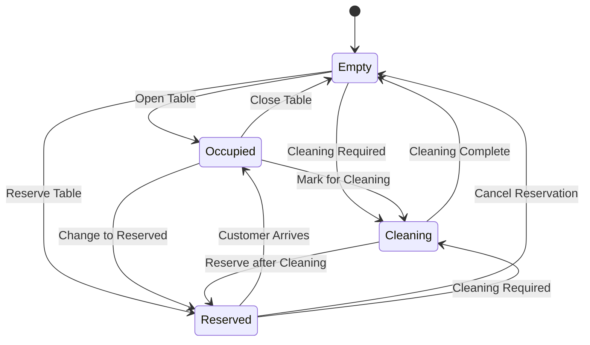

# Table Management System Design

## Table of Contents
1. [Overview](#overview)
2. [System Requirements](#system-requirements)
3. [Data Model](#data-model)
4. [User Interface Design](#user-interface-design)
5. [API Specification](#api-specification)
6. [Business Logic](#business-logic)
7. [Real-time Updates](#real-time-updates)
8. [Integration Points](#integration-points)
9. [Implementation Details](#implementation-details)

## Overview

The Table Management System is the foundation component of the Lengolf POS system, providing visual table layout management, occupancy tracking, and order assignment capabilities. This system replaces the table management functionality currently provided by Qashier POS while integrating seamlessly with existing booking and customer systems.

### Key Features
- **Visual Table Layout**: Interactive map showing all dining/service areas
- **Real-time Status Updates**: Live occupancy, pax count, and order status
- **Multi-Zone Support**: Bar area, Golf bays, and Lounge seating
- **Order Assignment**: Link tables to active orders and customer sessions
- **Staff Management**: Track assigned staff and service responsibilities
- **Booking Integration**: Connect golf bay tables to existing booking system

### Business Context
Based on the current Qashier system analysis, the facility operates with:
- **Bar Area**: 5 tables (Bar 1-5)
- **Golf Simulator Bays**: 3 bays (Bay 1-3) 
- **Lounge Area**: 6 tables (Lng 1-6)
- **Total Capacity**: 14 service points with varying occupancy limits

## System Requirements

### Functional Requirements

#### FR1: Table Layout Management
- Display visual representation of all tables across three zones
- Show real-time table status (Empty, Occupied, Reserved, Cleaning)
- Display current pax count for occupied tables
- Support table status transitions (Empty → Occupied → Cleaning → Empty)

#### FR2: Occupancy Tracking
- Track customer count (pax) per table with validation (1-99 range)
- Monitor table session duration
- Track staff assignments to tables
- Support table transfers and merging operations

#### FR3: Order Integration
- Link tables to active POS orders
- Display order totals and item counts at table level
- Support multiple orders per table (split billing)
- Show payment status and completion indicators

#### FR4: Booking System Integration
- Connect golf bay tables to existing booking system
- Display booking customer information
- Show scheduled lesson times and instructors
- Support walk-in customers vs. pre-booked sessions

#### FR5: Real-time Synchronization
- Live updates across all connected POS terminals
- Conflict resolution for simultaneous table operations
- Offline mode with sync when connection restored
- Data consistency validation

### Non-Functional Requirements

#### Performance
- **Response Time**: < 100ms for table status updates
- **Real-time Updates**: < 1 second latency for status changes
- **Concurrent Users**: Support 10+ staff members simultaneously
- **Offline Mode**: 30 minutes local operation capability

#### Reliability
- **Uptime**: 99.9% availability during business hours
- **Data Consistency**: Zero data loss during normal operations
- **Error Recovery**: Automatic recovery from network issues
- **Audit Trail**: Complete table activity logging

#### Usability
- **Touch Optimized**: Designed for tablet and touchscreen devices
- **Visual Clarity**: Clear status indicators and intuitive layout
- **Quick Actions**: One-touch operations for common tasks
- **Accessibility**: Support for various screen sizes and orientations

## Data Model

### Core Tables

#### Table Configuration (`pos.tables`)
```sql
CREATE TABLE pos.tables (
    id UUID PRIMARY KEY DEFAULT gen_random_uuid(),
    zone_id UUID NOT NULL REFERENCES pos.zones(id),
    table_number INTEGER NOT NULL,
    display_name VARCHAR(50) NOT NULL,
    max_pax INTEGER NOT NULL DEFAULT 8,
    position_x INTEGER NOT NULL, -- Layout position
    position_y INTEGER NOT NULL, -- Layout position
    is_active BOOLEAN DEFAULT true,
    created_at TIMESTAMPTZ DEFAULT NOW(),
    updated_at TIMESTAMPTZ DEFAULT NOW(),
    
    UNIQUE(zone_id, table_number)
);

-- Indexes for performance
CREATE INDEX idx_tables_zone ON pos.tables(zone_id);
CREATE INDEX idx_tables_active ON pos.tables(is_active);
```

#### Table Zones (`pos.zones`)
```sql
CREATE TABLE pos.zones (
    id UUID PRIMARY KEY DEFAULT gen_random_uuid(),
    name VARCHAR(50) NOT NULL UNIQUE,
    display_name VARCHAR(100) NOT NULL,
    zone_type VARCHAR(20) NOT NULL CHECK (zone_type IN ('bar', 'bay', 'lounge')),
    color_theme VARCHAR(7) DEFAULT '#6B7280', -- Hex color for UI
    is_active BOOLEAN DEFAULT true,
    display_order INTEGER DEFAULT 0,
    created_at TIMESTAMPTZ DEFAULT NOW(),
    updated_at TIMESTAMPTZ DEFAULT NOW()
);

-- Initial zone data
INSERT INTO pos.zones (name, display_name, zone_type, color_theme, display_order) VALUES
('bar', 'Bar Area', 'bar', '#DC2626', 1),
('bay', 'Golf Simulator Bays', 'bay', '#059669', 2),
('lounge', 'Lounge Seating', 'lounge', '#7C3AED', 3);
```

#### Table Sessions (`pos.table_sessions`)
```sql
CREATE TABLE pos.table_sessions (
    id UUID PRIMARY KEY DEFAULT gen_random_uuid(),
    table_id UUID NOT NULL REFERENCES pos.tables(id),
    status VARCHAR(20) NOT NULL DEFAULT 'empty' 
        CHECK (status IN ('empty', 'occupied', 'reserved', 'cleaning')),
    pax_count INTEGER DEFAULT 0 CHECK (pax_count >= 0 AND pax_count <= 99),
    customer_id UUID REFERENCES public.customers(id),
    assigned_staff_id UUID REFERENCES backoffice.staff(id),
    booking_id UUID REFERENCES public.bookings(id), -- For golf bay integration
    session_start TIMESTAMPTZ,
    session_end TIMESTAMPTZ,
    total_amount DECIMAL(10,2) DEFAULT 0,
    notes TEXT,
    created_at TIMESTAMPTZ DEFAULT NOW(),
    updated_at TIMESTAMPTZ DEFAULT NOW(),
    
    -- Business rules
    CONSTRAINT valid_session_dates CHECK (session_end IS NULL OR session_end > session_start),
    CONSTRAINT valid_pax_for_status CHECK (
        (status = 'empty' AND pax_count = 0) OR 
        (status != 'empty' AND pax_count > 0)
    )
);

-- Indexes for performance
CREATE INDEX idx_table_sessions_table ON pos.table_sessions(table_id);
CREATE INDEX idx_table_sessions_status ON pos.table_sessions(status);
CREATE INDEX idx_table_sessions_active ON pos.table_sessions(session_end) 
    WHERE session_end IS NULL;
```

#### Table Orders Relationship (`pos.table_orders`)
```sql
CREATE TABLE pos.table_orders (
    id UUID PRIMARY KEY DEFAULT gen_random_uuid(),
    table_session_id UUID NOT NULL REFERENCES pos.table_sessions(id),
    order_id UUID NOT NULL, -- References the order in the POS system
    order_number VARCHAR(50) NOT NULL,
    order_total DECIMAL(10,2) NOT NULL DEFAULT 0,
    order_status VARCHAR(20) NOT NULL DEFAULT 'active',
    created_at TIMESTAMPTZ DEFAULT NOW(),
    
    UNIQUE(order_id)
);

-- Index for table-order lookups
CREATE INDEX idx_table_orders_session ON pos.table_orders(table_session_id);
CREATE INDEX idx_table_orders_status ON pos.table_orders(order_status);
```

### TypeScript Interfaces

```typescript
// Core table data structure
interface Table {
  id: string;
  zoneId: string;
  tableNumber: number;
  displayName: string;
  maxPax: number;
  position: { x: number; y: number };
  isActive: boolean;
  zone: Zone;
  currentSession?: TableSession;
}

// Zone information
interface Zone {
  id: string;
  name: string;
  displayName: string;
  zoneType: 'bar' | 'bay' | 'lounge';
  colorTheme: string;
  isActive: boolean;
  displayOrder: number;
}

// Active table session
interface TableSession {
  id: string;
  tableId: string;
  status: 'empty' | 'occupied' | 'reserved' | 'cleaning';
  paxCount: number;
  customerId?: string;
  assignedStaffId?: string;
  bookingId?: string;
  sessionStart?: Date;
  totalAmount: number;
  notes?: string;
  orders: TableOrder[];
  customer?: Customer;
  assignedStaff?: Staff;
  booking?: Booking;
}

// Order relationship
interface TableOrder {
  id: string;
  tableSessionId: string;
  orderId: string;
  orderNumber: string;
  orderTotal: number;
  orderStatus: string;
  createdAt: Date;
}
```

## User Interface Design

### Main Table Layout View

#### Visual Layout Structure
```tsx
<TableManagementDashboard>
  <Header>
    <ZoneTabs /> {/* Bar | Bay | Lounge */}
    <StatusSummary /> {/* Occupied: 5/14 tables */}
    <QuickActions /> {/* Refresh, Settings */}
  </Header>
  
  <ZoneView>
    <TableGrid>
      {tables.map(table => (
        <TableCard 
          key={table.id}
          table={table}
          onClick={handleTableSelect}
          onStatusChange={handleStatusChange}
        />
      ))}
    </TableGrid>
  </ZoneView>
  
  <FloatingActions>
    <NewOrderButton />
    <TableTransferButton />
    <CleaningModeButton />
  </FloatingActions>
</TableManagementDashboard>
```

#### Table Card Design
```tsx
interface TableCardProps {
  table: Table;
  onClick: (table: Table) => void;
  onStatusChange: (tableId: string, status: TableStatus) => void;
}

const TableCard = ({ table, onClick, onStatusChange }: TableCardProps) => {
  const session = table.currentSession;
  const statusColor = getStatusColor(session?.status || 'empty');
  
  return (
    <Card 
      className={`table-card ${statusColor} cursor-pointer`}
      onClick={() => onClick(table)}
    >
      <CardHeader>
        <h3 className="text-lg font-semibold">{table.displayName}</h3>
        <StatusBadge status={session?.status || 'empty'} />
      </CardHeader>
      
      <CardContent>
        {session?.status === 'occupied' && (
          <>
            <div className="text-sm text-gray-600">
              Pax: {session.paxCount}
            </div>
            {session.customer && (
              <div className="text-sm font-medium">
                {session.customer.name}
              </div>
            )}
            {session.orders.length > 0 && (
              <div className="text-sm text-green-600">
                Orders: {session.orders.length}
                Total: ฿{session.totalAmount.toFixed(2)}
              </div>
            )}
            <div className="text-xs text-gray-500">
              {formatSessionDuration(session.sessionStart)}
            </div>
          </>
        )}
        
        {session?.status === 'empty' && (
          <div className="text-gray-400 text-center py-4">
            Available
          </div>
        )}
      </CardContent>
      
      <CardFooter>
        <QuickActionButtons 
          table={table}
          onStatusChange={onStatusChange}
        />
      </CardFooter>
    </Card>
  );
};
```

#### Zone Tab Navigation
```tsx
const ZoneTabs = ({ activeZone, onZoneChange }: ZoneTabsProps) => {
  const zones = useZones();
  
  return (
    <div className="flex space-x-1 bg-gray-100 rounded-lg p-1">
      {zones.map(zone => (
        <button
          key={zone.id}
          className={`px-4 py-2 rounded-md transition-colors ${
            activeZone === zone.id
              ? 'bg-white text-gray-900 shadow-sm'
              : 'text-gray-600 hover:text-gray-900'
          }`}
          onClick={() => onZoneChange(zone.id)}
        >
          <span 
            className="inline-block w-3 h-3 rounded-full mr-2"
            style={{ backgroundColor: zone.colorTheme }}
          />
          {zone.displayName}
          <span className="ml-2 text-sm text-gray-500">
            ({getOccupiedCount(zone.id)}/{getTotalCount(zone.id)})
          </span>
        </button>
      ))}
    </div>
  );
};
```

### Table Detail Modal

#### Table Session Management
```tsx
const TableDetailModal = ({ table, isOpen, onClose }: TableDetailModalProps) => {
  const [paxCount, setPaxCount] = useState(table.currentSession?.paxCount || 1);
  const [selectedCustomer, setSelectedCustomer] = useState<Customer | null>(null);
  
  return (
    <Dialog open={isOpen} onOpenChange={onClose}>
      <DialogContent className="max-w-lg">
        <DialogHeader>
          <DialogTitle>{table.displayName}</DialogTitle>
        </DialogHeader>
        
        <div className="space-y-4">
          {/* Pax Count Selection */}
          <div>
            <Label>Number of Guests</Label>
            <div className="flex items-center space-x-2">
              <Button 
                variant="outline" 
                size="sm"
                onClick={() => setPaxCount(Math.max(1, paxCount - 1))}
              >
                -
              </Button>
              <Input 
                type="number" 
                value={paxCount} 
                onChange={(e) => setPaxCount(Number(e.target.value))}
                className="w-20 text-center"
                min={1}
                max={table.maxPax}
              />
              <Button 
                variant="outline" 
                size="sm"
                onClick={() => setPaxCount(Math.min(table.maxPax, paxCount + 1))}
              >
                +
              </Button>
              <span className="text-sm text-gray-500">
                (Max: {table.maxPax})
              </span>
            </div>
          </div>
          
          {/* Customer Assignment */}
          <div>
            <Label>Customer (Optional)</Label>
            <CustomerSearchInput 
              value={selectedCustomer}
              onChange={setSelectedCustomer}
              placeholder="Search by name or phone..."
            />
          </div>
          
          {/* Booking Integration (for golf bays) */}
          {table.zone.zoneType === 'bay' && (
            <div>
              <Label>Booking Assignment</Label>
              <BookingSearchInput 
                tableId={table.id}
                onBookingSelect={handleBookingAssignment}
              />
            </div>
          )}
          
          {/* Staff Assignment */}
          <div>
            <Label>Assigned Staff</Label>
            <StaffSelect 
              value={selectedStaff}
              onChange={setSelectedStaff}
            />
          </div>
          
          {/* Notes */}
          <div>
            <Label>Notes</Label>
            <Textarea 
              placeholder="Special requests or notes..."
              value={notes}
              onChange={(e) => setNotes(e.target.value)}
            />
          </div>
        </div>
        
        <DialogFooter>
          <Button variant="outline" onClick={onClose}>
            Cancel
          </Button>
          <Button onClick={handleOpenTable}>
            Open Table
          </Button>
        </DialogFooter>
      </DialogContent>
    </Dialog>
  );
};
```

### Status Color Coding

```typescript
const getStatusColor = (status: TableStatus): string => {
  switch (status) {
    case 'empty':
      return 'bg-gray-100 border-gray-300 text-gray-700';
    case 'occupied':
      return 'bg-green-100 border-green-300 text-green-800';
    case 'reserved':
      return 'bg-blue-100 border-blue-300 text-blue-800';
    case 'cleaning':
      return 'bg-yellow-100 border-yellow-300 text-yellow-800';
    default:
      return 'bg-gray-100 border-gray-300 text-gray-700';
  }
};

const StatusBadge = ({ status }: { status: TableStatus }) => {
  const statusConfig = {
    empty: { label: 'Available', icon: '○' },
    occupied: { label: 'Occupied', icon: '●' },
    reserved: { label: 'Reserved', icon: '◐' },
    cleaning: { label: 'Cleaning', icon: '◇' }
  };
  
  const config = statusConfig[status];
  
  return (
    <span className={`inline-flex items-center px-2 py-1 rounded-full text-xs font-medium ${getStatusColor(status)}`}>
      <span className="mr-1">{config.icon}</span>
      {config.label}
    </span>
  );
};
```

## API Specification

### Table Management Endpoints

#### GET `/api/pos/tables`
Retrieve all tables with current session data

```typescript
interface GetTablesResponse {
  tables: Table[];
  zones: Zone[];
  summary: {
    totalTables: number;
    occupiedTables: number;
    availableTables: number;
    totalRevenue: number;
  };
}

// Example response
{
  "tables": [
    {
      "id": "table-bar-1",
      "zoneId": "zone-bar",
      "tableNumber": 1,
      "displayName": "Bar 1",
      "maxPax": 8,
      "position": { "x": 100, "y": 150 },
      "isActive": true,
      "zone": {
        "id": "zone-bar",
        "name": "bar",
        "displayName": "Bar Area",
        "zoneType": "bar",
        "colorTheme": "#DC2626"
      },
      "currentSession": {
        "id": "session-123",
        "status": "occupied",
        "paxCount": 4,
        "customerId": "customer-456",
        "sessionStart": "2025-07-14T12:30:00Z",
        "totalAmount": 850.00,
        "orders": [
          {
            "orderId": "order-789",
            "orderNumber": "ORD-001",
            "orderTotal": 850.00,
            "orderStatus": "active"
          }
        ]
      }
    }
  ]
}
```

#### POST `/api/pos/tables/{tableId}/open`
Open a table with customer and pax information

```typescript
interface OpenTableRequest {
  paxCount: number;
  customerId?: string;
  assignedStaffId?: string;
  bookingId?: string;
  notes?: string;
}

interface OpenTableResponse {
  success: boolean;
  session: TableSession;
  message?: string;
}
```

#### PUT `/api/pos/tables/{tableId}/status`
Update table status

```typescript
interface UpdateTableStatusRequest {
  status: 'empty' | 'occupied' | 'reserved' | 'cleaning';
  reason?: string;
}

interface UpdateTableStatusResponse {
  success: boolean;
  session: TableSession;
  message?: string;
}
```

#### POST `/api/pos/tables/{tableId}/close`
Close a table session

```typescript
interface CloseTableRequest {
  reason?: string;
  finalAmount?: number;
}

interface CloseTableResponse {
  success: boolean;
  closedSession: TableSession;
  message?: string;
}
```

#### POST `/api/pos/tables/transfer`
Transfer order between tables

```typescript
interface TransferTableRequest {
  fromTableId: string;
  toTableId: string;
  orderIds?: string[]; // Optional: specific orders to transfer
  transferAll?: boolean;
}

interface TransferTableResponse {
  success: boolean;
  fromSession: TableSession;
  toSession: TableSession;
  transferredOrders: TableOrder[];
  message?: string;
}
```

### Real-time Event Endpoints

#### WebSocket `/ws/pos/tables`
Real-time table status updates

```typescript
// Outgoing events (client → server)
interface TableEventMessage {
  type: 'subscribe' | 'unsubscribe' | 'update_status';
  payload: {
    tableIds?: string[];
    zoneIds?: string[];
    status?: TableStatus;
    sessionData?: Partial<TableSession>;
  };
}

// Incoming events (server → client)
interface TableUpdateEvent {
  type: 'table_updated' | 'session_created' | 'session_closed' | 'order_added';
  payload: {
    tableId: string;
    session?: TableSession;
    order?: TableOrder;
    timestamp: string;
  };
}
```

## Business Logic

### Table Status Workflow



### Table Opening Logic

```typescript
const openTable = async (
  tableId: string, 
  openRequest: OpenTableRequest
): Promise<TableSession> => {
  // Validation
  const table = await getTable(tableId);
  if (!table) throw new Error('Table not found');
  
  const currentSession = await getCurrentSession(tableId);
  if (currentSession?.status !== 'empty') {
    throw new Error('Table is not available');
  }
  
  if (openRequest.paxCount < 1 || openRequest.paxCount > table.maxPax) {
    throw new Error(`Pax count must be between 1 and ${table.maxPax}`);
  }
  
  // Create new session
  const session = await createTableSession({
    tableId,
    status: 'occupied',
    paxCount: openRequest.paxCount,
    customerId: openRequest.customerId,
    assignedStaffId: openRequest.assignedStaffId,
    bookingId: openRequest.bookingId,
    sessionStart: new Date(),
    notes: openRequest.notes
  });
  
  // Emit real-time update
  await broadcastTableUpdate(tableId, 'session_created', session);
  
  return session;
};
```

### Order Assignment Logic

```typescript
const assignOrderToTable = async (
  tableId: string, 
  orderId: string, 
  orderData: OrderData
): Promise<TableOrder> => {
  // Validate table has active session
  const session = await getCurrentSession(tableId);
  if (!session || session.status !== 'occupied') {
    throw new Error('Table must be occupied to assign orders');
  }
  
  // Create order relationship
  const tableOrder = await createTableOrder({
    tableSessionId: session.id,
    orderId: orderId,
    orderNumber: orderData.orderNumber,
    orderTotal: orderData.total,
    orderStatus: 'active'
  });
  
  // Update session total
  await updateSessionTotal(session.id);
  
  // Emit real-time update
  await broadcastTableUpdate(tableId, 'order_added', tableOrder);
  
  return tableOrder;
};
```

### Table Transfer Logic

```typescript
const transferTable = async (
  fromTableId: string,
  toTableId: string,
  options: TransferOptions = {}
): Promise<TransferResult> => {
  // Validate source table
  const fromSession = await getCurrentSession(fromTableId);
  if (!fromSession || fromSession.status !== 'occupied') {
    throw new Error('Source table must be occupied');
  }
  
  // Validate destination table
  const toSession = await getCurrentSession(toTableId);
  if (toSession && toSession.status !== 'empty') {
    throw new Error('Destination table must be empty');
  }
  
  const toTable = await getTable(toTableId);
  if (fromSession.paxCount > toTable.maxPax) {
    throw new Error('Destination table cannot accommodate pax count');
  }
  
  await db.transaction(async (trx) => {
    // Create new session at destination
    const newSession = await createTableSession({
      tableId: toTableId,
      status: 'occupied',
      paxCount: fromSession.paxCount,
      customerId: fromSession.customerId,
      assignedStaffId: fromSession.assignedStaffId,
      bookingId: fromSession.bookingId,
      sessionStart: fromSession.sessionStart,
      notes: fromSession.notes
    }, trx);
    
    // Transfer orders
    const ordersToTransfer = options.orderIds 
      ? await getOrdersByIds(options.orderIds)
      : await getSessionOrders(fromSession.id);
      
    for (const order of ordersToTransfer) {
      await updateOrderSession(order.id, newSession.id, trx);
    }
    
    // Close original session
    await closeTableSession(fromSession.id, trx);
    
    // Update totals
    await updateSessionTotal(newSession.id, trx);
  });
  
  // Emit updates for both tables
  await Promise.all([
    broadcastTableUpdate(fromTableId, 'session_closed'),
    broadcastTableUpdate(toTableId, 'session_created')
  ]);
  
  return { success: true };
};
```

## Real-time Updates

### WebSocket Integration

```typescript
// Table management store with real-time updates
export const useTableStore = create<TableStore>((set, get) => ({
  tables: [],
  zones: [],
  wsConnection: null,
  
  initializeRealtime: () => {
    const ws = new WebSocket('/ws/pos/tables');
    
    ws.onopen = () => {
      console.log('Table management WebSocket connected');
      set({ wsConnection: ws });
    };
    
    ws.onmessage = (event) => {
      const message = JSON.parse(event.data) as TableUpdateEvent;
      handleTableUpdate(message);
    };
    
    ws.onclose = () => {
      console.log('Table management WebSocket disconnected');
      set({ wsConnection: null });
      // Attempt reconnection
      setTimeout(() => get().initializeRealtime(), 3000);
    };
  },
  
  handleTableUpdate: (event: TableUpdateEvent) => {
    const { tables } = get();
    
    switch (event.type) {
      case 'table_updated':
        set({
          tables: tables.map(table => 
            table.id === event.payload.tableId
              ? { ...table, currentSession: event.payload.session }
              : table
          )
        });
        break;
        
      case 'session_created':
      case 'session_closed':
        // Refresh specific table data
        get().refreshTable(event.payload.tableId);
        break;
        
      case 'order_added':
        // Update table order list
        get().updateTableOrders(event.payload.tableId, event.payload.order);
        break;
    }
  },
  
  refreshTable: async (tableId: string) => {
    const response = await fetch(`/api/pos/tables/${tableId}`);
    const table = await response.json();
    
    const { tables } = get();
    set({
      tables: tables.map(t => t.id === tableId ? table : t)
    });
  }
}));
```

### Conflict Resolution

```typescript
// Handle concurrent table operations
export const handleTableConflict = async (
  operation: TableOperation,
  conflictData: ConflictData
): Promise<void> => {
  switch (operation.type) {
    case 'open_table':
      if (conflictData.currentStatus !== 'empty') {
        throw new ConflictError('Table is no longer available');
      }
      break;
      
    case 'close_table':
      if (!conflictData.currentSession) {
        throw new ConflictError('Table session no longer exists');
      }
      break;
      
    case 'transfer_table':
      // Check both source and destination
      if (conflictData.sourceStatus !== 'occupied') {
        throw new ConflictError('Source table is no longer occupied');
      }
      if (conflictData.destinationStatus !== 'empty') {
        throw new ConflictError('Destination table is no longer available');
      }
      break;
  }
};
```

## Integration Points

### Booking System Integration

```typescript
// Golf bay booking integration
export const integrateWithBooking = async (
  tableId: string,
  bookingId: string
): Promise<void> => {
  // Validate booking exists and is for correct bay
  const booking = await getBooking(bookingId);
  if (!booking) throw new Error('Booking not found');
  
  const table = await getTable(tableId);
  if (table.zone.zoneType !== 'bay') {
    throw new Error('Booking integration only available for golf bays');
  }
  
  // Check booking is for today and correct bay
  const today = format(new Date(), 'yyyy-MM-dd');
  const bookingDate = format(booking.date, 'yyyy-MM-dd');
  
  if (bookingDate !== today) {
    throw new Error('Booking must be for today');
  }
  
  // Auto-populate customer and session details
  const sessionData = {
    customerId: booking.customerId,
    paxCount: booking.numberOfGuests,
    assignedStaffId: booking.instructorId,
    bookingId: booking.id,
    notes: `Booking: ${booking.serviceType} - ${format(booking.startTime, 'HH:mm')}`
  };
  
  return openTable(tableId, sessionData);
};
```

### Customer System Integration

```typescript
// Customer lookup and auto-complete
export const useCustomerLookup = () => {
  const [customers, setCustomers] = useState<Customer[]>([]);
  const [loading, setLoading] = useState(false);
  
  const searchCustomers = useMemo(
    () => debounce(async (query: string) => {
      if (query.length < 2) {
        setCustomers([]);
        return;
      }
      
      setLoading(true);
      try {
        const response = await fetch(`/api/customers/search?q=${encodeURIComponent(query)}`);
        const results = await response.json();
        setCustomers(results.customers);
      } catch (error) {
        console.error('Customer search failed:', error);
        setCustomers([]);
      } finally {
        setLoading(false);
      }
    }, 300),
    []
  );
  
  return { customers, loading, searchCustomers };
};
```

### Staff Assignment Integration

```typescript
// Staff management integration
export const useStaffAssignment = () => {
  const { data: staff } = useSWR('/api/staff/active', fetcher);
  
  const assignStaffToTable = async (
    tableId: string,
    staffId: string
  ): Promise<void> => {
    const response = await fetch(`/api/pos/tables/${tableId}/assign-staff`, {
      method: 'POST',
      headers: { 'Content-Type': 'application/json' },
      body: JSON.stringify({ staffId })
    });
    
    if (!response.ok) {
      throw new Error('Failed to assign staff to table');
    }
  };
  
  return { staff, assignStaffToTable };
};
```

## Implementation Details

### Component File Structure

```
src/components/pos/table-management/
├── TableManagementDashboard.tsx    # Main dashboard component
├── ZoneTabNavigation.tsx           # Zone switching tabs
├── TableGrid.tsx                   # Table layout grid
├── TableCard.tsx                   # Individual table display
├── TableDetailModal.tsx            # Table session management modal
├── CustomerSearchInput.tsx         # Customer lookup component
├── BookingIntegration.tsx          # Golf bay booking integration
├── StatusIndicators.tsx            # Visual status components
├── QuickActions.tsx               # Table action buttons
└── hooks/
    ├── useTableStore.ts            # Table state management
    ├── useRealTimeUpdates.ts       # WebSocket integration
    ├── useCustomerLookup.ts        # Customer search
    └── useTableOperations.ts       # Table CRUD operations
```

### Database Migration Script

```sql
-- Table Management System Migration
-- Run this script to set up the table management database structure

BEGIN;

-- Create zones table
CREATE TABLE IF NOT EXISTS pos.zones (
    id UUID PRIMARY KEY DEFAULT gen_random_uuid(),
    name VARCHAR(50) NOT NULL UNIQUE,
    display_name VARCHAR(100) NOT NULL,
    zone_type VARCHAR(20) NOT NULL CHECK (zone_type IN ('bar', 'bay', 'lounge')),
    color_theme VARCHAR(7) DEFAULT '#6B7280',
    is_active BOOLEAN DEFAULT true,
    display_order INTEGER DEFAULT 0,
    created_at TIMESTAMPTZ DEFAULT NOW(),
    updated_at TIMESTAMPTZ DEFAULT NOW()
);

-- Create tables table
CREATE TABLE IF NOT EXISTS pos.tables (
    id UUID PRIMARY KEY DEFAULT gen_random_uuid(),
    zone_id UUID NOT NULL REFERENCES pos.zones(id),
    table_number INTEGER NOT NULL,
    display_name VARCHAR(50) NOT NULL,
    max_pax INTEGER NOT NULL DEFAULT 8,
    position_x INTEGER NOT NULL DEFAULT 0,
    position_y INTEGER NOT NULL DEFAULT 0,
    is_active BOOLEAN DEFAULT true,
    created_at TIMESTAMPTZ DEFAULT NOW(),
    updated_at TIMESTAMPTZ DEFAULT NOW(),
    
    UNIQUE(zone_id, table_number)
);

-- Create table sessions table
CREATE TABLE IF NOT EXISTS pos.table_sessions (
    id UUID PRIMARY KEY DEFAULT gen_random_uuid(),
    table_id UUID NOT NULL REFERENCES pos.tables(id),
    status VARCHAR(20) NOT NULL DEFAULT 'empty' 
        CHECK (status IN ('empty', 'occupied', 'reserved', 'cleaning')),
    pax_count INTEGER DEFAULT 0 CHECK (pax_count >= 0 AND pax_count <= 99),
    customer_id UUID REFERENCES public.customers(id),
    assigned_staff_id UUID REFERENCES backoffice.staff(id),
    booking_id UUID REFERENCES public.bookings(id),
    session_start TIMESTAMPTZ,
    session_end TIMESTAMPTZ,
    total_amount DECIMAL(10,2) DEFAULT 0,
    notes TEXT,
    created_at TIMESTAMPTZ DEFAULT NOW(),
    updated_at TIMESTAMPTZ DEFAULT NOW(),
    
    CONSTRAINT valid_session_dates CHECK (session_end IS NULL OR session_end > session_start),
    CONSTRAINT valid_pax_for_status CHECK (
        (status = 'empty' AND pax_count = 0) OR 
        (status != 'empty' AND pax_count > 0)
    )
);

-- Create table orders relationship table
CREATE TABLE IF NOT EXISTS pos.table_orders (
    id UUID PRIMARY KEY DEFAULT gen_random_uuid(),
    table_session_id UUID NOT NULL REFERENCES pos.table_sessions(id),
    order_id UUID NOT NULL,
    order_number VARCHAR(50) NOT NULL,
    order_total DECIMAL(10,2) NOT NULL DEFAULT 0,
    order_status VARCHAR(20) NOT NULL DEFAULT 'active',
    created_at TIMESTAMPTZ DEFAULT NOW(),
    
    UNIQUE(order_id)
);

-- Create indexes
CREATE INDEX IF NOT EXISTS idx_tables_zone ON pos.tables(zone_id);
CREATE INDEX IF NOT EXISTS idx_tables_active ON pos.tables(is_active);
CREATE INDEX IF NOT EXISTS idx_table_sessions_table ON pos.table_sessions(table_id);
CREATE INDEX IF NOT EXISTS idx_table_sessions_status ON pos.table_sessions(status);
CREATE INDEX IF NOT EXISTS idx_table_sessions_active ON pos.table_sessions(session_end) WHERE session_end IS NULL;
CREATE INDEX IF NOT EXISTS idx_table_orders_session ON pos.table_orders(table_session_id);
CREATE INDEX IF NOT EXISTS idx_table_orders_status ON pos.table_orders(order_status);

-- Insert initial zone data
INSERT INTO pos.zones (name, display_name, zone_type, color_theme, display_order) VALUES
('bar', 'Bar Area', 'bar', '#DC2626', 1),
('bay', 'Golf Simulator Bays', 'bay', '#059669', 2),
('lounge', 'Lounge Seating', 'lounge', '#7C3AED', 3)
ON CONFLICT (name) DO NOTHING;

-- Insert initial table data based on current Qashier setup
-- Bar tables (Bar 1-5)
INSERT INTO pos.tables (zone_id, table_number, display_name, max_pax, position_x, position_y) 
SELECT 
    z.id,
    generate_series(1, 5),
    'Bar ' || generate_series(1, 5),
    8,
    (generate_series(1, 5) - 1) * 150 + 50,
    100
FROM pos.zones z WHERE z.name = 'bar'
ON CONFLICT (zone_id, table_number) DO NOTHING;

-- Bay tables (Bay 1-3) 
INSERT INTO pos.tables (zone_id, table_number, display_name, max_pax, position_x, position_y)
SELECT 
    z.id,
    generate_series(1, 3),
    'Bay ' || generate_series(1, 3),
    6,
    (generate_series(1, 3) - 1) * 200 + 100,
    300
FROM pos.zones z WHERE z.name = 'bay'
ON CONFLICT (zone_id, table_number) DO NOTHING;

-- Lounge tables (Lng 1-6)
INSERT INTO pos.tables (zone_id, table_number, display_name, max_pax, position_x, position_y)
SELECT 
    z.id,
    generate_series(1, 6),
    'Lng ' || generate_series(1, 6),
    6,
    ((generate_series(1, 6) - 1) % 3) * 150 + 50,
    500 + ((generate_series(1, 6) - 1) / 3) * 150
FROM pos.zones z WHERE z.name = 'lounge'
ON CONFLICT (zone_id, table_number) DO NOTHING;

-- Create function to get table summary
CREATE OR REPLACE FUNCTION pos.get_table_summary()
RETURNS JSON AS $$
DECLARE
    result JSON;
BEGIN
    SELECT json_build_object(
        'total_tables', COUNT(*),
        'occupied_tables', COUNT(*) FILTER (WHERE ts.status = 'occupied'),
        'available_tables', COUNT(*) FILTER (WHERE ts.status = 'empty' OR ts.status IS NULL),
        'total_revenue', COALESCE(SUM(ts.total_amount) FILTER (WHERE ts.status = 'occupied'), 0),
        'by_zone', json_agg(
            json_build_object(
                'zone_name', z.display_name,
                'total', zone_stats.total,
                'occupied', zone_stats.occupied,
                'available', zone_stats.available
            )
        )
    ) INTO result
    FROM pos.zones z
    LEFT JOIN pos.tables t ON t.zone_id = z.id AND t.is_active = true
    LEFT JOIN pos.table_sessions ts ON ts.table_id = t.id AND ts.session_end IS NULL
    CROSS JOIN LATERAL (
        SELECT 
            COUNT(t2.*) as total,
            COUNT(ts2.*) FILTER (WHERE ts2.status = 'occupied') as occupied,
            COUNT(t2.*) FILTER (WHERE ts2.status IS NULL OR ts2.status = 'empty') as available
        FROM pos.tables t2
        LEFT JOIN pos.table_sessions ts2 ON ts2.table_id = t2.id AND ts2.session_end IS NULL
        WHERE t2.zone_id = z.id AND t2.is_active = true
    ) zone_stats
    WHERE z.is_active = true
    GROUP BY z.id, z.display_name;
    
    RETURN result;
END;
$$ LANGUAGE plpgsql;

COMMIT;
```

---

**Next Implementation Steps:**
1. Create database migration and run initial setup
2. Implement basic table management UI components
3. Add real-time WebSocket integration
4. Integrate with existing customer and staff systems
5. Add booking system integration for golf bays
6. Implement table transfer and conflict resolution
7. Add comprehensive testing suite

**Related Documents:**
- [POS Interface Design](./POS_INTERFACE_DESIGN.md) - Order creation interface
- [Product Catalog Integration](./PRODUCT_CATALOG_INTEGRATION.md) - Product selection system
- [Transaction Processing](./TRANSACTION_PROCESSING_DESIGN.md) - Order processing engine

---

**Document Status**: Technical Specification v1.0  
**Last Updated**: July 14, 2025  
**Implementation Priority**: High (Foundation Component)