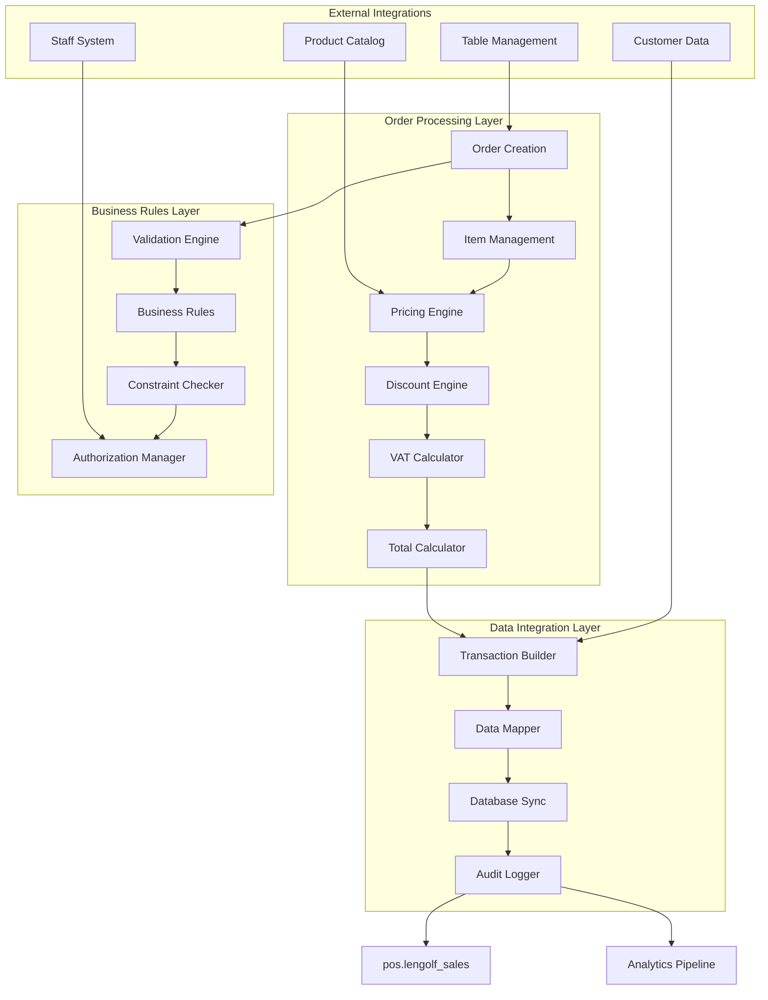
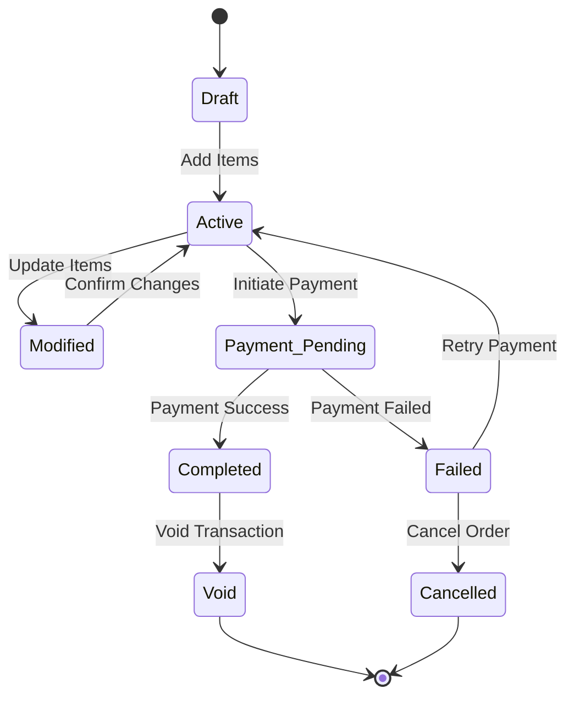

# Transaction Processing Engine Design

## Table of Contents
1. [Overview](#overview)
2. [System Architecture](#system-architecture)
3. [Order Lifecycle Management](#order-lifecycle-management)
4. [Pricing and Calculation Engine](#pricing-and-calculation-engine)
5. [Data Integration Strategy](#data-integration-strategy)
6. [Business Rules Engine](#business-rules-engine)
7. [Real-time Processing](#real-time-processing)
8. [Error Handling and Recovery](#error-handling-and-recovery)
9. [Performance Optimization](#performance-optimization)
10. [Implementation Details](#implementation-details)

## Overview

The Transaction Processing Engine is the core business logic component that handles the complete order lifecycle from creation to completion. It manages calculations, validates business rules, processes discounts, handles VAT computations, and ensures seamless integration with the existing `pos.lengolf_sales` database structure.

### Key Responsibilities
- **Order Management**: Complete order lifecycle from creation to completion
- **Financial Calculations**: Real-time pricing, VAT, discounts, and totals
- **Business Rule Enforcement**: Validation of business logic and constraints
- **Data Integration**: Seamless sync with existing transaction database
- **Audit Trail**: Complete transaction history and modification tracking
- **Error Recovery**: Robust error handling and transaction rollback

### Integration Context
The engine integrates with existing systems while maintaining data compatibility:
- **Products**: Integration with `products.products` and `products.categories`
- **Customers**: Connection to `public.customers` database
- **Staff**: Integration with `backoffice.staff` system
- **Sales Data**: Direct sync to `pos.lengolf_sales` for analytics continuity
- **Table Management**: Link with table session management

## System Architecture

### Core Processing Components



### Processing Flow Architecture

```
Order Creation → Item Addition → Price Calculation → Discount Application → 
VAT Computation → Total Calculation → Validation → Data Integration → 
Transaction Storage → Analytics Sync
```

### Key Design Principles
- **Real-time Processing**: Immediate calculation updates as items change
- **Data Consistency**: Maintain compatibility with existing analytics
- **Business Rule Enforcement**: Comprehensive validation at all stages
- **Performance Optimization**: Efficient calculations for responsive UI
- **Error Resilience**: Graceful handling of edge cases and failures

## Order Lifecycle Management

### Order State Machine



### Order Entity Model

```typescript
interface Order {
  // Identification
  id: string;
  orderNumber: string;
  status: OrderStatus;
  
  // Context
  tableId?: string;
  customerId?: string;
  staffId: string;
  
  // Items and pricing
  items: OrderItem[];
  subtotal: number;
  vatRate: number;
  vatAmount: number;
  discountAmount: number;
  total: number;
  
  // Metadata
  notes?: string;
  createdAt: Date;
  updatedAt: Date;
  completedAt?: Date;
  
  // Audit
  modificationHistory: OrderModification[];
}

interface OrderItem {
  id: string;
  productId: string;
  productName: string;
  categoryId: string;
  
  // Quantity and pricing
  quantity: number;
  unitPrice: number;
  total: number;
  
  // VAT
  vatRate: number;
  vatAmount: number;
  
  // Customization
  modifiers: ItemModifier[];
  notes?: string;
  
  // Metadata
  addedAt: Date;
  addedBy: string;
}

enum OrderStatus {
  DRAFT = 'draft',
  ACTIVE = 'active',
  MODIFIED = 'modified',
  PAYMENT_PENDING = 'payment_pending',
  COMPLETED = 'completed',
  FAILED = 'failed',
  CANCELLED = 'cancelled',
  VOID = 'void'
}
```

### Order Lifecycle Operations

```typescript
class OrderLifecycleManager {
  async createOrder(context: OrderContext): Promise<Order> {
    const order: Order = {
      id: generateId(),
      orderNumber: await this.generateOrderNumber(),
      status: OrderStatus.DRAFT,
      
      tableId: context.tableId,
      customerId: context.customerId,
      staffId: context.staffId,
      
      items: [],
      subtotal: 0,
      vatRate: this.getCurrentVATRate(),
      vatAmount: 0,
      discountAmount: 0,
      total: 0,
      
      createdAt: new Date(),
      updatedAt: new Date(),
      modificationHistory: []
    };
    
    await this.validateOrderCreation(order, context);
    await this.persistOrder(order);
    await this.notifyOrderCreated(order);
    
    return order;
  }
  
  async addItemToOrder(
    orderId: string, 
    product: Product, 
    quantity: number = 1,
    modifiers: ItemModifier[] = []
  ): Promise<Order> {
    const order = await this.getOrder(orderId);
    
    // Validate item addition
    await this.validateItemAddition(order, product, quantity);
    
    // Check for existing item
    const existingItem = order.items.find(item => 
      item.productId === product.id && 
      this.modifiersMatch(item.modifiers, modifiers)
    );
    
    if (existingItem) {
      existingItem.quantity += quantity;
      existingItem.total = this.calculateItemTotal(existingItem);
      existingItem.vatAmount = this.calculateItemVAT(existingItem);
    } else {
      const newItem: OrderItem = {
        id: generateId(),
        productId: product.id,
        productName: product.name,
        categoryId: product.category_id,
        
        quantity,
        unitPrice: product.price,
        total: product.price * quantity,
        
        vatRate: this.getProductVATRate(product),
        vatAmount: this.calculateProductVAT(product, quantity),
        
        modifiers,
        notes: '',
        
        addedAt: new Date(),
        addedBy: order.staffId
      };
      
      order.items.push(newItem);
    }
    
    // Recalculate totals
    this.recalculateOrderTotals(order);
    
    // Update order status
    order.status = OrderStatus.ACTIVE;
    order.updatedAt = new Date();
    
    // Record modification
    this.recordModification(order, {
      type: 'item_added',
      productId: product.id,
      quantity,
      modifiers,
      timestamp: new Date()
    });
    
    await this.persistOrder(order);
    await this.notifyOrderUpdated(order);
    
    return order;
  }
  
  async removeItemFromOrder(orderId: string, itemId: string): Promise<Order> {
    const order = await this.getOrder(orderId);
    const itemIndex = order.items.findIndex(item => item.id === itemId);
    
    if (itemIndex === -1) {
      throw new Error(`Item ${itemId} not found in order`);
    }
    
    const removedItem = order.items[itemIndex];
    order.items.splice(itemIndex, 1);
    
    // Recalculate totals
    this.recalculateOrderTotals(order);
    
    // Update status
    order.status = order.items.length > 0 ? OrderStatus.MODIFIED : OrderStatus.DRAFT;
    order.updatedAt = new Date();
    
    // Record modification
    this.recordModification(order, {
      type: 'item_removed',
      itemId,
      productId: removedItem.productId,
      timestamp: new Date()
    });
    
    await this.persistOrder(order);
    await this.notifyOrderUpdated(order);
    
    return order;
  }
}
```

## Pricing and Calculation Engine

### VAT Calculation Strategy

Based on the existing system's VAT implementation logic, the engine handles two different VAT calculation methods:

```typescript
class VATCalculationEngine {
  private vatChangeDate = new Date('2024-09-01'); // VAT implementation date
  private vatRate = 0.07; // 7% VAT rate
  
  calculateVAT(amount: number, transactionDate: Date): VATCalculation {
    if (transactionDate < this.vatChangeDate) {
      // Pre-VAT implementation: VAT added on top
      return {
        method: 'additive',
        baseAmount: amount,
        vatAmount: amount * this.vatRate,
        totalAmount: amount * (1 + this.vatRate)
      };
    } else {
      // Post-VAT implementation: VAT included in price
      return {
        method: 'inclusive',
        baseAmount: amount / (1 + this.vatRate),
        vatAmount: (amount * this.vatRate) / (1 + this.vatRate),
        totalAmount: amount
      };
    }
  }
  
  calculateItemVAT(item: OrderItem, transactionDate: Date): number {
    const calculation = this.calculateVAT(item.total, transactionDate);
    return calculation.vatAmount;
  }
  
  calculateOrderVAT(order: Order): number {
    return order.items.reduce((total, item) => {
      return total + this.calculateItemVAT(item, order.createdAt);
    }, 0);
  }
}
```

### Pricing Engine

```typescript
class PricingEngine {
  private vatEngine = new VATCalculationEngine();
  private discountEngine = new DiscountEngine();
  
  calculateItemPricing(
    product: Product,
    quantity: number,
    modifiers: ItemModifier[] = [],
    transactionDate: Date = new Date()
  ): ItemPricing {
    // Base price calculation
    let basePrice = product.price;
    
    // Apply modifiers
    const modifierTotal = modifiers.reduce((total, modifier) => {
      return total + this.calculateModifierPrice(modifier);
    }, 0);
    
    const itemTotal = (basePrice + modifierTotal) * quantity;
    
    // Calculate VAT
    const vatCalculation = this.vatEngine.calculateVAT(itemTotal, transactionDate);
    
    return {
      unitPrice: basePrice + modifierTotal,
      quantity,
      subtotal: itemTotal,
      vatAmount: vatCalculation.vatAmount,
      total: vatCalculation.totalAmount,
      modifierTotal
    };
  }
  
  calculateOrderPricing(order: Order): OrderPricing {
    // Calculate item totals
    const itemPricings = order.items.map(item => 
      this.calculateItemPricing(
        { price: item.unitPrice } as Product,
        item.quantity,
        item.modifiers,
        order.createdAt
      )
    );
    
    const subtotal = itemPricings.reduce((sum, pricing) => sum + pricing.subtotal, 0);
    const vatAmount = itemPricings.reduce((sum, pricing) => sum + pricing.vatAmount, 0);
    
    // Apply order-level discounts
    const discountAmount = this.discountEngine.calculateOrderDiscount(order, subtotal);
    
    const total = subtotal + vatAmount - discountAmount;
    
    return {
      subtotal,
      vatAmount,
      discountAmount,
      total,
      itemPricings
    };
  }
  
  private calculateModifierPrice(modifier: ItemModifier): number {
    switch (modifier.type) {
      case 'addition':
        return modifier.price;
      case 'percentage':
        return 0; // Handled at order level
      default:
        return 0;
    }
  }
}
```

### Discount Engine

```typescript
class DiscountEngine {
  calculateOrderDiscount(order: Order, subtotal: number): number {
    let totalDiscount = 0;
    
    // Apply item-level discounts
    for (const item of order.items) {
      totalDiscount += this.calculateItemDiscount(item);
    }
    
    // Apply order-level discounts
    // Implementation depends on business rules
    
    return totalDiscount;
  }
  
  private calculateItemDiscount(item: OrderItem): number {
    // Implementation for item-specific discounts
    return 0;
  }
  
  validateDiscount(
    discount: DiscountRequest,
    order: Order,
    staff: StaffMember
  ): DiscountValidation {
    // Validate discount rules and permissions
    const rules = this.getDiscountRules(discount.type);
    
    return {
      isValid: this.checkDiscountRules(discount, order, rules),
      requiresAuthorization: this.requiresManagerApproval(discount, staff),
      maxAmount: rules.maxAmount,
      reason: discount.reason
    };
  }
}
```

## Data Integration Strategy

### Database Schema Integration

```sql
-- Orders table for active order management
CREATE TABLE pos.orders (
    id UUID PRIMARY KEY DEFAULT gen_random_uuid(),
    order_number VARCHAR(20) NOT NULL UNIQUE,
    status VARCHAR(20) NOT NULL DEFAULT 'draft',
    
    -- Context
    table_id UUID REFERENCES pos.tables(id),
    customer_id UUID REFERENCES public.customers(id),
    staff_id UUID NOT NULL REFERENCES backoffice.staff(id),
    
    -- Financial data
    subtotal DECIMAL(10,2) NOT NULL DEFAULT 0,
    vat_rate DECIMAL(5,4) NOT NULL DEFAULT 0.07,
    vat_amount DECIMAL(10,2) NOT NULL DEFAULT 0,
    discount_amount DECIMAL(10,2) NOT NULL DEFAULT 0,
    total DECIMAL(10,2) NOT NULL DEFAULT 0,
    
    -- Metadata
    notes TEXT,
    
    -- Timestamps
    created_at TIMESTAMPTZ DEFAULT NOW(),
    updated_at TIMESTAMPTZ DEFAULT NOW(),
    completed_at TIMESTAMPTZ,
    
    -- Constraints
    CHECK (subtotal >= 0),
    CHECK (vat_amount >= 0),
    CHECK (discount_amount >= 0),
    CHECK (total >= 0)
);

-- Order items table
CREATE TABLE pos.order_items (
    id UUID PRIMARY KEY DEFAULT gen_random_uuid(),
    order_id UUID NOT NULL REFERENCES pos.orders(id) ON DELETE CASCADE,
    
    -- Product reference
    product_id UUID NOT NULL REFERENCES products.products(id),
    product_name VARCHAR(200) NOT NULL,
    category_id UUID NOT NULL REFERENCES products.categories(id),
    
    -- Quantity and pricing
    quantity INTEGER NOT NULL CHECK (quantity > 0),
    unit_price DECIMAL(10,2) NOT NULL,
    total DECIMAL(10,2) NOT NULL,
    
    -- VAT
    vat_rate DECIMAL(5,4) NOT NULL,
    vat_amount DECIMAL(10,2) NOT NULL DEFAULT 0,
    
    -- Customization
    modifiers JSONB DEFAULT '[]',
    notes TEXT,
    
    -- Audit
    added_at TIMESTAMPTZ DEFAULT NOW(),
    added_by UUID NOT NULL REFERENCES backoffice.staff(id),
    
    -- Constraints
    CHECK (unit_price >= 0),
    CHECK (total >= 0)
);

-- Order modifications audit table
CREATE TABLE pos.order_modifications (
    id UUID PRIMARY KEY DEFAULT gen_random_uuid(),
    order_id UUID NOT NULL REFERENCES pos.orders(id),
    
    modification_type VARCHAR(50) NOT NULL,
    details JSONB NOT NULL,
    
    -- Audit
    modified_by UUID NOT NULL REFERENCES backoffice.staff(id),
    modified_at TIMESTAMPTZ DEFAULT NOW()
);
```

### Data Mapping to pos.lengolf_sales

```typescript
class TransactionDataMapper {
  async mapOrderToSalesRecord(
    order: Order,
    paymentData: PaymentData
  ): Promise<LengolfSalesRecord> {
    const salesRecord: LengolfSalesRecord = {
      // Transaction identifiers
      bill_no: order.orderNumber,
      transaction_id: order.id,
      
      // Financial data
      subtotal: order.subtotal,
      vat_amount: order.vatAmount,
      total_amount: order.total,
      discount_amount: order.discountAmount,
      
      // Payment information
      payment_method: this.mapPaymentMethod(paymentData.method),
      payment_reference: paymentData.reference,
      
      // Context
      table_number: await this.getTableNumber(order.tableId),
      customer_id: order.customerId,
      staff_id: order.staffId,
      
      // Items (serialized)
      order_items: JSON.stringify(order.items.map(item => ({
        product_id: item.productId,
        product_name: item.productName,
        category_id: item.categoryId,
        quantity: item.quantity,
        unit_price: item.unitPrice,
        total: item.total,
        vat_amount: item.vatAmount,
        modifiers: item.modifiers,
        notes: item.notes
      }))),
      
      // Timestamps
      transaction_date: order.completedAt || new Date(),
      created_at: new Date(),
      
      // Additional metadata
      pos_system_version: '2.0',
      order_notes: order.notes,
      modification_count: order.modificationHistory.length
    };
    
    return salesRecord;
  }
  
  private mapPaymentMethod(method: string): string {
    // Map new payment method names to legacy format
    const mapping: Record<string, string> = {
      'cash': 'Cash',
      'visa': 'Visa',
      'mastercard': 'Mastercard',
      'promptpay': 'PromptPay',
      'truemoney': 'TrueMoney',
      'alipay': 'Alipay'
    };
    
    return mapping[method] || method;
  }
}
```

## Business Rules Engine

### Rule Definition System

```typescript
interface BusinessRule {
  id: string;
  name: string;
  description: string;
  type: 'validation' | 'calculation' | 'authorization';
  condition: RuleCondition;
  action: RuleAction;
  priority: number;
  active: boolean;
}

interface RuleCondition {
  field: string;
  operator: 'equals' | 'greater_than' | 'less_than' | 'contains' | 'custom';
  value: any;
  customFunction?: string;
}

interface RuleAction {
  type: 'block' | 'warn' | 'modify' | 'authorize';
  message?: string;
  modification?: any;
  requiredRole?: string;
}

class BusinessRulesEngine {
  private rules: BusinessRule[] = [];
  
  async evaluateOrderRules(order: Order, context: RuleContext): Promise<RuleEvaluationResult> {
    const applicableRules = this.rules.filter(rule => 
      this.isRuleApplicable(rule, order, context)
    );
    
    const results: RuleResult[] = [];
    
    for (const rule of applicableRules) {
      const result = await this.evaluateRule(rule, order, context);
      results.push(result);
      
      // Handle blocking rules
      if (result.action.type === 'block' && result.passed === false) {
        return {
          passed: false,
          blockingRule: rule,
          message: result.action.message,
          results
        };
      }
    }
    
    return {
      passed: true,
      results,
      warnings: results.filter(r => r.action.type === 'warn' && !r.passed),
      modifications: results.filter(r => r.action.type === 'modify' && r.passed)
    };
  }
  
  private async evaluateRule(
    rule: BusinessRule,
    order: Order,
    context: RuleContext
  ): Promise<RuleResult> {
    const conditionMet = await this.evaluateCondition(rule.condition, order, context);
    
    return {
      ruleId: rule.id,
      passed: conditionMet,
      action: rule.action,
      evaluatedAt: new Date()
    };
  }
}
```

### Common Business Rules

```typescript
const BUSINESS_RULES: BusinessRule[] = [
  {
    id: 'min_order_amount',
    name: 'Minimum Order Amount',
    description: 'Orders must meet minimum amount requirement',
    type: 'validation',
    condition: {
      field: 'total',
      operator: 'greater_than',
      value: 50 // ฿50 minimum
    },
    action: {
      type: 'warn',
      message: 'Order total is below minimum amount of ฿50'
    },
    priority: 1,
    active: true
  },
  
  {
    id: 'max_discount_percentage',
    name: 'Maximum Discount Percentage',
    description: 'Staff cannot apply discounts over 20% without manager approval',
    type: 'authorization',
    condition: {
      field: 'discountPercentage',
      operator: 'greater_than',
      value: 0.2
    },
    action: {
      type: 'authorize',
      message: 'Discount over 20% requires manager approval',
      requiredRole: 'manager'
    },
    priority: 2,
    active: true
  },
  
  {
    id: 'bay_booking_required',
    name: 'Bay Booking Required',
    description: 'Golf bay usage requires existing booking',
    type: 'validation',
    condition: {
      field: 'hasSimulatorItems',
      operator: 'equals',
      value: true
    },
    action: {
      type: 'block',
      message: 'Golf bay items require an active booking'
    },
    priority: 3,
    active: true
  }
];
```

## Real-time Processing

### WebSocket Integration

```typescript
class RealTimeOrderProcessor {
  private wsConnections = new Map<string, WebSocket>();
  
  async broadcastOrderUpdate(order: Order): Promise<void> {
    const updateMessage = {
      type: 'order_updated',
      orderId: order.id,
      tableId: order.tableId,
      data: {
        status: order.status,
        itemCount: order.items.length,
        total: order.total,
        updatedAt: order.updatedAt
      }
    };
    
    // Broadcast to all connected POS terminals
    this.broadcast(updateMessage);
    
    // Notify table management system
    if (order.tableId) {
      await this.notifyTableManagement(order.tableId, updateMessage);
    }
  }
  
  async subscribeToOrderUpdates(
    connectionId: string,
    tableIds: string[] = []
  ): Promise<void> {
    const subscription = {
      connectionId,
      tables: tableIds,
      subscribedAt: new Date()
    };
    
    // Set up real-time subscription
    await this.supabase
      .channel(`orders_${connectionId}`)
      .on('postgres_changes', {
        event: '*',
        schema: 'pos',
        table: 'orders',
        filter: tableIds.length > 0 ? `table_id=in.(${tableIds.join(',')})` : undefined
      }, (payload) => {
        this.handleOrderChange(connectionId, payload);
      })
      .subscribe();
  }
  
  private handleOrderChange(connectionId: string, payload: any): void {
    const ws = this.wsConnections.get(connectionId);
    if (ws && ws.readyState === WebSocket.OPEN) {
      ws.send(JSON.stringify({
        type: 'order_change',
        event: payload.eventType,
        order: payload.new || payload.old,
        timestamp: new Date()
      }));
    }
  }
}
```

### Event-Driven Architecture

```typescript
class OrderEventProcessor {
  private eventBus = new EventBus();
  
  constructor() {
    this.setupEventHandlers();
  }
  
  private setupEventHandlers(): void {
    this.eventBus.on('order.created', this.handleOrderCreated.bind(this));
    this.eventBus.on('order.item_added', this.handleItemAdded.bind(this));
    this.eventBus.on('order.completed', this.handleOrderCompleted.bind(this));
    this.eventBus.on('order.voided', this.handleOrderVoided.bind(this));
  }
  
  private async handleOrderCreated(event: OrderCreatedEvent): Promise<void> {
    // Update table status
    if (event.order.tableId) {
      await this.tableService.updateTableStatus(event.order.tableId, 'occupied');
    }
    
    // Initialize analytics tracking
    await this.analyticsService.trackOrderStart(event.order);
    
    // Notify kitchen/bar systems (future feature)
    await this.notificationService.notifyOrderStart(event.order);
  }
  
  private async handleOrderCompleted(event: OrderCompletedEvent): Promise<void> {
    // Save to analytics database
    await this.saveToAnalyticsDatabase(event.order, event.paymentData);
    
    // Update table status
    if (event.order.tableId) {
      await this.tableService.updateTableStatus(event.order.tableId, 'cleaning');
    }
    
    // Generate receipt
    await this.receiptService.generateReceipt(event.order, event.paymentData);
    
    // Update inventory (future feature)
    await this.inventoryService.updateStock(event.order.items);
  }
}
```

## Error Handling and Recovery

### Transaction Error Recovery

```typescript
class TransactionErrorHandler {
  async handleProcessingError(
    orderId: string,
    error: ProcessingError,
    context: ErrorContext
  ): Promise<ErrorRecoveryResult> {
    // Log error for analysis
    await this.logError(orderId, error, context);
    
    // Determine recovery strategy
    const strategy = this.determineRecoveryStrategy(error);
    
    switch (strategy) {
      case 'retry':
        return await this.retryOperation(orderId, context);
        
      case 'rollback':
        return await this.rollbackTransaction(orderId);
        
      case 'manual_intervention':
        return await this.escalateToManager(orderId, error);
        
      case 'partial_recovery':
        return await this.attemptPartialRecovery(orderId, error);
        
      default:
        return { success: false, requiresManualIntervention: true };
    }
  }
  
  private async rollbackTransaction(orderId: string): Promise<ErrorRecoveryResult> {
    try {
      // Get original order state
      const originalOrder = await this.getOrderSnapshot(orderId);
      
      // Restore order to previous state
      await this.restoreOrderState(orderId, originalOrder);
      
      // Notify connected clients
      await this.notifyOrderRollback(orderId);
      
      return {
        success: true,
        action: 'rollback_completed',
        message: 'Order restored to previous state'
      };
    } catch (rollbackError) {
      return {
        success: false,
        action: 'rollback_failed',
        error: rollbackError.message,
        requiresManualIntervention: true
      };
    }
  }
}
```

### Data Consistency Validation

```typescript
class DataConsistencyValidator {
  async validateOrderConsistency(order: Order): Promise<ConsistencyReport> {
    const issues: ConsistencyIssue[] = [];
    
    // Validate item totals
    for (const item of order.items) {
      const expectedTotal = item.quantity * item.unitPrice;
      if (Math.abs(item.total - expectedTotal) > 0.01) {
        issues.push({
          type: 'calculation_error',
          itemId: item.id,
          expected: expectedTotal,
          actual: item.total,
          severity: 'high'
        });
      }
    }
    
    // Validate order totals
    const expectedSubtotal = order.items.reduce((sum, item) => sum + item.total, 0);
    if (Math.abs(order.subtotal - expectedSubtotal) > 0.01) {
      issues.push({
        type: 'subtotal_mismatch',
        expected: expectedSubtotal,
        actual: order.subtotal,
        severity: 'high'
      });
    }
    
    // Validate VAT calculations
    const expectedVAT = this.calculateExpectedVAT(order);
    if (Math.abs(order.vatAmount - expectedVAT) > 0.01) {
      issues.push({
        type: 'vat_calculation_error',
        expected: expectedVAT,
        actual: order.vatAmount,
        severity: 'high'
      });
    }
    
    return {
      orderId: order.id,
      isConsistent: issues.length === 0,
      issues,
      validatedAt: new Date()
    };
  }
}
```

## Implementation Details

### API Controllers

```typescript
export class TransactionProcessingController {
  // Create new order
  async POST_createOrder(req: CreateOrderRequest): Promise<OrderResponse> {
    const { tableId, customerId, staffId } = req.body;
    
    try {
      const order = await this.orderService.createOrder({
        tableId,
        customerId,
        staffId
      });
      
      return { success: true, order };
    } catch (error) {
      return { success: false, error: error.message };
    }
  }
  
  // Add item to order
  async POST_addItem(req: AddItemRequest): Promise<OrderResponse> {
    const { orderId, productId, quantity, modifiers } = req.body;
    
    try {
      const product = await this.productService.getProduct(productId);
      const order = await this.orderService.addItemToOrder(
        orderId,
        product,
        quantity,
        modifiers
      );
      
      return { success: true, order };
    } catch (error) {
      return { success: false, error: error.message };
    }
  }
  
  // Complete order
  async POST_completeOrder(req: CompleteOrderRequest): Promise<OrderResponse> {
    const { orderId, paymentData } = req.body;
    
    try {
      const order = await this.orderService.completeOrder(orderId, paymentData);
      return { success: true, order };
    } catch (error) {
      return { success: false, error: error.message };
    }
  }
}
```

### Service Layer Implementation

```typescript
class OrderService {
  constructor(
    private pricingEngine: PricingEngine,
    private rulesEngine: BusinessRulesEngine,
    private dataMapper: TransactionDataMapper,
    private eventProcessor: OrderEventProcessor
  ) {}
  
  async createOrder(context: OrderContext): Promise<Order> {
    // Validate creation context
    await this.validateOrderContext(context);
    
    // Create order
    const order = await this.lifecycleManager.createOrder(context);
    
    // Emit event
    this.eventProcessor.emit('order.created', { order, context });
    
    return order;
  }
  
  async addItemToOrder(
    orderId: string,
    product: Product,
    quantity: number,
    modifiers: ItemModifier[] = []
  ): Promise<Order> {
    // Add item
    const order = await this.lifecycleManager.addItemToOrder(
      orderId,
      product,
      quantity,
      modifiers
    );
    
    // Validate business rules
    const rulesResult = await this.rulesEngine.evaluateOrderRules(order, {
      action: 'item_added',
      staffId: order.staffId
    });
    
    if (!rulesResult.passed) {
      throw new BusinessRuleError(rulesResult.blockingRule.action.message);
    }
    
    // Emit event
    this.eventProcessor.emit('order.item_added', { order, product, quantity });
    
    return order;
  }
  
  async completeOrder(orderId: string, paymentData: PaymentData): Promise<Order> {
    const order = await this.getOrder(orderId);
    
    // Final validation
    const consistency = await this.validator.validateOrderConsistency(order);
    if (!consistency.isConsistent) {
      throw new ConsistencyError('Order data is inconsistent');
    }
    
    // Mark as completed
    order.status = OrderStatus.COMPLETED;
    order.completedAt = new Date();
    
    // Save to analytics database
    const salesRecord = await this.dataMapper.mapOrderToSalesRecord(order, paymentData);
    await this.saveSalesRecord(salesRecord);
    
    // Persist order
    await this.persistOrder(order);
    
    // Emit completion event
    this.eventProcessor.emit('order.completed', { order, paymentData });
    
    return order;
  }
}
```

---

## Implementation Roadmap

### Phase 1: Core Engine (Week 1-2)
- [ ] Order lifecycle management
- [ ] Basic pricing calculations
- [ ] VAT handling implementation
- [ ] Database schema creation

### Phase 2: Business Logic (Week 3-4)
- [ ] Business rules engine
- [ ] Discount processing
- [ ] Data mapping to lengolf_sales
- [ ] Error handling framework

### Phase 3: Real-time Features (Week 5-6)
- [ ] WebSocket integration
- [ ] Event-driven processing
- [ ] Consistency validation
- [ ] Performance optimization

### Phase 4: Integration & Testing (Week 7-8)
- [ ] Full system integration
- [ ] Load testing
- [ ] Error recovery testing
- [ ] Production deployment

---

**Maintained by**: Lengolf Development Team  
**Last Updated**: July 14, 2025  
**Next Review**: August 2025

## Related Documents
- [System Architecture](./LENGOLF_POS_SYSTEM_ARCHITECTURE.md)
- [POS Interface Design](./POS_INTERFACE_DESIGN.md)
- [Payment Processing Design](./PAYMENT_PROCESSING_DESIGN.md)
- [Product Catalog Integration](./PRODUCT_CATALOG_INTEGRATION.md)