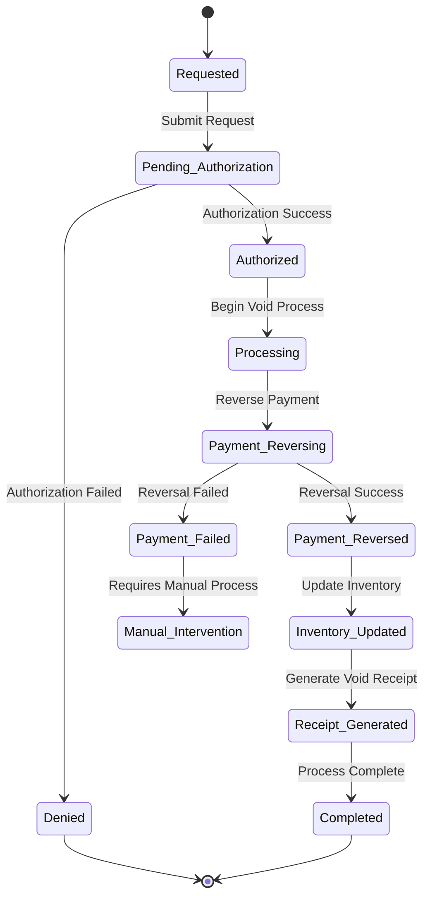

# Void Transaction System Design

## Table of Contents
1. [Overview](#overview)
2. [Void Transaction Types](#void-transaction-types)
3. [Authorization and Security](#authorization-and-security)
4. [Void Processing Workflow](#void-processing-workflow)
5. [Data Model and Storage](#data-model-and-storage)
6. [User Interface Design](#user-interface-design)
7. [Financial Impact Management](#financial-impact-management)
8. [Audit Trail and Compliance](#audit-trail-and-compliance)
9. [Integration Points](#integration-points)
10. [Implementation Details](#implementation-details)

## Overview

The Void Transaction System provides comprehensive transaction cancellation and reversal capabilities for the POS system. It handles various void scenarios while maintaining strict security controls, complete audit trails, and proper financial reconciliation. The system ensures compliance with Thai tax regulations and integrates seamlessly with existing transaction and payment processing systems.

### Key Features
- **Multiple Void Types**: Full transaction voids, partial refunds, and line item removals
- **Authorization Levels**: Role-based void permissions with manager overrides
- **Payment Reversal**: Automatic payment reversals for card and digital transactions
- **Audit Compliance**: Complete audit trails for regulatory compliance
- **Financial Reconciliation**: Proper handling of void impacts on daily reports
- **Receipt Management**: Void receipt generation and reprinting

### Business Requirements
Based on current operations and regulatory needs:
- **Manager Authorization**: High-value voids require manager approval
- **Reason Tracking**: Mandatory void reasons for audit purposes
- **Time Limits**: Configurable time windows for transaction voids
- **Payment Reversal**: Automatic reversal for electronic payments
- **Tax Compliance**: Proper VAT handling for void transactions

## Void Transaction Types

### 1. Full Transaction Void

Complete cancellation of an entire transaction before or after payment completion.

```typescript
interface FullTransactionVoid {
  originalTransactionId: string;
  voidReason: VoidReason;
  authorizedBy: string;
  voided_at: Date;
  
  // Original transaction data
  originalAmount: number;
  originalPaymentMethod: string;
  originalItems: TransactionItem[];
  
  // Reversal information
  paymentReversalRequired: boolean;
  paymentReversalStatus: 'pending' | 'processing' | 'completed' | 'failed';
  paymentReversalReference?: string;
}
```

**Use Cases:**
- Customer decides not to purchase after payment
- Wrong customer charged by mistake
- Technical error during transaction processing
- Duplicate transactions
- System malfunction requiring transaction cancellation

### 2. Partial Refund

Selective removal of items from a completed transaction with partial payment reversal.

```typescript
interface PartialRefund {
  originalTransactionId: string;
  refundedItems: RefundItem[];
  refundAmount: number;
  refundReason: RefundReason;
  authorizedBy: string;
  processedAt: Date;
  
  // Financial calculations
  refundSubtotal: number;
  refundVATAmount: number;
  refundTotal: number;
  
  // Payment handling
  refundMethod: 'original_payment' | 'cash' | 'store_credit';
  refundReference?: string;
}

interface RefundItem {
  originalItemId: string;
  productId: string;
  quantityRefunded: number;
  unitPrice: number;
  refundAmount: number;
  reason: string;
}
```

**Use Cases:**
- Customer returns specific items
- Wrong items added to order
- Food/beverage quality issues
- Service-related problems
- Pricing errors on specific items

### 3. Line Item Void

Removal of individual items from an active order before payment completion.

```typescript
interface LineItemVoid {
  orderId: string;
  voidedItems: VoidedItem[];
  voidReason: string;
  authorizedBy: string;
  voidedAt: Date;
  
  // Order adjustments
  orderSubtotalAdjustment: number;
  orderVATAdjustment: number;
  orderTotalAdjustment: number;
}

interface VoidedItem {
  orderItemId: string;
  productId: string;
  quantityVoided: number;
  priceAdjustment: number;
  reason: string;
}
```

**Use Cases:**
- Customer changes mind before payment
- Kitchen unable to fulfill order item
- Incorrect item added by staff
- Pricing corrections
- Inventory unavailability

## Authorization and Security

### Permission Levels

```typescript
enum VoidPermissionLevel {
  STAFF = 'staff',           // Basic voids up to configurable limit
  SUPERVISOR = 'supervisor', // Mid-range voids and overrides
  MANAGER = 'manager',       // High-value voids and emergency overrides
  ADMIN = 'admin'           // System-level voids and maintenance
}

interface VoidAuthorizationRules {
  staffMaxAmount: number;           // Maximum void amount for staff
  supervisorMaxAmount: number;      // Maximum void amount for supervisors
  managerMaxAmount: number;         // Maximum void amount for managers
  requiresSecondApproval: number;   // Amount requiring dual approval
  maxVoidAge: number;               // Maximum age of transaction for void (hours)
  requiresReason: boolean;          // Mandatory reason requirement
  requiresCustomerPresent: boolean; // Customer presence requirement
}

const DEFAULT_VOID_RULES: VoidAuthorizationRules = {
  staffMaxAmount: 500,        // ฿500 maximum
  supervisorMaxAmount: 2000,  // ฿2,000 maximum
  managerMaxAmount: 10000,    // ฿10,000 maximum
  requiresSecondApproval: 5000, // ฿5,000+ requires dual approval
  maxVoidAge: 24,             // 24 hours maximum
  requiresReason: true,
  requiresCustomerPresent: false
};
```

### Authorization Workflow

```typescript
class VoidAuthorizationService {
  async authorizeVoid(
    voidRequest: VoidRequest,
    currentUser: StaffMember
  ): Promise<AuthorizationResult> {
    // Check basic permissions
    const permissionCheck = await this.checkVoidPermissions(
      currentUser,
      voidRequest.amount
    );
    
    if (!permissionCheck.authorized) {
      return {
        authorized: false,
        reason: permissionCheck.reason,
        requiresManagerOverride: true
      };
    }
    
    // Check transaction age
    const ageCheck = await this.checkTransactionAge(voidRequest.originalTransactionId);
    if (!ageCheck.valid) {
      return {
        authorized: false,
        reason: 'Transaction too old for void',
        requiresManagerOverride: true
      };
    }
    
    // Check if dual approval required
    if (voidRequest.amount >= this.rules.requiresSecondApproval) {
      return {
        authorized: false,
        reason: 'Requires dual approval',
        requiresSecondApproval: true
      };
    }
    
    return {
      authorized: true,
      authorizationLevel: currentUser.permissionLevel,
      authorizationToken: await this.generateAuthToken(voidRequest, currentUser)
    };
  }
  
  async requestManagerOverride(
    voidRequest: VoidRequest,
    requestingStaff: StaffMember,
    managerCredentials: ManagerCredentials
  ): Promise<OverrideResult> {
    // Validate manager credentials
    const manager = await this.validateManagerCredentials(managerCredentials);
    if (!manager) {
      return { success: false, error: 'Invalid manager credentials' };
    }
    
    // Check manager authorization level
    if (!await this.canManagerAuthorizeVoid(manager, voidRequest)) {
      return { success: false, error: 'Manager lacks sufficient authorization' };
    }
    
    // Create override record
    const override = await this.createManagerOverride({
      voidRequestId: voidRequest.id,
      requestingStaffId: requestingStaff.id,
      approvingManagerId: manager.id,
      reason: voidRequest.reason,
      amount: voidRequest.amount,
      timestamp: new Date()
    });
    
    return {
      success: true,
      overrideId: override.id,
      authorizationToken: await this.generateAuthToken(voidRequest, manager)
    };
  }
}
```

### Security Controls

```typescript
interface VoidSecurityControls {
  requiresPIN: boolean;
  requiresDigitalSignature: boolean;
  requiresCustomerConsent: boolean;
  requiresPhotoEvidence: boolean;
  ipAddressLogging: boolean;
  deviceFingerprinting: boolean;
  biometricVerification: boolean;
}

class VoidSecurityService {
  async validateVoidSecurity(
    voidRequest: VoidRequest,
    securityData: VoidSecurityData
  ): Promise<SecurityValidationResult> {
    const validations: SecurityValidation[] = [];
    
    // PIN verification
    if (this.controls.requiresPIN) {
      const pinValid = await this.validatePIN(
        securityData.staffId,
        securityData.pin
      );
      validations.push({
        type: 'pin_verification',
        passed: pinValid,
        timestamp: new Date()
      });
    }
    
    // Digital signature verification
    if (this.controls.requiresDigitalSignature) {
      const signatureValid = await this.validateDigitalSignature(
        securityData.digitalSignature,
        voidRequest
      );
      validations.push({
        type: 'digital_signature',
        passed: signatureValid,
        timestamp: new Date()
      });
    }
    
    // Customer consent verification
    if (this.controls.requiresCustomerConsent) {
      const consentValid = this.validateCustomerConsent(securityData.customerConsent);
      validations.push({
        type: 'customer_consent',
        passed: consentValid,
        timestamp: new Date()
      });
    }
    
    const allPassed = validations.every(v => v.passed);
    
    return {
      passed: allPassed,
      validations,
      securityScore: this.calculateSecurityScore(validations),
      timestamp: new Date()
    };
  }
}
```

## Void Processing Workflow

### Void State Machine



### Processing Pipeline

```typescript
class VoidProcessingPipeline {
  async processVoid(voidRequest: VoidRequest): Promise<VoidResult> {
    const pipeline = [
      this.validateVoidRequest,
      this.authorizeVoid,
      this.lockTransaction,
      this.processPaymentReversal,
      this.updateInventory,
      this.updateFinancialRecords,
      this.generateAuditTrail,
      this.generateVoidReceipt,
      this.notifyStakeholders,
      this.unlockTransaction
    ];
    
    let currentState = { ...voidRequest };
    
    try {
      for (const step of pipeline) {
        currentState = await step(currentState);
        await this.updateVoidStatus(voidRequest.id, currentState.status);
      }
      
      return {
        success: true,
        voidId: currentState.id,
        status: 'completed',
        completedAt: new Date()
      };
    } catch (error) {
      await this.handleVoidError(voidRequest.id, error);
      return {
        success: false,
        error: error.message,
        status: 'failed',
        failedAt: new Date()
      };
    }
  }
  
  private async processPaymentReversal(
    voidState: VoidState
  ): Promise<VoidState> {
    const originalTransaction = voidState.originalTransaction;
    
    if (originalTransaction.paymentMethod === 'cash') {
      // Cash transactions require manual refund
      return {
        ...voidState,
        paymentReversalStatus: 'manual_required',
        cashRefundAmount: originalTransaction.amount
      };
    }
    
    // Process electronic payment reversal
    const reversalResult = await this.paymentProcessor.reversePayment({
      originalTransactionId: originalTransaction.paymentTransactionId,
      amount: voidState.refundAmount || originalTransaction.amount,
      reason: voidState.reason
    });
    
    return {
      ...voidState,
      paymentReversalStatus: reversalResult.success ? 'completed' : 'failed',
      paymentReversalReference: reversalResult.reversalId,
      paymentReversalError: reversalResult.error
    };
  }
}
```

## Data Model and Storage

### Void Transactions Schema

```sql
-- Main void transactions table
CREATE TABLE pos.void_transactions (
    id UUID PRIMARY KEY DEFAULT gen_random_uuid(),
    void_type VARCHAR(20) NOT NULL CHECK (void_type IN ('full_void', 'partial_refund', 'line_item_void')),
    
    -- Original transaction reference
    original_transaction_id UUID NOT NULL,
    original_receipt_number VARCHAR(50) NOT NULL,
    original_amount DECIMAL(10,2) NOT NULL,
    
    -- Void details
    void_amount DECIMAL(10,2) NOT NULL,
    void_reason VARCHAR(100) NOT NULL,
    void_reason_details TEXT,
    
    -- Authorization
    authorized_by_staff_id UUID NOT NULL REFERENCES backoffice.staff(id),
    authorization_level VARCHAR(20) NOT NULL,
    authorization_token VARCHAR(200),
    manager_override_id UUID REFERENCES pos.manager_overrides(id),
    
    -- Processing status
    status VARCHAR(20) NOT NULL DEFAULT 'pending' 
        CHECK (status IN ('pending', 'authorized', 'processing', 'completed', 'failed', 'cancelled')),
    
    -- Payment reversal
    payment_reversal_required BOOLEAN NOT NULL DEFAULT false,
    payment_reversal_status VARCHAR(20) DEFAULT 'not_required',
    payment_reversal_reference VARCHAR(200),
    payment_reversal_error TEXT,
    
    -- Financial impact
    subtotal_adjustment DECIMAL(10,2) NOT NULL DEFAULT 0,
    vat_adjustment DECIMAL(10,2) NOT NULL DEFAULT 0,
    total_adjustment DECIMAL(10,2) NOT NULL DEFAULT 0,
    
    -- Audit and compliance
    customer_present BOOLEAN DEFAULT false,
    customer_consent_obtained BOOLEAN DEFAULT false,
    photo_evidence_url VARCHAR(500),
    digital_signature BYTEA,
    
    -- Timestamps
    requested_at TIMESTAMPTZ DEFAULT NOW(),
    authorized_at TIMESTAMPTZ,
    processed_at TIMESTAMPTZ,
    completed_at TIMESTAMPTZ,
    
    -- Audit fields
    created_by_staff_id UUID REFERENCES backoffice.staff(id),
    ip_address INET,
    device_fingerprint VARCHAR(200),
    
    created_at TIMESTAMPTZ DEFAULT NOW(),
    updated_at TIMESTAMPTZ DEFAULT NOW()
);

-- Void transaction items (for partial voids/refunds)
CREATE TABLE pos.void_transaction_items (
    id UUID PRIMARY KEY DEFAULT gen_random_uuid(),
    void_transaction_id UUID NOT NULL REFERENCES pos.void_transactions(id) ON DELETE CASCADE,
    
    -- Original item reference
    original_item_id UUID NOT NULL,
    product_id UUID NOT NULL REFERENCES products.products(id),
    
    -- Void details
    quantity_voided INTEGER NOT NULL CHECK (quantity_voided > 0),
    unit_price DECIMAL(10,2) NOT NULL,
    total_voided DECIMAL(10,2) NOT NULL,
    vat_voided DECIMAL(10,2) NOT NULL DEFAULT 0,
    
    -- Reason
    item_void_reason VARCHAR(200),
    
    created_at TIMESTAMPTZ DEFAULT NOW()
);

-- Manager overrides
CREATE TABLE pos.manager_overrides (
    id UUID PRIMARY KEY DEFAULT gen_random_uuid(),
    override_type VARCHAR(20) NOT NULL,
    
    -- Authorization details
    requesting_staff_id UUID NOT NULL REFERENCES backoffice.staff(id),
    approving_manager_id UUID NOT NULL REFERENCES backoffice.staff(id),
    
    -- Request details
    request_reason TEXT NOT NULL,
    override_reason TEXT,
    amount_involved DECIMAL(10,2),
    
    -- Security
    manager_pin_hash VARCHAR(200),
    manager_signature BYTEA,
    
    -- Status
    status VARCHAR(20) DEFAULT 'pending' CHECK (status IN ('pending', 'approved', 'denied')),
    
    -- Timestamps
    requested_at TIMESTAMPTZ DEFAULT NOW(),
    resolved_at TIMESTAMPTZ,
    
    created_at TIMESTAMPTZ DEFAULT NOW()
);

-- Indexes for performance
CREATE INDEX idx_void_transactions_original ON pos.void_transactions(original_transaction_id);
CREATE INDEX idx_void_transactions_status ON pos.void_transactions(status);
CREATE INDEX idx_void_transactions_date ON pos.void_transactions(requested_at);
CREATE INDEX idx_void_transaction_items_void ON pos.void_transaction_items(void_transaction_id);
CREATE INDEX idx_manager_overrides_staff ON pos.manager_overrides(requesting_staff_id, approving_manager_id);
```

### Data Integration with pos.lengolf_sales

```typescript
class VoidDataIntegrationService {
  async integrateVoidWithSalesData(
    voidTransaction: VoidTransaction
  ): Promise<void> {
    // Create void record in lengolf_sales
    const voidSalesRecord = this.mapVoidToSalesRecord(voidTransaction);
    
    await this.supabase
      .from('lengolf_sales')
      .insert(voidSalesRecord);
    
    // Update original transaction status
    await this.supabase
      .from('lengolf_sales')
      .update({ 
        is_voided: true,
        void_transaction_id: voidTransaction.id,
        void_date: voidTransaction.completedAt
      })
      .eq('transaction_id', voidTransaction.originalTransactionId);
    
    // Update daily summary if necessary
    await this.updateDailySummary(voidTransaction);
  }
  
  private mapVoidToSalesRecord(void_transaction: VoidTransaction): LengolfSalesRecord {
    return {
      // Identifier fields
      bill_no: `VOID-${void_transaction.originalReceiptNumber}`,
      transaction_id: void_transaction.id,
      
      // Amount fields (negative for voids)
      subtotal: -void_transaction.subtotalAdjustment,
      vat_amount: -void_transaction.vatAdjustment,
      total_amount: -void_transaction.totalAdjustment,
      
      // Transaction details
      payment_method: 'VOID',
      staff_id: void_transaction.authorizedByStaffId,
      
      // Void-specific fields
      transaction_type: 'void',
      original_transaction_id: void_transaction.originalTransactionId,
      void_reason: void_transaction.voidReason,
      
      // Timestamps
      transaction_date: void_transaction.completedAt,
      created_at: new Date()
    };
  }
}
```

## User Interface Design

### Void Transaction Initiation

```tsx
interface VoidTransactionModalProps {
  transaction: TransactionSummary;
  onVoidSubmit: (voidRequest: VoidRequest) => void;
  onCancel: () => void;
}

const VoidTransactionModal: React.FC<VoidTransactionModalProps> = ({
  transaction,
  onVoidSubmit,
  onCancel
}) => {
  const [voidType, setVoidType] = useState<VoidType>('full_void');
  const [selectedItems, setSelectedItems] = useState<string[]>([]);
  const [voidReason, setVoidReason] = useState('');
  const [requiresManagerAuth, setRequiresManagerAuth] = useState(false);
  
  const voidAmount = useMemo(() => {
    if (voidType === 'full_void') {
      return transaction.total;
    }
    
    return selectedItems.reduce((sum, itemId) => {
      const item = transaction.items.find(i => i.id === itemId);
      return sum + (item?.total || 0);
    }, 0);
  }, [voidType, selectedItems, transaction]);
  
  useEffect(() => {
    // Check if manager authorization required
    const currentUser = useCurrentUser();
    const authCheck = checkVoidAuthorization(currentUser, voidAmount);
    setRequiresManagerAuth(!authCheck.authorized);
  }, [voidAmount]);
  
  return (
    <Dialog open onClose={onCancel} maxWidth="md" fullWidth>
      <DialogTitle>
        Void Transaction - {transaction.receiptNumber}
      </DialogTitle>
      
      <DialogContent>
        <TransactionSummaryDisplay transaction={transaction} />
        
        <VoidTypeSelector
          voidType={voidType}
          onChange={setVoidType}
          transaction={transaction}
        />
        
        {voidType === 'partial_refund' && (
          <ItemSelectionGrid
            items={transaction.items}
            selectedItems={selectedItems}
            onSelectionChange={setSelectedItems}
          />
        )}
        
        <VoidReasonSelector
          reason={voidReason}
          onChange={setVoidReason}
          required
        />
        
        <VoidSummaryPanel
          voidAmount={voidAmount}
          originalAmount={transaction.total}
          paymentMethod={transaction.paymentMethod}
        />
        
        {requiresManagerAuth && (
          <ManagerAuthorizationPanel
            amount={voidAmount}
            reason={voidReason}
            onAuthorizationComplete={(authToken) => {
              setRequiresManagerAuth(false);
            }}
          />
        )}
      </DialogContent>
      
      <DialogActions>
        <CancelButton onClick={onCancel} />
        <VoidButton 
          onClick={() => onVoidSubmit({
            type: voidType,
            originalTransactionId: transaction.id,
            amount: voidAmount,
            selectedItems,
            reason: voidReason
          })}
          disabled={!voidReason || requiresManagerAuth}
          variant="destructive"
        />
      </DialogActions>
    </Dialog>
  );
};
```

### Manager Authorization Interface

```tsx
const ManagerAuthorizationPanel: React.FC<ManagerAuthProps> = ({
  amount,
  reason,
  onAuthorizationComplete
}) => {
  const [managerPin, setManagerPin] = useState('');
  const [managerId, setManagerId] = useState('');
  const [isAuthenticating, setIsAuthenticating] = useState(false);
  
  const handleManagerAuth = async () => {
    setIsAuthenticating(true);
    
    try {
      const authResult = await authenticateManager({
        managerId,
        pin: managerPin,
        voidAmount: amount,
        voidReason: reason
      });
      
      if (authResult.success) {
        onAuthorizationComplete(authResult.authToken);
        toast.success('Manager authorization successful');
      } else {
        toast.error('Manager authorization failed');
      }
    } catch (error) {
      toast.error('Authentication error');
    } finally {
      setIsAuthenticating(false);
    }
  };
  
  return (
    <Card className="border-yellow-200 bg-yellow-50">
      <CardHeader>
        <CardTitle className="text-yellow-800">
          Manager Authorization Required
        </CardTitle>
        <CardDescription>
          Void amount (฿{amount.toLocaleString()}) requires manager approval
        </CardDescription>
      </CardHeader>
      
      <CardContent className="space-y-4">
        <ManagerSelect
          value={managerId}
          onChange={setManagerId}
          required
        />
        
        <PINInput
          value={managerPin}
          onChange={setManagerPin}
          placeholder="Manager PIN"
          secureEntry
          required
        />
        
        <Button
          onClick={handleManagerAuth}
          disabled={!managerId || !managerPin || isAuthenticating}
          className="w-full"
        >
          {isAuthenticating ? 'Authenticating...' : 'Authorize Void'}
        </Button>
      </CardContent>
    </Card>
  );
};
```

### Void Status Tracking

```tsx
const VoidStatusTracker: React.FC<VoidStatusProps> = ({ voidId }) => {
  const { data: voidStatus, isLoading } = useVoidStatus(voidId);
  
  if (isLoading) {
    return <LoadingSpinner />;
  }
  
  const steps = [
    { key: 'requested', label: 'Void Requested', status: 'completed' },
    { key: 'authorized', label: 'Authorization', status: getStepStatus('authorized') },
    { key: 'payment_reversal', label: 'Payment Reversal', status: getStepStatus('payment_reversal') },
    { key: 'receipt_generation', label: 'Receipt Generation', status: getStepStatus('receipt_generation') },
    { key: 'completed', label: 'Completed', status: getStepStatus('completed') }
  ];
  
  return (
    <Card>
      <CardHeader>
        <CardTitle>Void Processing Status</CardTitle>
      </CardHeader>
      
      <CardContent>
        <ProcessingSteps steps={steps} />
        
        {voidStatus?.error && (
          <ErrorAlert 
            message={voidStatus.error}
            onRetry={() => retryVoidProcessing(voidId)}
          />
        )}
        
        {voidStatus?.paymentReversalRequired && (
          <PaymentReversalStatus 
            status={voidStatus.paymentReversalStatus}
            reference={voidStatus.paymentReversalReference}
          />
        )}
      </CardContent>
    </Card>
  );
};
```

## Financial Impact Management

### Daily Reconciliation Impact

```typescript
class VoidFinancialImpactService {
  async calculateDailyVoidImpact(date: Date): Promise<VoidImpactSummary> {
    const voids = await this.getVoidsForDate(date);
    
    const impact = {
      totalVoidCount: voids.length,
      totalVoidAmount: 0,
      vatImpact: 0,
      paymentMethodImpact: new Map<string, number>(),
      hourlyDistribution: new Map<number, number>(),
      reasonDistribution: new Map<string, number>()
    };
    
    for (const void_transaction of voids) {
      impact.totalVoidAmount += void_transaction.voidAmount;
      impact.vatImpact += void_transaction.vatAdjustment;
      
      // Payment method impact
      const currentAmount = impact.paymentMethodImpact.get(void_transaction.originalPaymentMethod) || 0;
      impact.paymentMethodImpact.set(
        void_transaction.originalPaymentMethod,
        currentAmount + void_transaction.voidAmount
      );
      
      // Hourly distribution
      const hour = void_transaction.processedAt.getHours();
      const currentHourlyAmount = impact.hourlyDistribution.get(hour) || 0;
      impact.hourlyDistribution.set(hour, currentHourlyAmount + void_transaction.voidAmount);
      
      // Reason distribution
      const currentReasonCount = impact.reasonDistribution.get(void_transaction.voidReason) || 0;
      impact.reasonDistribution.set(void_transaction.voidReason, currentReasonCount + 1);
    }
    
    return impact;
  }
  
  async generateVoidReconciliationReport(
    startDate: Date,
    endDate: Date
  ): Promise<VoidReconciliationReport> {
    const voids = await this.getVoidsForPeriod(startDate, endDate);
    
    return {
      period: { startDate, endDate },
      summary: {
        totalVoids: voids.length,
        totalVoidAmount: voids.reduce((sum, v) => sum + v.voidAmount, 0),
        averageVoidAmount: voids.length > 0 ? 
          voids.reduce((sum, v) => sum + v.voidAmount, 0) / voids.length : 0,
        largestVoid: Math.max(...voids.map(v => v.voidAmount)),
        smallestVoid: Math.min(...voids.map(v => v.voidAmount))
      },
      paymentMethodBreakdown: this.analyzePaymentMethodVoids(voids),
      reasonAnalysis: this.analyzeVoidReasons(voids),
      staffPerformance: this.analyzeStaffVoidPatterns(voids),
      timePatterns: this.analyzeTimePatterns(voids),
      complianceMetrics: this.analyzeComplianceMetrics(voids)
    };
  }
}
```

### Tax Compliance for Voids

```typescript
class VoidTaxComplianceService {
  async processVoidTaxImpact(voidTransaction: VoidTransaction): Promise<TaxImpactResult> {
    const originalTransaction = await this.getOriginalTransaction(voidTransaction.originalTransactionId);
    
    // Calculate VAT impact
    const vatImpact = this.calculateVATImpact(originalTransaction, voidTransaction);
    
    // Update tax records
    await this.updateTaxRecords(vatImpact);
    
    // Generate tax compliance documentation
    const complianceDoc = await this.generateTaxComplianceDocument(voidTransaction, vatImpact);
    
    return {
      vatImpact,
      complianceDocumentId: complianceDoc.id,
      taxReportingRequired: vatImpact.amount > 2000, // Thai tax requirement
      submissionDeadline: this.calculateSubmissionDeadline(voidTransaction.processedAt)
    };
  }
  
  private calculateVATImpact(
    originalTransaction: Transaction,
    voidTransaction: VoidTransaction
  ): VATImpact {
    const originalVATAmount = originalTransaction.vatAmount;
    const voidVATAmount = voidTransaction.vatAdjustment;
    
    return {
      originalVAT: originalVATAmount,
      voidVAT: voidVATAmount,
      netVATImpact: originalVATAmount - Math.abs(voidVATAmount),
      vatRate: originalTransaction.vatRate,
      reportingPeriod: this.getCurrentReportingPeriod(),
      requiresAmendment: Math.abs(voidVATAmount) > 2000
    };
  }
}
```

## Audit Trail and Compliance

### Comprehensive Audit Logging

```typescript
interface VoidAuditEntry {
  id: string;
  voidTransactionId: string;
  eventType: VoidAuditEventType;
  timestamp: Date;
  
  // Actor information
  staffId: string;
  staffName: string;
  staffRole: string;
  
  // Technical details
  ipAddress: string;
  deviceFingerprint: string;
  userAgent: string;
  
  // Business context
  previousState?: any;
  newState?: any;
  changes: AuditChange[];
  
  // Compliance data
  businessJustification: string;
  customerConsent?: boolean;
  managerApproval?: string;
  
  // Data integrity
  checksum: string;
  digitalSignature: string;
}

enum VoidAuditEventType {
  VOID_REQUESTED = 'void_requested',
  AUTHORIZATION_REQUIRED = 'authorization_required',
  MANAGER_OVERRIDE = 'manager_override',
  PAYMENT_REVERSED = 'payment_reversed',
  RECEIPT_GENERATED = 'receipt_generated',
  VOID_COMPLETED = 'void_completed',
  VOID_FAILED = 'void_failed',
  AUDIT_ACCESS = 'audit_access'
}

class VoidAuditService {
  async logVoidEvent(
    voidId: string,
    eventType: VoidAuditEventType,
    context: AuditContext
  ): Promise<void> {
    const auditEntry: VoidAuditEntry = {
      id: generateId(),
      voidTransactionId: voidId,
      eventType,
      timestamp: new Date(),
      
      staffId: context.staffId,
      staffName: context.staffName,
      staffRole: context.staffRole,
      
      ipAddress: context.ipAddress,
      deviceFingerprint: context.deviceFingerprint,
      userAgent: context.userAgent,
      
      previousState: context.previousState,
      newState: context.newState,
      changes: this.calculateChanges(context.previousState, context.newState),
      
      businessJustification: context.businessJustification,
      customerConsent: context.customerConsent,
      managerApproval: context.managerApproval,
      
      checksum: this.calculateChecksum(context),
      digitalSignature: await this.generateDigitalSignature(context)
    };
    
    // Store in immutable audit log
    await this.storeAuditEntry(auditEntry);
    
    // Send to external audit system if required
    if (this.isHighValueVoid(context)) {
      await this.sendToExternalAuditSystem(auditEntry);
    }
  }
  
  async generateAuditReport(
    startDate: Date,
    endDate: Date,
    filters?: AuditReportFilters
  ): Promise<VoidAuditReport> {
    const auditEntries = await this.getAuditEntries(startDate, endDate, filters);
    
    return {
      period: { startDate, endDate },
      totalEvents: auditEntries.length,
      eventsByType: this.groupByEventType(auditEntries),
      staffActivity: this.analyzeStaffActivity(auditEntries),
      complianceIssues: this.identifyComplianceIssues(auditEntries),
      securityAlerts: this.identifySecurityAlerts(auditEntries),
      integrityVerification: await this.verifyDataIntegrity(auditEntries)
    };
  }
}
```

### Regulatory Compliance

```typescript
class VoidComplianceService {
  async ensureRegulatoryCompliance(
    voidTransaction: VoidTransaction
  ): Promise<ComplianceResult> {
    const complianceChecks = [
      this.checkThaiTaxCompliance,
      this.checkDataRetentionCompliance,
      this.checkAuditTrailCompliance,
      this.checkCustomerRightsCompliance,
      this.checkFinancialReportingCompliance
    ];
    
    const results = await Promise.all(
      complianceChecks.map(check => check(voidTransaction))
    );
    
    const violations = results.filter(result => !result.compliant);
    
    if (violations.length > 0) {
      await this.handleComplianceViolations(voidTransaction.id, violations);
    }
    
    return {
      compliant: violations.length === 0,
      violations,
      complianceScore: this.calculateComplianceScore(results),
      remedyActions: violations.flatMap(v => v.remedyActions)
    };
  }
  
  private async checkThaiTaxCompliance(
    voidTransaction: VoidTransaction
  ): Promise<ComplianceCheck> {
    // Check VAT handling
    const vatCompliant = await this.verifyVATHandling(voidTransaction);
    
    // Check receipt requirements
    const receiptCompliant = await this.verifyReceiptRequirements(voidTransaction);
    
    // Check reporting requirements
    const reportingCompliant = await this.verifyReportingRequirements(voidTransaction);
    
    return {
      category: 'tax_compliance',
      compliant: vatCompliant && receiptCompliant && reportingCompliant,
      details: {
        vatHandling: vatCompliant,
        receiptRequirements: receiptCompliant,
        reportingRequirements: reportingCompliant
      },
      remedyActions: []
    };
  }
}
```

## Implementation Details

### API Endpoints

```typescript
export class VoidTransactionController {
  // Initiate void transaction
  async POST_initiateVoid(req: InitiateVoidRequest): Promise<VoidResponse> {
    const { originalTransactionId, voidType, amount, reason, selectedItems } = req.body;
    
    try {
      // Validate void request
      const validation = await this.validateVoidRequest(req.body);
      if (!validation.isValid) {
        return { success: false, error: validation.error };
      }
      
      // Check authorization
      const authorization = await this.checkVoidAuthorization(
        req.user,
        amount
      );
      
      if (!authorization.authorized) {
        return {
          success: false,
          error: authorization.reason,
          requiresManagerOverride: authorization.requiresManagerOverride
        };
      }
      
      // Create void transaction
      const voidTransaction = await this.createVoidTransaction({
        originalTransactionId,
        voidType,
        amount,
        reason,
        selectedItems,
        authorizedBy: req.user.id,
        status: 'authorized'
      });
      
      // Queue for processing
      await this.queueVoidProcessing(voidTransaction.id);
      
      return {
        success: true,
        voidId: voidTransaction.id,
        status: 'processing'
      };
    } catch (error) {
      return { success: false, error: error.message };
    }
  }
  
  // Request manager override
  async POST_requestManagerOverride(req: ManagerOverrideRequest): Promise<OverrideResponse> {
    const { voidRequestId, managerCredentials, overrideReason } = req.body;
    
    try {
      const override = await this.voidAuthService.requestManagerOverride(
        voidRequestId,
        req.user,
        managerCredentials,
        overrideReason
      );
      
      if (override.success) {
        // Continue with void processing
        await this.queueVoidProcessing(voidRequestId);
      }
      
      return override;
    } catch (error) {
      return { success: false, error: error.message };
    }
  }
  
  // Get void status
  async GET_voidStatus(req: VoidStatusRequest): Promise<VoidStatusResponse> {
    const { voidId } = req.params;
    
    const voidTransaction = await this.getVoidTransaction(voidId);
    if (!voidTransaction) {
      return { success: false, error: 'Void transaction not found' };
    }
    
    return {
      success: true,
      status: voidTransaction.status,
      progress: this.calculateProgress(voidTransaction),
      details: {
        paymentReversalStatus: voidTransaction.paymentReversalStatus,
        receiptGenerated: !!voidTransaction.voidReceiptNumber,
        auditTrailComplete: await this.isAuditTrailComplete(voidId)
      }
    };
  }
}
```

### Configuration Management

```typescript
interface VoidSystemConfig {
  authorization: {
    staffMaxAmount: number;
    supervisorMaxAmount: number;
    managerMaxAmount: number;
    requiresSecondApproval: number;
    maxVoidAge: number;
  };
  
  security: {
    requiresPIN: boolean;
    requiresCustomerConsent: boolean;
    requiresPhotoEvidence: boolean;
    biometricVerification: boolean;
  };
  
  compliance: {
    auditRetentionYears: number;
    externalAuditingRequired: boolean;
    complianceReportingEnabled: boolean;
    dataEncryptionRequired: boolean;
  };
  
  processing: {
    automaticPaymentReversal: boolean;
    receiptGenerationEnabled: boolean;
    inventoryUpdateEnabled: boolean;
    notificationEnabled: boolean;
  };
}

class VoidConfigManager {
  async loadConfig(): Promise<VoidSystemConfig> {
    const config = await this.getConfigFromDatabase();
    return { ...this.getDefaultConfig(), ...config };
  }
  
  async updateConfig(updates: Partial<VoidSystemConfig>): Promise<void> {
    const currentConfig = await this.loadConfig();
    const newConfig = { ...currentConfig, ...updates };
    
    // Validate configuration
    const validation = await this.validateConfig(newConfig);
    if (!validation.isValid) {
      throw new Error(`Invalid configuration: ${validation.errors.join(', ')}`);
    }
    
    // Save to database
    await this.saveConfigToDatabase(newConfig);
    
    // Invalidate caches
    await this.invalidateConfigCache();
  }
}
```

---

## Implementation Roadmap

### Phase 1: Core Void Functionality (Week 1-2)
- [ ] Basic void transaction data model
- [ ] Simple authorization system
- [ ] Full transaction void processing
- [ ] Basic audit logging

### Phase 2: Enhanced Features (Week 3-4)
- [ ] Partial refund capabilities
- [ ] Manager override system
- [ ] Payment reversal integration
- [ ] Void receipt generation

### Phase 3: Security & Compliance (Week 5-6)
- [ ] Advanced security controls
- [ ] Comprehensive audit trail
- [ ] Regulatory compliance features
- [ ] Data integrity verification

### Phase 4: Integration & Optimization (Week 7-8)
- [ ] POS system integration
- [ ] Financial reporting integration
- [ ] Performance optimization
- [ ] End-to-end testing

---

**Maintained by**: Lengolf Development Team  
**Last Updated**: July 14, 2025  
**Next Review**: August 2025