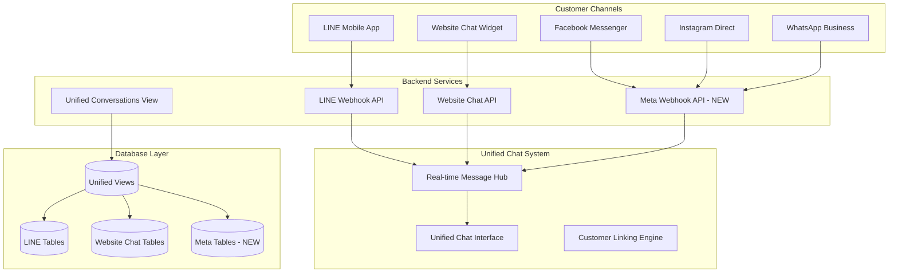

# Meta Platform Integration Guide

**Complete setup guide for Facebook, Instagram, and WhatsApp integration into the Unified Chat System**
*Created: September 2025*

## 🎯 Overview

This guide walks you through integrating Meta platforms (Facebook Messenger, Instagram Direct, WhatsApp Business) into your existing unified chat system. The integration follows the same architectural patterns as your LINE implementation for consistency and maintainability.

## 📋 Prerequisites

Before starting, ensure you have:
- ✅ Existing unified chat system with LINE and website support
- ✅ Meta Business account
- ✅ Facebook Developer account
- ✅ WhatsApp Business account (for WhatsApp integration)
- ✅ Instagram Business account (for Instagram integration)
- ✅ SSL certificate for webhook URLs (required by Meta)

## 🏗️ Architecture Overview

The Meta integration extends your existing unified chat system:



## 📦 Database Schema

The integration adds these new tables to your existing schema:

### Core Meta Tables
- `meta_users`: User profiles from all Meta platforms
- `meta_conversations`: Conversation management across platforms
- `meta_messages`: Message storage with platform-specific metadata
- `meta_webhook_logs`: Webhook event logging for debugging

### Updated Views
- `unified_conversations`: Extended to include Meta conversations
- `unified_messages`: Extended to include Meta messages

## 🚀 Step-by-Step Setup

### Step 1: Meta App Creation

1. **Create Facebook App**
   ```bash
   # Go to Facebook Developers Console
   https://developers.facebook.com/apps/create/

   # Choose "Business" as app type
   # Add your app name and contact email
   ```

2. **Add Required Products**
   - Messenger (for Facebook messaging)
   - Instagram (for Instagram Direct)
   - WhatsApp Business (for WhatsApp messaging)

### Step 2: Configure Environment Variables

Copy the example environment file and configure:

```bash
cp .env.meta.example .env.local
```

Add these variables to your `.env.local`:

```bash
# Meta App Configuration
META_APP_SECRET=your_meta_app_secret
META_WEBHOOK_VERIFY_TOKEN=your_custom_verify_token
META_PAGE_ACCESS_TOKEN=your_page_access_token

# WhatsApp Specific
META_WA_PHONE_NUMBER_ID=your_phone_number_id
```

### Step 3: Webhook Setup

1. **Configure Webhook URL**
   - Production: `https://your-domain.com/api/meta/webhook`
   - Development: `https://your-ngrok-url.ngrok.io/api/meta/webhook`

2. **Set Subscription Fields**
   - **Facebook/Instagram**: `messages`, `messaging_postbacks`, `message_reads`
   - **WhatsApp**: `messages`

3. **Verify Webhook**
   ```bash
   # Your webhook will receive a GET request for verification
   # The endpoint automatically handles this with your verify token
   ```

### Step 4: Platform-Specific Configuration

#### Facebook Messenger Setup

1. **Page Access Token**
   ```bash
   # Generate long-lived page access token
   # Go to: Graph API Explorer
   # Select your page and generate token with required permissions
   ```

2. **Permissions Required**
   - `pages_messaging`
   - `pages_read_engagement`

#### Instagram Direct Setup

1. **Connect Instagram Account**
   ```bash
   # In Facebook App settings
   # Connect your Instagram Business account
   # Same token works for both Facebook and Instagram
   ```

2. **Enable Instagram Messaging**
   - Go to Instagram settings
   - Enable "Allow access to messages"

#### WhatsApp Business Setup

1. **Business Verification**
   ```bash
   # Complete business verification process
   # This is required for WhatsApp Business API
   ```

2. **Phone Number Setup**
   ```bash
   # Add and verify your business phone number
   # Get the Phone Number ID for API calls
   ```

3. **Message Templates** (Optional)
   ```bash
   # Create message templates for notifications
   # Templates require approval for production use
   ```

### Step 5: Development Testing

1. **Start Development Server**
   ```bash
   npm run dev
   ```

2. **Expose Local Server** (for webhook testing)
   ```bash
   # Install ngrok
   npm install -g ngrok

   # Expose local server
   ngrok http 3000

   # Use the HTTPS URL for webhook configuration
   ```

3. **Test Webhook Reception**
   ```bash
   # Send a test message to your Facebook page
   # Check your server logs for webhook events
   ```

## 🔧 API Endpoints

### Send Message to Meta Platforms

```bash
POST /api/meta/send-message
Content-Type: application/json
Authorization: Bearer <your-dev-token>  # Development only

{
  "platformUserId": "user-platform-specific-id",
  "message": "Hello from staff!",
  "platform": "facebook|instagram|whatsapp"
}
```

### Webhook Endpoint

```bash
POST /api/meta/webhook
# Automatically receives and processes webhook events
# Handles all platforms (Facebook, Instagram, WhatsApp)
```

## 💬 Frontend Integration

The integration extends your existing unified chat interface:

### Channel Indicators
- 📘 Facebook (blue)
- 📷 Instagram (pink)
- 💬 WhatsApp (green)
- 📱 LINE (green) - existing
- 🌐 Website (blue) - existing

### Real-time Updates
Messages from Meta platforms appear instantly in your unified chat interface alongside LINE and website conversations.

## 🧪 Testing Your Integration

### 1. Webhook Testing Tools

**Meta Webhook Tester**
```bash
# Use Meta's official testing tool
https://developers.facebook.com/tools/webhooks/

# Test different event types:
# - Text messages
# - Image uploads
# - Postback events
```

### 2. Manual Testing

**Facebook Messenger**
1. Send message to your Facebook page
2. Check unified chat interface for new conversation
3. Reply from staff interface
4. Verify message appears in Messenger

**Instagram Direct**
1. Send DM to your Instagram business account
2. Verify appears in unified chat
3. Test bi-directional messaging

**WhatsApp Business**
1. Send WhatsApp to your business number
2. Check for conversation in unified interface
3. Test template messages (if configured)

### 3. Database Verification

```sql
-- Check Meta conversations are created
SELECT * FROM unified_conversations WHERE channel_type IN ('facebook', 'instagram', 'whatsapp');

-- Verify messages are stored
SELECT * FROM unified_messages WHERE channel_type IN ('facebook', 'instagram', 'whatsapp');

-- Check webhook logs
SELECT * FROM meta_webhook_logs ORDER BY created_at DESC LIMIT 10;
```

## 🚨 Troubleshooting

### Common Issues

**Webhook Not Receiving Events**
```bash
# Check webhook URL is HTTPS
# Verify webhook verification token matches
# Ensure app is not in development mode for production testing
```

**Message Sending Fails**
```bash
# Verify page access token has correct permissions
# Check if user has messaged your page first (required by Meta)
# Ensure rate limits aren't exceeded
```

**Messages Not Appearing in UI**
```bash
# Check real-time subscriptions are working
# Verify database triggers are functioning
# Check browser console for JavaScript errors
```

### Debug Mode

Enable debug mode for development:

```bash
# Add to your webhook request headers
X-Debug-Request: true

# This bypasses signature validation for testing
```

## 📊 Monitoring & Analytics

### Webhook Event Logs

Monitor webhook processing:

```sql
-- Check webhook success rates
SELECT
  platform,
  processing_status,
  COUNT(*) as event_count
FROM meta_webhook_logs
WHERE created_at > NOW() - INTERVAL '1 day'
GROUP BY platform, processing_status;
```

### Message Volume

Track message volume by platform:

```sql
-- Daily message counts by platform
SELECT
  DATE(created_at) as date,
  channel_type,
  sender_type,
  COUNT(*) as message_count
FROM unified_messages
WHERE channel_type IN ('facebook', 'instagram', 'whatsapp')
AND created_at > NOW() - INTERVAL '7 days'
GROUP BY date, channel_type, sender_type
ORDER BY date DESC;
```

## 🔒 Security Considerations

### Webhook Security
- ✅ Signature validation implemented (HMAC-SHA256)
- ✅ Environment variables for secrets
- ✅ Rate limiting protection
- ✅ Input validation for all webhook data

### Data Protection
- ✅ Customer data encrypted in database
- ✅ Secure token storage
- ✅ Audit trails for all messages
- ✅ GDPR compliance support

## 🚀 Production Deployment

### Pre-deployment Checklist
- [ ] All environment variables configured
- [ ] SSL certificate installed
- [ ] Webhook URLs updated to production domain
- [ ] Database migrations applied
- [ ] Meta app switched to production mode
- [ ] Webhook subscription verified

### Production Configuration
```bash
# Update webhook URLs in Meta app settings
Production Webhook: https://your-domain.com/api/meta/webhook

# Ensure environment variables are set
META_APP_SECRET=production_secret
META_PAGE_ACCESS_TOKEN=production_token
```

## 📚 Additional Resources

- **Meta for Developers**: https://developers.facebook.com/
- **WhatsApp Business API**: https://developers.facebook.com/docs/whatsapp
- **Instagram Basic Display**: https://developers.facebook.com/docs/instagram-basic-display-api
- **Messenger Platform**: https://developers.facebook.com/docs/messenger-platform

## 🎯 Next Steps

After successful integration:

1. **Monitor Performance**: Set up monitoring for webhook success rates
2. **User Training**: Train staff on multi-platform messaging
3. **Analytics**: Implement platform-specific analytics
4. **Automation**: Consider chatbot integration for common queries
5. **Templates**: Set up WhatsApp message templates for notifications

---

**Need Help?** Check the webhook logs in your database or enable debug mode for detailed error information.