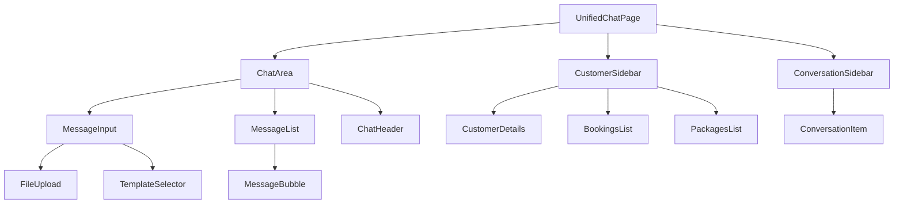
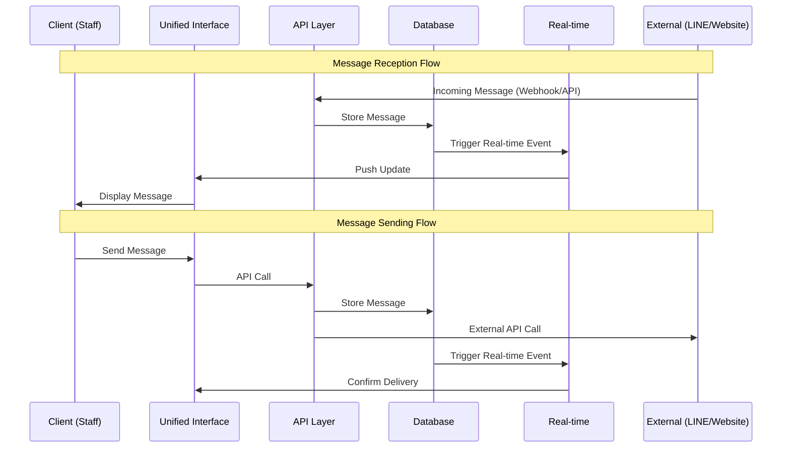

# Unified Chat System Architecture

**Technical Architecture and Component Documentation**
*Last Updated: January 2025*

## 🏗️ Architecture Overview

The Unified Chat System is built on a modern, scalable architecture that integrates multiple messaging platforms into a single interface. The system supports **LINE, Website Chat, Facebook Messenger, Instagram Direct, and WhatsApp Business** through a unified abstraction layer. It follows a microservices-inspired approach within a Next.js monolith, providing clear separation of concerns while maintaining development simplicity.

### Supported Channels
- **LINE** - Full messaging support with stickers, images, replies
- **Website Chat** - Live chat widget with file uploads
- **Facebook Messenger** - Messages, images, postbacks
- **Instagram Direct** - Direct messages and media
- **WhatsApp Business** - Messages, templates, media

## 📋 System Components

### 1. Frontend Architecture

#### Core Pages
```
app/staff/unified-chat/
├── page.tsx                    # Main unified chat interface
├── components/                 # Shared chat components
│   ├── ConversationSidebar.tsx # Conversation list management
│   ├── ChatArea.tsx           # Message display and input
│   ├── CustomerSidebar.tsx    # Customer information panel
│   └── MessageInput.tsx       # Message composition interface
├── hooks/                     # Business logic hooks
│   ├── useUnifiedChat.ts      # Main chat state management
│   ├── useChatOperations.ts   # Message operations
│   ├── useCustomerData.ts     # Customer data management
│   ├── useTypingIndicator.ts  # Real-time typing presence
│   └── usePanelState.ts       # UI state management
└── utils/                     # Utilities and types
    ├── chatTypes.ts           # TypeScript type definitions
    └── formatters.ts          # Data formatting utilities
```

#### Component Hierarchy


### 2. Backend Architecture

#### API Layer Structure
```
app/api/
├── conversations/             # Unified conversation endpoints
│   ├── route.ts              # GET: Fetch all conversations
│   └── website/              # Website-specific endpoints
│       ├── send-message/     # POST: Send website message
│       └── [id]/
│           └── mark-read/    # PUT: Mark conversation as read
├── line/                     # LINE-specific endpoints
│   ├── conversations/        # LINE conversation management
│   ├── messages/            # LINE message operations
│   ├── webhook/             # LINE webhook handler
│   └── templates/           # Message template system
└── unified/                 # Cross-channel operations
    ├── messages/            # Unified message operations
    └── customers/           # Customer linking operations
```

### 3. Database Architecture

#### Schema Organization
```
public (schema)
├── line_conversations        # LINE conversation management
├── line_messages            # LINE message storage
├── line_users              # LINE user profiles
├── web_chat_conversations  # Website conversation management
├── web_chat_messages       # Website message storage
├── web_chat_sessions       # Website user sessions
├── profiles               # System user profiles
└── customers             # Customer master data

Views
├── unified_conversations  # Combined conversation view
└── unified_messages      # Combined message view
```

#### Data Flow Architecture


## 🔌 Integration Layers

### 1. Real-time Communication Layer

#### Supabase Real-time Integration
```typescript
// Real-time subscription configuration for all channels
const realtimeConfig = {
  line_messages: {
    event: 'INSERT',
    schema: 'public',
    table: 'line_messages',
    filter: conversationId ? `conversation_id=eq.${conversationId}` : undefined
  },
  web_chat_messages: {
    event: 'INSERT',
    schema: 'public',
    table: 'web_chat_messages',
    filter: conversationId ? `conversation_id=eq.${conversationId}` : undefined
  },
  meta_messages: {
    event: 'INSERT',
    schema: 'public',
    table: 'meta_messages',
    filter: conversationId ? `conversation_id=eq.${conversationId}` : undefined
  }
};

// Channel-specific subscription
const channelType: 'line' | 'website' | 'meta' | 'all' = 'all';
```

#### Connection Management
- **Automatic Reconnection**: Exponential backoff on connection failures
- **Selective Subscriptions**: Subscribe only to relevant conversations
- **Connection Health Monitoring**: Visual indicators for connection status
- **Graceful Degradation**: Fallback to polling if real-time fails

### 2. External API Integration

#### LINE Messaging API
```typescript
// LINE API message sending
const lineApiCall = {
  endpoint: 'https://api.line.me/v2/bot/message/push',
  headers: {
    'Authorization': `Bearer ${LINE_CHANNEL_ACCESS_TOKEN}`,
    'Content-Type': 'application/json'
  },
  payload: {
    to: lineUserId,
    messages: [{ type: 'text', text: messageContent }]
  }
};
```

#### Website Chat WebSocket
```typescript
// Website real-time delivery
const websiteDelivery = {
  channel: `session:${sessionId}`,
  event: 'new_message',
  payload: {
    id: messageId,
    content: messageContent,
    sender: 'staff',
    timestamp: new Date().toISOString()
  }
};
```

#### Meta Platform APIs
```typescript
// Meta (Facebook, Instagram, WhatsApp) message sending
const metaApiCall = {
  endpoint: 'https://graph.facebook.com/v18.0/me/messages',
  headers: {
    'Authorization': `Bearer ${META_PAGE_ACCESS_TOKEN}`,
    'Content-Type': 'application/json'
  },
  payload: {
    recipient: { id: platformUserId },
    message: {
      text: messageContent,
      // Optional: Reply to specific message
      reply_to: { message_id: replyToMessageId }
    },
    messaging_type: 'RESPONSE'
  }
};

// Platform-specific delivery
const platforms = {
  facebook: 'Facebook Messenger',
  instagram: 'Instagram Direct',
  whatsapp: 'WhatsApp Business'
};
```

## 🧩 Core Hooks Architecture

### 1. useUnifiedChat Hook

#### Responsibilities
- **Conversation Management**: Fetch and maintain conversation list
- **State Synchronization**: Keep UI state in sync with database
- **Multi-Channel Abstraction**: Provide unified interface for different channels
- **Performance Optimization**: Efficient loading and caching strategies

#### Implementation Details
```typescript
interface UseUnifiedChatReturn {
  conversations: Conversation[];                    // All conversations
  setConversations: React.Dispatch<React.SetStateAction<Conversation[]>>;
  loading: boolean;                                // Loading state
  error: string | null;                           // Error state
  fetchConversations: () => Promise<void>;        // Manual fetch
  refreshConversations: () => Promise<void>;      // Force refresh
  getConversationById: (id: string) => Conversation | null;
  updateConversationLastMessage: (conversationId: string, message: UnifiedMessage) => void;
  updateConversationUnreadCount: (conversationId: string, unreadCount: number) => void;
}
```

#### Key Features
- **Automatic Customer Linking**: Links website sessions to customer profiles
- **Unified Data Format**: Converts different channel formats to consistent interface
- **Optimistic Updates**: Immediate UI updates with background sync
- **Error Recovery**: Automatic retry mechanisms for failed operations

### 2. useRealtimeMessages Hook

#### Connection Management
```typescript
const useRealtimeMessages = ({
  conversationId,     // Specific conversation or null for all
  onNewMessage,       // Message handler callback
  channelType         // 'line', 'website', or 'all'
}) => {
  // Returns connection status and control functions
  return {
    connectionStatus: 'connected' | 'connecting' | 'disconnected',
    reconnect: () => void,
    disconnect: () => void
  };
};
```

#### Features
- **Multi-Channel Subscriptions**: Simultaneous LINE and website message listening
- **Selective Filtering**: Subscribe to specific conversations or all
- **Message Deduplication**: Prevent duplicate message display
- **Automatic Reconnection**: Handle network interruptions gracefully

### 3. useChatOperations Hook

#### Message Operations
```typescript
interface ChatOperations {
  sendMessage: (content: string, type?: MessageType, replyToMessageId?: string) => Promise<void>;
  sendingMessage: boolean;
  handleFileUpload: (file: File) => Promise<void>;
  selectedFile: File | null;
  setSelectedFile: (file: File | null) => void;
  sendBatchImages: (imageIds: string[]) => Promise<void>;
  sendingProgress: {current: number, total: number} | null;
  sendUnifiedMessage?: (content: string, conversation: UnifiedConversation, type?: MessageType) => Promise<void>;
  channelType?: ChannelType | null;
}
```

#### Channel-Specific Logic
- **LINE Messages**: Rich content support, stickers, templates
- **Website Messages**: Text and file support with real-time delivery
- **Unified Interface**: Same API regardless of target channel
- **Error Handling**: Comprehensive error recovery and user feedback

### 4. useTypingIndicator Hook

#### Presence Management
```typescript
interface UseTypingIndicatorOptions {
  conversationId: string | null;
  userEmail: string;
  userDisplayName: string;
  enabled?: boolean;
}

interface UseTypingIndicatorReturn {
  typingUsers: TypingUser[];
  broadcastTyping: () => void;
  connectionStatus: RealtimeConnectionStatus;
  reconnect: () => void;
  disconnect: () => void;
}
```

#### Implementation Pattern
- **Supabase Presence API**: Ephemeral real-time state management (no database storage)
- **Conversation Channels**: Each conversation has its own presence channel `typing:{conversationId}`
- **Auto-Cleanup**: Presence state auto-removes on disconnect or tab close
- **Stale Filter**: Entries older than 4 seconds are filtered out
- **Debounced Broadcasting**: 500ms debounce prevents excessive presence updates

#### Features
- **Staff-Only Visibility**: Typing indicators only shown to staff members
- **Specific Names**: Shows actual staff display names (e.g., "Ashley is typing...")
- **Auto-Timeout**: Clears typing state after 3 seconds of inactivity
- **Reconnection Handling**: Auto-reconnects on network issues with exponential backoff
- **Page Visibility**: Reconnects after 30 seconds when page becomes visible again
- **Multi-User Display**: Smart formatting for single/multiple typing users

#### Presence State Structure
```typescript
{
  email: 'staff@example.com',
  displayName: 'Ashley',
  typing: true,
  last_typed_at: Date.now()
}
```

## 💾 Database Design Patterns

### 1. Unified Views Strategy

#### Benefits
- **Single Query Interface**: Access all conversations through one view
- **Performance Optimization**: Pre-joined data reduces query complexity
- **Abstraction Layer**: Hide channel-specific implementation details
- **Future-Proof Design**: Easy to add new channels without interface changes

#### Implementation Pattern
```sql
-- Unified conversations view
CREATE VIEW unified_conversations AS
  -- LINE conversations with fallback customer linking
  SELECT
    'line'::text AS channel_type,
    lc.id,
    lc.line_user_id AS channel_user_id,
    COALESCE(lc.customer_id, lu.customer_id) AS customer_id,
    lc.last_message_at,
    lc.last_message_text,
    -- Channel-specific metadata
    jsonb_build_object(
      'display_name', lu.display_name,
      'picture_url', lu.picture_url,
      'customer_name', c.name
    ) AS channel_metadata
  FROM line_conversations lc
  LEFT JOIN line_users lu ON lc.line_user_id = lu.line_user_id
  LEFT JOIN customers c ON COALESCE(lc.customer_id, lu.customer_id) = c.id

  UNION ALL

  -- Website conversations with automatic customer linking
  SELECT
    'website'::text AS channel_type,
    wcc.id,
    wcc.session_id::text AS channel_user_id,
    COALESCE(wcs.customer_id, p.customer_id) AS customer_id,
    wcc.last_message_at,
    wcc.last_message_text,
    -- Channel-specific metadata
    jsonb_build_object(
      'email', wcs.email,
      'display_name', wcs.display_name,
      'customer_name', c.name
    ) AS channel_metadata
  FROM web_chat_conversations wcc
  LEFT JOIN web_chat_sessions wcs ON wcc.session_id::text = wcs.id::text
  LEFT JOIN profiles p ON wcs.user_id = p.id
  LEFT JOIN customers c ON COALESCE(wcs.customer_id, p.customer_id) = c.id;
```

### 2. Customer Linking Strategy

#### Automatic Linking Mechanisms
1. **Website Sessions**: Link via `profiles.customer_id` when user is logged in
2. **LINE Users**: Manual linking via staff interface
3. **Profile Association**: Use `web_chat_sessions.user_id` → `profiles.id` → `profiles.customer_id`
4. **Fallback Handling**: Graceful handling when no customer link exists

#### Data Consistency
- **Transaction Safety**: Atomic operations for multi-table updates
- **Referential Integrity**: Foreign key constraints ensure data consistency
- **Audit Trails**: Complete logging of customer linking operations
- **Soft Deletes**: Preserve conversation history when unlinking customers

## 🔄 State Management Patterns

### 1. Local State Strategy

#### Component State Distribution
```typescript
// Page-level state (unified-chat/page.tsx)
const [selectedConversation, setSelectedConversation] = useState<string | null>(null);
const [messages, setMessages] = useState<any[]>([]);

// Hook-managed state (useUnifiedChat)
const [conversations, setConversations] = useState<Conversation[]>([]);
const [loading, setLoading] = useState(true);

// Component-specific state (ChatArea, CustomerSidebar)
const [replyingToMessage, setReplyingToMessage] = useState<Message | null>(null);
const [showAttachmentMenu, setShowAttachmentMenu] = useState(false);
```

#### State Synchronization
- **Top-Down Data Flow**: Parent state flows down to child components
- **Callback Updates**: Child components update parent state via callbacks
- **Hook Isolation**: Business logic isolated in custom hooks
- **Optimistic Updates**: Immediate UI updates with background persistence

### 2. Real-time State Synchronization

#### Update Patterns
```typescript
// New message received via real-time
const handleNewMessage = useCallback((message: any) => {
  // Update messages if for current conversation
  if (selectedConversation === message.conversationId) {
    setMessages(prev => [...prev, message]);
  }

  // Update conversation list with latest message
  updateConversationLastMessage(message.conversationId, message);
}, [selectedConversation, updateConversationLastMessage]);
```

#### Conflict Resolution
- **Last-Write-Wins**: Simple conflict resolution for most operations
- **Optimistic Rollback**: Rollback failed optimistic updates
- **State Reconciliation**: Periodic state verification with server
- **User Feedback**: Clear feedback for failed operations

## 🚀 Performance Optimization

### 1. Component Optimization

#### React Performance Patterns
```typescript
// Memoized components
const ConversationItem = React.memo(({ conversation, isSelected, onClick }) => {
  return (
    <div
      className={`conversation-item ${isSelected ? 'selected' : ''}`}
      onClick={() => onClick(conversation.id)}
    >
      {/* Component content */}
    </div>
  );
});

// Memoized callbacks
const handleConversationSelect = useCallback((conversationId: string) => {
  setSelectedConversation(conversationId);
}, []);

// Optimized selectors
const selectedConversationObj = useMemo(() =>
  conversations.find(conv => conv.id === selectedConversation) || null,
  [conversations, selectedConversation]
);
```

#### Virtual Scrolling
```typescript
// Message list virtualization for large conversation histories
const VirtualMessageList = ({ messages }) => {
  const [startIndex, endIndex] = useVirtualScrolling({
    itemCount: messages.length,
    itemHeight: 60,
    containerHeight: 400
  });

  return (
    <div className="message-container">
      {messages.slice(startIndex, endIndex).map(message =>
        <MessageBubble key={message.id} message={message} />
      )}
    </div>
  );
};
```

### 2. Database Performance

#### Query Optimization
- **Indexed Views**: Strategic indexes on unified views
- **Selective Loading**: Load only visible conversation data
- **Pagination**: Implement message pagination for large conversations
- **Connection Pooling**: Efficient database connection management

#### Caching Strategy
```typescript
// Message caching
const messageCache = new Map<string, Message[]>();

const getCachedMessages = (conversationId: string): Message[] | null => {
  return messageCache.get(conversationId) || null;
};

const setCachedMessages = (conversationId: string, messages: Message[]) => {
  messageCache.set(conversationId, messages);
};
```

### 3. Network Optimization

#### Request Batching
```typescript
// Batch multiple operations
const batchOperations = {
  markAsRead: [] as string[],
  sendMessages: [] as { conversationId: string; content: string }[]
};

// Flush batch every 100ms or when limit reached
const flushBatch = useMemo(() =>
  debounce(() => {
    if (batchOperations.markAsRead.length > 0) {
      api.batchMarkAsRead(batchOperations.markAsRead);
      batchOperations.markAsRead = [];
    }
  }, 100),
  []
);
```

#### Real-time Optimization
- **Selective Subscriptions**: Only subscribe to active conversations
- **Message Filtering**: Server-side filtering to reduce bandwidth
- **Connection Sharing**: Single connection for multiple subscriptions
- **Automatic Cleanup**: Clean up unused subscriptions

## 🛡️ Error Handling & Resilience

### 1. Error Boundary Strategy

#### Component Error Boundaries
```typescript
class ChatErrorBoundary extends React.Component {
  constructor(props) {
    super(props);
    this.state = { hasError: false, error: null };
  }

  static getDerivedStateFromError(error) {
    return { hasError: true, error };
  }

  componentDidCatch(error, errorInfo) {
    console.error('Chat error:', error, errorInfo);
    // Report to error tracking service
  }

  render() {
    if (this.state.hasError) {
      return <ChatErrorFallback onRetry={() => this.setState({ hasError: false })} />;
    }

    return this.props.children;
  }
}
```

### 2. Network Error Recovery

#### Automatic Retry Logic
```typescript
const withRetry = async <T>(
  operation: () => Promise<T>,
  maxRetries: number = 3,
  delay: number = 1000
): Promise<T> => {
  for (let attempt = 1; attempt <= maxRetries; attempt++) {
    try {
      return await operation();
    } catch (error) {
      if (attempt === maxRetries) throw error;
      await new Promise(resolve => setTimeout(resolve, delay * attempt));
    }
  }
  throw new Error('Max retries exceeded');
};
```

#### Graceful Degradation
- **Offline Mode**: Cache messages locally when offline
- **Reduced Functionality**: Disable real-time features if connection fails
- **User Feedback**: Clear status indicators for system health
- **Manual Recovery**: User-initiated retry mechanisms

## 🔮 Extensibility & Future Enhancements

### 1. Plugin Architecture

#### Message Type Plugins
```typescript
interface MessageTypePlugin {
  type: string;
  renderer: React.ComponentType<{ message: Message }>;
  composer?: React.ComponentType<{ onSend: (content: any) => void }>;
  validator: (content: any) => boolean;
}

// Plugin registration
const registerMessageType = (plugin: MessageTypePlugin) => {
  messageTypeRegistry.set(plugin.type, plugin);
};
```

### 2. Channel Extension Framework

#### New Channel Integration
```typescript
interface ChannelProvider {
  type: ChannelType;
  name: string;

  // Required methods
  sendMessage: (conversationId: string, content: string) => Promise<void>;
  fetchMessages: (conversationId: string) => Promise<Message[]>;
  subscribeToMessages: (conversationId: string, callback: (message: Message) => void) => () => void;

  // Optional methods
  markAsRead?: (conversationId: string) => Promise<void>;
  typing?: (conversationId: string, typing: boolean) => Promise<void>;
}
```

### 3. Analytics Integration

#### Event Tracking Framework
```typescript
interface AnalyticsEvent {
  type: 'message_sent' | 'conversation_opened' | 'customer_linked';
  timestamp: Date;
  userId: string;
  metadata: Record<string, any>;
}

const trackEvent = (event: AnalyticsEvent) => {
  // Send to analytics service
  analytics.track(event);
};
```

---

*This architecture documentation provides a comprehensive technical overview of the Unified Chat System. For implementation details, see the [Development Guide](./UNIFIED_CHAT_DEVELOPMENT_GUIDE.md).*