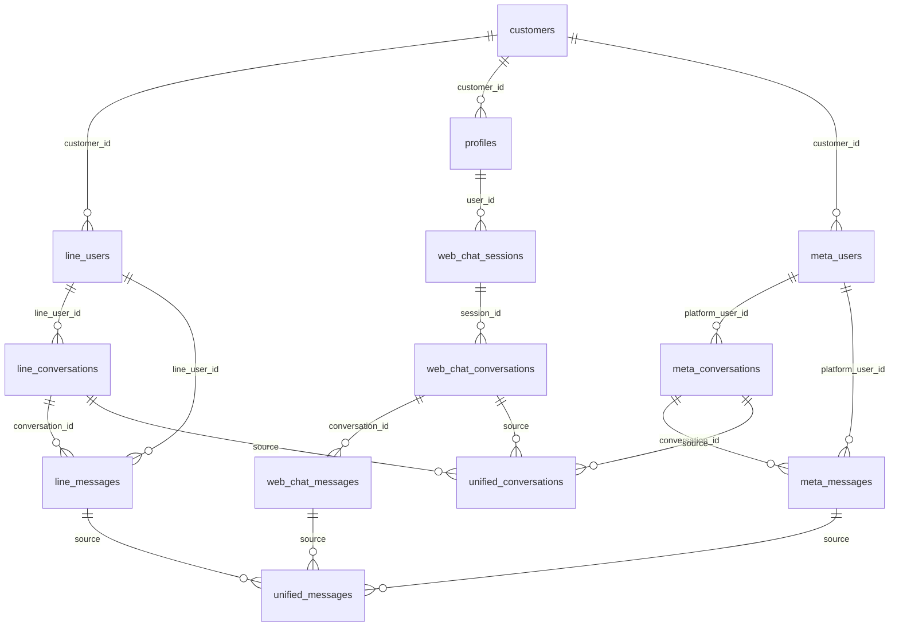

# Unified Chat System Database Documentation

**Database Design Patterns, Views, Functions, and Migrations**
*Last Updated: January 2025*

## 📋 Database Overview

The Unified Chat System uses a hybrid database architecture that combines LINE chat tables, website chat tables, and Meta platform tables (Facebook, Instagram, WhatsApp), unified through PostgreSQL views. The system maintains **19 tables and 2 views** to support multi-channel messaging operations.

> 📊 **Complete Table Reference**: For detailed table schemas, fields, indexes, and relationships, see [Database Tables Reference](./UNIFIED_CHAT_DATABASE_TABLES.md)

### Quick Reference
- **19 Tables**: 8 LINE, 3 Website, 4 Meta, 2 AI, 2 supporting tables
- **2 Views**: `unified_conversations`, `unified_messages`
- **Multiple Functions**: Triggers, helpers, utilities

## 🏗️ Schema Architecture



## 📊 Core Tables

### 1. Customer Master Data

#### `customers` Table
Central customer information repository.

```sql
CREATE TABLE customers (
    id UUID PRIMARY KEY DEFAULT gen_random_uuid(),
    name VARCHAR(255) NOT NULL,
    code VARCHAR(50) UNIQUE,
    phone VARCHAR(20),
    email VARCHAR(255),
    created_at TIMESTAMPTZ DEFAULT NOW(),
    updated_at TIMESTAMPTZ DEFAULT NOW()
);

-- Indexes
CREATE INDEX idx_customers_code ON customers(code);
CREATE INDEX idx_customers_email ON customers(email);
CREATE INDEX idx_customers_phone ON customers(phone);
```

#### `profiles` Table
System user profiles for website authentication.

```sql
CREATE TABLE profiles (
    id UUID PRIMARY KEY DEFAULT gen_random_uuid(),
    user_id UUID REFERENCES auth.users(id),
    customer_id UUID REFERENCES customers(id),
    email VARCHAR(255),
    display_name VARCHAR(255),
    created_at TIMESTAMPTZ DEFAULT NOW(),
    updated_at TIMESTAMPTZ DEFAULT NOW()
);

-- Indexes
CREATE UNIQUE INDEX idx_profiles_user_id ON profiles(user_id);
CREATE INDEX idx_profiles_customer_id ON profiles(customer_id);
CREATE INDEX idx_profiles_email ON profiles(email);
```

### 2. LINE Chat System Tables

#### `line_users` Table
LINE user profiles and customer associations.

```sql
CREATE TABLE line_users (
    id UUID PRIMARY KEY DEFAULT gen_random_uuid(),
    line_user_id VARCHAR(255) UNIQUE NOT NULL,
    display_name VARCHAR(255),
    picture_url TEXT,
    status_message TEXT,
    customer_id UUID REFERENCES customers(id),
    is_active BOOLEAN DEFAULT true,
    created_at TIMESTAMPTZ DEFAULT NOW(),
    updated_at TIMESTAMPTZ DEFAULT NOW()
);

-- Indexes
CREATE UNIQUE INDEX idx_line_users_line_user_id ON line_users(line_user_id);
CREATE INDEX idx_line_users_customer_id ON line_users(customer_id);
CREATE INDEX idx_line_users_active ON line_users(is_active);
```

#### `line_conversations` Table
LINE conversation management.

```sql
CREATE TABLE line_conversations (
    id UUID PRIMARY KEY DEFAULT gen_random_uuid(),
    line_user_id VARCHAR(255) NOT NULL REFERENCES line_users(line_user_id),
    customer_id UUID REFERENCES customers(id),
    last_message_at TIMESTAMPTZ,
    last_message_text TEXT,
    last_message_by VARCHAR(20) CHECK (last_message_by IN ('user', 'admin')),
    last_message_type VARCHAR(20) DEFAULT 'text',
    unread_count INTEGER DEFAULT 0,
    is_active BOOLEAN DEFAULT true,
    assigned_to UUID REFERENCES profiles(id),
    created_at TIMESTAMPTZ DEFAULT NOW(),
    updated_at TIMESTAMPTZ DEFAULT NOW()
);

-- Indexes
CREATE INDEX idx_line_conversations_line_user_id ON line_conversations(line_user_id);
CREATE INDEX idx_line_conversations_customer_id ON line_conversations(customer_id);
CREATE INDEX idx_line_conversations_last_message_at ON line_conversations(last_message_at DESC);
CREATE INDEX idx_line_conversations_active ON line_conversations(is_active);
CREATE INDEX idx_line_conversations_unread ON line_conversations(unread_count) WHERE unread_count > 0;
```

#### `line_messages` Table
LINE message storage with rich content support.

```sql
CREATE TABLE line_messages (
    id UUID PRIMARY KEY DEFAULT gen_random_uuid(),
    conversation_id UUID NOT NULL REFERENCES line_conversations(id),
    line_user_id VARCHAR(255) NOT NULL REFERENCES line_users(line_user_id),
    line_message_id VARCHAR(255),
    message_text TEXT,
    message_type VARCHAR(50) NOT NULL DEFAULT 'text',
    sender_type VARCHAR(20) NOT NULL CHECK (sender_type IN ('user', 'admin')),
    sender_name VARCHAR(255),

    -- Rich content fields
    image_url TEXT,
    file_url TEXT,
    file_name VARCHAR(255),
    file_size INTEGER,
    file_type VARCHAR(100),

    -- Sticker fields
    package_id VARCHAR(50),
    sticker_id VARCHAR(50),
    sticker_keywords TEXT[],

    -- Reply/Quote fields
    quote_token VARCHAR(255),
    replied_to_message_id UUID REFERENCES line_messages(id),
    reply_preview_text TEXT,
    reply_preview_type VARCHAR(50),

    -- Metadata
    is_read BOOLEAN DEFAULT false,
    delivered_at TIMESTAMPTZ,
    failed_reason TEXT,

    created_at TIMESTAMPTZ DEFAULT NOW(),
    updated_at TIMESTAMPTZ DEFAULT NOW()
);

-- Indexes
CREATE INDEX idx_line_messages_conversation_id ON line_messages(conversation_id);
CREATE INDEX idx_line_messages_line_user_id ON line_messages(line_user_id);
CREATE INDEX idx_line_messages_created_at ON line_messages(created_at DESC);
CREATE INDEX idx_line_messages_sender_type ON line_messages(sender_type);
CREATE INDEX idx_line_messages_type ON line_messages(message_type);
CREATE INDEX idx_line_messages_unread ON line_messages(is_read) WHERE is_read = false;
CREATE UNIQUE INDEX idx_line_messages_line_message_id ON line_messages(line_message_id) WHERE line_message_id IS NOT NULL;
```

### 3. Website Chat System Tables

#### `web_chat_sessions` Table
Website user sessions for anonymous and authenticated users.

```sql
CREATE TABLE web_chat_sessions (
    id UUID PRIMARY KEY DEFAULT gen_random_uuid(),
    session_id VARCHAR(255) UNIQUE NOT NULL,
    user_id UUID REFERENCES auth.users(id),
    customer_id UUID REFERENCES customers(id),
    display_name VARCHAR(255),
    email VARCHAR(255),
    ip_address INET,
    user_agent TEXT,
    last_seen_at TIMESTAMPTZ DEFAULT NOW(),
    is_active BOOLEAN DEFAULT true,
    created_at TIMESTAMPTZ DEFAULT NOW(),
    updated_at TIMESTAMPTZ DEFAULT NOW()
);

-- Indexes
CREATE UNIQUE INDEX idx_web_chat_sessions_session_id ON web_chat_sessions(session_id);
CREATE INDEX idx_web_chat_sessions_user_id ON web_chat_sessions(user_id);
CREATE INDEX idx_web_chat_sessions_customer_id ON web_chat_sessions(customer_id);
CREATE INDEX idx_web_chat_sessions_email ON web_chat_sessions(email);
CREATE INDEX idx_web_chat_sessions_active ON web_chat_sessions(is_active);
CREATE INDEX idx_web_chat_sessions_last_seen ON web_chat_sessions(last_seen_at DESC);
```

#### `web_chat_conversations` Table
Website conversation management.

```sql
CREATE TABLE web_chat_conversations (
    id UUID PRIMARY KEY DEFAULT gen_random_uuid(),
    session_id UUID NOT NULL REFERENCES web_chat_sessions(id),
    last_message_at TIMESTAMPTZ,
    last_message_text TEXT,
    unread_count INTEGER DEFAULT 0,
    is_active BOOLEAN DEFAULT true,
    assigned_to UUID REFERENCES profiles(id),
    created_at TIMESTAMPTZ DEFAULT NOW(),
    updated_at TIMESTAMPTZ DEFAULT NOW()
);

-- Indexes
CREATE INDEX idx_web_chat_conversations_session_id ON web_chat_conversations(session_id);
CREATE INDEX idx_web_chat_conversations_last_message_at ON web_chat_conversations(last_message_at DESC);
CREATE INDEX idx_web_chat_conversations_active ON web_chat_conversations(is_active);
CREATE INDEX idx_web_chat_conversations_unread ON web_chat_conversations(unread_count) WHERE unread_count > 0;
```

#### `web_chat_messages` Table
Website message storage.

```sql
CREATE TABLE web_chat_messages (
    id UUID PRIMARY KEY DEFAULT gen_random_uuid(),
    conversation_id UUID NOT NULL REFERENCES web_chat_conversations(id),
    session_id UUID NOT NULL REFERENCES web_chat_sessions(id),
    message_text TEXT NOT NULL,
    sender_type VARCHAR(20) NOT NULL CHECK (sender_type IN ('customer', 'staff')),
    sender_name VARCHAR(255),

    -- File attachment fields
    file_url TEXT,
    file_name VARCHAR(255),
    file_size INTEGER,
    file_type VARCHAR(100),

    -- Metadata
    is_read BOOLEAN DEFAULT false,

    created_at TIMESTAMPTZ DEFAULT NOW(),
    updated_at TIMESTAMPTZ DEFAULT NOW()
);

-- Indexes
CREATE INDEX idx_web_chat_messages_conversation_id ON web_chat_messages(conversation_id);
CREATE INDEX idx_web_chat_messages_session_id ON web_chat_messages(session_id);
CREATE INDEX idx_web_chat_messages_created_at ON web_chat_messages(created_at DESC);
CREATE INDEX idx_web_chat_messages_sender_type ON web_chat_messages(sender_type);
CREATE INDEX idx_web_chat_messages_unread ON web_chat_messages(is_read) WHERE is_read = false;
```

## 📊 Unified Views

### 1. `unified_conversations` View
Combines conversations from both LINE and website channels.

```sql
CREATE VIEW unified_conversations AS
-- LINE conversations with enhanced customer linking
SELECT
    'line'::text AS channel_type,
    lc.id,
    lc.line_user_id AS channel_user_id,
    COALESCE(lc.customer_id, lu.customer_id) AS customer_id,
    lc.last_message_at,
    lc.last_message_text,
    lc.last_message_by,
    lc.unread_count,
    lc.is_active,
    lc.assigned_to,
    lc.created_at,
    lc.updated_at,
    -- Channel-specific metadata
    jsonb_build_object(
        'line_user_id', lu.line_user_id,
        'display_name', lu.display_name,
        'picture_url', lu.picture_url,
        'customer_name', c.name
    ) AS channel_metadata
FROM line_conversations lc
LEFT JOIN line_users lu ON lc.line_user_id = lu.line_user_id
LEFT JOIN customers c ON COALESCE(lc.customer_id, lu.customer_id) = c.id

UNION ALL

-- Website conversations with automatic customer linking
SELECT
    'website'::text AS channel_type,
    wcc.id,
    wcc.session_id::text AS channel_user_id,
    COALESCE(wcs.customer_id, p.customer_id) AS customer_id,
    wcc.last_message_at,
    wcc.last_message_text,
    'user'::text AS last_message_by, -- Default for website
    wcc.unread_count,
    wcc.is_active,
    wcc.assigned_to,
    wcc.created_at,
    wcc.updated_at,
    -- Channel-specific metadata
    jsonb_build_object(
        'session_id', wcs.session_id,
        'email', wcs.email,
        'display_name', wcs.display_name,
        'customer_name', c.name
    ) AS channel_metadata
FROM web_chat_conversations wcc
LEFT JOIN web_chat_sessions wcs ON wcc.session_id = wcs.id
LEFT JOIN profiles p ON wcs.user_id = p.id
LEFT JOIN customers c ON COALESCE(wcs.customer_id, p.customer_id) = c.id;
```

### 2. `unified_messages` View
Combines messages from both channels with standardized format.

```sql
CREATE VIEW unified_messages AS
-- LINE messages with standardized format
SELECT
    'line'::text AS channel_type,
    lm.id,
    lm.conversation_id,
    lm.line_user_id AS channel_user_id,
    lm.message_text AS content,
    lm.message_type AS content_type,
    lm.sender_type,
    lm.sender_name,
    lm.is_read,
    lm.created_at,
    -- Channel-specific metadata
    jsonb_build_object(
        'line_message_id', lm.line_message_id,
        'image_url', lm.image_url,
        'file_url', lm.file_url,
        'file_name', lm.file_name,
        'file_size', lm.file_size,
        'package_id', lm.package_id,
        'sticker_id', lm.sticker_id,
        'quote_token', lm.quote_token,
        'replied_to_message_id', lm.replied_to_message_id
    ) AS channel_metadata
FROM line_messages lm

UNION ALL

-- Website messages with standardized format
SELECT
    'website'::text AS channel_type,
    wcm.id,
    wcm.conversation_id,
    wcm.session_id::text AS channel_user_id,
    wcm.message_text AS content,
    CASE
        WHEN wcm.file_url IS NOT NULL THEN 'file'
        ELSE 'text'
    END AS content_type,
    wcm.sender_type,
    wcm.sender_name,
    wcm.is_read,
    wcm.created_at,
    -- Channel-specific metadata
    jsonb_build_object(
        'file_url', wcm.file_url,
        'file_name', wcm.file_name,
        'file_size', wcm.file_size,
        'file_type', wcm.file_type
    ) AS channel_metadata
FROM web_chat_messages wcm;
```

## 🔧 Supporting Tables

### 1. LINE Message Templates

#### `line_message_templates` Table
Pre-configured message templates for staff use.

```sql
CREATE TABLE line_message_templates (
    id UUID PRIMARY KEY DEFAULT gen_random_uuid(),
    title VARCHAR(255) NOT NULL,
    category VARCHAR(100),
    content TEXT NOT NULL,
    variables TEXT[], -- Array of variable names like {customer_name}, {date}
    is_active BOOLEAN DEFAULT true,
    usage_count INTEGER DEFAULT 0,
    created_by UUID REFERENCES profiles(id),
    created_at TIMESTAMPTZ DEFAULT NOW(),
    updated_at TIMESTAMPTZ DEFAULT NOW()
);

-- Indexes
CREATE INDEX idx_line_message_templates_category ON line_message_templates(category);
CREATE INDEX idx_line_message_templates_active ON line_message_templates(is_active);
CREATE INDEX idx_line_message_templates_usage ON line_message_templates(usage_count DESC);
```

### 2. Curated Images

#### `line_curated_images` Table
Managed image library for staff use.

```sql
CREATE TABLE line_curated_images (
    id UUID PRIMARY KEY DEFAULT gen_random_uuid(),
    title VARCHAR(255) NOT NULL,
    description TEXT,
    image_url TEXT NOT NULL,
    category VARCHAR(100),
    tags TEXT[],
    file_size INTEGER,
    mime_type VARCHAR(100),
    is_active BOOLEAN DEFAULT true,
    usage_count INTEGER DEFAULT 0,
    created_by UUID REFERENCES profiles(id),
    created_at TIMESTAMPTZ DEFAULT NOW(),
    updated_at TIMESTAMPTZ DEFAULT NOW()
);

-- Indexes
CREATE INDEX idx_line_curated_images_category ON line_curated_images(category);
CREATE INDEX idx_line_curated_images_active ON line_curated_images(is_active);
CREATE INDEX idx_line_curated_images_tags ON line_curated_images USING GIN(tags);
```

### 3. Webhook Logging

#### `line_webhook_logs` Table
LINE webhook event logging for debugging.

```sql
CREATE TABLE line_webhook_logs (
    id UUID PRIMARY KEY DEFAULT gen_random_uuid(),
    event_type VARCHAR(100) NOT NULL,
    source_type VARCHAR(50),
    source_user_id VARCHAR(255),
    message_id VARCHAR(255),
    webhook_data JSONB,
    processing_status VARCHAR(50) DEFAULT 'pending',
    error_message TEXT,
    processed_at TIMESTAMPTZ,
    created_at TIMESTAMPTZ DEFAULT NOW()
);

-- Indexes
CREATE INDEX idx_line_webhook_logs_event_type ON line_webhook_logs(event_type);
CREATE INDEX idx_line_webhook_logs_created_at ON line_webhook_logs(created_at DESC);
CREATE INDEX idx_line_webhook_logs_status ON line_webhook_logs(processing_status);
CREATE INDEX idx_line_webhook_logs_user_id ON line_webhook_logs(source_user_id);
```

## 🔄 Database Functions

### 1. Conversation Management Functions

#### Auto-update Last Message Function
```sql
CREATE OR REPLACE FUNCTION update_conversation_last_message()
RETURNS TRIGGER AS $$
BEGIN
    -- Update LINE conversation
    IF TG_TABLE_NAME = 'line_messages' THEN
        UPDATE line_conversations
        SET
            last_message_at = NEW.created_at,
            last_message_text = NEW.message_text,
            last_message_by = NEW.sender_type,
            last_message_type = NEW.message_type,
            unread_count = CASE
                WHEN NEW.sender_type = 'user' THEN unread_count + 1
                ELSE unread_count
            END,
            updated_at = NOW()
        WHERE id = NEW.conversation_id;
    END IF;

    -- Update website conversation
    IF TG_TABLE_NAME = 'web_chat_messages' THEN
        UPDATE web_chat_conversations
        SET
            last_message_at = NEW.created_at,
            last_message_text = NEW.message_text,
            unread_count = CASE
                WHEN NEW.sender_type = 'customer' THEN unread_count + 1
                ELSE unread_count
            END,
            updated_at = NOW()
        WHERE id = NEW.conversation_id;
    END IF;

    RETURN NEW;
END;
$$ LANGUAGE plpgsql;

-- Create triggers
CREATE TRIGGER trigger_update_line_conversation_last_message
    AFTER INSERT ON line_messages
    FOR EACH ROW EXECUTE FUNCTION update_conversation_last_message();

CREATE TRIGGER trigger_update_web_conversation_last_message
    AFTER INSERT ON web_chat_messages
    FOR EACH ROW EXECUTE FUNCTION update_conversation_last_message();
```

#### Mark Conversation as Read Function
```sql
CREATE OR REPLACE FUNCTION mark_conversation_as_read(
    p_conversation_id UUID,
    p_channel_type TEXT
)
RETURNS BOOLEAN AS $$
DECLARE
    updated_count INTEGER;
BEGIN
    IF p_channel_type = 'line' THEN
        UPDATE line_conversations
        SET unread_count = 0, updated_at = NOW()
        WHERE id = p_conversation_id;
        GET DIAGNOSTICS updated_count = ROW_COUNT;

        UPDATE line_messages
        SET is_read = true, updated_at = NOW()
        WHERE conversation_id = p_conversation_id AND is_read = false;

    ELSIF p_channel_type = 'website' THEN
        UPDATE web_chat_conversations
        SET unread_count = 0, updated_at = NOW()
        WHERE id = p_conversation_id;
        GET DIAGNOSTICS updated_count = ROW_COUNT;

        UPDATE web_chat_messages
        SET is_read = true, updated_at = NOW()
        WHERE conversation_id = p_conversation_id AND is_read = false;
    END IF;

    RETURN updated_count > 0;
END;
$$ LANGUAGE plpgsql;
```

### 2. Customer Linking Functions

#### Link Customer to LINE User Function
```sql
CREATE OR REPLACE FUNCTION link_customer_to_line_user(
    p_line_user_id VARCHAR(255),
    p_customer_id UUID
)
RETURNS BOOLEAN AS $$
DECLARE
    updated_count INTEGER;
BEGIN
    -- Update line_users table
    UPDATE line_users
    SET customer_id = p_customer_id, updated_at = NOW()
    WHERE line_user_id = p_line_user_id;
    GET DIAGNOSTICS updated_count = ROW_COUNT;

    -- Update line_conversations table
    UPDATE line_conversations
    SET customer_id = p_customer_id, updated_at = NOW()
    WHERE line_user_id = p_line_user_id;

    RETURN updated_count > 0;
END;
$$ LANGUAGE plpgsql;
```

#### Auto-link Website Session to Customer Function
```sql
CREATE OR REPLACE FUNCTION auto_link_website_session()
RETURNS TRIGGER AS $$
DECLARE
    customer_id_from_profile UUID;
BEGIN
    -- Get customer_id from profiles if user_id is set
    IF NEW.user_id IS NOT NULL THEN
        SELECT customer_id INTO customer_id_from_profile
        FROM profiles
        WHERE user_id = NEW.user_id;

        -- Update session with customer_id if found
        IF customer_id_from_profile IS NOT NULL THEN
            NEW.customer_id := customer_id_from_profile;
        END IF;
    END IF;

    RETURN NEW;
END;
$$ LANGUAGE plpgsql;

-- Create trigger
CREATE TRIGGER trigger_auto_link_website_session
    BEFORE INSERT OR UPDATE ON web_chat_sessions
    FOR EACH ROW EXECUTE FUNCTION auto_link_website_session();
```

## 📊 Performance Optimizations

### 1. Indexing Strategy

#### Primary Indexes
All tables include optimized indexes for:
- Primary key lookups
- Foreign key relationships
- Timestamp-based queries (conversation ordering)
- Filtering by status (active/inactive, read/unread)

#### Composite Indexes
```sql
-- Conversation list performance
CREATE INDEX idx_conversations_active_last_message
ON line_conversations(is_active, last_message_at DESC)
WHERE is_active = true;

CREATE INDEX idx_web_conversations_active_last_message
ON web_chat_conversations(is_active, last_message_at DESC)
WHERE is_active = true;

-- Message loading performance
CREATE INDEX idx_messages_conversation_created
ON line_messages(conversation_id, created_at DESC);

CREATE INDEX idx_web_messages_conversation_created
ON web_chat_messages(conversation_id, created_at DESC);

-- Unread message queries
CREATE INDEX idx_conversations_unread_count
ON line_conversations(unread_count, last_message_at DESC)
WHERE unread_count > 0;
```

### 2. View Optimization

#### Materialized View for Heavy Queries
```sql
-- For high-traffic scenarios, consider materialized views
CREATE MATERIALIZED VIEW mv_conversation_summary AS
SELECT
    channel_type,
    COUNT(*) as total_conversations,
    COUNT(*) FILTER (WHERE unread_count > 0) as unread_conversations,
    AVG(unread_count) as avg_unread_count,
    MAX(last_message_at) as latest_message
FROM unified_conversations
WHERE is_active = true
GROUP BY channel_type;

-- Refresh strategy
CREATE OR REPLACE FUNCTION refresh_conversation_summary()
RETURNS VOID AS $$
BEGIN
    REFRESH MATERIALIZED VIEW CONCURRENTLY mv_conversation_summary;
END;
$$ LANGUAGE plpgsql;
```

## 🔒 Security & Permissions

### 1. Row Level Security (RLS)

#### Enable RLS on Core Tables
```sql
-- Enable RLS on conversation tables
ALTER TABLE line_conversations ENABLE ROW LEVEL SECURITY;
ALTER TABLE web_chat_conversations ENABLE ROW LEVEL SECURITY;
ALTER TABLE line_messages ENABLE ROW LEVEL SECURITY;
ALTER TABLE web_chat_messages ENABLE ROW LEVEL SECURITY;

-- Staff access policy
CREATE POLICY staff_full_access ON line_conversations
    FOR ALL TO authenticated
    USING (true);

CREATE POLICY staff_full_access ON web_chat_conversations
    FOR ALL TO authenticated
    USING (true);

-- Customer access policy (for future customer portal)
CREATE POLICY customer_own_conversations ON line_conversations
    FOR SELECT TO authenticated
    USING (
        customer_id IN (
            SELECT customer_id FROM profiles WHERE user_id = auth.uid()
        )
    );
```

### 2. Data Validation Constraints

#### Message Content Validation
```sql
-- Ensure message content is not empty
ALTER TABLE line_messages
ADD CONSTRAINT chk_line_message_content
CHECK (
    message_text IS NOT NULL OR
    image_url IS NOT NULL OR
    file_url IS NOT NULL OR
    (package_id IS NOT NULL AND sticker_id IS NOT NULL)
);

-- Validate sender types
ALTER TABLE line_messages
ADD CONSTRAINT chk_line_sender_type
CHECK (sender_type IN ('user', 'admin'));

ALTER TABLE web_chat_messages
ADD CONSTRAINT chk_web_sender_type
CHECK (sender_type IN ('customer', 'staff'));
```

## 📈 Analytics & Reporting

### 1. Conversation Analytics Views

#### Daily Conversation Stats
```sql
CREATE VIEW daily_conversation_stats AS
SELECT
    DATE(created_at) as date,
    channel_type,
    COUNT(*) as new_conversations,
    COUNT(*) FILTER (WHERE customer_id IS NOT NULL) as linked_conversations,
    AVG(
        EXTRACT(EPOCH FROM (last_message_at - created_at)) / 3600
    ) as avg_duration_hours
FROM unified_conversations
GROUP BY DATE(created_at), channel_type
ORDER BY date DESC, channel_type;
```

#### Message Volume Analytics
```sql
CREATE VIEW message_volume_stats AS
SELECT
    DATE(created_at) as date,
    channel_type,
    sender_type,
    COUNT(*) as message_count,
    COUNT(DISTINCT conversation_id) as active_conversations
FROM unified_messages
GROUP BY DATE(created_at), channel_type, sender_type
ORDER BY date DESC, channel_type, sender_type;
```

### 2. Performance Monitoring

#### Query Performance View
```sql
CREATE VIEW query_performance_stats AS
SELECT
    schemaname,
    tablename,
    attname,
    n_distinct,
    correlation,
    most_common_vals
FROM pg_stats
WHERE schemaname = 'public'
AND tablename IN (
    'line_conversations', 'line_messages',
    'web_chat_conversations', 'web_chat_messages'
);
```

## 🔄 Migration Scripts

### 1. Customer Linking Migration
```sql
-- Migrate existing LINE users to use customer linking
UPDATE line_users lu
SET customer_id = c.id
FROM customers c
WHERE lu.display_name = c.name
AND lu.customer_id IS NULL;

-- Update conversations with customer links
UPDATE line_conversations lc
SET customer_id = lu.customer_id
FROM line_users lu
WHERE lc.line_user_id = lu.line_user_id
AND lc.customer_id IS NULL
AND lu.customer_id IS NOT NULL;
```

### 2. Website Session Migration
```sql
-- Auto-link existing website sessions to customers
UPDATE web_chat_sessions wcs
SET customer_id = p.customer_id
FROM profiles p
WHERE wcs.user_id = p.id
AND wcs.customer_id IS NULL
AND p.customer_id IS NOT NULL;
```

## 📝 Maintenance Procedures

### 1. Regular Cleanup Tasks

#### Archive Old Messages
```sql
-- Archive messages older than 1 year
CREATE TABLE line_messages_archive (LIKE line_messages);
CREATE TABLE web_chat_messages_archive (LIKE web_chat_messages);

-- Move old messages to archive
WITH old_messages AS (
    DELETE FROM line_messages
    WHERE created_at < NOW() - INTERVAL '1 year'
    RETURNING *
)
INSERT INTO line_messages_archive SELECT * FROM old_messages;
```

#### Clean Inactive Sessions
```sql
-- Clean up inactive website sessions
DELETE FROM web_chat_sessions
WHERE last_seen_at < NOW() - INTERVAL '30 days'
AND is_active = false;
```

### 2. Health Check Queries

#### Data Consistency Checks
```sql
-- Check for orphaned messages
SELECT 'line_messages' as table_name, COUNT(*) as orphaned_count
FROM line_messages lm
LEFT JOIN line_conversations lc ON lm.conversation_id = lc.id
WHERE lc.id IS NULL

UNION ALL

SELECT 'web_chat_messages' as table_name, COUNT(*) as orphaned_count
FROM web_chat_messages wcm
LEFT JOIN web_chat_conversations wcc ON wcm.conversation_id = wcc.id
WHERE wcc.id IS NULL;

-- Check unread count accuracy
SELECT
    lc.id,
    lc.unread_count as recorded_count,
    COUNT(lm.id) FILTER (WHERE lm.is_read = false AND lm.sender_type = 'user') as actual_count
FROM line_conversations lc
LEFT JOIN line_messages lm ON lc.id = lm.conversation_id
GROUP BY lc.id, lc.unread_count
HAVING lc.unread_count != COUNT(lm.id) FILTER (WHERE lm.is_read = false AND lm.sender_type = 'user');
```

---

*This database documentation provides comprehensive coverage of the Unified Chat System's data architecture. For API integration details, see the [API Reference](./UNIFIED_CHAT_API_REFERENCE.md).*