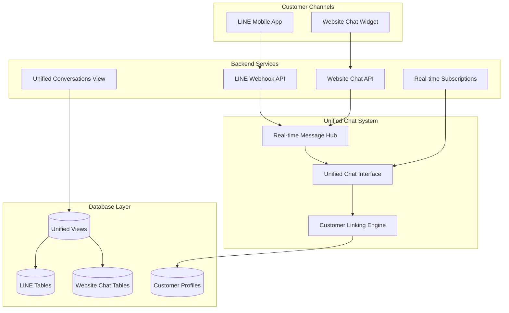

# Unified Chat System Documentation

**Comprehensive Guide to the Multi-Channel Unified Chat System**
*Last Updated: September 2025*

> ⚠️ **Notice**: AI-powered chat suggestions are currently disabled while we continue development. The core unified chat functionality remains fully operational.


## 🌟 Executive Summary

The Unified Chat System is a comprehensive multi-channel messaging platform that enables staff to manage customer conversations across both LINE and website channels from a single, streamlined interface. This system represents the evolution of the original LINE-only chat system into a full omnichannel communication platform.

### Key Capabilities
- **Multi-Channel Support**: Seamlessly handle LINE and website conversations
- **Unified Interface**: Single staff interface for all customer communications
- **Real-Time Updates**: Instant message delivery and read status updates
- **Customer Linking**: Automatic customer association across channels
- **Message Types**: Support for text, images, files, stickers, and rich content
- **Mobile-Responsive**: Optimized for both desktop and mobile staff usage

## 🏗️ System Architecture Overview



## 🎯 Core Features

### 1. Multi-Channel Conversation Management
- **Unified Inbox**: All conversations from LINE and website appear in a single list
- **Channel Indicators**: Clear visual distinction between LINE and website conversations
- **Consistent Interface**: Identical staff experience regardless of customer channel
- **Cross-Channel Customer Tracking**: Customer information linked across all channels

### 2. Real-Time Communication
- **Instant Message Delivery**: Messages appear immediately without refresh
- **Read Status Tracking**: Automatic read status updates when conversations are viewed
- **Typing Indicators**: Real-time feedback for active conversations
- **Connection Status**: Visual indicators for real-time connection health

### 3. Customer Context & Linking
- **Automatic Linking**: Website users automatically linked to customer profiles
- **Manual Linking**: Staff can manually link LINE users to customer records
- **Customer Information Panel**: Full customer details, bookings, packages, and transactions
- **Conversation History**: Complete message history across all channels

### 4. Message Types & Rich Content
- **Text Messages**: Standard text communication with emoji support
- **Image Sharing**: Photo uploads and curated image libraries
- **File Attachments**: Document and file sharing capabilities
- **LINE Stickers**: Native LINE sticker support
- **Template Messages**: Pre-configured message templates
- **Booking Confirmations**: Rich booking confirmation messages

## 📱 User Interface Components

### Main Interface Layout
```
┌─────────────────────────────────────────────────────────────┐
│ [≡] Unified Chat System                              [⚙️] │
├─────────────────────────────────────────────────────────────┤
│ Conversations │        Chat Area        │ Customer Info     │
│               │                         │                   │
│ 📱 LINE       │   Selected Conversation │ 👤 Customer      │
│ 🌐 Website    │                         │    Details        │
│               │   [Message Input]       │                   │
│ [+ New Chat]  │                         │ 📅 Bookings      │
│               │                         │ 🎫 Packages      │
│               │                         │ 💰 Transactions  │
└─────────────────────────────────────────────────────────────┘
```

### Key UI Components
1. **ConversationSidebar**: List of all conversations with channel indicators
2. **ChatArea**: Main message display and input area
3. **CustomerSidebar**: Customer information and relationship management
4. **MessageInput**: Rich message composition with file upload
5. **Mobile Optimization**: Responsive design for staff mobile usage

## 🔧 Technical Implementation

### Core Technologies
- **Frontend**: Next.js 14, TypeScript, Tailwind CSS
- **Backend**: Next.js API routes, Supabase
- **Real-time**: Supabase real-time subscriptions
- **Database**: PostgreSQL with unified views
- **Authentication**: NextAuth.js with development bypass

### Key Components

#### 1. Unified Chat Hook (`useUnifiedChat`)
```typescript
// Manages conversations across all channels
const {
  conversations,           // All conversations (LINE + Website)
  loading,                // Loading state
  refreshConversations,   // Manual refresh function
  getConversationById,    // Get specific conversation
  updateConversationLastMessage,  // Update when new message arrives
  updateConversationUnreadCount   // Update read status
} = useUnifiedChat();
```

#### 2. Real-time Message Hook (`useRealtimeMessages`)
```typescript
// Handles real-time message subscriptions
const {
  connectionStatus,       // Connection health
  reconnect,             // Manual reconnection
  disconnect             // Cleanup function
} = useRealtimeMessages({
  conversationId: null,  // Subscribe to all conversations
  onNewMessage: handleNewMessage,
  channelType: 'all'     // Listen to both LINE and website
});
```

#### 3. Chat Operations Hook (`useChatOperations`)
```typescript
// Manages message sending and file uploads
const chatOps = useChatOperations(selectedConversation, handleMessageSent, selectedConversationObj);
```

## 📊 Database Architecture

### Unified Views
The system uses PostgreSQL views to create a unified interface over separate LINE and website tables:

#### `unified_conversations` View
Combines conversations from both channels:
```sql
-- LINE conversations
SELECT
  'line'::text AS channel_type,
  lc.id,
  lc.line_user_id AS channel_user_id,
  COALESCE(lc.customer_id, lu.customer_id) AS customer_id,
  -- ... other fields
FROM line_conversations lc
LEFT JOIN line_users lu ON lc.line_user_id = lu.line_user_id

UNION ALL

-- Website conversations
SELECT
  'website'::text AS channel_type,
  wcc.id,
  wcc.session_id::text AS channel_user_id,
  COALESCE(wcs.customer_id, p.customer_id) AS customer_id,
  -- ... other fields
FROM web_chat_conversations wcc
LEFT JOIN web_chat_sessions wcs ON wcc.session_id::text = wcs.id::text
LEFT JOIN profiles p ON wcs.user_id = p.id
```

#### `unified_messages` View
Combines messages from both channels with standardized fields.

### Core Tables

#### LINE Tables
- `line_conversations`: LINE conversation management
- `line_messages`: LINE message storage
- `line_users`: LINE user profiles
- `line_message_templates`: Message templates
- `line_curated_images`: Image management

#### Website Chat Tables
- `web_chat_conversations`: Website conversation management
- `web_chat_messages`: Website message storage
- `web_chat_sessions`: Website user sessions
- `profiles`: User profile linking

## 🚀 Getting Started

### For Developers

#### 1. Environment Setup
```bash
# Add to .env.local
SKIP_AUTH=true  # Development authentication bypass
```

#### 2. Access the Interface
```bash
# Start development server
npm run dev

# Access unified chat
open http://localhost:3000/staff/unified-chat
```

#### 3. Test Different Scenarios
- **LINE Conversations**: Conversations from LINE webhook
- **Website Conversations**: Conversations from website chat widget
- **Customer Linking**: Test automatic and manual customer association
- **Real-time Updates**: Test message delivery and read status

### For Staff Users

#### 1. Accessing the System
Navigate to `/staff/unified-chat` to access the unified interface.

#### 2. Managing Conversations
- **View All Conversations**: Both LINE and website conversations appear in the left sidebar
- **Channel Identification**: Look for channel indicators (📱 LINE, 🌐 Website)
- **Select Conversations**: Click any conversation to view messages
- **Read Status**: Unread count automatically clears when viewing

#### 3. Sending Messages
- **Text Messages**: Type and press Enter or click Send
- **File Uploads**: Click attachment icon to upload files
- **Templates**: Use pre-configured message templates
- **Images**: Send from curated image library

#### 4. Customer Management
- **View Customer Info**: Customer details appear in right sidebar
- **Link Customers**: Manually link LINE users to customer records
- **Booking Confirmations**: Send booking confirmations directly from chat
- **Package Information**: View customer packages and usage

## 🔄 Message Flow

### Incoming Messages

#### LINE Messages
1. LINE webhook receives message
2. Stored in `line_messages` table
3. Real-time subscription triggers update
4. Message appears in unified interface
5. Conversation list updates with latest message

#### Website Messages
1. Website chat widget sends message via API
2. Stored in `web_chat_messages` table
3. Real-time subscription triggers update
4. Message appears in unified interface
5. Conversation list updates with latest message

### Outgoing Messages

#### To LINE Users
1. Staff sends message via unified interface
2. Message sent to LINE API
3. Stored in `line_messages` table
4. Real-time update to interface

#### To Website Users
1. Staff sends message via unified interface
2. Message stored in `web_chat_messages` table
3. Real-time subscription delivers to website widget
4. Interface updates immediately

## 📈 Performance & Scalability

### Real-Time Optimization
- **Selective Subscriptions**: Only subscribe to active conversations
- **Connection Management**: Automatic reconnection on failures
- **Message Batching**: Efficient handling of high-message volumes

### Database Performance
- **Indexed Views**: Optimized queries for unified data
- **Selective Loading**: Load only necessary conversation data
- **Caching Strategy**: Message caching for frequently accessed conversations

### Mobile Performance
- **Responsive Design**: Optimized for staff mobile devices
- **Touch-Friendly Interface**: Large touch targets and swipe gestures
- **Offline Resilience**: Graceful handling of connection issues

## 🔒 Security & Privacy

### Authentication & Authorization
- **Staff Authentication**: NextAuth.js with Google OAuth
- **Development Bypass**: Complete authentication bypass for development
- **Role-Based Access**: Future support for role-based permissions

### Data Protection
- **Message Encryption**: Secure storage of sensitive conversations
- **Customer Privacy**: Proper handling of customer personal information
- **Audit Trails**: Complete logging of staff actions

### API Security
- **CSRF Protection**: Built-in Next.js CSRF protection
- **Input Validation**: Comprehensive validation of all inputs
- **Rate Limiting**: Protection against abuse

## 🛠️ Maintenance & Monitoring

### Health Checks
- **Real-time Connection Status**: Visual indicators for connection health
- **API Endpoint Monitoring**: Automatic health checks for critical endpoints
- **Database Performance**: Query performance monitoring

### Troubleshooting
- **Connection Issues**: Automatic reconnection with exponential backoff
- **Message Delivery**: Retry mechanisms for failed message delivery
- **Error Logging**: Comprehensive error tracking and reporting

### Updates & Migrations
- **Database Migrations**: Supabase migration system
- **Feature Rollouts**: Gradual rollout of new features
- **Backward Compatibility**: Maintaining compatibility with existing data

## 📚 Related Documentation

- **[Unified Chat Architecture](./UNIFIED_CHAT_ARCHITECTURE.md)** - Technical architecture details
- **[Unified Chat API Reference](./UNIFIED_CHAT_API_REFERENCE.md)** - Complete API documentation
- **[Unified Chat Database](./UNIFIED_CHAT_DATABASE.md)** - Database schema and relationships
- **[Unified Chat Development Guide](./UNIFIED_CHAT_DEVELOPMENT_GUIDE.md)** - Developer implementation guide
- **[Customer Web Chat Implementation Guide](./CUSTOMER_WEB_CHAT_IMPLEMENTATION_GUIDE.md)** - Original implementation plan

## 🎯 Future Enhancements

### Planned Features
- **Message Search**: Full-text search across all conversations
- **Conversation Tags**: Categorization and organization
- **Staff Assignment**: Route conversations to specific staff members
- **Analytics Dashboard**: Conversation metrics and performance tracking
- **Advanced Templates**: Dynamic templates with customer data
- **Multi-Language Support**: Support for multiple languages

### Technical Improvements
- **Message Threading**: Support for conversation threads
- **Voice Messages**: Audio message support
- **Video Calls**: Integration with video calling platforms
- **Chatbot Integration**: AI-powered automated responses
- **Workflow Automation**: Automated routing and responses

---

*This documentation is part of the Lengolf Forms comprehensive documentation system. For additional information, see the [Documentation Index](../../DOCUMENTATION_INDEX.md).*