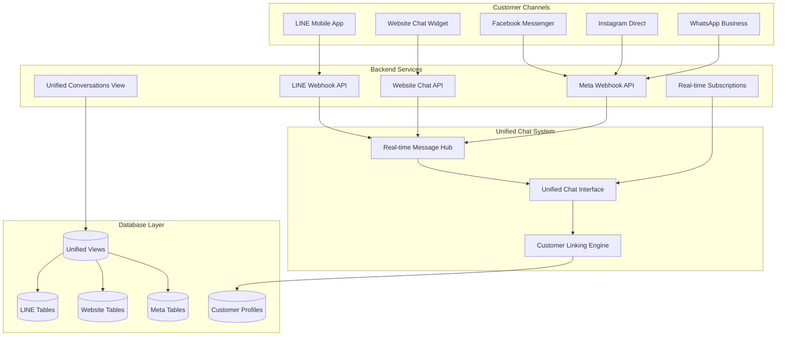

# Unified Chat System - Documentation Index

**Complete Documentation Hub for the Multi-Channel Unified Chat System**
*Last Updated: January 2025*

> ⚠️ **Notice**: AI-powered chat suggestions are currently disabled while we continue development. The core unified chat functionality remains fully operational.

---

## 📚 Documentation Overview

This is the main entry point for all Unified Chat System documentation. Use this index to navigate to specific topics.

---

## 🌟 System Overview

The Unified Chat System is a comprehensive multi-channel messaging platform that enables staff to manage customer conversations across **LINE, Website Chat, Facebook Messenger, Instagram Direct, and WhatsApp** from a single, streamlined interface.

### Key Capabilities
- **Multi-Channel Support**: LINE, Website, Facebook, Instagram, WhatsApp
- **Unified Interface**: Single staff interface for all customer communications
- **Real-Time Updates**: Instant message delivery and read status updates
- **Customer Linking**: Automatic customer association across all channels
- **Message Types**: Text, images, files, stickers, rich content, and templates
- **Mobile-Responsive**: Optimized for both desktop and mobile staff usage
- **AI Assistance**: Smart response suggestions (currently disabled, under development)

### Supported Channels
| Channel | Status | Icon | Features |
|---------|--------|------|----------|
| **LINE** | ✅ Active | 📱 | Messages, stickers, images, templates |
| **Website Chat** | ✅ Active | 🌐 | Live chat widget, file uploads |
| **Facebook Messenger** | ✅ Active | 📘 | Messages, images, postbacks |
| **Instagram Direct** | ✅ Active | 📷 | Direct messages, images |
| **WhatsApp Business** | ✅ Active | 💬 | Messages, templates, media |
| **AI Suggestions** | 🚧 Development | 🤖 | Smart response generation |

---

## 📖 Complete Documentation Library

### 🏗️ Architecture & Design
- **[Architecture Documentation](./UNIFIED_CHAT_ARCHITECTURE.md)** - Technical architecture, components, data flow, performance optimization
- **[Database Schema](./UNIFIED_CHAT_DATABASE_TABLES.md)** - Complete database tables, relationships, and indexes
- **[Database Documentation](./UNIFIED_CHAT_DATABASE.md)** - Database design patterns, views, functions, and migrations

### 🔧 API & Integration
- **[API Reference](./UNIFIED_CHAT_API_REFERENCE.md)** - Complete REST API documentation for all endpoints
- **[Meta Integration Guide](./META_INTEGRATION_GUIDE.md)** - Facebook, Instagram, and WhatsApp setup

### 👨‍💻 Development
- **[Development Guide](./UNIFIED_CHAT_DEVELOPMENT_GUIDE.md)** - Developer implementation guide, code patterns, testing
- **[Customer Web Chat Implementation](./CUSTOMER_WEB_CHAT_IMPLEMENTATION_GUIDE.md)** - Original implementation plan (historical reference)

### 🤖 AI Features (Under Development)
- **[AI Chat Suggestions](./AI_CHAT_SUGGESTIONS.md)** - AI-powered response suggestions (disabled)
- **[AI Function Calling](./AI_FUNCTION_CALLING_IMPLEMENTATION.md)** - Future AI automation features

---

## 🚀 Quick Start Guides

### For Developers

#### Initial Setup
```bash
# Clone and install
git clone [repository-url]
cd lengolf-forms
npm install

# Configure environment
cp .env.example .env.local
echo "SKIP_AUTH=true" >> .env.local  # Development bypass

# Start development server
npm run dev
```

#### Access Points
- **Unified Chat Interface**: `http://localhost:3000/staff/unified-chat`
- **LINE Chat (Legacy)**: `http://localhost:3000/staff/line-chat`
- **AI Demo**: `http://localhost:3000/staff/ai-demo`

### For Staff Users

#### Accessing the System
1. Navigate to `/staff/unified-chat`
2. All conversations appear in a single list with channel indicators
3. Click any conversation to view and respond
4. Messages are delivered instantly to customers

#### Channel Indicators
- 📱 **Green** = LINE
- 🌐 **Blue** = Website Chat
- 📘 **Blue** = Facebook Messenger
- 📷 **Pink** = Instagram Direct
- 💬 **Green** = WhatsApp Business

---

## 🗄️ Database Tables Reference

### Complete Table List (19 Tables + 2 Views)

#### LINE Chat Tables (6 tables)
- `line_users` - LINE user profiles and customer associations
- `line_conversations` - LINE conversation management
- `line_messages` - LINE message storage with rich content
- `line_message_templates` - Pre-configured message templates
- `line_curated_images` - Managed image library
- `line_webhook_logs` - Webhook event logging
- `line_group_debug` - LINE group chat debugging
- `line_group_debug_settings` - Debug configuration

#### Website Chat Tables (3 tables)
- `web_chat_sessions` - Website user sessions
- `web_chat_conversations` - Website conversation management
- `web_chat_messages` - Website message storage

#### Meta Platform Tables (4 tables)
- `meta_users` - User profiles from Facebook/Instagram/WhatsApp
- `meta_conversations` - Conversation management across Meta platforms
- `meta_messages` - Message storage with platform-specific metadata
- `meta_webhook_logs` - Webhook event logging

#### AI & Embeddings Tables (2 tables)
- `message_embeddings` - Vector embeddings for AI suggestions
- `ai_suggestions` - AI suggestion tracking and feedback

#### Unified Views (2 views)
- `unified_conversations` - Combined view of all channel conversations
- `unified_messages` - Combined view of all channel messages

**📊 Detailed Documentation**: See [Database Tables Reference](./UNIFIED_CHAT_DATABASE_TABLES.md)

---

## 🏗️ System Architecture Overview



**📖 Detailed Architecture**: See [Architecture Documentation](./UNIFIED_CHAT_ARCHITECTURE.md)

---

## 🎯 Core Features Summary

### 1. Multi-Channel Conversation Management
- Unified Inbox for all channels (LINE, Website, Facebook, Instagram, WhatsApp)
- Channel indicators with visual distinction
- Consistent staff interface across all channels
- Cross-channel customer tracking and linking

### 2. Real-Time Communication
- Instant message delivery without page refresh
- Read status tracking and typing indicators
- Connection health monitoring
- Automatic conversation sorting by most recent
- Date separators for multi-day conversations

### 3. Customer Context & Linking
- Automatic linking for website users to customer profiles
- Manual linking for LINE users to customer records
- Customer information panel with bookings, packages, transactions
- Complete conversation history across all channels
- Internal notes management for customer profiles
- Past bookings history with cancellation tracking

### 4. Message Types & Rich Content
- Text messages with emoji support
- Image sharing with curated image libraries
- File attachments and document sharing
- LINE stickers (native support)
- Pre-configured message templates
- Rich booking confirmation messages
- Booking cancellation confirmation messages (LINE and Website)

**📖 Full Feature Details**: See sections below and [Development Guide](./UNIFIED_CHAT_DEVELOPMENT_GUIDE.md)

---

## 📱 User Interface

### Main Components
- **ConversationSidebar**: Multi-channel conversation list
- **ChatArea**: Message display and input
- **CustomerSidebar**: Customer info, bookings, packages
- **MessageInput**: Rich composition with file upload
- **Mobile Responsive**: Optimized for all devices

**📖 Component Details**: See [Architecture Documentation](./UNIFIED_CHAT_ARCHITECTURE.md)

---

## 🔧 Technical Stack

### Technologies
- **Frontend**: Next.js 14, TypeScript, Tailwind CSS
- **Backend**: Next.js API routes, Supabase
- **Real-time**: Supabase real-time subscriptions
- **Database**: PostgreSQL with unified views (19 tables + 2 views)
- **Authentication**: NextAuth.js with development bypass

### Key Hooks
- `useUnifiedChat` - Conversation management across all channels
- `useRealtimeMessages` - Real-time message subscriptions
- `useChatOperations` - Message sending and file uploads
- `useCustomerData` - Customer details, bookings, packages, notes management

**📖 Implementation Details**: See [Development Guide](./UNIFIED_CHAT_DEVELOPMENT_GUIDE.md)

---

## 💡 Common Use Cases

### For Staff
1. **Respond to Customer Inquiries** - View and reply to messages from any channel
2. **Link Customers** - Associate LINE/social media users with customer records
3. **Send Templates** - Use pre-configured messages for common scenarios
4. **View Customer History** - Access bookings, packages, transactions in-chat
5. **Send Booking Confirmations** - Send confirmation messages for active bookings
6. **Send Cancellation Notifications** - Send cancellation confirmations for cancelled bookings
7. **Manage Customer Notes** - Add and update internal notes for customer profiles

### For Administrators
1. **Monitor Conversations** - Track all customer interactions across channels
2. **Manage Templates** - Create and organize message templates
3. **Review Analytics** - Track response times and conversation metrics
4. **Configure Integrations** - Set up new messaging channels

**📖 Detailed Use Cases**: See [Development Guide](./UNIFIED_CHAT_DEVELOPMENT_GUIDE.md)

---

## 🔗 Additional Resources

### Technical Documentation
- **[Architecture](./UNIFIED_CHAT_ARCHITECTURE.md)** - System design, components, data flow
- **[Database Tables](./UNIFIED_CHAT_DATABASE_TABLES.md)** - Complete table reference (19 tables + 2 views)
- **[Database Design](./UNIFIED_CHAT_DATABASE.md)** - Views, functions, migrations, patterns
- **[API Reference](./UNIFIED_CHAT_API_REFERENCE.md)** - Complete REST API documentation

### Integration Guides
- **[Meta Platforms](./META_INTEGRATION_GUIDE.md)** - Facebook, Instagram, WhatsApp setup
- **[Customer Web Chat](./CUSTOMER_WEB_CHAT_IMPLEMENTATION_GUIDE.md)** - Website widget implementation

### AI Features (Under Development)
- **[AI Chat Suggestions](./AI_CHAT_SUGGESTIONS.md)** - GPT-4o-mini powered suggestions
- **[AI Function Calling](./AI_FUNCTION_CALLING_IMPLEMENTATION.md)** - Future automation features

### Project Documentation
- **[Main Documentation Index](../../DOCUMENTATION_INDEX.md)** - Project-wide documentation hub

---

## 🎯 System Status

| Component | Status | Notes |
|-----------|--------|-------|
| LINE Chat | ✅ Production | Fully operational |
| Website Chat | ✅ Production | Fully operational |
| Facebook Messenger | ✅ Production | Active integration |
| Instagram Direct | ✅ Production | Active integration |
| WhatsApp Business | ✅ Production | Active integration |
| AI Suggestions | 🚧 Development | Feature disabled, under development |
| Real-time Messaging | ✅ Production | All channels supported |
| Customer Linking | ✅ Production | Automatic + manual linking |

---

## 📞 Support & Troubleshooting

### Common Issues
- **Messages not appearing**: Check real-time connection status in UI
- **Customer not linked**: Use manual linking feature in customer sidebar
- **Webhook failures**: Check Meta/LINE webhook logs tables

### Debug Resources
- **Database logs**: `line_webhook_logs`, `meta_webhook_logs`
- **AI logs**: `ai_suggestions`, `message_embeddings` (when enabled)
- **Development mode**: Set `SKIP_AUTH=true` in `.env.local`

**📖 Detailed Troubleshooting**: See [Development Guide](./UNIFIED_CHAT_DEVELOPMENT_GUIDE.md#troubleshooting)

---

*Last Updated: January 2025*
*For questions or updates, see the [Development Guide](./UNIFIED_CHAT_DEVELOPMENT_GUIDE.md)*