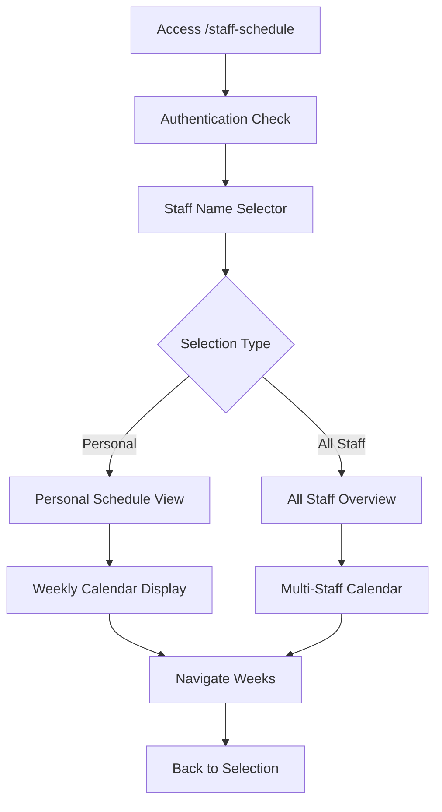
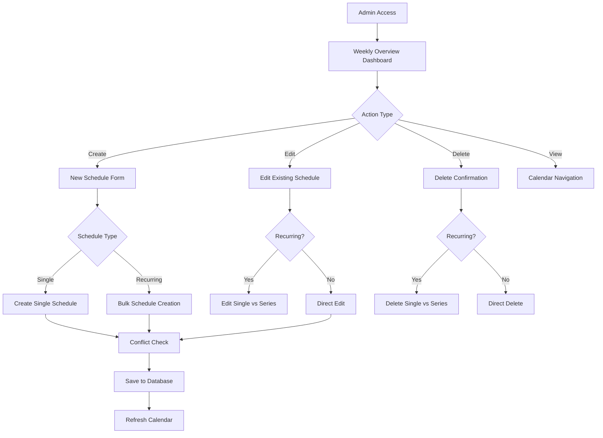
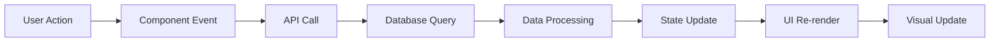

# Staff Scheduling System

## Overview

The Staff Scheduling System is a comprehensive solution for managing staff work schedules at Lengolf Golf Academy. It provides both staff and administrative interfaces for viewing, creating, and managing work schedules with real-time updates, visual calendar displays, and automated notifications.

## Table of Contents

1. [System Architecture](#system-architecture)
2. [Staff Schedule View (`/staff-schedule`)](#staff-schedule-view-staff-schedule)
3. [Admin Staff Scheduling (`/admin/staff-scheduling`)](#admin-staff-scheduling-admin-staff-scheduling)
4. [Database Schema](#database-schema)
5. [API Endpoints](#api-endpoints)
6. [Components Overview](#components-overview)
7. [Authentication & Authorization](#authentication--authorization)
8. [Features & Capabilities](#features--capabilities)
9. [Technical Implementation](#technical-implementation)
10. [Troubleshooting](#troubleshooting)

## System Architecture

The Staff Scheduling System follows a dual-interface approach:

```
┌─────────────────────────────────────────────────────────────┐
│                Staff Scheduling System                      │
├─────────────────────────────────────────────────────────────┤
│  Staff Interface (/staff-schedule)                         │
│  ├── Personal schedule viewing                             │
│  ├── All staff schedule overview                           │
│  ├── Weekly/monthly navigation                             │
│  └── Staff name selector                                   │
├─────────────────────────────────────────────────────────────┤
│  Admin Interface (/admin/staff-scheduling)                 │
│  ├── Schedule creation & editing                           │
│  ├── Weekly overview with coverage analysis                │
│  ├── Staff hours tracking & optimization                   │
│  ├── Recurring schedule management                         │
│  ├── Conflict detection & resolution                       │
│  └── Advanced calendar visualization                       │
├─────────────────────────────────────────────────────────────┤
│  Shared Components                                          │
│  ├── Calendar visualization components                     │
│  ├── Schedule form modals                                  │
│  ├── Staff color assignment system                         │
│  └── Time calculation utilities                            │
└─────────────────────────────────────────────────────────────┘
```

## Staff Schedule View (`/staff-schedule`)

### Purpose
The staff schedule view allows employees to view their personal work schedules and see overview of all staff schedules. This is a **non-administrative** interface focused on schedule viewing rather than management.

### Access
- **URL**: `http://localhost:3000/staff-schedule`
- **Navigation**: Available in "Daily Operations" section of the main menu
- **Authentication**: Requires valid session, **no admin privileges needed**
- **Route Protection**: `requireAdmin={false}`

### Key Features

#### 1. Staff Name Selector
```typescript
// Components: StaffNameSelector.tsx
interface StaffNameSelector {
  onStaffSelect: (staff: Staff) => void
  onViewAllStaff: () => void
}
```

**Features:**
- **Personal Schedule**: Staff can select their own name to view personal schedules
- **All Staff View**: Option to view all staff schedules in overview mode
- **Session Persistence**: Remembers last selection using sessionStorage
- **Search & Filter**: Quick staff member lookup
- **Responsive Design**: Mobile-optimized interface

#### 2. Personal Schedule View
```typescript
interface StaffScheduleView {
  selectedStaff: Staff | null
  viewAllStaff: boolean
  onBackToSelection: () => void
}
```

**Capabilities:**
- **Weekly Calendar**: Clean weekly view of personal shifts
- **Schedule Details**: Start/end times, locations, notes
- **Recurring Indicators**: Visual markers for recurring shifts
- **Navigation**: Week-by-week browsing
- **Schedule Information**: Duration, break times, special notes

#### 3. All Staff Overview
- **Multi-Staff View**: See all staff schedules simultaneously
- **Color Coding**: Each staff member has unique colors
- **Coverage Analysis**: Visual gaps and overlaps
- **Shift Summaries**: Quick overview of who's working when

### Usage Workflow



### Component Structure

```
app/staff-schedule/
├── page.tsx                    # Main page component
└── components/staff-schedule/
    ├── StaffNameSelector.tsx   # Staff selection interface
    ├── StaffScheduleView.tsx   # Main schedule display
    ├── ScheduleCard.tsx        # Individual schedule cards
    └── ShiftDetailModal.tsx    # Schedule detail popups
```

## Admin Staff Scheduling (`/admin/staff-scheduling`)

### Purpose
The administrative interface provides comprehensive staff scheduling management with advanced features for schedule creation, editing, conflict resolution, and coverage optimization.

### Access
- **URL**: `http://localhost:3000/admin/staff-scheduling`
- **Navigation**: Available in admin menu
- **Authentication**: **Requires admin privileges**
- **Route Protection**: `requireAdmin={true}`, redirects to `/staff-schedule` if not admin

### Key Features

#### 1. Weekly Schedule Overview
```typescript
interface ScheduleOverview {
  week_period: {
    start_date: string
    end_date: string
  }
  kpis: {
    total_staff: number
    scheduled_shifts: number
    staff_scheduled: number
    coverage_percentage: number
    conflicts_count: number
  }
  schedule_grid: { [date: string]: ScheduleEntry[] }
  conflicts: ConflictEntry[]
  raw_schedules: ScheduleEntry[]
}
```

**Dashboard Components:**
- **Week Navigation**: Previous/Next/Today navigation
- **KPI Metrics**: Coverage percentage, total shifts, conflicts
- **Schedule Grid**: Visual weekly calendar with all staff
- **Staff Hours Summary**: Weekly hour totals with optimization indicators

#### 2. Advanced Calendar Visualization
```typescript
// Component: CleanScheduleView.tsx
interface CleanScheduleView {
  scheduleData: ScheduleOverview
  staffAssignments: StaffColorAssignment[]
  weekStart: string
  loading?: boolean
  onEditSchedule?: (schedule: any) => void
}
```

**Visual Features:**
- **Staff Color Legend**: Each staff member assigned unique colors
- **Time Grid**: 10am-11pm hourly slots (business hours)
- **Schedule Blocks**: Visual representation with precise duration
- **Hover Tooltips**: Detailed schedule information on hover
- **Click-to-Edit**: Direct schedule editing from calendar
- **Recurring Indicators**: Visual markers for recurring schedules
- **Overlap Resolution**: Smart positioning for concurrent schedules

#### 3. Schedule Creation & Editing

**Schedule Form Modal:**
```typescript
interface ScheduleFormProps {
  isOpen: boolean
  onClose: () => void
  onSubmit: (schedule: Schedule | BulkSchedule, editType?: 'single' | 'series') => Promise<void>
  onDelete?: (schedule: Schedule) => void
  schedule?: Schedule | null
  title?: string
}
```

**Form Features:**
- **Staff Selection**: Dropdown with all active staff
- **Date & Time**: Date picker with time inputs
- **Recurring Schedules**: "Make Recurring" functionality
- **Notes & Location**: Additional schedule details
- **Delete Functionality**: Schedule removal with confirmation
- **Validation**: Time conflicts and business rule checking

#### 4. Recurring Schedule Management

**Recurring Schedule Creation:**
```typescript
interface BulkSchedule {
  staff_id: number
  start_date: string
  end_date: string
  start_time: string
  end_time: string
  days_of_week: number[] // 0 = Sunday, 1 = Monday, etc.
  notes?: string
}
```

**Capabilities:**
- **Day Selection**: Choose specific days of the week
- **Date Range**: Set start and end dates for recurrence
- **Preview**: Shows schedule summary before creation
- **Bulk Operations**: Create multiple schedules efficiently

#### 5. Conflict Detection & Resolution
```typescript
interface ConflictEntry {
  type: 'time_overlap'
  staff_id: number
  staff_name: string
  date: string
  conflicting_schedules: Array<{
    id: string
    time: string
    location?: string
  }>
}
```

**Conflict Management:**
- **Real-time Detection**: Automatic conflict checking
- **Visual Indicators**: Highlighted conflicting schedules
- **Resolution Suggestions**: Automated conflict resolution options
- **Override Capabilities**: Admin override for special cases

#### 6. Coverage Analysis
```typescript
interface DayCoverage {
  coveragePercentage: number
  coverageGaps: Array<{
    start_time: string
    end_time: string
    duration: number
  }>
  totalBusinessHours: number
  coveredHours: number
}
```

**Analysis Features:**
- **Coverage Percentage**: Daily and weekly coverage metrics
- **Gap Identification**: Uncovered time periods
- **Optimization Suggestions**: Staff scheduling recommendations
- **Visual Indicators**: Color-coded coverage status

### Administrative Workflow



## Database Schema

### Primary Tables

#### `backoffice.staff_schedules`
```sql
CREATE TABLE backoffice.staff_schedules (
    id UUID PRIMARY KEY DEFAULT gen_random_uuid(),
    staff_id INTEGER NOT NULL REFERENCES backoffice.staff(id),
    schedule_date DATE NOT NULL,
    start_time TIME NOT NULL,
    end_time TIME NOT NULL,
    location TEXT,
    notes TEXT,
    is_recurring BOOLEAN DEFAULT FALSE,
    recurring_group_id UUID,
    created_at TIMESTAMP WITH TIME ZONE DEFAULT NOW(),
    updated_at TIMESTAMP WITH TIME ZONE DEFAULT NOW()
);
```

#### `backoffice.staff`
```sql
CREATE TABLE backoffice.staff (
    id SERIAL PRIMARY KEY,
    staff_name TEXT NOT NULL,
    is_active BOOLEAN DEFAULT TRUE,
    position TEXT,
    employee_id TEXT UNIQUE,
    created_at TIMESTAMP WITH TIME ZONE DEFAULT NOW()
);
```

### Database Functions

#### `get_staff_schedule(p_staff_id, p_start_date, p_end_date)`
```sql
-- Returns schedule data for specified staff and date range
-- Used by both staff and admin interfaces
```

#### `check_schedule_conflict(p_staff_id, p_schedule_date, p_start_time, p_end_time, p_exclude_schedule_id)`
```sql
-- Checks for scheduling conflicts
-- Returns boolean indicating if conflict exists
```

### Indexes
```sql
-- Performance optimization indexes
CREATE INDEX idx_staff_schedules_staff_date ON backoffice.staff_schedules(staff_id, schedule_date);
CREATE INDEX idx_staff_schedules_date_range ON backoffice.staff_schedules(schedule_date, start_time, end_time);
CREATE INDEX idx_staff_schedules_recurring ON backoffice.staff_schedules(recurring_group_id) WHERE recurring_group_id IS NOT NULL;
```

## API Endpoints

### Staff Schedule API (`/api/staff-schedule/`)

#### `GET /api/staff-schedule/staff`
**Purpose**: Get list of all active staff members
```typescript
// Response
{
  success: true,
  data: {
    staff: Array<{
      id: number
      name: string
    }>
  }
}
```

#### `GET /api/staff-schedule/schedules`
**Purpose**: Get schedules for specific staff and date range
```typescript
// Query Parameters
{
  staff_id?: number
  start_date: string  // YYYY-MM-DD
  end_date: string    // YYYY-MM-DD
}

// Response
{
  success: true,
  data: {
    schedules: Array<ScheduleEntry>
  }
}
```

### Admin Staff Scheduling API (`/api/admin/staff-scheduling/`)

#### `GET /api/admin/staff-scheduling/overview`
**Purpose**: Get comprehensive weekly overview with KPIs
```typescript
// Query Parameters
{
  week_start: string  // YYYY-MM-DD
}

// Response
{
  success: true,
  data: ScheduleOverview
}
```

#### `POST /api/admin/staff-scheduling/schedules`
**Purpose**: Create new schedule
```typescript
// Request Body
{
  staff_id: number
  schedule_date: string
  start_time: string
  end_time: string
  location?: string
  notes?: string
}

// Response
{
  success: true,
  data: ScheduleEntry
}
```

#### `PUT /api/admin/staff-scheduling/schedules/[id]`
**Purpose**: Update existing schedule
```typescript
// Request Body
{
  staff_id: number
  schedule_date: string
  start_time: string
  end_time: string
  location?: string
  notes?: string
  editType?: 'single' | 'series'  // For recurring schedules
}
```

#### `DELETE /api/admin/staff-scheduling/schedules/[id]`
**Purpose**: Delete schedule
```typescript
// Request Body
{
  deleteType?: 'single' | 'series'  // For recurring schedules
}
```

#### `POST /api/admin/staff-scheduling/bulk`
**Purpose**: Create recurring schedules
```typescript
// Request Body
{
  operation: 'create_recurring_days'
  data: BulkSchedule
}
```

### API Features
- **Cache Prevention**: All APIs use `no-cache` headers to prevent stale data
- **Error Handling**: Comprehensive error responses with specific error codes
- **Validation**: Input validation for dates, times, and business rules
- **Authentication**: Session-based auth with development bypass support
- **Rate Limiting**: Built-in rate limiting for API protection

## Components Overview

### Shared Components

#### `CleanScheduleView.tsx`
**Purpose**: Advanced calendar visualization component
```typescript
interface CleanScheduleViewProps {
  scheduleData: ScheduleOverview
  staffAssignments: StaffColorAssignment[]
  weekStart: string
  loading?: boolean
  onEditSchedule?: (schedule: any) => void
}
```

**Features:**
- **Visual Calendar**: 10am-11pm time grid
- **Staff Color Coding**: Unique colors for each staff member
- **Schedule Blocks**: Precise visual representation with duration
- **Interactive Elements**: Click-to-edit, hover tooltips
- **Responsive Design**: Mobile and desktop optimized
- **Overlap Resolution**: Smart positioning for concurrent schedules

#### `ScheduleForm.tsx`
**Purpose**: Modal form for schedule creation and editing
```typescript
interface ScheduleFormProps {
  isOpen: boolean
  onClose: () => void
  onSubmit: (schedule: Schedule | BulkSchedule, editType?: 'single' | 'series') => Promise<void>
  onDelete?: (schedule: Schedule) => void
  schedule?: Schedule | null
  title?: string
}
```

**Capabilities:**
- **Create/Edit Modes**: Supports both new and existing schedules
- **Recurring Options**: "Make Recurring" functionality
- **Delete Integration**: Built-in delete with confirmation
- **Validation**: Real-time input validation
- **Responsive Modal**: Mobile-friendly modal design

#### `WeeklyCalendarGrid.tsx`
**Purpose**: Compact weekly schedule overview
```typescript
interface WeeklyCalendarGridProps {
  scheduleGrid: { [date: string]: any[] }
  weekStart: string
  onEditSchedule: (schedule: any) => void
  onDeleteSchedule: (schedule: any) => void
  staffAssignments: StaffColorAssignment[]
  allStaff: Array<{ id: number; staff_name: string }>
  overview: ScheduleOverview | null
}
```

**Features:**
- **Grid Layout**: 7-day weekly view
- **Schedule Cards**: Compact schedule representations
- **Coverage Indicators**: Visual coverage status
- **OFF Day Tracking**: Shows staff who are off
- **Expandable Days**: Collapsible day details for mobile

### Staff-Specific Components

#### `StaffNameSelector.tsx`
**Purpose**: Staff selection interface for `/staff-schedule`
```typescript
interface StaffNameSelectorProps {
  onStaffSelect: (staff: Staff) => void
  onViewAllStaff: () => void
}
```

#### `StaffScheduleView.tsx`
**Purpose**: Main schedule display for staff interface
```typescript
interface StaffScheduleViewProps {
  selectedStaff: Staff | null
  viewAllStaff: boolean
  onBackToSelection: () => void
}
```

### Utility Components

#### `staff-colors.ts`
**Purpose**: Staff color assignment system
```typescript
interface StaffColorAssignment {
  staffId: number
  staffName: string
  color: {
    bg: string
    text: string
    border: string
    hex: string
  }
}

// Functions
generateStaffColorAssignments(staff: Staff[]): StaffColorAssignment[]
getStaffColor(staffId: number, assignments: StaffColorAssignment[]): ColorInfo
```

## Authentication & Authorization

### Access Control Matrix

| Feature | Staff Access | Admin Access | Notes |
|---------|-------------|-------------|-------|
| View Personal Schedule | ✅ | ✅ | All authenticated users |
| View All Staff Schedules | ✅ | ✅ | Read-only for staff |
| Create Schedules | ❌ | ✅ | Admin only |
| Edit Schedules | ❌ | ✅ | Admin only |
| Delete Schedules | ❌ | ✅ | Admin only |
| Manage Recurring | ❌ | ✅ | Admin only |
| Coverage Analysis | ❌ | ✅ | Admin only |

### Route Protection
```typescript
// Staff Schedule - Non-admin access
<RouteProtection requireAdmin={false}>
  <StaffSchedulePage />
</RouteProtection>

// Admin Scheduling - Admin required
<RouteProtection requireAdmin={true} redirectTo="/staff-schedule">
  <AdminStaffSchedulingDashboard />
</RouteProtection>
```

### Development Authentication
- **Development Bypass**: `SKIP_AUTH=true` bypasses all authentication
- **Production Safety**: Multiple environment checks prevent accidental bypass
- **Session Management**: Proper session handling in all environments

## Features & Capabilities

### 1. Visual Schedule Management

#### Time Grid System
- **Business Hours**: 10am-11pm coverage (14-hour window)
- **Precise Timing**: Minute-level accuracy for schedule positioning
- **Visual Duration**: Exact visual representation of shift lengths
- **Grid Alignment**: Perfect alignment between time labels and schedule blocks

#### Staff Color Coding
```typescript
const STAFF_COLORS = [
  { bg: 'bg-blue-100', border: 'border-blue-300', text: 'text-blue-900', hex: '#3b82f6' },
  { bg: 'bg-green-100', border: 'border-green-300', text: 'text-green-900', hex: '#10b981' },
  { bg: 'bg-purple-100', border: 'border-purple-300', text: 'text-purple-900', hex: '#8b5cf6' },
  // ... additional colors
]
```

### 2. Schedule Creation Workflows

#### Single Schedule Creation
1. **Staff Selection**: Choose from active staff list
2. **Date Selection**: Date picker with validation
3. **Time Entry**: Start/end time with conflict checking
4. **Details**: Optional location and notes
5. **Validation**: Business rule checking
6. **Confirmation**: Save with automatic refresh

#### Recurring Schedule Creation
1. **Basic Info**: Staff, start date, times
2. **Recurrence Pattern**: Select days of week
3. **End Date**: Define recurrence end
4. **Preview**: Show summary of schedules to create
5. **Bulk Creation**: Generate all recurring instances

### 3. Advanced Management Features

#### Conflict Resolution
- **Real-time Detection**: Immediate conflict checking on input
- **Visual Indicators**: Highlight conflicting schedules
- **Override Options**: Admin ability to override for special cases
- **Suggestion Engine**: Automated resolution suggestions

#### Coverage Optimization
- **Gap Analysis**: Identify uncovered time periods
- **Staff Utilization**: Track hours per staff member
- **Optimization Alerts**: Suggest schedule improvements
- **Performance Metrics**: Coverage percentage tracking

### 4. User Experience Features

#### Mobile Responsiveness
- **Responsive Grid**: Adapts to screen size
- **Touch Interactions**: Mobile-optimized interactions
- **Collapsible Sections**: Space-efficient mobile layout
- **Fast Loading**: Optimized for mobile networks

#### Performance Optimization
- **Lazy Loading**: Components loaded on demand
- **Efficient Queries**: Optimized database queries
- **Caching Strategy**: Smart data caching
- **Real-time Updates**: Immediate UI updates after changes

## Technical Implementation

### State Management
```typescript
// Main scheduling state
const [overview, setOverview] = useState<ScheduleOverview | null>(null)
const [staffAssignments, setStaffAssignments] = useState<StaffColorAssignment[]>([])
const [weekStart, setWeekStart] = useState<string>(getCurrentMonday())

// Form states
const [isFormOpen, setIsFormOpen] = useState(false)
const [editingSchedule, setEditingSchedule] = useState<any>(null)
const [isDeleteDialogOpen, setIsDeleteDialogOpen] = useState(false)
```

### Data Flow Architecture


### Performance Optimizations

#### Database Optimizations
- **Indexed Queries**: Strategic database indexes for fast queries
- **Efficient Joins**: Optimized table joins for schedule data
- **Query Caching**: Temporary caching for repeated queries
- **Batch Operations**: Bulk operations for recurring schedules

#### Frontend Optimizations
- **Component Memoization**: React.memo for expensive components
- **Efficient Re-renders**: Optimized state updates
- **Lazy Loading**: On-demand component loading
- **Cache Busting**: Prevents stale data issues

### Error Handling

#### Client-Side Error Handling
```typescript
try {
  await createSchedule(scheduleData)
  setSuccess('Schedule created successfully')
} catch (error) {
  setError(error.message || 'Failed to create schedule')
  // Rollback UI state if needed
}
```

#### Server-Side Error Handling
```typescript
// API error responses
{
  success: false,
  error: "Specific error message",
  code: "ERROR_CODE",
  details: {...}
}
```

### Cache Management

#### API Cache Prevention
```typescript
// All scheduling APIs use no-cache headers
headers: {
  'Cache-Control': 'no-cache, no-store, must-revalidate',
  'Pragma': 'no-cache',
  'Expires': '0'
}
```

#### Frontend Cache Busting
```typescript
// Timestamp-based cache busting
const response = await fetch(`/api/admin/staff-scheduling/overview?week_start=${weekStart}&_t=${Date.now()}`, {
  cache: 'no-store',
  headers: { 'Cache-Control': 'no-cache' }
})
```

## Troubleshooting

### Common Issues

#### 1. Schedules Not Updating After Changes
**Problem**: UI doesn't refresh after creating/editing schedules
**Cause**: Browser or API caching
**Solution**: 
- Implemented cache-busting with timestamps
- No-cache headers on all API responses
- Force component re-render with refresh keys

#### 2. Visual Duration Misalignment
**Problem**: Schedule blocks don't match actual duration (e.g., 8-hour shift shows as 7.5 hours)
**Cause**: Imprecise time calculations
**Solution**:
```typescript
// Fixed with precise minute-based calculations
const startMinutes = timeToMinutes(schedule.start_time)
const endMinutes = timeToMinutes(schedule.end_time)
const preciseDuration = (endMinutes - startMinutes) / 60
const height = preciseDuration * 48 // 48px per hour
```

#### 3. Recurring Schedule Edit Issues
**Problem**: Editing recurring schedules affects wrong instances
**Cause**: Unclear edit scope
**Solution**: 
- Clear "Edit Single vs Series" modal
- Separate handling for single and series edits
- Visual indicators for recurring schedules

#### 4. Staff Color Consistency
**Problem**: Staff colors change between views
**Cause**: Dynamic color assignment
**Solution**:
- Consistent color assignment algorithm
- Color persistence across sessions
- Fallback colors for new staff

### Debug Tools

#### Development Mode Features
```typescript
// Debug staff status
if (process.env.NODE_ENV === 'development') {
  const urlParams = new URLSearchParams(window.location.search)
  if (urlParams.get('debug_staff') === 'true') {
    debugStaffStatus(allStaff, scheduleStaff, 'david')
  }
}
```

#### Console Logging
- **API Calls**: Request/response logging
- **State Changes**: Component state debugging
- **Performance**: Timing for critical operations

### Performance Monitoring
```typescript
// Built-in performance monitoring
const { data } = await performanceMonitor.measureAsync('admin.fetchOverview', async () => {
  return await fetchScheduleOverview(weekStart)
}, { weekStart })
```

## Future Enhancements

### Planned Features
1. **Mobile App Integration**: Native mobile app support
2. **Push Notifications**: Schedule change notifications
3. **Calendar Sync**: Integration with personal calendars
4. **Shift Trading**: Staff-to-staff shift exchanges
5. **Time Clock Integration**: Link with time tracking system

### Technical Improvements
1. **Real-time Updates**: WebSocket-based live updates
2. **Offline Support**: PWA capabilities
3. **Export Features**: PDF/Excel schedule exports
4. **Advanced Analytics**: Detailed scheduling analytics
5. **API v2**: Enhanced API with GraphQL

---

## System Status

**Last Updated**: January 2025  
**Version**: 1.0  
**Status**: ✅ Production Ready

### Implementation Status
- ✅ **Staff Schedule View**: Complete with responsive design
- ✅ **Admin Scheduling**: Full CRUD operations with advanced features
- ✅ **Calendar Visualization**: Clean, precise calendar components
- ✅ **Recurring Schedules**: Bulk creation and management
- ✅ **Conflict Detection**: Real-time conflict checking
- ✅ **Coverage Analysis**: Automated coverage tracking
- ✅ **Mobile Support**: Responsive design for all devices
- ✅ **Performance**: Optimized for fast loading and updates

### Integration Points
- **Authentication System**: NextAuth.js with role-based access
- **Database**: Supabase PostgreSQL with RLS policies
- **UI Framework**: Tailwind CSS with Radix UI components
- **State Management**: React hooks with optimized re-rendering
- **API Layer**: Next.js API routes with comprehensive error handling

This documentation provides complete coverage of the Staff Scheduling System, enabling developers, administrators, and users to effectively understand and utilize the system's capabilities.