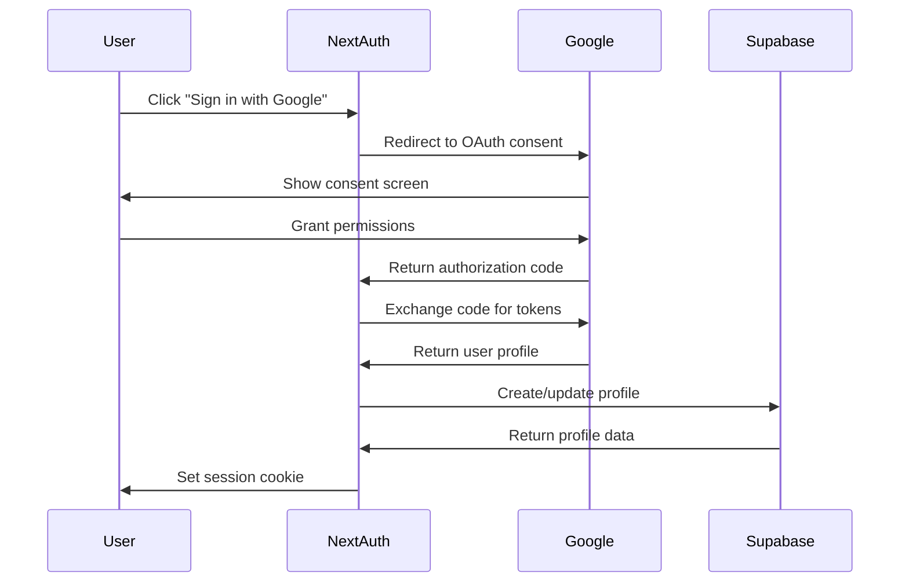
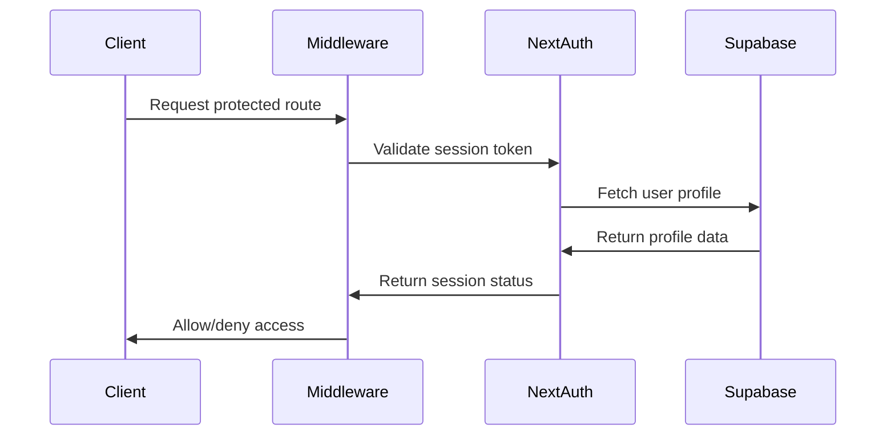

# Authentication System Documentation

## Overview

The Lengolf Forms authentication system is built on NextAuth.js v5 with Google OAuth as the primary authentication provider. The system implements a binary role-based access control with user profiles stored in Supabase, session management, and middleware-based route protection.

## Architecture

### Authentication Stack

- **NextAuth.js v5**: Core authentication framework
- **Google OAuth 2.0**: Primary authentication provider
- **Supabase**: User profile and session storage
- **JWT Tokens**: Session token management
- **Middleware**: Route protection and authorization

### Database Integration

#### Profiles Table
The system maintains user profiles in Supabase with Google OAuth integration:

```sql
CREATE TABLE profiles (
    id UUID PRIMARY KEY,
    email TEXT,
    display_name TEXT,
    phone_number TEXT,
    provider TEXT,
    provider_id TEXT UNIQUE,
    picture_url TEXT,
    updated_at TIMESTAMPTZ,
    marketing_preference BOOLEAN DEFAULT true,
    vip_customer_data_id UUID REFERENCES vip_customer_data(id)
);
```

**Key Fields**:
- `provider_id`: Google OAuth user ID for unique identification
- `vip_customer_data_id`: Links to VIP customer system
- `marketing_preference`: User consent for marketing communications

### Authentication Flow

#### 1. Initial Login


#### 2. Session Validation


## Configuration

### Environment Variables

```bash
# NextAuth Configuration
NEXTAUTH_URL=https://your-domain.com
NEXTAUTH_SECRET=your-nextauth-secret

# Google OAuth
GOOGLE_CLIENT_ID=your-google-client-id
GOOGLE_CLIENT_SECRET=your-google-client-secret

# Supabase
NEXT_PUBLIC_SUPABASE_URL=your-supabase-url
NEXT_PUBLIC_SUPABASE_ANON_KEY=your-supabase-anon-key
SUPABASE_SERVICE_ROLE_KEY=your-supabase-service-role-key
```

### NextAuth Configuration

```typescript
// auth.config.ts
import { NextAuthConfig } from 'next-auth';
import Google from 'next-auth/providers/google';

export const authConfig: NextAuthConfig = {
  providers: [
    Google({
      clientId: process.env.GOOGLE_CLIENT_ID!,
      clientSecret: process.env.GOOGLE_CLIENT_SECRET!,
      authorization: {
        params: {
          scope: 'openid email profile',
          prompt: 'consent',
          access_type: 'offline',
          response_type: 'code'
        }
      }
    })
  ],
  pages: {
    signIn: '/auth/signin',
    error: '/auth/error'
  },
  callbacks: {
    authorized({ auth, request: { nextUrl } }) {
      const isLoggedIn = !!auth?.user;
      const isOnProtectedRoute = nextUrl.pathname.startsWith('/admin') || 
                                nextUrl.pathname.startsWith('/booking');
      
      if (isOnProtectedRoute) {
        if (isLoggedIn) return true;
        return false; // Redirect unauthenticated users to login page
      }
      
      return true;
    },
    jwt({ token, user, account }) {
      if (account && user) {
        token.accessToken = account.access_token;
        token.provider_id = account.providerAccountId;
      }
      return token;
    },
    session({ session, token }) {
      session.accessToken = token.accessToken;
      session.provider_id = token.provider_id;
      return session;
    }
  }
};
```

## Role-Based Access Control

### Multi-Role System

The system implements a comprehensive role-based access control with three primary roles:

#### User Role Types

1. **Admin Users** (`is_admin: true`)
   - Full system access including admin features
   - Can access all coaching functionality
   - System-wide management capabilities

2. **Coach Users** (`is_coach: true`)
   - Access to coaching portal (`/coaching`)
   - View own coaching data and students
   - Manage personal availability and earnings

3. **Coach + Admin Users** (`is_coach: true, is_admin: true`)
   - Combined access to both roles
   - Can switch between coach and admin views
   - Full system privileges

#### Role Identification

Roles are stored in the Supabase `backoffice.allowed_users` table:

```sql
CREATE TABLE backoffice.allowed_users (
  id UUID PRIMARY KEY DEFAULT gen_random_uuid(),
  email TEXT UNIQUE NOT NULL,
  is_admin BOOLEAN DEFAULT false,
  is_coach BOOLEAN DEFAULT false,
  coach_name TEXT,
  coach_display_name TEXT,
  created_at TIMESTAMP DEFAULT NOW()
);
```

#### Role Check Functions

```typescript
// src/lib/auth.ts
export async function isUserAdmin(email: string): Promise<boolean> {
  if (isDevAuthBypassEnabled()) return true;
  
  const { data, error } = await refacSupabaseAdmin
    .schema('backoffice')
    .from('allowed_users')
    .select('is_admin')
    .eq('email', email.toLowerCase())
    .single();
    
  return data?.is_admin === true;
}

export async function isUserCoach(email: string): Promise<boolean> {
  if (isDevAuthBypassEnabled()) return true;
  
  const { data, error } = await refacSupabaseAdmin
    .schema('backoffice')
    .from('allowed_users')
    .select('is_coach')
    .eq('email', email.toLowerCase())
    .single();
    
  return data?.is_coach === true;
}
```

#### NextAuth Integration

```typescript
// src/lib/auth-config.ts
export const authOptions: NextAuthOptions = {
  callbacks: {
    async jwt({ token, user }) {
      if (user?.email) {
        const adminStatus = await isUserAdmin(user.email);
        const coachStatus = await isUserCoach(user.email);
        token.isAdmin = adminStatus;
        token.isCoach = coachStatus;
      }
      return token;
    },
    async session({ session, token }) {
      if (session.user) {
        session.user.isAdmin = token.isAdmin;
        session.user.isCoach = token.isCoach;
      }
      return session;
    }
  }
};
```

### Access Control Implementation

#### Middleware-Level Protection

```typescript
// middleware.ts
async function customMiddleware(request: NextRequest, event: NextFetchEvent) {
  return withAuth(
    async (req) => {
      // Role-based access control for coaches
      if (req.nextUrl.pathname.startsWith('/coaching')) {
        // Coaching portal access - allow coaches and admins
        return NextResponse.next();
      } else if (req.nextUrl.pathname !== '/coaching' && req.nextUrl.pathname !== '/') {
        // Check if user is coach-only
        const { data: user } = await supabase
          .schema('backoffice')
          .from('allowed_users')
          .select('is_coach, is_admin')
          .eq('email', req.nextauth.token?.email)
          .single();

        // Redirect coach-only users to coaching portal
        if (user?.is_coach && !user?.is_admin) {
          return NextResponse.redirect(new URL('/coaching', req.url));
        }
      }
      
      return NextResponse.next();
    }
  )(request as NextRequestWithAuth, event);
}
```

#### API Route Protection

```typescript
// Protected API pattern
export async function GET(request: NextRequest) {
  const session = await getDevSession(authOptions, request);
  if (!session?.user?.email) {
    return NextResponse.json({ error: 'Unauthorized' }, { status: 401 });
  }

  const { data: currentUser } = await supabase
    .schema('backoffice')
    .from('allowed_users')
    .select('is_admin, is_coach')
    .eq('email', session.user.email)
    .single();

  // Different access patterns based on endpoint
  if (request.nextUrl.pathname.startsWith('/api/admin/')) {
    if (!currentUser.is_admin) {
      return NextResponse.json({ error: 'Admin access required' }, { status: 403 });
    }
  } else if (request.nextUrl.pathname.startsWith('/api/coaching/')) {
    if (!currentUser.is_coach && !currentUser.is_admin) {
      return NextResponse.json({ error: 'Coach or admin access required' }, { status: 403 });
    }
  }
}
```

### Route Protection

#### Coach-Only Routes
- `/coaching`: Personal coaching dashboard
- `/coaching/availability`: Coach availability management

#### Admin Routes
- `/admin/*`: Admin panel and management features
- `/admin/coaching`: Admin coaching portal
- `/booking/*`: Booking management (admin only)
- `/inventory/*`: Inventory management (staff/admin)
- `/crm/*`: Customer relationship management (admin only)

#### Shared Routes (Coach + Admin)
- `/api/coaching/*`: Coaching API endpoints (role-specific data)

#### Public Routes
- `/`: Home page (coaches auto-redirected to coaching portal)
- `/auth/*`: Authentication pages
- `/api/bookings/create`: Public booking creation
- `/api/availability`: Public availability checking

### Navigation Control

```typescript
// Navigation component with role-based visibility
const isAdmin = session?.user?.isAdmin || false;
const isCoach = session?.user?.isCoach || false;

// Coaching portal link for coaches
{isCoach && (
  <Link href="/coaching">
    <Button>Coaching Portal</Button>
  </Link>
)}

// Admin dropdown with full admin features
{isAdmin && (
  <DropdownMenu>
    <DropdownMenuItem>
      <Link href="/admin/coaching">Coaching Portal</Link>
    </DropdownMenuItem>
    {/* Other admin items */}
  </DropdownMenu>
)}
```

### Client-Side Protection

```typescript
// CoachRedirect component for automatic redirects
export function CoachRedirect() {
  const { data: session, status } = useSession();
  const router = useRouter();

  useEffect(() => {
    if (status === 'authenticated' && session?.user) {
      // Redirect coach-only users to coaching portal
      if (session.user.isCoach && !session.user.isAdmin) {
        router.replace('/coaching');
      }
    }
  }, [session, status, router]);

  return null;
}
```

## User Profile Management

### Profile Creation Flow

#### First-Time User
1. **OAuth Authentication**: User authenticates with Google
2. **Profile Creation**: System creates profile in Supabase
3. **Customer Matching**: Attempt to match with existing CRM customer
4. **VIP Linking**: Link to VIP customer data if applicable
5. **Session Creation**: Create authenticated session

#### Returning User
1. **OAuth Validation**: Validate existing OAuth session
2. **Profile Update**: Update profile with latest Google data
3. **Session Refresh**: Refresh authentication session

### Profile Update Logic

```typescript
async function createOrUpdateProfile(googleUser: GoogleUser) {
  const { data: existingProfile } = await supabase
    .from('profiles')
    .select('*')
    .eq('provider_id', googleUser.id)
    .single();

  const profileData = {
    email: googleUser.email,
    display_name: googleUser.name,
    picture_url: googleUser.picture,
    provider: 'google',
    provider_id: googleUser.id,
    updated_at: new Date().toISOString()
  };

  if (existingProfile) {
    // Update existing profile
    const { data: updatedProfile } = await supabase
      .from('profiles')
      .update(profileData)
      .eq('id', existingProfile.id)
      .select()
      .single();
    
    return updatedProfile;
  } else {
    // Create new profile
    const { data: newProfile } = await supabase
      .from('profiles')
      .insert({
        ...profileData,
        id: uuidv4()
      })
      .select()
      .single();
    
    // Trigger CRM customer matching
    await triggerCustomerMatching(newProfile);
    
    return newProfile;
  }
}
```

## Session Management

### Session Storage
- **JWT Tokens**: Encrypted JWT tokens for session data
- **HTTP-Only Cookies**: Secure cookie storage
- **Database Sessions**: Optional database session storage

### Session Lifecycle

#### Session Creation
```typescript
// After successful authentication
const session = {
  user: {
    id: profile.id,
    email: profile.email,
    name: profile.display_name,
    image: profile.picture_url,
    isAdmin: isAdmin(profile.email)
  },
  expires: new Date(Date.now() + 30 * 24 * 60 * 60 * 1000) // 30 days
};
```

#### Session Validation
```typescript
export async function getServerSession() {
  const session = await auth();
  
  if (!session?.user?.email) {
    return null;
  }
  
  // Validate against current profile
  const { data: profile } = await supabase
    .from('profiles')
    .select('*')
    .eq('email', session.user.email)
    .single();
  
  if (!profile) {
    return null;
  }
  
  return {
    ...session,
    user: {
      ...session.user,
      isAdmin: isAdmin(profile.email),
      profileId: profile.id
    }
  };
}
```

## Security Features

### CSRF Protection
- **Built-in CSRF**: NextAuth.js provides CSRF protection
- **State Parameters**: OAuth state parameter validation
- **Token Validation**: JWT token signature validation

### XSS Prevention
- **HTTP-Only Cookies**: Prevent JavaScript access to tokens
- **Secure Cookies**: HTTPS-only cookie transmission
- **Content Security Policy**: Restrict script execution

### Session Security
- **Token Rotation**: Regular token refresh
- **Secure Headers**: Security headers for authentication
- **Rate Limiting**: Prevent brute force attacks

```typescript
// Security headers
export function middleware(request: NextRequest) {
  const response = NextResponse.next();
  
  response.headers.set('X-Frame-Options', 'DENY');
  response.headers.set('X-Content-Type-Options', 'nosniff');
  response.headers.set('Referrer-Policy', 'strict-origin-when-cross-origin');
  
  return response;
}
```

## API Authentication

### Protected API Routes

#### Authentication Middleware
```typescript
// lib/auth-middleware.ts
export async function requireAuth(request: Request) {
  const session = await getServerSession();
  
  if (!session) {
    return NextResponse.json(
      { error: 'Authentication required' }, 
      { status: 401 }
    );
  }
  
  return session;
}

export async function requireAdmin(request: Request) {
  const session = await requireAuth(request);
  
  if (session instanceof NextResponse) {
    return session; // Auth failed
  }
  
  if (!session.user.isAdmin) {
    return NextResponse.json(
      { error: 'Admin access required' }, 
      { status: 403 }
    );
  }
  
  return session;
}
```

#### API Route Protection
```typescript
// app/api/admin/bookings/route.ts
export async function GET(request: Request) {
  const authResult = await requireAdmin(request);
  
  if (authResult instanceof NextResponse) {
    return authResult; // Return error response
  }
  
  // Continue with protected logic
  const bookings = await getBookings();
  return NextResponse.json(bookings);
}
```

## Error Handling

### Authentication Errors

#### Common Error Types
- **Invalid Credentials**: Google OAuth failure
- **Expired Session**: Token expiration
- **Permission Denied**: Insufficient privileges
- **Profile Not Found**: Missing user profile

#### Error Handling Strategy
```typescript
export function handleAuthError(error: AuthError) {
  switch (error.type) {
    case 'OAuthAccountNotLinked':
      return redirect('/auth/link-account');
    
    case 'AccessDenied':
      return redirect('/auth/access-denied');
    
    case 'SessionRequired':
      return redirect('/auth/signin');
    
    default:
      console.error('Auth error:', error);
      return redirect('/auth/error');
  }
}
```

### Error Pages

#### Custom Error Pages
- `/auth/signin`: Custom sign-in page
- `/auth/error`: Authentication error page
- `/auth/access-denied`: Access denied page
- `/unauthorized`: Unauthorized access page

## Monitoring and Logging

### Authentication Logs

#### Login Events
```typescript
async function logAuthEvent(event: AuthEvent) {
  await supabase.from('auth_logs').insert({
    user_id: event.userId,
    event_type: event.type, // 'login', 'logout', 'failed_login'
    ip_address: event.ipAddress,
    user_agent: event.userAgent,
    success: event.success,
    error_message: event.error,
    created_at: new Date().toISOString()
  });
}
```

#### Security Monitoring
- **Failed Login Attempts**: Track and alert on suspicious activity
- **Session Anomalies**: Detect unusual session patterns
- **Admin Access**: Log all admin actions
- **API Access**: Monitor API authentication attempts

### Performance Monitoring

#### Session Performance
- **Authentication Time**: Track OAuth flow duration
- **Database Queries**: Monitor profile fetch performance
- **Token Validation**: Measure validation speed
- **Memory Usage**: Monitor session storage impact

## Testing

### Authentication Testing

#### Unit Tests
```typescript
// __tests__/auth.test.ts
describe('Authentication', () => {
  test('should create profile for new user', async () => {
    const mockGoogleUser = {
      id: 'google-123',
      email: 'test@example.com',
      name: 'Test User'
    };
    
    const profile = await createOrUpdateProfile(mockGoogleUser);
    
    expect(profile.email).toBe(mockGoogleUser.email);
    expect(profile.provider_id).toBe(mockGoogleUser.id);
  });
  
  test('should identify admin users correctly', () => {
    process.env.ADMIN_EMAILS = 'admin@lengolf.com';
    
    expect(isAdmin('admin@lengolf.com')).toBe(true);
    expect(isAdmin('user@example.com')).toBe(false);
  });
});
```

#### Integration Tests
```typescript
// __tests__/auth-integration.test.ts
describe('Auth Integration', () => {
  test('should protect admin routes', async () => {
    const response = await fetch('/admin/bookings', {
      headers: { 'Cookie': 'next-auth.session-token=invalid' }
    });
    
    expect(response.status).toBe(401);
  });
});
```

## Troubleshooting

### Common Issues

#### OAuth Configuration
1. **Invalid Redirect URI**: Ensure Google OAuth settings match
2. **Client ID Mismatch**: Verify environment variables
3. **Scope Issues**: Check OAuth scope configuration
4. **Domain Verification**: Ensure domain is verified with Google

#### Session Issues
1. **Cookie Problems**: Check secure/sameSite settings
2. **Token Expiration**: Verify token refresh logic
3. **Database Connectivity**: Check Supabase connection
4. **Middleware Conflicts**: Review middleware order

#### Profile Synchronization
1. **Data Inconsistency**: Manual profile cleanup
2. **CRM Linking Failures**: Check customer matching logic
3. **VIP Data Sync**: Verify VIP customer integration
4. **Permission Updates**: Refresh admin email configuration

### Debug Mode

Enable authentication debugging:
```bash
NEXTAUTH_DEBUG=true
```

This provides detailed logs for:
- OAuth flow steps
- Token validation
- Session creation/updates
- Database operations
- Error details

## Production Considerations

### Security Hardening
- **HTTPS Only**: Enforce HTTPS in production
- **Secure Cookies**: Enable secure cookie flags
- **Token Rotation**: Implement regular token refresh
- **Rate Limiting**: Add authentication rate limits

### Performance Optimization
- **Session Caching**: Cache session validation
- **Profile Caching**: Cache user profiles
- **Database Indexing**: Optimize profile queries
- **CDN Integration**: Cache static auth assets

### Monitoring and Alerts
- **Authentication Metrics**: Track login success rates
- **Security Alerts**: Monitor suspicious activities
- **Performance Monitoring**: Track authentication latency
- **Error Tracking**: Monitor authentication errors

## Future Enhancements

### Planned Features
- **Multi-Factor Authentication**: Add MFA support
- **Social Login**: Additional OAuth providers
- **Role Granularity**: More detailed permission system
- **Session Analytics**: Advanced session tracking

### Technical Improvements
- **Database Sessions**: Optional database session storage
- **Token Refresh**: Automatic token refresh
- **Audit Logging**: Comprehensive audit trails
- **Security Enhancements**: Additional security layers

---

**Last Updated**: January 2025  
**Version**: 2.1  
**Focus**: Multi-role access control and coaching integration 