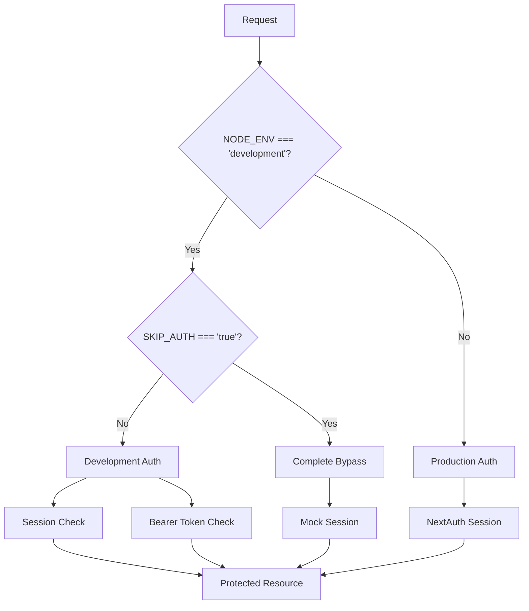

# Development Authentication System

**Lengolf Forms - Development Authentication Bypass**

---

## Document Information
- **Version**: 1.0
- **Last Updated**: January 2025
- **Status**: Production Ready
- **Document Type**: Technical Implementation Guide

---

## Overview

The Lengolf Forms development authentication system provides a comprehensive bypass mechanism for development environments while maintaining security in production. This system enables seamless development and testing workflows without compromising production authentication requirements.

### Key Features
- **Complete Authentication Bypass**: Skip all authentication checks with `SKIP_AUTH=true`
- **Bearer Token Support**: Generate JWT tokens for API testing with curl/fetch
- **Frontend Bypass**: Direct access to protected pages without Google login
- **Admin Access**: Automatic admin privileges in development mode
- **Production Safety**: Multiple safeguards prevent accidental production deployment

---

## Architecture Overview

### Core Components

```
src/lib/
├── dev-auth.ts          # Core bypass logic and mock session creation
├── dev-session.ts       # Enhanced session getter with development support
└── dev-middleware.ts    # Middleware integration for request handling

app/api/
├── dev-token/           # JWT token generation for API testing
├── debug-session/       # Session state debugging endpoint
└── debug/               # Database connectivity testing

app/admin/
└── layout.tsx           # Admin layout with bypass integration

middleware.ts            # Route protection with development bypass
```

### Authentication Flow



---

## Core Implementation

### 1. Development Bypass Logic (`src/lib/dev-auth.ts`)

The foundation of the bypass system with multiple safety checks:

```typescript
/**
 * Check if development auth bypass is enabled
 * Multiple checks prevent accidental production deployment
 */
export function isDevAuthBypassEnabled(): boolean {
  return (
    process.env.NODE_ENV === 'development' &&
    process.env.VERCEL_ENV !== 'production' &&
    process.env.SKIP_AUTH === 'true'
  );
}

/**
 * Create mock session for development
 * Matches production session structure exactly
 */
export function createMockSession(): Session {
  if (!isDevAuthBypassEnabled()) {
    throw new Error('Mock session can only be created in development');
  }

  return {
    user: {
      email: 'dev@lengolf.local',
      name: 'Development User',
      isAdmin: true,
      image: null
    },
    expires: new Date(Date.now() + 30 * 24 * 60 * 60 * 1000).toISOString()
  };
}
```

### 2. Enhanced Session Management (`src/lib/dev-session.ts`)

Unified session handling supporting multiple authentication methods:

```typescript
/**
 * Development-enhanced session getter that supports multiple auth methods
 * 
 * In production: Only NextAuth sessions work
 * In development: 
 *   - NextAuth sessions (browser/cookies)
 *   - Bearer tokens from /api/dev-token
 *   - Complete auth bypass (if SKIP_AUTH=true)
 */
export async function getDevSession(
  authOptions: NextAuthOptions,
  request?: NextRequest
) {
  // Check for complete development bypass first
  if (isDevAuthBypassEnabled()) {
    return createMockSession();
  }
  
  // Try NextAuth session first (works for browser/Puppeteer with cookies)
  const session = await getServerSession(authOptions);
  if (session) {
    return session;
  }

  // In development, also try Bearer token (works for API testing)
  if (process.env.NODE_ENV === 'development' && request) {
    const authHeader = request.headers.get('Authorization');
    if (authHeader?.startsWith('Bearer ')) {
      const token = authHeader.substring(7);
      try {
        const secret = new TextEncoder().encode(process.env.NEXTAUTH_SECRET!);
        const { payload } = await jwtVerify(token, secret);
        
        // Return session-like object that matches NextAuth structure
        return {
          user: {
            email: payload.email as string,
            isAdmin: payload.isAdmin as boolean,
            name: payload.name as string,
            picture: payload.picture as string || null
          },
          expires: new Date((payload.exp as number) * 1000).toISOString()
        };
      } catch (error) {
        console.log('Invalid Bearer token in development mode');
      }
    }
  }

  return null;
}
```

### 3. Development Token Generation (`app/api/dev-token/route.ts`)

JWT token generation for API testing workflows:

```typescript
// GET endpoint to generate a quick admin token
export async function GET() {
  // Only allow in development
  if (process.env.NODE_ENV !== 'development') {
    return NextResponse.json({ error: 'Not available in production' }, { status: 403 });
  }

  const secret = new TextEncoder().encode(process.env.NEXTAUTH_SECRET);
  const email = 'admin@lengolf.dev';
  const isAdmin = true;

  // Create NextAuth-compatible JWT token
  const token = await new SignJWT({
    email,
    isAdmin,
    name: 'Admin',
    picture: null,
    sub: email,
    iat: Math.floor(Date.now() / 1000),
    exp: Math.floor(Date.now() / 1000) + (30 * 24 * 60 * 60),
    jti: Math.random().toString(36)
  })
    .setProtectedHeader({ alg: 'HS256' })
    .setIssuedAt()
    .setExpirationTime('30d')
    .sign(secret);

  return NextResponse.json({
    success: true,
    token,
    user: { email, isAdmin: true, name: 'Admin' },
    instructions: {
      cookie: `Set as cookie: next-auth.session-token=${token}`,
      header: `Or use as header: Authorization: Bearer ${token}`,
      curl: `curl -H "Authorization: Bearer ${token}" http://localhost:3000/api/customers`
    }
  });
}
```

---

## Setup and Configuration

### 1. Environment Configuration

Add to `.env.local` for development:

```bash
# Enable complete authentication bypass
SKIP_AUTH=true

# Required for token generation
NEXTAUTH_SECRET=your-secret-key

# Supabase credentials (for API testing)
NEXT_PUBLIC_REFAC_SUPABASE_URL=your-supabase-url
REFAC_SUPABASE_SERVICE_ROLE_KEY=your-service-key
```

### 2. Development Server Setup

```bash
# Clone and setup
git clone [repository-url]
cd lengolf-forms
npm install

# Configure environment
cp .env.example .env.local
echo "SKIP_AUTH=true" >> .env.local

# Start development server
npm run dev
```

### 3. Verification

Check that bypass is active:

```bash
# Server logs should show:
# 🔧 Development middleware: Complete auth bypass active
```

---

## Testing Workflows

### 1. Frontend Testing

**Browser/Puppeteer Testing:**
```bash
# Direct navigation (no login required)
open http://localhost:3000                    # Main dashboard
open http://localhost:3000/admin             # Admin panel
open http://localhost:3000/admin/sales-dashboard
open http://localhost:3000/create-booking
open http://localhost:3000/package-monitor
```

**Admin Pages:**
```bash
# All admin routes accessible
open http://localhost:3000/admin/inventory
open http://localhost:3000/admin/invoices
open http://localhost:3000/admin/coaching
open http://localhost:3000/admin/reconciliation
```

### 2. API Testing

**No Authentication Required:**
```bash
# Direct API calls (when SKIP_AUTH=true)
curl http://localhost:3000/api/customers
curl http://localhost:3000/api/packages/monitor
curl http://localhost:3000/api/dashboard/summary
curl http://localhost:3000/api/admin/transactions
```

**Bearer Token Testing:**
```bash
# Get development token
TOKEN=$(curl -s http://localhost:3000/api/dev-token | jq -r '.token')

# Use token for API calls
curl -H "Authorization: Bearer $TOKEN" http://localhost:3000/api/customers
curl -H "Authorization: Bearer $TOKEN" http://localhost:3000/api/admin/invoices
curl -H "Authorization: Bearer $TOKEN" http://localhost:3000/api/coaching/dashboard
```

**Token Information:**
```bash
# Get token with usage instructions
curl http://localhost:3000/api/dev-token | jq

# Response includes:
# - token: JWT for Authorization header
# - instructions: Usage examples
# - user: Mock user data
```

### 3. Debug Endpoints

**Session Debugging:**
```bash
# Check session state
curl http://localhost:3000/api/debug-session

# With Bearer token
curl -H "Authorization: Bearer $TOKEN" http://localhost:3000/api/debug-session
```

**Database Testing:**
```bash
# Test database connectivity
curl http://localhost:3000/api/debug
```

---

## Production Safety

### Multiple Safety Layers

1. **Environment Checks**: 
   - `NODE_ENV === 'development'`
   - `VERCEL_ENV !== 'production'`
   - `SKIP_AUTH === 'true'`

2. **Explicit Configuration**: Requires manual `SKIP_AUTH=true` setting

3. **Automatic Disabling**: Disabled on Vercel production automatically

4. **Development-Only Endpoints**: `/api/dev-token` returns 403 in production

### Safety Verification

```typescript
// Example production check
if (process.env.NODE_ENV !== 'development') {
  return NextResponse.json({ error: 'Not available in production' }, { status: 403 });
}

// Multiple environment validation
const isDev = process.env.NODE_ENV === 'development';
const notProd = process.env.VERCEL_ENV !== 'production';
const skipAuth = process.env.SKIP_AUTH === 'true';

return isDev && notProd && skipAuth;
```

---

## Integration with Existing Systems

### 1. API Route Pattern

Use this pattern for all new API routes:

```typescript
import { NextRequest, NextResponse } from "next/server";
import { getDevSession } from '@/lib/dev-session';
import { authOptions } from '@/lib/auth-config';

export async function GET(request: NextRequest) {
  const session = await getDevSession(authOptions, request);
  if (!session?.user?.email) {
    return NextResponse.json({ error: "Unauthorized" }, { status: 401 });
  }

  // Your logic here
  return NextResponse.json({ data: result });
}
```

### 2. Admin Layout Integration

Admin layouts automatically use development bypass:

```typescript
// app/admin/layout.tsx
export default async function AdminLayout({ children }: { children: React.ReactNode }) {
  // Check for development bypass first
  if (process.env.NODE_ENV === 'development' && process.env.SKIP_AUTH === 'true') {
    return (
      <div className="admin-section">
        <div className="container py-6">
          {children}
        </div>
      </div>
    );
  }
  
  // Normal authentication flow
  const session = await getDevSession(authOptions);
  // ... rest of auth logic
}
```

### 3. Middleware Integration

Route protection with development awareness:

```typescript
// middleware.ts
import { isDevAuthBypassEnabledMiddleware } from '@/lib/dev-auth';

export function middleware(request: NextRequest) {
  // Complete bypass for development
  if (isDevAuthBypassEnabledMiddleware()) {
    console.log('🔧 Development middleware: Complete auth bypass active');
    return NextResponse.next();
  }
  
  // Normal middleware logic
  // ... authentication checks
}
```

---

## Troubleshooting

### Common Issues

**1. Admin pages still redirect after enabling bypass:**
```bash
# Solution: Restart development server
npm run dev

# Clear browser cache
# Hard refresh (Ctrl+Shift+R)
```

**2. API calls return 401 Unauthorized:**
```bash
# Check environment variable
echo $SKIP_AUTH  # Should be 'true'

# Restart server after adding SKIP_AUTH=true
npm run dev

# Check server logs for bypass confirmation
```

**3. Bearer tokens not working:**
```bash
# Generate fresh token
TOKEN=$(curl -s http://localhost:3000/api/dev-token | jq -r '.token')

# Test token endpoint
curl http://localhost:3000/api/dev-token

# Verify NEXTAUTH_SECRET is set
echo $NEXTAUTH_SECRET
```

### Debug Logging

Development mode includes extensive logging:

```typescript
// Session creation logging
console.log('🔧 getDevSession called');
console.log('🔧 Development auth bypass: Returning mock session');

// Middleware logging  
console.log('🔧 Development middleware: Complete auth bypass active');

// Admin layout logging
console.log('🔧 Admin layout: Development bypass enabled, skipping auth check');
```

### Verification Commands

```bash
# Check bypass status
curl http://localhost:3000/api/debug-session | jq

# Test database connection
curl http://localhost:3000/api/debug | jq

# Verify admin access
curl http://localhost:3000/api/admin/transactions | head

# Test coaching endpoints
curl http://localhost:3000/api/coaching/dashboard | jq
```

---

## Security Considerations

### Development Mode Only

- **Automatic Disabling**: All bypass features automatically disabled in production
- **Environment Validation**: Multiple environment checks prevent accidental deployment
- **Explicit Configuration**: Requires manual `SKIP_AUTH=true` setting

### Data Security

- **Mock Data**: Uses fake development user (`dev@lengolf.local`)
- **No Real Credentials**: No production user data exposed
- **Isolated Environment**: Development and production completely separate

### Access Control

- **Admin Privileges**: Development user has admin access for testing
- **Full API Access**: Can test all endpoints including admin-only routes
- **Database Access**: Full database access for development testing

---

## Performance Considerations

### Build Optimization

The authentication system includes performance optimizations:

```typescript
// Conditional logging (production builds exclude debug output)
if (process.env.NODE_ENV === 'development') {
  console.log('🔧 Debug information');
}

// Static route generation where possible
export const dynamic = 'force-dynamic' // Only when needed
```

### Development Speed

- **No Login Flow**: Skip Google OAuth during development
- **Instant Access**: Immediate access to all protected routes
- **Fast API Testing**: Direct API access without token management

---

## Migration Guide

### From Old Auth System

If migrating from a previous authentication system:

1. **Update API Routes**: Replace `getServerSession` with `getDevSession`
2. **Add Environment Variable**: Set `SKIP_AUTH=true` in `.env.local`
3. **Update Admin Layouts**: Integrate development bypass checks
4. **Test All Routes**: Verify both frontend and API access

### Example Migration

```typescript
// Before
import { getServerSession } from 'next-auth';

export async function GET(request: NextRequest) {
  const session = await getServerSession(authOptions);
  // ... rest of logic
}

// After  
import { getDevSession } from '@/lib/dev-session';

export async function GET(request: NextRequest) {
  const session = await getDevSession(authOptions, request);
  // ... rest of logic (unchanged)
}
```

---

## Related Documentation

- **[Authentication System](./AUTHENTICATION_SYSTEM.md)** - Production authentication implementation
- **[API Reference](../api/API_REFERENCE.md)** - Complete API endpoint documentation
- **[Admin Panel](../features/ADMIN_PANEL.md)** - Administrative interface features
- **[Development Setup](../development/SETUP.md)** - Complete development environment setup

---

**Last Updated**: January 2025  
**Version**: 1.0  
**Maintainer**: Development Team

**Status**: Production Ready - Used daily for development and testing workflows